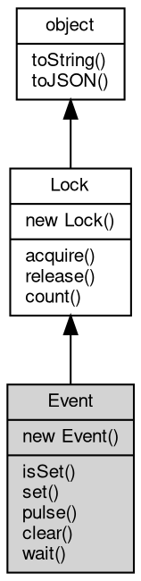

# Object Event
Event is the fiber-level event primitive of the [coroutine](../../module/ifs/coroutine.md) [module](../../module/ifs/module.md): a broadcast gate that

suspends the calling fiber until the event is set, wakes every waiter at once and keeps its
state readable

A fiber calls wait() to suspend until the event is set; another fiber calls set() to set the
flag and wake all waiters, or pulse() to wake all waiters without changing the flag. clear()
resets the flag. Since wait() returns immediately once the flag is set, an Event acts as a
one-way gate rather than a counting semaphore: it synchronizes fibers, for example as a start
or completion gate, instead of limiting concurrency.

Concepts:

- **[Fiber](Fiber.md) scheduling**: wait() suspends only the current fiber, not the thread or the [process](../../module/ifs/process.md);
  the runtime keeps scheduling other fibers, so create the parallel work with [coroutine.start](../../module/ifs/coroutine.md#start)
  and see the [coroutine](../../module/ifs/coroutine.md) [module](../../module/ifs/module.md) for the fiber model.
- **Value semantics**: the event holds a boolean flag, false by default and true when the
  constructor receives a truthy value. set() sets the flag and wakes all waiters; pulse() wakes
  all waiters but leaves the flag unchanged, so a later wait() blocks again unless the event
  was set; clear() resets the flag.
- **Broadcast, not a queue**: waiters are not queued or consumed; every fiber that waits on a set
  event returns immediately, and every fiber waiting when set()/pulse() is called is woken.
- **[Lock](Lock.md) relationship**: Event derives from [Lock](Lock.md), so it also provides acquire(blocking),
  release() and count(). release() is set(); acquire(false) is a non-blocking state check that
  returns the flag value; acquire() waits like wait(). Because release() leaves the event set,
  an Event does not provide mutual exclusion — use [coroutine.Lock](../../module/ifs/coroutine.md#Lock) or [coroutine.Semaphore](../../module/ifs/coroutine.md#Semaphore) for
  that.
- **Node.js / MDN**: Node.js has no direct equivalent (the closest shapes are an inverted
  [Semaphore](Semaphore.md) or Atomics.wait); the [global](../../module/ifs/global.md) DOM-style `Event` class of fibjs is [DOMEvent](DOMEvent.md) and is
  unrelated to this class.

Obtained from:
- `new [coroutine.Event](../../module/ifs/coroutine.md#Event)(value = false)` — creates the event, already set when value is truthy.

Example 1 — a start gate that holds a worker fiber until the main fiber is ready:

```JavaScript
const coroutine = require('coroutine');

const started = new coroutine.Event();

coroutine.start(() => {
    console.log('worker waiting'); // printed first
    started.wait();
    console.log('worker running'); // printed after main sets the event
});

coroutine.sleep(10);
console.log('main sets the event');
started.set();
coroutine.sleep(10);
```

Example 2 — pulse wakes every waiter without setting the flag:

```JavaScript
const coroutine = require('coroutine');

const gate = new coroutine.Event();
let done = 0;

for (let i = 0; i < 3; i++)
    coroutine.start(() => {
        gate.wait();
        done++;
    });

coroutine.sleep(10);
console.log(gate.count()); // 3 waiting fibers, count() is inherited from Lock
gate.pulse();
coroutine.sleep(10);
console.log(done); // 3
console.log(gate.isSet()); // false, pulse does not set the flag
```

Example 3 — set/clear gate and wait on a set event:

```JavaScript
const coroutine = require('coroutine');

const ready = new coroutine.Event(true);
console.log(ready.isSet()); // true
ready.wait(); // returns immediately, no fiber is suspended
console.log('not blocked');

ready.clear();
let resumed = false;
coroutine.start(() => {
    ready.wait();
    resumed = true;
});

coroutine.sleep(10);
console.log(resumed); // false
ready.set();
coroutine.sleep(10);
console.log(resumed); // true
```

## Inheritance

```dot
digraph {
    node [fontname="Helvetica,sans-Serif", fontsize=10, shape="record", style="filled", fillcolor="white"];

    object [tooltip="object", URL="object.md", label="{object|toString()\ltoJSON()\l}"];
    Lock [tooltip="Lock", URL="Lock.md", label="{Lock|new Lock()\l|acquire()\lrelease()\lcount()\l}"];
    Event [tooltip="Event", fillcolor="lightgray", id="me", label="{Event|new Event()\l|isSet()\lset()\lpulse()\lclear()\lwait()\l}"];

    object -> Lock [dir=back];
    Lock -> Event [dir=back];
}
```

## Constructors
        
### Event
**Creates an event [object](object.md)**

```JavaScript
new Event(Boolean value = false);
```

Parameters:
* value: Boolean, initial state; the event is created set when true, default is false

The value is converted to boolean: when it is truthy the event is created already set, so
the first wait() returns immediately. The default is an unset event.

## Methods
        
### isSet
**Returns the current state of the event**

```JavaScript
Boolean Event.isSet();
```

Returns:
* Boolean, returns true if the event is set

The state is the flag set by set() and cleared by clear(); pulse() does not change it. A
newly created Event is unset unless the constructor received a truthy value.

--------------------------
### set
**Sets the event and wakes every waiting fiber**

```JavaScript
Event.set();
```

The state becomes true and all fibers blocked in wait() resume; later wait() calls return
immediately until clear() is called. Calling set() on an already set event only wakes the
fibers waiting at that moment. The inherited [Lock](Lock.md)#release() performs the same operation.

--------------------------
### pulse
**Wakes every waiting fiber without changing the event state**

```JavaScript
Event.pulse();
```

All fibers blocked in wait() resume, but the flag stays as it was: a fiber that calls wait()
again after a pulse() on an unset event blocks again. Calling pulse() with no waiter is a
no-op.

Example — pulse() wakes all waiters but leaves the event unset:

```JavaScript
const coroutine = require('coroutine');

const event = new coroutine.Event();
let waiters = 0;

coroutine.start(() => {
    event.wait();
    waiters++;
});
coroutine.start(() => {
    event.wait();
    waiters++;
});
coroutine.sleep(10);

event.pulse();
coroutine.sleep(10);
console.log(waiters); // 2
console.log(event.isSet()); // false
```

--------------------------
### clear
**Clears the event**

```JavaScript
Event.clear();
```

The state becomes false, so later wait() calls block again until set() or pulse() is called.
Fibers already waiting are not affected and keep waiting. clear() on an unset event is a
no-op.

--------------------------
### wait
**Waits for the event to be set or pulsed**

```JavaScript
Event.wait() async;
```

If the event is already set the call returns immediately without suspending the fiber;
otherwise the current fiber is suspended until set() or pulse() is called by another fiber.
The state is not consumed: every waiting fiber resumes and a fiber that waits again is
blocked or not according to the state at that moment. The generated waitAsync() provides the
Promise form; from a context that cannot suspend the current fiber, the call fails.

Example — suspend a worker fiber until another fiber signals it:

```JavaScript
const coroutine = require('coroutine');

const event = new coroutine.Event();
let resumed = false;

coroutine.start(() => {
    event.wait();
    resumed = true;
});

coroutine.sleep(10);
console.log(resumed); // false
event.set();
coroutine.sleep(10);
console.log(resumed); // true
```

--------------------------
### acquire
**Acquires the lock**

```JavaScript
Boolean Event.acquire(Boolean blocking = true) async;
```

Parameters:
* blocking: Boolean, true to wait for the lock, false to return immediately

Returns:
* Boolean, true when the lock was acquired, false only with `blocking` false

When the lock is free the call returns true at once. When another fiber owns it and
`blocking` is true (the default), the calling fiber is suspended until that fiber
releases the lock, and the call then returns true; when `blocking` is false the call
returns false immediately without waiting. The owner may acquire the lock again, so
`acquire(false)` from the owning fiber returns true even if other fibers are waiting.
The argument is coerced to boolean, and `acquireAsync()` is the promise form that does
not block the calling fiber.

Example — the same fiber may re-enter the lock:

```JavaScript
const coroutine = require('coroutine');

const lock = new coroutine.Lock();

console.log('first acquire:', lock.acquire());
console.log('acquire again in the same fiber:', lock.acquire());
lock.release();
console.log('after one release, acquire(false):', lock.acquire(false));
lock.release();
lock.release();

console.log('fibers waiting:', lock.count());
```

will output:
```sh
first acquire: true
acquire again in the same fiber: true
after one release, acquire(false): true
fibers waiting: 0
```

--------------------------
### release
**Releases the lock**

```JavaScript
Event.release();
```

Removes one level of ownership from the calling fiber; the lock becomes free for other
fibers when the last level is released, and one of the waiting fibers is resumed.
Releasing a lock that the calling fiber does not own is a programming error: debug
builds abort on the assertion, while release builds silently corrupt the lock state,
so keep the calls balanced with `try`/`finally`. The call returns undefined.

--------------------------
### count
**Number of fibers blocked in acquire**

```JavaScript
Integer Event.count();
```

Returns:
* Integer, number of fibers waiting for the lock

The value covers the waits on this lock only: the owning fiber and fibers that used
`acquire(false)` are not counted, and the recursion depth of the owner is not
reported. Use it for diagnostics and monitoring, never as a synchronization condition.

--------------------------
### toString
**Returns the string form of the [object](object.md)**

```JavaScript
String Event.toString();
```

Returns:
* String, returns the string form of the [object](object.md)

The base implementation reports an error: a native [object](object.md) has no implicit
text form, and only the classes whose value can be written as a string
override the member. [Buffer](Buffer.md) returns its content decoded with the given
[encoding](../../module/ifs/encoding.md), [HttpCookie](HttpCookie.md) returns "name=value", and so on; an override commonly
accepts optional arguments ([Buffer.toString](Buffer.md#toString) takes [encoding](../../module/ifs/encoding.md), start and
end) that are not part of this declaration.

Calling the member on a class that does not override it throws
"<Class>: the [object](object.md) can not be converted to string.", which is the
behavior to rely on when probing whether a value has a string form. See
toJSON for the serialization hook.

--------------------------
### toJSON
**Returns the JSON representation of the [object](object.md)**

```JavaScript
Value Event.toJSON(String key = "");
```

Parameters:
* key: String, the property name of the value being serialized

Returns:
* Value, returns the JSON-serializable value

JSON.stringify(value) calls value.toJSON(key) when the member exists and
serializes the returned value in its place; the key argument carries the
property name of the value inside its parent [object](object.md) (an empty string at
the top level) and may be used to build a keyed form. The base
implementation returns a plain [object](object.md) holding the readable properties of
the instance, so a native [object](object.md) serializes without per-class code; a
class with a portable shape such as [Buffer](Buffer.md) overrides it, and a JavaScript
class may override it in the same way.

The member is normally reached through JSON.stringify rather than called
directly; calling it returns the same value JSON.stringify would
serialize.

