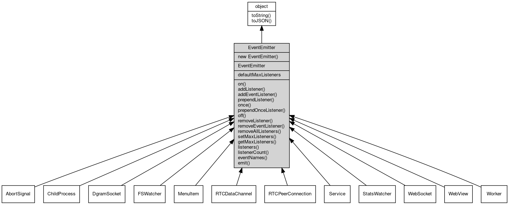

# 对象 EventEmitter
EventEmitter 是事件触发对象，它可以被用于建立观察者模式，支持事件触发的对象均继承于此

当一个事件被触发时，所有与该事件相关联的监听器会以异步方式被调用。它还允许我们创建具有高度可定制性和灵活性的代码。

常用函数包括：addListener/on、once、removeListener/off、removeAllListeners 和 emit。

下面是一个示例代码：

```JavaScript
var fs = require('fs');
var EventEmitter = require('events');
var event = new EventEmitter();

event.on('read_file', function(filename) {
    fs.readFile(filename, 'utf8', function(err, data) {
        if (err) {
            event.emit('error', err);
            return;
        }
        event.emit('show_content', data);
    });
});

event.on('error', function(err) {
    console.log(`Error ${err}`);
});

event.on('show_content', function(content) {
    console.log(content);
});

event.emit('read_file', 'test.txt');
```

上述示例代码，当运行时，事件emitter实例event首先监听'read_file'事件，然后在事件触发时(`event.emit('read_file', 'test.txt')`)触发读取文件的操作。当读取成功后，会触发'show_content'事件，此时监听了'show_content'事件的函数就会被执行并显示文件内容。如果在读取文件过程中发生错误，则会触发'error'事件，此时操作失败的情况就得到了应对。

这种模式在应对异步操作的业务场景中具有很好的优越性。

## 继承关系


## 构造函数
        
### EventEmitter
**构造函数**

```JavaScript
new EventEmitter();
```

## 对象
        
**事件触发对象**

```JavaScript
EventEmitter new EventEmitter;
```

## 静态属性
        
### defaultMaxListeners
**Integer, 默认全局最大监听器数**

```JavaScript
static Integer EventEmitter.defaultMaxListeners;
```

## 成员函数
        
### on
**绑定一个事件处理函数到对象**

```JavaScript
Object EventEmitter.on(String ev,
    Function func);
```

调用参数:
* ev: String, 指定事件的名称
* func: Function, 指定事件处理函数

返回结果:
* Object, 返回事件对象本身，便于链式调用

--------------------------
**绑定一个事件处理函数到对象**

```JavaScript
Object EventEmitter.on(Object map);
```

调用参数:
* map: Object, 指定事件映射关系，对象属性名称将作为事件名称，属性的值将作为事件处理函数

返回结果:
* Object, 返回事件对象本身，便于链式调用

--------------------------
### addListener
**绑定一个事件处理函数到对象**

```JavaScript
Object EventEmitter.addListener(String ev,
    Function func);
```

调用参数:
* ev: String, 指定事件的名称
* func: Function, 指定事件处理函数

返回结果:
* Object, 返回事件对象本身，便于链式调用

--------------------------
**绑定一个事件处理函数到对象**

```JavaScript
Object EventEmitter.addListener(Object map);
```

调用参数:
* map: Object, 指定事件映射关系，对象属性名称将作为事件名称，属性的值将作为事件处理函数

返回结果:
* Object, 返回事件对象本身，便于链式调用

--------------------------
### addEventListener
**绑定一个事件处理函数到对象**

```JavaScript
Object EventEmitter.addEventListener(String ev,
    Function func,
    Object options = {});
```

调用参数:
* ev: String, 指定事件的名称
* func: Function, 指定事件处理函数
* options: Object, 指定事件处理函数的选项

返回结果:
* Object, 返回事件对象本身，便于链式调用

options 参数是一个对象，它可以包含以下属性：
- once: 如果为 true，则事件处理函数只会触发一次，触发后会被移除

--------------------------
### prependListener
**绑定一个事件处理函数到对象起始**

```JavaScript
Object EventEmitter.prependListener(String ev,
    Function func);
```

调用参数:
* ev: String, 指定事件的名称
* func: Function, 指定事件处理函数

返回结果:
* Object, 返回事件对象本身，便于链式调用

--------------------------
**绑定一个事件处理函数到对象起始**

```JavaScript
Object EventEmitter.prependListener(Object map);
```

调用参数:
* map: Object, 指定事件映射关系，对象属性名称将作为事件名称，属性的值将作为事件处理函数

返回结果:
* Object, 返回事件对象本身，便于链式调用

--------------------------
### once
**绑定一个一次性事件处理函数到对象，一次性处理函数只会触发一次**

```JavaScript
Object EventEmitter.once(String ev,
    Function func);
```

调用参数:
* ev: String, 指定事件的名称
* func: Function, 指定事件处理函数

返回结果:
* Object, 返回事件对象本身，便于链式调用

--------------------------
**绑定一个一次性事件处理函数到对象，一次性处理函数只会触发一次**

```JavaScript
Object EventEmitter.once(Object map);
```

调用参数:
* map: Object, 指定事件映射关系，对象属性名称将作为事件名称，属性的值将作为事件处理函数

返回结果:
* Object, 返回事件对象本身，便于链式调用

--------------------------
### prependOnceListener
**绑定一个事件处理函数到对象起始**

```JavaScript
Object EventEmitter.prependOnceListener(String ev,
    Function func);
```

调用参数:
* ev: String, 指定事件的名称
* func: Function, 指定事件处理函数

返回结果:
* Object, 返回事件对象本身，便于链式调用

--------------------------
**绑定一个事件处理函数到对象起始**

```JavaScript
Object EventEmitter.prependOnceListener(Object map);
```

调用参数:
* map: Object, 指定事件映射关系，对象属性名称将作为事件名称，属性的值将作为事件处理函数

返回结果:
* Object, 返回事件对象本身，便于链式调用

--------------------------
### off
**从对象处理队列中取消指定函数**

```JavaScript
Object EventEmitter.off(String ev,
    Function func);
```

调用参数:
* ev: String, 指定事件的名称
* func: Function, 指定事件处理函数

返回结果:
* Object, 返回事件对象本身，便于链式调用

--------------------------
**取消对象处理队列中的全部函数**

```JavaScript
Object EventEmitter.off(String ev);
```

调用参数:
* ev: String, 指定事件的名称

返回结果:
* Object, 返回事件对象本身，便于链式调用

--------------------------
**从对象处理队列中取消指定函数**

```JavaScript
Object EventEmitter.off(Object map);
```

调用参数:
* map: Object, 指定事件映射关系，对象属性名称作为事件名称，属性的值作为事件处理函数

返回结果:
* Object, 返回事件对象本身，便于链式调用

--------------------------
### removeListener
**从对象处理队列中取消指定函数**

```JavaScript
Object EventEmitter.removeListener(String ev,
    Function func);
```

调用参数:
* ev: String, 指定事件的名称
* func: Function, 指定事件处理函数

返回结果:
* Object, 返回事件对象本身，便于链式调用

--------------------------
**取消对象处理队列中的全部函数**

```JavaScript
Object EventEmitter.removeListener(String ev);
```

调用参数:
* ev: String, 指定事件的名称

返回结果:
* Object, 返回事件对象本身，便于链式调用

--------------------------
**从对象处理队列中取消指定函数**

```JavaScript
Object EventEmitter.removeListener(Object map);
```

调用参数:
* map: Object, 指定事件映射关系，对象属性名称作为事件名称，属性的值作为事件处理函数

返回结果:
* Object, 返回事件对象本身，便于链式调用

--------------------------
### removeEventListener
**从对象处理队列中取消指定函数**

```JavaScript
Object EventEmitter.removeEventListener(String ev,
    Function func,
    Object options = {});
```

调用参数:
* ev: String, 指定事件的名称
* func: Function, 指定事件处理函数
* options: Object, 指定事件处理函数的选项

返回结果:
* Object, 返回事件对象本身，便于链式调用

--------------------------
### removeAllListeners
**从对象处理队列中取消所有事件的所有监听器， 如果指定事件，则移除指定事件的所有监听器。**

```JavaScript
Object EventEmitter.removeAllListeners(String ev);
```

调用参数:
* ev: String, 指定事件的名称

返回结果:
* Object, 返回事件对象本身，便于链式调用

--------------------------
**从对象处理队列中取消所有事件的所有监听器， 如果指定事件，则移除指定事件的所有监听器。**

```JavaScript
Object EventEmitter.removeAllListeners(Array evs = []);
```

调用参数:
* evs: Array, 指定事件的名称

返回结果:
* Object, 返回事件对象本身，便于链式调用

--------------------------
### setMaxListeners
**监听器的默认限制的数量，仅用于兼容**

```JavaScript
EventEmitter.setMaxListeners(Integer n);
```

调用参数:
* n: Integer, 指定事件的数量

--------------------------
### getMaxListeners
**获取监听器的默认限制的数量，仅用于兼容**

```JavaScript
Integer EventEmitter.getMaxListeners();
```

返回结果:
* Integer, 返回默认限制数量

--------------------------
### listeners
**查询对象指定事件的监听器数组**

```JavaScript
Array EventEmitter.listeners(String ev);
```

调用参数:
* ev: String, 指定事件的名称

返回结果:
* Array, 返回指定事件的监听器数组

--------------------------
### listenerCount
**查询对象指定事件的监听器数量**

```JavaScript
Integer EventEmitter.listenerCount(String ev);
```

调用参数:
* ev: String, 指定事件的名称

返回结果:
* Integer, 返回指定事件的监听器数量

--------------------------
**查询对象指定事件的监听器数量**

```JavaScript
Integer EventEmitter.listenerCount(Value o,
    String ev);
```

调用参数:
* o: Value, 指定查询的对象
* ev: String, 指定事件的名称

返回结果:
* Integer, 返回指定事件的监听器数量

--------------------------
### eventNames
**查询监听器事件名称**

```JavaScript
Array EventEmitter.eventNames();
```

返回结果:
* Array, 返回事件名称数组

--------------------------
### emit
**主动触发一个事件**

```JavaScript
Boolean EventEmitter.emit(String ev,
    ...args);
```

调用参数:
* ev: String, 事件名称
* args: ..., 事件参数，将会传递给事件处理函数

返回结果:
* Boolean, 返回事件触发状态，有响应事件返回 true，否则返回 false

--------------------------
### toString
**返回对象的字符串表示，一般返回 "[Native Object]"，对象可以根据自己的特性重新实现**

```JavaScript
String EventEmitter.toString();
```

返回结果:
* String, 返回对象的字符串表示

--------------------------
### toJSON
**返回对象的 JSON 格式表示，一般返回对象定义的可读属性集合**

```JavaScript
Value EventEmitter.toJSON(String key = "");
```

调用参数:
* key: String, 未使用

返回结果:
* Value, 返回包含可 JSON 序列化的值

