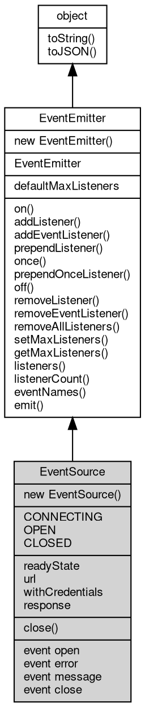

# 对象 EventSource
事件源接口，用于服务器推送事件

引用方式：

```JavaScript
const http = require('http');

const es = new http.EventSource('http://localhost:8080');
```

## 继承关系


## 构造函数
        
### EventSource
**构造函数**

```JavaScript
new EventSource(String url,
    Object options = {});
```

调用参数:
* url: String, 服务器地址
* options: Object, 选项

options 包含请求的附加选项，支持的内容如下：

```JavaScript
{
    "method": "GET", // specify the http request method: GET, POST, etc, default: GET.
    "protocol": "http",
    "slashes": true,
    "username": "",
    "password": "",
    "hostname": "",
    "port": "",
    "pathname": "",
    "keepAlive": unknown, // If not specified, the default settings of the client will be used.
    "query": {},
    "body": SeekableStream | Buffer | String | {},
    "json": {},
    "pack": {},
    "headers": {}
}

# # 静态属性

# # # defaultMaxListeners
    **
    Integer, 默认全局最大监听器数 **
    ``
`JavaScript
static Integer EventSource.defaultMaxListeners;
```

## 常量
        
### CONNECTING
**事件源状态：连接中**

```JavaScript
const EventSource.CONNECTING = 0;
```

--------------------------
### OPEN
**事件源状态：已连接**

```JavaScript
const EventSource.OPEN = 1;
```

--------------------------
### CLOSED
**事件源状态：已关闭**

```JavaScript
const EventSource.CLOSED = 2;
```

## 成员属性
        
### readyState
**Integer, 事件源状态，取值为 CONNECTING、OPEN、CLOSED**

```JavaScript
readonly Integer EventSource.readyState;
```

--------------------------
### url
**String, 服务器地址**

```JavaScript
readonly String EventSource.url;
```

--------------------------
### withCredentials
**Boolean, 是否携带凭证**

```JavaScript
readonly Boolean EventSource.withCredentials;
```

--------------------------
### response
**[HttpResponse](HttpResponse.md), [http](../../module/ifs/http.md) 响应对象**

```JavaScript
readonly HttpResponse EventSource.response;
```

## 成员函数
        
### close
**关闭连接**

```JavaScript
EventSource.close() async;
```

--------------------------
### on
**绑定一个事件处理函数到对象**

```JavaScript
Object EventSource.on(String ev,
    Function func);
```

调用参数:
* ev: String, 指定事件的名称
* func: Function, 指定事件处理函数

返回结果:
* Object, 返回事件对象本身，便于链式调用

--------------------------
**绑定一个事件处理函数到对象**

```JavaScript
Object EventSource.on(Object map);
```

调用参数:
* map: Object, 指定事件映射关系，对象属性名称将作为事件名称，属性的值将作为事件处理函数

返回结果:
* Object, 返回事件对象本身，便于链式调用

--------------------------
### addListener
**绑定一个事件处理函数到对象**

```JavaScript
Object EventSource.addListener(String ev,
    Function func);
```

调用参数:
* ev: String, 指定事件的名称
* func: Function, 指定事件处理函数

返回结果:
* Object, 返回事件对象本身，便于链式调用

--------------------------
**绑定一个事件处理函数到对象**

```JavaScript
Object EventSource.addListener(Object map);
```

调用参数:
* map: Object, 指定事件映射关系，对象属性名称将作为事件名称，属性的值将作为事件处理函数

返回结果:
* Object, 返回事件对象本身，便于链式调用

--------------------------
### addEventListener
**绑定一个事件处理函数到对象**

```JavaScript
Object EventSource.addEventListener(String ev,
    Function func,
    Object options = {});
```

调用参数:
* ev: String, 指定事件的名称
* func: Function, 指定事件处理函数
* options: Object, 指定事件处理函数的选项

返回结果:
* Object, 返回事件对象本身，便于链式调用

options 参数是一个对象，它可以包含以下属性：
- once: 如果为 true，则事件处理函数只会触发一次，触发后会被移除

--------------------------
### prependListener
**绑定一个事件处理函数到对象起始**

```JavaScript
Object EventSource.prependListener(String ev,
    Function func);
```

调用参数:
* ev: String, 指定事件的名称
* func: Function, 指定事件处理函数

返回结果:
* Object, 返回事件对象本身，便于链式调用

--------------------------
**绑定一个事件处理函数到对象起始**

```JavaScript
Object EventSource.prependListener(Object map);
```

调用参数:
* map: Object, 指定事件映射关系，对象属性名称将作为事件名称，属性的值将作为事件处理函数

返回结果:
* Object, 返回事件对象本身，便于链式调用

--------------------------
### once
**绑定一个一次性事件处理函数到对象，一次性处理函数只会触发一次**

```JavaScript
Object EventSource.once(String ev,
    Function func);
```

调用参数:
* ev: String, 指定事件的名称
* func: Function, 指定事件处理函数

返回结果:
* Object, 返回事件对象本身，便于链式调用

--------------------------
**绑定一个一次性事件处理函数到对象，一次性处理函数只会触发一次**

```JavaScript
Object EventSource.once(Object map);
```

调用参数:
* map: Object, 指定事件映射关系，对象属性名称将作为事件名称，属性的值将作为事件处理函数

返回结果:
* Object, 返回事件对象本身，便于链式调用

--------------------------
### prependOnceListener
**绑定一个事件处理函数到对象起始**

```JavaScript
Object EventSource.prependOnceListener(String ev,
    Function func);
```

调用参数:
* ev: String, 指定事件的名称
* func: Function, 指定事件处理函数

返回结果:
* Object, 返回事件对象本身，便于链式调用

--------------------------
**绑定一个事件处理函数到对象起始**

```JavaScript
Object EventSource.prependOnceListener(Object map);
```

调用参数:
* map: Object, 指定事件映射关系，对象属性名称将作为事件名称，属性的值将作为事件处理函数

返回结果:
* Object, 返回事件对象本身，便于链式调用

--------------------------
### off
**从对象处理队列中取消指定函数**

```JavaScript
Object EventSource.off(String ev,
    Function func);
```

调用参数:
* ev: String, 指定事件的名称
* func: Function, 指定事件处理函数

返回结果:
* Object, 返回事件对象本身，便于链式调用

--------------------------
**取消对象处理队列中的全部函数**

```JavaScript
Object EventSource.off(String ev);
```

调用参数:
* ev: String, 指定事件的名称

返回结果:
* Object, 返回事件对象本身，便于链式调用

--------------------------
**从对象处理队列中取消指定函数**

```JavaScript
Object EventSource.off(Object map);
```

调用参数:
* map: Object, 指定事件映射关系，对象属性名称作为事件名称，属性的值作为事件处理函数

返回结果:
* Object, 返回事件对象本身，便于链式调用

--------------------------
### removeListener
**从对象处理队列中取消指定函数**

```JavaScript
Object EventSource.removeListener(String ev,
    Function func);
```

调用参数:
* ev: String, 指定事件的名称
* func: Function, 指定事件处理函数

返回结果:
* Object, 返回事件对象本身，便于链式调用

--------------------------
**取消对象处理队列中的全部函数**

```JavaScript
Object EventSource.removeListener(String ev);
```

调用参数:
* ev: String, 指定事件的名称

返回结果:
* Object, 返回事件对象本身，便于链式调用

--------------------------
**从对象处理队列中取消指定函数**

```JavaScript
Object EventSource.removeListener(Object map);
```

调用参数:
* map: Object, 指定事件映射关系，对象属性名称作为事件名称，属性的值作为事件处理函数

返回结果:
* Object, 返回事件对象本身，便于链式调用

--------------------------
### removeEventListener
**从对象处理队列中取消指定函数**

```JavaScript
Object EventSource.removeEventListener(String ev,
    Function func,
    Object options = {});
```

调用参数:
* ev: String, 指定事件的名称
* func: Function, 指定事件处理函数
* options: Object, 指定事件处理函数的选项

返回结果:
* Object, 返回事件对象本身，便于链式调用

--------------------------
### removeAllListeners
**从对象处理队列中取消所有事件的所有监听器， 如果指定事件，则移除指定事件的所有监听器。**

```JavaScript
Object EventSource.removeAllListeners(String ev);
```

调用参数:
* ev: String, 指定事件的名称

返回结果:
* Object, 返回事件对象本身，便于链式调用

--------------------------
**从对象处理队列中取消所有事件的所有监听器， 如果指定事件，则移除指定事件的所有监听器。**

```JavaScript
Object EventSource.removeAllListeners(Array evs = []);
```

调用参数:
* evs: Array, 指定事件的名称

返回结果:
* Object, 返回事件对象本身，便于链式调用

--------------------------
### setMaxListeners
**监听器的默认限制的数量，仅用于兼容**

```JavaScript
EventSource.setMaxListeners(Integer n);
```

调用参数:
* n: Integer, 指定事件的数量

--------------------------
### getMaxListeners
**获取监听器的默认限制的数量，仅用于兼容**

```JavaScript
Integer EventSource.getMaxListeners();
```

返回结果:
* Integer, 返回默认限制数量

--------------------------
### listeners
**查询对象指定事件的监听器数组**

```JavaScript
Array EventSource.listeners(String ev);
```

调用参数:
* ev: String, 指定事件的名称

返回结果:
* Array, 返回指定事件的监听器数组

--------------------------
### listenerCount
**查询对象指定事件的监听器数量**

```JavaScript
Integer EventSource.listenerCount(String ev);
```

调用参数:
* ev: String, 指定事件的名称

返回结果:
* Integer, 返回指定事件的监听器数量

--------------------------
**查询对象指定事件的监听器数量**

```JavaScript
Integer EventSource.listenerCount(Value o,
    String ev);
```

调用参数:
* o: Value, 指定查询的对象
* ev: String, 指定事件的名称

返回结果:
* Integer, 返回指定事件的监听器数量

--------------------------
### eventNames
**查询监听器事件名称**

```JavaScript
Array EventSource.eventNames();
```

返回结果:
* Array, 返回事件名称数组

--------------------------
### emit
**主动触发一个事件**

```JavaScript
Boolean EventSource.emit(String ev,
    ...args);
```

调用参数:
* ev: String, 事件名称
* args: ..., 事件参数，将会传递给事件处理函数

返回结果:
* Boolean, 返回事件触发状态，有响应事件返回 true，否则返回 false

--------------------------
### toString
**返回对象的字符串表示，一般返回 "[Native Object]"，对象可以根据自己的特性重新实现**

```JavaScript
String EventSource.toString();
```

返回结果:
* String, 返回对象的字符串表示

--------------------------
### toJSON
**返回对象的 JSON 格式表示，一般返回对象定义的可读属性集合**

```JavaScript
Value EventSource.toJSON(String key = "");
```

调用参数:
* key: String, 未使用

返回结果:
* Value, 返回包含可 JSON 序列化的值

## 事件
        
### open
**打开事件回调**

```JavaScript
event EventSource.open();
```

--------------------------
### error
**错误事件回调**

```JavaScript
event EventSource.error();
```

--------------------------
### message
**消息事件回调**

```JavaScript
event EventSource.message();
```

--------------------------
### close
**关闭事件回调**

```JavaScript
event EventSource.close();
```

