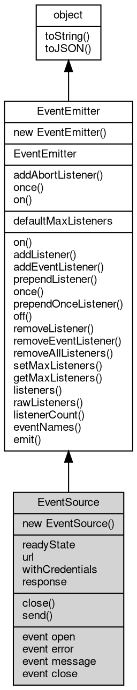

# Object EventSource
A client for the Server-Sent Events protocol, the fibjs EventSource implementation

An EventSource keeps one HTTP response open and reads a `text/event-stream`
body pushed by the server. Unlike [WebSocket](WebSocket.md) the channel is one-way: the
server keeps sending events and the client only reads them. Use it for live
feeds that travel over plain HTTP, such as notifications, logs or token
streams.

This class is exported by the [sse](../../module/ifs/sse.md) [module](../../module/ifs/module.md) as `sse.EventSource`, it is not a
[global](../../module/ifs/global.md) variable; the same [module](../../module/ifs/module.md) provides `sse.upgrade` for the server side.

Concepts:
- [Stream](Stream.md) format: the server sends UTF-8 text and one event is a group of
  lines terminated by an empty line. `data:` lines are joined with "\n",
  `event:` names the event type, `id:` carries the event id, `retry:`
  suggests a reconnection delay, and lines starting with ":" are comments
  and are ignored.
- Dispatching: a group without an `event:` field is delivered to `onmessage`
  listeners; a group with `event: <name>` is delivered to listeners of
  <name> registered with addEventListener. The event [object](object.md) carries `data`,
  `id` when a non-empty id was set, and `retry` ("" when absent).
- readyState: CONNECTING (0) while the request is being made, OPEN (1) once
  a response with Content-Type "text/event-stream" has been accepted, and
  CLOSED (2) after the stream ended or an HTTP error occurred. The server
  side of `sse.upgrade` starts in SENDER (3). The [constants](../../module/ifs/constants.md) live in the [sse](../../module/ifs/sse.md)
  [module](../../module/ifs/module.md), so they are read as `sse.OPEN` and so on.
- Reconnection: this implementation does not reconnect and never sends the
  Last-[Event](Event.md)-ID request header; `retry` is parsed and reported but not
  acted upon. A finished stream raises `close`, a fatal response or a
  network failure raises `error`, and the application decides whether to
  create a new EventSource. MDN EventSource reconnects on its own, so
  porting code must add that logic explicitly.
- Errors: a non-200 response reports the status as `code` and
  "Invalid status: ..." as `reason`; a response with a different
  Content-Type reports no code and "Invalid Content-Type: ..." as `reason`;
  a connection failure also reports no code and "Connection error" as
  `reason`. After an HTTP error readyState is CLOSED, but after a connection
  failure it stays CONNECTING because nothing is retried.
- Server side: `sse.upgrade(accept)` upgrades an HTTP request and hands the
  callback an EventSource in SENDER state whose `send(data, opts)` writes
  `event:`, `id:`, `retry:` and `data:` fields; `close()` terminates the
  chunked response so that client-side readers see the end of the stream.
- withCredentials is read only and always false in fibjs, and `response`
  exposes the underlying [HttpResponse](HttpResponse.md) as a fibjs extension.

Obtained from:
- `new (require('[sse](../../module/ifs/sse.md)').EventSource)([url](../../module/ifs/url.md), options)` — client connection;
- `sse.upgrade(accept)` — server handler; the accept callback receives the
  connected EventSource in SENDER state.

Example 1 — receive one event and observe the end of the stream:

```JavaScript
const http = require('http');
const sse = require('sse');

const server = new http.Server(0, {
    '/events': sse.upgrade((sender) => {
        sender.send('first event', {
            id: '1'
        });
        sender.close(); // ends the stream
    })
});
server.start();
const port = server.socket.localPort;

const es = new sse.EventSource('http://127.0.0.1:' + port + '/events');
es.onmessage = (ev) => console.log(ev.data, ev.id); // first event 1
es.onclose = () => {
    console.log(es.readyState === sse.CLOSED); // true
    server.stop();
};
es.onerror = (ev) => console.log('error', ev.reason);
```

Example 2 — a named event with id and retry fields and multi-line data:

```JavaScript
const http = require('http');
const sse = require('sse');

const server = new http.Server(0, {
    '/feed': sse.upgrade((sender) => {
        sender.send('line one\nline two', {
            event: 'tick',
            id: '42',
            retry: 3000
        });
        sender.close();
    })
});
server.start();
const port = server.socket.localPort;

const es = new sse.EventSource('http://127.0.0.1:' + port + '/feed');
es.addEventListener('tick', (ev) => {
    console.log(ev.data); // line one\nline two
    console.log(ev.id, ev.retry); // 42 3000
});
es.onclose = () => server.stop();
es.onerror = (ev) => console.log(ev.reason);
```

Example 3 — a rejected response reported through the error event:

```JavaScript
const http = require('http');
const sse = require('sse');

const server = new http.Server(0, (req) => {
    req.response.status = 404;
    req.response.write('missing');
});
server.start();
const port = server.socket.localPort;

const es = new sse.EventSource('http://127.0.0.1:' + port + '/');
es.onmessage = (ev) => console.log('never fires');
es.onerror = (ev) => {
    console.log(ev.code, ev.reason); // 404 Invalid status: File Not Found
    console.log(es.readyState === sse.CLOSED); // true
    server.stop();
};
```

## Inheritance

```dot
digraph {
    node [fontname="Helvetica,sans-Serif", fontsize=10, shape="record", style="filled", fillcolor="white"];

    object [tooltip="object", URL="object.md", label="{object|toString()\ltoJSON()\l}"];
    EventEmitter [tooltip="EventEmitter", URL="EventEmitter.md", label="{EventEmitter|new EventEmitter()\l|EventEmitter\l|addAbortListener()\lonce()\lon()\l|defaultMaxListeners\l|on()\laddListener()\laddEventListener()\lprependListener()\lonce()\lprependOnceListener()\loff()\lremoveListener()\lremoveEventListener()\lremoveAllListeners()\lsetMaxListeners()\lgetMaxListeners()\llisteners()\lrawListeners()\llistenerCount()\leventNames()\lemit()\l}"];
    EventSource [tooltip="EventSource", fillcolor="lightgray", id="me", label="{EventSource|new EventSource()\l|readyState\lurl\lwithCredentials\lresponse\l|close()\lsend()\l|event open\levent error\levent message\levent close\l}"];

    object -> EventEmitter [dir=back];
    EventEmitter -> EventSource [dir=back];
}
```

## Constructors
        
### EventSource
**Creates a client and starts reading a text/event-stream response**

```JavaScript
new EventSource(String url,
    Object options = {});
```

Parameters:
* url: String, the server address
* options: Object, request options, {} by default

The constructor returns with readyState CONNECTING and the request runs
in the background; `open` fires after a response with Content-Type
"text/event-stream" is received. `error` fires on an HTTP error, a wrong
content type or a connection failure, and `close` fires when the server
ends the stream.

options contains additional options for the request, the supported contents are as follows:

```JavaScript
// fragment: options
({
    "method": "GET", // request method, inferred as POST when body/json/pack is used
    "headers": {}, // extra request headers
    "body": null, // request body for methods that carry one
    "json": null, // JSON body, implies POST and sets Content-Type
    "pack": null, // msgpack body, implies POST and sets Content-Type
    "query": {}, // query string parameters
    "keepAlive": true, // the connection is kept alive until close()
    "timeout": 0, // request timeout in milliseconds
    "httpClient": null // HttpClient used for the request, the global one by default
})
```

The URL and the remaining options are resolved the same way `http.request`
resolves them.

## Static Methods
        
### addAbortListener
**Registers a one-shot abort handler on an [AbortSignal](AbortSignal.md)**

```JavaScript
static Object EventSource.addAbortListener(EventEmitter signal,
    Function(Object ev) func);
```

Parameters:
* signal: [EventEmitter](EventEmitter.md), the [AbortSignal](AbortSignal.md) [object](object.md) to listen to
* func: Function(Object ev), the handler for the abort event

Returns:
* Object, returns a Disposable [object](object.md) containing a `[Symbol.dispose]` method

The handler is called at most once when the signal is aborted, and it is removed from the
signal afterwards. If the signal is already aborted the handler is invoked synchronously.
The returned [object](object.md) has a `[Symbol.dispose]()` method that removes the handler, so it can be
released before the abort happens.

Example — abort handling with automatic cleanup:

```JavaScript
const events = require('events');

const controller = new AbortController();
const disposable = events.addAbortListener(controller.signal,
    () => console.log('aborted'));

controller.abort(); // aborted
disposable[Symbol.dispose](); // safe to call after the listener fired
console.log(controller.signal.listenerCount('abort')); // 0
```

--------------------------
### once
**Creates a Promise resolved by the next occurrence of an event**

```JavaScript
static Object EventSource.once(EventEmitter emitter,
    Value ev,
    Object options = {});
```

Parameters:
* emitter: [EventEmitter](EventEmitter.md), the event emitter [object](object.md) to listen to
* ev: Value, the event name to listen for
* options: Object, optional parameter [object](object.md)

Returns:
* Object, returns a Promise that resolves with the array of event parameters

The Promise resolves with the array of the emit arguments when the event fires; it rejects
when `error` is emitted while waiting, unless the waited event is `error` itself, or when
the signal option aborts. The temporary listeners are removed when the Promise settles.

options supports the following option:

```JavaScript
// fragment: options
({
    "signal": null // AbortSignal; aborting rejects the Promise with an AbortError
});
```

Example — awaiting the next occurrence of an event:

```JavaScript
const EventEmitter = require('events');

(async () => {
    const emitter = new EventEmitter();
    const waiting = EventEmitter.once(emitter, 'ready');

    emitter.emit('ready', 200, 'ok');
    console.log(JSON.stringify(await waiting)); // [200,"ok"]
})();
```

--------------------------
### on
**Creates an async iterator that yields event occurrences**

```JavaScript
static Object EventSource.on(EventEmitter emitter,
    Value ev,
    Object options = {});
```

Parameters:
* emitter: [EventEmitter](EventEmitter.md), the event emitter [object](object.md) to listen to
* ev: Value, the event name to listen for
* options: Object, optional parameter [object](object.md)

Returns:
* Object, returns an AsyncIterator [object](object.md)

Each next() resolves with `{ value: [args...], done: false }` when the event fires and with
`{ done: true }` after an event named in the `close` option fires or the signal aborts; an
`error` event rejects the pending call. The listeners are registered when the iterator is
created and removed when the iteration ends or the signal aborts.

options supports the following options:

```JavaScript
// fragment: options
({
    "signal": null, // AbortSignal; aborting rejects pending and future next() calls
    "close": [] // event names; the first one to fire ends the iteration
});
```

Example — iterating the occurrences of an event:

```JavaScript
const EventEmitter = require('events');

(async () => {
    const emitter = new EventEmitter();
    const iterator = EventEmitter.on(emitter, 'data', {
        close: ['end']
    });

    emitter.emit('data', 1);
    emitter.emit('data', 2);
    emitter.emit('end');

    for await (const args of iterator)
    console.log(JSON.stringify(args)); // [1] then [2]
})();
```

## Static Properties
        
### defaultMaxListeners
**Integer, The [process](../../module/ifs/process.md)-wide default listener limit reported by getMaxListeners()**

```JavaScript
static Integer EventSource.defaultMaxListeners;
```

Defaults to 10. Assigning a value changes getMaxListeners() for every emitter that never
called setMaxListeners(); an emitter with an explicit limit keeps it. The limit is
informational: fibjs never warns when the number of listeners exceeds it.

## Properties
        
### readyState
**Integer, Queries the connection state: CONNECTING, OPEN, CLOSED or SENDER**

```JavaScript
readonly Integer EventSource.readyState;
```

CONNECTING (0) while the request is being made, OPEN (1) after a
text/event-stream response has been accepted, CLOSED (2) after the
stream ended or an HTTP error occurred. A connection failure leaves the
state at CONNECTING because this implementation does not reconnect. The
[constants](../../module/ifs/constants.md) come from the [sse](../../module/ifs/sse.md) [module](../../module/ifs/module.md) (`sse.OPEN` and so on), not from the
instance.

--------------------------
### url
**String, Queries the URL the client connected to**

```JavaScript
readonly String EventSource.url;
```

The value is the resolved request URL, including the query string, and
is available immediately after construction.

--------------------------
### withCredentials
**Boolean, Reports whether the request carries credentials; always false in fibjs**

```JavaScript
readonly Boolean EventSource.withCredentials;
```

fibjs does not implement the withCredentials behaviour of the browser
EventSource: the property exists for API compatibility, is read only and
is always false, so cookies are handled by the [HttpClient](HttpClient.md) that performs
the request.

--------------------------
### response
**[HttpResponse](HttpResponse.md), Queries the [HttpResponse](HttpResponse.md) of the connection**

```JavaScript
readonly HttpResponse EventSource.response;
```

The response is null before the response headers are received and is
available from the `open` event on; it exposes the status, the headers
and the body stream of the text/event-stream response.

## Methods
        
### close
**Closes the connection and stops reading events**

```JavaScript
EventSource.close() async;
```

After close() the readyState is CLOSED and no further events are read;
the HTTP connection to the server is released. On a server-side sender,
close() terminates the chunked stream so that the client sees the end of
the response and raises its `close` event. Closing an already closed
[object](object.md) is harmless, and close() never raises `error`.

--------------------------
### send
**Sends one event to the client; available on a server-side sender only**

```JavaScript
Integer EventSource.send(String data,
    Object options = {}) async;
```

Parameters:
* data: String, the event data, sent as one or more data lines
* options: Object, event options, {} by default

Returns:
* Integer, the number of bytes sent

The [object](object.md) must be in SENDER state, which is how `sse.upgrade` hands it
to the accept callback; calling send() on a client EventSource throws.

options contains additional options for the event, the supported contents are as follows:

```JavaScript
// fragment: options
({
    "event": "message", // event name, "message" by default
    "id": "", // event id; the id line is written only when provided
    "retry": 0 // suggested reconnect delay in ms; written only when provided
})
```

The payload is written as UTF-8: every line of data becomes its own
`data:` line and the event is terminated by an empty line, so a
multi-line string is delivered as one event whose data contains
newlines. retry must not be negative. The returned value is the number
of bytes written to the connection.

Example — sending several named events on one connection:

```JavaScript
const http = require('http');
const sse = require('sse');

const server = new http.Server(0, {
    '/progress': sse.upgrade((sender) => {
        sender.send('start', {
            event: 'status',
            id: 's1'
        });
        sender.send('half', {
            event: 'progress'
        }); // no id, no retry
        sender.send('end', {
            event: 'status',
            id: 's2'
        });
        sender.close();
    })
});
server.start();
const port = server.socket.localPort;

const es = new sse.EventSource('http://127.0.0.1:' + port + '/progress');
// status events print "start s1" and "end s2"
es.addEventListener('status', (ev) => console.log('status', ev.data, ev.id));
es.addEventListener('progress', (ev) => console.log('progress', ev.data)); // half
es.onclose = () => server.stop();
es.onerror = (ev) => console.log(ev.reason);
```

--------------------------
### on
**Appends an event handler to the emitter**

```JavaScript
Object EventSource.on(Value ev,
    Function(...args) func);
```

Parameters:
* ev: Value, the event name to bind
* func: Function(...args), the event handler function, called with the emit arguments

Returns:
* Object, returns the event [object](object.md) itself for chaining

The listener is called with the arguments of emit() and `this` set to the emitter; the
emitter itself is returned so registrations can be chained. The same function may be
registered several times for one event and each copy is called. See the class documentation
for the dispatch order.

--------------------------
**Appends several event handlers to the emitter**

```JavaScript
Object EventSource.on(Object map);
```

Parameters:
* map: Object, the event mapping; [object](object.md) property names are used as event names

Returns:
* Object, returns the event [object](object.md) itself for chaining

Every enumerable property of the map whose value is a function is registered under its
property name. Properties are processed in order; a value that is not a function makes the
call fail with an invalid-type error while entries processed before it stay registered.

Example — registering several handlers at once:

```JavaScript
const EventEmitter = require('events');

const emitter = new EventEmitter();
emitter.on({
    connect: () => console.log('connect'),
    close: () => console.log('close')
});

emitter.emit('connect'); // connect
emitter.emit('close'); // close
```

--------------------------
### addListener
**Appends an event handler to the emitter**

```JavaScript
Object EventSource.addListener(Value ev,
    Function(...args) func);
```

Parameters:
* ev: Value, the event name to bind
* func: Function(...args), the event handler function

Returns:
* Object, returns the event [object](object.md) itself for chaining

Alias of on(ev, func), provided for Node.js compatibility.

--------------------------
**Appends several event handlers to the emitter**

```JavaScript
Object EventSource.addListener(Object map);
```

Parameters:
* map: Object, the event mapping; [object](object.md) property names are used as event names

Returns:
* Object, returns the event [object](object.md) itself for chaining

Alias of on(map), provided for Node.js compatibility.

--------------------------
### addEventListener
**Appends an event handler to the emitter with an options [object](object.md)**

```JavaScript
Object EventSource.addEventListener(Value ev,
    Function(...args) func,
    Object options = {});
```

Parameters:
* ev: Value, the event name to bind
* func: Function(...args), the event handler function, called with the emit arguments
* options: Object, the options of the event handler

Returns:
* Object, returns the event [object](object.md) itself for chaining

Web-style alias of on(); the only supported option is `once`, which registers a one-shot
handler exactly like once(). The listener receives the plain emit arguments and not an [Event](Event.md)
[object](object.md); see the [DOMEvent](DOMEvent.md) class for the DOM-style event [object](object.md) used by [AbortSignal](AbortSignal.md) and
fetch-style APIs.

options supports the following option:

```JavaScript
// fragment: options
({
    "once": false // when true, the handler is removed before its single invocation
});
```

Example — a one-shot DOM-style registration:

```JavaScript
const EventEmitter = require('events');

const emitter = new EventEmitter();
emitter.addEventListener('ping', () => console.log('ping'), {
    once: true
});

emitter.emit('ping'); // ping
console.log(emitter.emit('ping')); // false
console.log(emitter.listenerCount('ping')); // 0
```

--------------------------
### prependListener
**Inserts an event handler at the front of the queue**

```JavaScript
Object EventSource.prependListener(Value ev,
    Function(...args) func);
```

Parameters:
* ev: Value, the event name to bind
* func: Function(...args), the event handler function

Returns:
* Object, returns the event [object](object.md) itself for chaining

The listener is called before the listeners registered with on()/addListener() the next time
the event is emitted. When several prependListener() calls are made, the last one registered
is called first, because every call inserts at the same position.

Example — insertion at the front of the queue:

```JavaScript
const EventEmitter = require('events');

const emitter = new EventEmitter();
emitter.on('order', () => console.log('on'));
emitter.prependListener('order', () => console.log('prepend'));

emitter.emit('order'); // prepend, then on
```

--------------------------
**Inserts several event handlers at the front of the queue**

```JavaScript
Object EventSource.prependListener(Object map);
```

Parameters:
* map: Object, the event mapping; [object](object.md) property names are used as event names

Returns:
* Object, returns the event [object](object.md) itself for chaining

Map form of prependListener(); every function property is inserted at the front, so the
properties of the map are called in reverse order.

--------------------------
### once
**Appends a one-shot event handler to the emitter**

```JavaScript
Object EventSource.once(Value ev,
    Function(...args) func);
```

Parameters:
* ev: Value, the event name to bind
* func: Function(...args), the event handler function

Returns:
* Object, returns the event [object](object.md) itself for chaining

The handler is wrapped and removes itself from the queue before it is called, so it runs at
most once. off() removes it when passed the original function, listeners() returns the
original function, and rawListeners() returns the internal wrapper whose `_func` property
holds the original. See Example 2 in the class documentation.

--------------------------
**Appends several one-shot event handlers to the emitter**

```JavaScript
Object EventSource.once(Object map);
```

Parameters:
* map: Object, the event mapping; [object](object.md) property names are used as event names

Returns:
* Object, returns the event [object](object.md) itself for chaining

Map form of once(); every function property is registered as a one-shot listener under its
property name.

--------------------------
### prependOnceListener
**Inserts a one-shot event handler at the front of the queue**

```JavaScript
Object EventSource.prependOnceListener(Value ev,
    Function(...args) func);
```

Parameters:
* ev: Value, the event name to bind
* func: Function(...args), the event handler function

Returns:
* Object, returns the event [object](object.md) itself for chaining

Combines prependListener() and once(): the handler is called first and only once, and it is
removed before its invocation.

--------------------------
**Inserts several one-shot event handlers at the front of the queue**

```JavaScript
Object EventSource.prependOnceListener(Object map);
```

Parameters:
* map: Object, the event mapping; [object](object.md) property names are used as event names

Returns:
* Object, returns the event [object](object.md) itself for chaining

Map form of prependOnceListener(); every function property is inserted as a one-shot
listener, and the properties of the map are called in reverse order.

--------------------------
### off
**Removes an event handler from the emitter**

```JavaScript
Object EventSource.off(Value ev,
    Function(...args) func);
```

Parameters:
* ev: Value, the event name to unbind
* func: Function(...args), the event handler function

Returns:
* Object, returns the event [object](object.md) itself for chaining

The first matching listener is removed; when the same function was registered several times
only one copy is removed per call, so repeat the call to remove the others. A once() wrapper
is matched by its original function as well. Removing a listener emits the `removeListener`
meta event after the removal.

--------------------------
**Removes all event handlers of one event**

```JavaScript
Object EventSource.off(Value ev);
```

Parameters:
* ev: Value, the event name to unbind

Returns:
* Object, returns the event [object](object.md) itself for chaining

Every listener of the event is removed and `removeListener` is emitted once per removed
listener. The call succeeds when the event has no listener.

Example — removing every listener of one event:

```JavaScript
const EventEmitter = require('events');

const emitter = new EventEmitter();
emitter.on('data', () => console.log('first'));
emitter.on('data', () => console.log('second'));

emitter.off('data');
console.log(emitter.emit('data')); // false
```

--------------------------
**Removes several event handlers from the emitter**

```JavaScript
Object EventSource.off(Object map);
```

Parameters:
* map: Object, the event mapping; [object](object.md) property names are used as event names

Returns:
* Object, returns the event [object](object.md) itself for chaining

Every enumerable property of the map whose value is a function names an event from which
that function is removed (one copy per event). A value that is not a function makes the call
fail with an invalid-type error.

--------------------------
### removeListener
**Removes an event handler from the emitter**

```JavaScript
Object EventSource.removeListener(Value ev,
    Function(...args) func);
```

Parameters:
* ev: Value, the event name to unbind
* func: Function(...args), the event handler function

Returns:
* Object, returns the event [object](object.md) itself for chaining

Alias of off(ev, func), provided for Node.js compatibility.

--------------------------
**Removes all event handlers of one event**

```JavaScript
Object EventSource.removeListener(Value ev);
```

Parameters:
* ev: Value, the event name to unbind

Returns:
* Object, returns the event [object](object.md) itself for chaining

Alias of off(ev), provided for Node.js compatibility.

--------------------------
**Removes several event handlers from the emitter**

```JavaScript
Object EventSource.removeListener(Object map);
```

Parameters:
* map: Object, the event mapping; [object](object.md) property names are used as event names

Returns:
* Object, returns the event [object](object.md) itself for chaining

Alias of off(map), provided for Node.js compatibility.

--------------------------
### removeEventListener
**Removes an event handler with an options [object](object.md)**

```JavaScript
Object EventSource.removeEventListener(Value ev,
    Function(...args) func,
    Object options = {});
```

Parameters:
* ev: Value, the event name to unbind
* func: Function(...args), the event handler function
* options: Object, the options of the event handler, ignored

Returns:
* Object, returns the event [object](object.md) itself for chaining

Web-style alias of off(ev, func); the options [object](object.md) is accepted and ignored, and a once()
wrapper is matched by its original function like off().

--------------------------
### removeAllListeners
**Removes all listeners of one event**

```JavaScript
Object EventSource.removeAllListeners(Value ev);
```

Parameters:
* ev: Value, the event name to remove

Returns:
* Object, returns the event [object](object.md) itself for chaining

Equivalent to off(ev): every listener of the event is removed, including once() wrappers
matched by their original function, and `removeListener` is emitted once per removal.

--------------------------
**Removes all listeners of the given events, or of the whole emitter**

```JavaScript
Object EventSource.removeAllListeners(Array evs = []);
```

Parameters:
* evs: Array, the event names to remove

Returns:
* Object, returns the event [object](object.md) itself for chaining

An empty array — including the no-argument call, because the parameter defaults to [] —
clears every string-keyed event; symbol-keyed listeners are left in place, unlike Node.js
which removes them too. A non-empty array clears each named event as
removeAllListeners(ev) does.

Example — clearing selected events and the whole emitter:

```JavaScript
const EventEmitter = require('events');

const emitter = new EventEmitter();
emitter.on('a', () => {});
emitter.on('b', () => {});
emitter.on('c', () => {});

emitter.removeAllListeners(['a', 'b']);
console.log(emitter.listenerCount('a'), emitter.listenerCount('c')); // 0 1

emitter.removeAllListeners();
console.log(emitter.eventNames().length); // 0
```

--------------------------
### setMaxListeners
**Stores a per-emitter listener limit**

```JavaScript
EventSource.setMaxListeners(Integer n);
```

Parameters:
* n: Integer, the number of events

The value is reported by getMaxListeners() and is otherwise informational: fibjs never warns
when the number of listeners exceeds it. This member exists for Node.js compatibility. A
negative value throws; 0 is accepted and stored as-is, while Node.js treats 0 as unlimited.

--------------------------
### getMaxListeners
**Returns the listener limit of the emitter**

```JavaScript
Integer EventSource.getMaxListeners();
```

Returns:
* Integer, returns the default limit

Returns the value set by setMaxListeners(), or the [process](../../module/ifs/process.md)-wide defaultMaxListeners (10)
when no explicit value was set.

--------------------------
### listeners
**Returns a copy of the listener array of an event**

```JavaScript
Array EventSource.listeners(Value ev);
```

Parameters:
* ev: Value, the event name to query

Returns:
* Array, returns the listener array of the specified event

One-shot wrappers are unwrapped, so the result contains the functions passed to
on()/once() and can be passed to off(); an unknown event produces an empty array.

Example — once() listeners are returned unwrapped:

```JavaScript
const EventEmitter = require('events');

const emitter = new EventEmitter();

function onTick() {
    console.log('tick');
}

emitter.once('tick', onTick);
console.log(emitter.listeners('tick')[0] === onTick); // true
console.log(emitter.rawListeners('tick')[0] === onTick); // false
```

--------------------------
### rawListeners
**Returns the internal listener array of an event**

```JavaScript
Array EventSource.rawListeners(Value ev);
```

Parameters:
* ev: Value, the event name to query

Returns:
* Array, returns the listener array of the specified event

The array is not unwrapped: a listener registered with once() appears as the internal
wrapper function whose `_func` property holds the original function. An unknown event
produces an empty array.

--------------------------
### listenerCount
**Returns the number of listeners of an event**

```JavaScript
Integer EventSource.listenerCount(Value ev);
```

Parameters:
* ev: Value, the event name to query

Returns:
* Integer, returns the number of listeners of the specified event

One-shot listeners count as one and an unknown event returns 0.

--------------------------
**Returns the number of listeners of an event on another [object](object.md)**

```JavaScript
Integer EventSource.listenerCount(Value o,
    Value ev);
```

Parameters:
* o: Value, the [object](object.md) to query
* ev: Value, the event name to query

Returns:
* Integer, returns the number of listeners of the specified event

Counts without requiring the target to be an [EventEmitter](EventEmitter.md): any [object](object.md) with registered
events can be queried. The call is normally written as
`EventEmitter.listenerCount(target, 'data')`.

Example — counting the listeners of another [object](object.md):

```JavaScript
const EventEmitter = require('events');

const emitter = new EventEmitter();
emitter.on('data', () => {});
emitter.on('data', () => {});

console.log(EventEmitter.listenerCount(emitter, 'data')); // 2
```

--------------------------
### eventNames
**Returns the names of the events with at least one listener**

```JavaScript
Array EventSource.eventNames();
```

Returns:
* Array, returns the array of event names

Only string-keyed events are reported; symbol-keyed events are omitted and numeric event
names are returned as numbers (Node.js also reports symbol events).

--------------------------
### emit
**Emits an event and returns whether a listener was called**

```JavaScript
Boolean EventSource.emit(Value ev,
    ...args);
```

Parameters:
* ev: Value, event name
* args: ..., event parameters, which are passed to the event handler

Returns:
* Boolean, returns whether the event had a listener to respond to it

Listeners are called as described by the dispatch model in the class documentation: the
first one runs synchronously on the current fiber, the remaining ones run in parallel
fibers, and the call returns after all of them finish; an exception raised by a listener is
thrown back to the caller. Emitting `error` with no listener throws instead of returning
false: an Error argument is thrown as-is and any other value is wrapped in
`Error("Unhandled error. (...)")`. [Event](Event.md) names are strings or symbols; `emit()` does not
match a listener registered with a numeric name.

--------------------------
### toString
**Returns the string form of the [object](object.md)**

```JavaScript
String EventSource.toString();
```

Returns:
* String, returns the string form of the [object](object.md)

The base implementation reports an error: a native [object](object.md) has no implicit
text form, and only the classes whose value can be written as a string
override the member. [Buffer](Buffer.md) returns its content decoded with the given
[encoding](../../module/ifs/encoding.md), [HttpCookie](HttpCookie.md) returns "name=value", and so on; an override commonly
accepts optional arguments ([Buffer.toString](Buffer.md#toString) takes [encoding](../../module/ifs/encoding.md), start and
end) that are not part of this declaration.

Calling the member on a class that does not override it throws
"<Class>: the [object](object.md) can not be converted to string.", which is the
behavior to rely on when probing whether a value has a string form. See
toJSON for the serialization hook.

--------------------------
### toJSON
**Returns the JSON representation of the [object](object.md)**

```JavaScript
Value EventSource.toJSON(String key = "");
```

Parameters:
* key: String, the property name of the value being serialized

Returns:
* Value, returns the JSON-serializable value

JSON.stringify(value) calls value.toJSON(key) when the member exists and
serializes the returned value in its place; the key argument carries the
property name of the value inside its parent [object](object.md) (an empty string at
the top level) and may be used to build a keyed form. The base
implementation returns a plain [object](object.md) holding the readable properties of
the instance, so a native [object](object.md) serializes without per-class code; a
class with a portable shape such as [Buffer](Buffer.md) overrides it, and a JavaScript
class may override it in the same way.

The member is normally reached through JSON.stringify rather than called
directly; calling it returns the same value JSON.stringify would
serialize.

## Events
        
### open
**Queries and binds the open event, equivalent to on("open", func)**

```JavaScript
event EventSource.open(Object ev);
```

Parameters:
* ev: Object, the event [object](object.md) of the connection

The listener receives the event [object](object.md) of the connection; the response
is available as `es.response` and readyState is OPEN. The event itself
carries no argument data.

--------------------------
### error
**Queries and binds the error event, equivalent to on("error", func)**

```JavaScript
event EventSource.error(Object ev);
```

Parameters:
* ev: Object, the event [object](object.md) carrying the error code and reason

The listener receives the fibjs event [object](object.md): `ev.reason` is
"Invalid status: ..." for a non-200 response, "Invalid Content-Type: ..."
for a different content type or "Connection error" for a network
failure, and `ev.code` carries the HTTP status when one was rejected. A
wrong content type or a connection failure has no code. After an HTTP
error readyState is CLOSED; after a connection failure it stays
CONNECTING.

--------------------------
### message
**Queries and binds the message event, equivalent to on("message", func)**

```JavaScript
event EventSource.message(Object ev);
```

Parameters:
* ev: Object, the event [object](object.md) carrying the message data, id and retry interval

The listener receives the default event of the stream: `ev.data` is the
payload with data lines joined by "\n", `ev.id` is present when the
group carried a non-empty `id:` field and `ev.retry` is the parsed retry
value or "". A group with an `event:` field does not fire this event;
register the named type with addEventListener(name, func).

--------------------------
### close
**Queries and binds the close event, equivalent to on("close", func)**

```JavaScript
event EventSource.close(Object ev);
```

Parameters:
* ev: Object, the event [object](object.md) of the closed connection

The listener receives the fibjs event [object](object.md); this event fires when the
server ends the stream and readyState becomes CLOSED. Fatal errors are
reported through the `error` event instead and do not raise `close`, and
calling close() does not raise it either.

