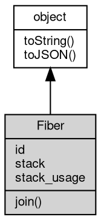

# Object Fiber
The handle of a fiber: identity, lifetime and fiber-local storage

A Fiber [object](object.md) represents one fiber of the current isolate. It is created by the
runtime and returned by `coroutine.start`; the same [object](object.md) is also `this` inside the
fiber function and the value returned by `coroutine.current()`, so properties attached
to it form the fiber-local storage, while its read-only members describe the fiber
itself. A Fiber cannot be constructed with `new`.

Concepts:

- **One [object](object.md) per fiber**: every way to reach a running fiber — the value returned by
`coroutine.start`, `this` in the fiber function, `coroutine.current()` and the entries
of `coroutine.fibers` — is the same [object](object.md). Setting a property on it from any of them
is visible from the others, and the property survives garbage collection while the
fiber is alive.
- **No inheritance**: a new fiber starts with an empty property set. The properties of
the fiber that created it are not copied, while closures keep sharing the variables of
their defining scope as usual.
- **Lifetime**: a fiber ends when its function returns or throws. `join()` waits for
that moment; afterwards the descriptive members are stale — `stack` is empty and
`stack_usage` no longer describes the fiber.
- **Introspection**: `id` is unique and increasing inside the isolate; `stack` is a
textual backtrace for logs; `stack_usage` reports the stack bytes in use for
diagnostics.
- **Concurrency model**: a fiber is scheduled by the [coroutine](../../module/ifs/coroutine.md) [module](../../module/ifs/module.md); see that [module](../../module/ifs/module.md)
for the scheduling, blocking and [process](../../module/ifs/process.md)-lifetime rules, and [worker_threads](../../module/ifs/worker_threads.md) for real
OS threads.

Obtained from:
- `coroutine.start(func[, ...args])` — starts a fiber and returns its [object](object.md);
- `coroutine.current()` — the Fiber [object](object.md) of the calling fiber;
- `coroutine.fibers` — the live fibers of the current isolate.

Example 1 — fiber-local storage is not inherited from the creating fiber:

```JavaScript
const coroutine = require('coroutine');

const parent = coroutine.current();
parent.value = 100;

const child = coroutine.start(function() {
    console.log('child sees parent.value:', this.value); // not copied
    this.value = 200;
    console.log('child has its own value:', this.value);
});

child.join();
console.log('parent keeps its value:', parent.value);
```

will output:
```sh
child sees parent.value: undefined
child has its own value: 200
parent keeps its value: 100
```

Example 2 — join a blocked fiber and read its id, stack and stack_usage:

```JavaScript
const coroutine = require('coroutine');

const task = coroutine.start(function() {
    coroutine.sleep(30); // blocks, so the fiber has a stack to show
    this.inside = true;
});

coroutine.sleep(10);
console.log('id > 0:', task.id > 0);
console.log('stack mentions sleep:', task.stack.indexOf('sleep') >= 0);
console.log('stack bytes in use > 0:', task.stack_usage > 0);

task.join();
console.log('after join the stack is empty:', task.stack === '');
console.log('flag set inside:', task.inside === true);
```

will output:
```sh
id > 0: true
stack mentions sleep: true
stack bytes in use > 0: true
after join the stack is empty: true
flag set inside: true
```

## Inheritance


## Properties
        
### id
**Long, Unique id of the fiber inside its isolate**

```JavaScript
readonly Long Fiber.id;
```

Ids are assigned in creation order, start at 1 and are never reused, which makes them
a stable key for logs and for the descriptive members. The sequence belongs to an
isolate (see `coroutine.vmid`), and the main script of a plain program runs on id 2.

Example — ids increase and the current fiber has one:

```JavaScript
const coroutine = require('coroutine');

const first = coroutine.start(function() {});
const second = coroutine.start(function() {});

console.log('increasing:', second.id > first.id);
console.log('current fiber has an id:', coroutine.current().id > 0);

first.join();
second.join();
```

will output:
```sh
increasing: true
current fiber has an id: true
```

--------------------------
### stack
**String, Textual stack of the fiber**

```JavaScript
readonly String Fiber.stack;
```

For the calling fiber it returns the current JavaScript backtrace (up to 300 frames).
For another fiber it returns the native frames of the point where that fiber is
blocked, or an empty string when the fiber is not blocked in native code; after the
fiber has finished the value is empty. The text is meant for logs and diagnostics.

--------------------------
### stack_usage
**Integer, Stack bytes currently in use by the fiber**

```JavaScript
readonly Integer Fiber.stack_usage;
```

For the calling fiber it measures the stack consumed so far; for another fiber it
measures the stack from its entry point to the point where it is blocked, and it is 0
when that information is not available. The value is a diagnostic and is not
meaningful after the fiber has finished. This is a fibjs extension with no Node.js
counterpart.

## Methods
        
### join
**Waits until the fiber ends**

```JavaScript
Fiber.join();
```

The calling fiber is suspended until the target fiber's function returns or throws;
several fibers may join the same target and all of them resume when it ends. `join`
does not rethrow an exception raised inside the target: the error is printed as an
uncaught fiber exception and the join returns normally. Joining the current fiber, or
two fibers joining each other, blocks the caller forever. The call returns undefined.

--------------------------
### toString
**Returns the string form of the [object](object.md)**

```JavaScript
String Fiber.toString();
```

Returns:
* String, returns the string form of the [object](object.md)

The base implementation reports an error: a native [object](object.md) has no implicit
text form, and only the classes whose value can be written as a string
override the member. [Buffer](Buffer.md) returns its content decoded with the given
[encoding](../../module/ifs/encoding.md), [HttpCookie](HttpCookie.md) returns "name=value", and so on; an override commonly
accepts optional arguments ([Buffer.toString](Buffer.md#toString) takes [encoding](../../module/ifs/encoding.md), start and
end) that are not part of this declaration.

Calling the member on a class that does not override it throws
"<Class>: the [object](object.md) can not be converted to string.", which is the
behavior to rely on when probing whether a value has a string form. See
toJSON for the serialization hook.

--------------------------
### toJSON
**Returns the JSON representation of the [object](object.md)**

```JavaScript
Value Fiber.toJSON(String key = "");
```

Parameters:
* key: String, the property name of the value being serialized

Returns:
* Value, returns the JSON-serializable value

JSON.stringify(value) calls value.toJSON(key) when the member exists and
serializes the returned value in its place; the key argument carries the
property name of the value inside its parent [object](object.md) (an empty string at
the top level) and may be used to build a keyed form. The base
implementation returns a plain [object](object.md) holding the readable properties of
the instance, so a native [object](object.md) serializes without per-class code; a
class with a portable shape such as [Buffer](Buffer.md) overrides it, and a JavaScript
class may override it in the same way.

The member is normally reached through JSON.stringify rather than called
directly; calling it returns the same value JSON.stringify would
serialize.

