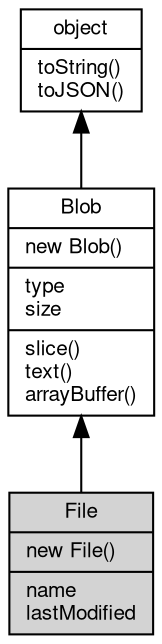

# 对象 File
File 对象用于表示文件系统中的文件，兼容 Web 标准 File API。

File 继承自 [Blob](Blob.md)，除具备所有 [Blob](Blob.md) 的二进制数据能力外，还增加了文件名（name）和最后修改时间（lastModified）等属性，常用于文件上传、下载、Web API 交互等场景。

主要特性：
1. 继承自 [Blob](Blob.md)，支持所有二进制数据操作、切片、异步读取等。
2. 只读属性 name：表示文件名，通常用于展示、上传或保存文件时使用。
3. 只读属性 lastModified：表示文件的最后修改时间（自 1970-01-01 00:00:00 UTC 起的毫秒数）。
4. 构造函数要求必须传递文件名参数，否则抛出 TypeError。
5. 构造时可指定 type、endings、lastModified 等选项，行为与 Web File API 保持一致。

常见用法示例：

```JavaScript
// Create File object
const file = new File(["hello"], "greeting.txt", {
    type: "text/plain"
});

// Read filename and type
console.log(file.name); // "greeting.txt"
console.log(file.type); // "text/plain"

// Get last modified time
console.log(file.lastModified);

// Slice
const part = file.slice(0, 2);

// Read content asynchronously
file.text().then(txt => console.log(txt));
```

## 继承关系


## 构造函数
        
### File
**File 构造函数，创建一个新的 File 实例。File 继承自 [Blob](Blob.md)，支持所有 [Blob](Blob.md) 的数据类型。**

```JavaScript
new File(Array blobParts,
    String name,
    Object options = {});
```

调用参数:
* blobParts: Array, 初始化数据数组，可以包含字符串、ArrayBuffer、TypedArray、[Blob](Blob.md) 等。
* name: String, 文件名，必须为字符串，表示该文件的名称（如 "a.txt"），不能为空。
* options: Object, 可选参数对象

options 支持以下属性：
   - type: 指定 MIME 类型（如 "text/plain"），默认为空字符串。
   - lastModified: 指定最后修改时间（时间戳，单位为毫秒），默认为当前时间。

--------------------------
**File 构造函数，创建一个新的 File 实例。File 继承自 [Blob](Blob.md)，支持所有 [Blob](Blob.md) 的数据类型。**

```JavaScript
new File(Buffer blobData,
    String name,
    Object options = {});
```

调用参数:
* blobData: [Buffer](Buffer.md), 初始化的二进制数据，可以是 [Buffer](Buffer.md) 或其他二进制数据类型。
* name: String, 文件名，必须为字符串，表示该文件的名称（如 "a.txt"），不能为空。
* options: Object, 可选参数对象

options 支持以下属性：
   - type: 指定 MIME 类型（如 "text/plain"），默认为空字符串。
   - lastModified: 指定最后修改时间（时间戳，单位为毫秒），默认为当前时间。

--------------------------
**File 构造函数，创建一个新的 File 实例。File 继承自 [Blob](Blob.md)，支持所有 [Blob](Blob.md) 的数据类型。**

```JavaScript
new File(Object options = {});
```

调用参数:
* options: Object, 可选参数对象

options 支持以下属性：
   - data: 初始化的二进制数据，可以是 [Buffer](Buffer.md) 或其他二进制数据类型。
   - name: 文件名，必须为字符串，表示该文件的名称（如 "a.txt"），不能为空。
   - type: 指定 MIME 类型（如 "text/plain"），默认为空字符串。
   - lastModified: 指定最后修改时间（时间戳，单位为毫秒），默认为当前时间。

## 成员属性
        
### name
**String, 文件名，只读属性，返回文件的名称。**

```JavaScript
readonly String File.name;
```

该属性用于标识文件，通常用于显示、上传或保存文件时使用。

--------------------------
### lastModified
**Number, 最后修改时间戳，只读属性，返回文件的最后修改时间（毫秒）。**

```JavaScript
readonly Number File.lastModified;
```

该属性表示文件的最后修改时间，单位为自 1970-01-01 00:00:00 UTC 起的毫秒数。

--------------------------
### type
**String, [Blob](Blob.md) 对象类型，返回 [Blob](Blob.md) 的 MIME 类型（如 "text/plain"、"image/png" 等），只读属性。**

```JavaScript
readonly String File.type;
```

--------------------------
### size
**Integer, [Blob](Blob.md) 对象的大小，返回 [Blob](Blob.md) 数据的字节数，只读属性。**

```JavaScript
readonly Integer File.size;
```

## 成员函数
        
### slice
**返回指定范围的 [Blob](Blob.md) 切片**

```JavaScript
Blob File.slice(Integer start = 0,
    Integer end = -1,
    String contentType = "");
```

调用参数:
* start: Integer, 起始位置（字节，默认为 0）
* end: Integer, 结束位置（字节，默认为 -1，表示到末尾）
* contentType: String, 新 [Blob](Blob.md) 的 MIME 类型（可选）

返回结果:
* [Blob](Blob.md), 返回新的 [Blob](Blob.md) 对象

创建一个新的 [Blob](Blob.md)，包含原始数据的指定区间内容。

--------------------------
### text
**以文本形式读取 [Blob](Blob.md) 内容**

```JavaScript
String File.text() promise;
```

返回结果:
* String, 返回包含文本内容的 Promise

异步读取 [Blob](Blob.md) 数据为字符串，返回 Promise。

--------------------------
### arrayBuffer
**以 ArrayBuffer 形式读取 [Blob](Blob.md) 内容**

```JavaScript
ArrayBuffer File.arrayBuffer() promise;
```

返回结果:
* ArrayBuffer, 返回包含二进制数据的 Promise

异步读取 [Blob](Blob.md) 数据为 ArrayBuffer，返回 Promise。

--------------------------
### toString
**返回对象的字符串表示，一般返回 "[Native Object]"，对象可以根据自己的特性重新实现**

```JavaScript
String File.toString();
```

返回结果:
* String, 返回对象的字符串表示

--------------------------
### toJSON
**返回对象的 JSON 格式表示，一般返回对象定义的可读属性集合**

```JavaScript
Value File.toJSON(String key = "");
```

调用参数:
* key: String, 未使用

返回结果:
* Value, 返回包含可 JSON 序列化的值

