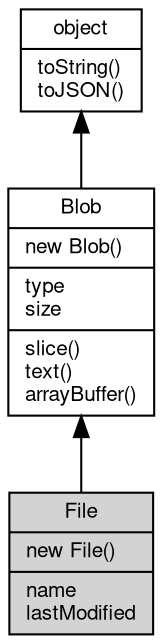

# Object File
An in-memory file: a [Blob](Blob.md) with a file name and a modification time

File implements the Web File API on top of [Blob](Blob.md), so it has every [Blob](Blob.md) capability (size,
type, slice, text, arrayBuffer) plus the read-only name and lastModified properties. It is
the value type behind upload, download and [FormData](FormData.md) flows, and it never touches the disk:
use [fs.readFile](../../module/ifs/fs.md#readFile) to load bytes from a real file and wrap them in a File only when the Web API
shape is needed.

Concepts:

- **[Blob](Blob.md) first**: File only adds metadata to [Blob](Blob.md); slice() still returns a [Blob](Blob.md), text() and
  arrayBuffer() are still promises. `File` is a [global](../../module/ifs/global.md) class in fibjs.
- **Immutable snapshot**: the parts are concatenated into one buffer at construction. A
  string part contributes its utf8 bytes, [Buffer](Buffer.md)/TypedArray/[Blob](Blob.md) parts contribute their
  bytes, and any other value contributes its DOM string form (null becomes 'null'). name and
  lastModified are read-only afterwards.
- **Options**: `type` is lowercased and defaults to an empty string; `lastModified` is a
  number of milliseconds since the Unix epoch and defaults to the current time. A Date is
  rejected, unlike Node.js, where it is converted (plans/compat-differences.md 2.17).
- **Not in Node.js**: the single-[object](object.md) constructor `new File({ data, name, ... })` is a
  fibjs extension; Node.js also exports the class as `buffer.File`, which fibjs does not
  provide.

Obtained from:
- `new File(blobParts, name[, options])` — an array of parts;
- `new File(blobData, name[, options])` — one [Buffer](Buffer.md) or string, utf8 for a string;
- `new File(options)` — fibjs extension, `data` is required and `name` defaults to '';
- [FormData](FormData.md) values (`[FormData](FormData.md)#get`, `[FormData](FormData.md)#getAll`) are File objects when the entry was
  appended as a File.

Example 1 — create a text file and read it back:

```JavaScript
const file = new File(['hello'], 'greeting.txt', {
    type: 'text/plain'
});
console.log(file.name, file.type, file.size); // greeting.txt text/plain 5

file.text().then((text) => console.log(text)); // hello
```

Example 2 — [Blob](Blob.md) inheritance: slice a binary file and read the slice:

```JavaScript
const file = new File([Buffer.from('hello world')], 'data.bin');
const part = file.slice(6, 11); // slice() still returns a Blob
console.log(part.size, file instanceof Blob); // 5 true

part.text().then((text) => console.log(text)); // world
```

Example 3 — build a File from one piece of data with explicit metadata:

```JavaScript
const file = new File({
    data: 'notes',
    name: 'notes.txt',
    lastModified: 1600000000000
});
console.log(file.name, file.size, file.lastModified);
// notes.txt 5 1600000000000
```

## Inheritance

```dot
digraph {
    node [fontname="Helvetica,sans-Serif", fontsize=10, shape="record", style="filled", fillcolor="white"];

    object [tooltip="object", URL="object.md", label="{object|toString()\ltoJSON()\l}"];
    Blob [tooltip="Blob", URL="Blob.md", label="{Blob|new Blob()\l|type\lsize\l|slice()\ltext()\larrayBuffer()\l}"];
    File [tooltip="File", fillcolor="lightgray", id="me", label="{File|new File()\l|name\llastModified\l}"];

    object -> Blob [dir=back];
    Blob -> File [dir=back];
}
```

## Constructors
        
### File
**Creates a File from an array of [Blob](Blob.md) parts**

```JavaScript
new File(Array blobParts,
    String name,
    Object options = {});
```

Parameters:
* blobParts: Array, the initial data array: strings, Buffers, TypedArrays, Blobs and other values
* name: String, the file name, a string such as "a.txt"
* options: Object, optional parameter [object](object.md)

The parts are concatenated in order into one buffer; see the class for how each part
type contributes bytes. name must be a string and may be empty, while a missing or
non-string name throws a TypeError. options supports the properties below; the type is
lowercased before it is stored.

The other constructors differ only in how the data is passed: one [Buffer](Buffer.md)|String
blobData (string parts are encoded as utf8), or a single options [object](object.md) whose `data`
property is required and whose `name` property defaults to an empty string.

options supports the following properties:

```JavaScript
// fragment: options
({
    "type": "", // the MIME type, lowercased; default an empty string
    "lastModified": 0 // ms since the Unix epoch; default the current time
})
```

--------------------------
**Creates a File from one [Buffer](Buffer.md) or string**

```JavaScript
new File(Buffer | String blobData,
    String name,
    Object options = {});
```

Parameters:
* blobData: [Buffer](Buffer.md) | String, the initial binary data
* name: String, the file name, a string such as "a.txt"
* options: Object, optional parameter [object](object.md)

blobData is the whole content: a string is encoded as utf8 and a [Buffer](Buffer.md) is used as it
is. name must be a string and options is the same [object](object.md) as in the parts form. Use this
form when the bytes are already available, for example from [fs.readFile](../../module/ifs/fs.md#readFile).

--------------------------
**Creates a File from a single options [object](object.md) (fibjs extension)**

```JavaScript
new File(Object options = {});
```

Parameters:
* options: Object, optional parameter [object](object.md)

`data` is required and is treated as one [Buffer](Buffer.md)|String part; `name` is optional and
defaults to an empty string, unlike the positional forms. The remaining properties are
the same options as in the parts form. This form is not part of the Web File API or
Node.js.

## Properties
        
### name
**String, File name, a read-only string**

```JavaScript
readonly String File.name;
```

Identifies the file in display, upload and download flows. It is a name, not a [path](../../module/ifs/path.md), and
it is never resolved against the file system. Read-only: an assignment throws in strict
mode. Same property as the Web File API and Node.js `buffer.File`.

--------------------------
### lastModified
**Number, Last modification time in milliseconds since the Unix epoch**

```JavaScript
readonly Number File.lastModified;
```

Set from the `lastModified` option at construction and defaulted to the current time.
Only a number is accepted; Node.js also converts a Date (plans/compat-differences.md
2.17). Read-only.

--------------------------
### type
**String, The MIME type of the [Blob](Blob.md), read-only**

```JavaScript
readonly String File.type;
```

The lowercased `type` option given to the constructor, or an empty string when the option
is missing or not a string. fibjs keeps the value as given (apart from the lower case
form); the Web standard resets a type containing characters outside U+0020-U+007E to an
empty string.

--------------------------
### size
**Integer, The byte length of the [Blob](Blob.md), read-only**

```JavaScript
readonly Integer File.size;
```

The total size of the concatenated parts; 0 for an empty [Blob](Blob.md). It is a plain number and
is recomputed from the stored buffer, so it is constant for the lifetime of the [Blob](Blob.md).

## Methods
        
### slice
**Returns a new [Blob](Blob.md) with a copy of a byte range**

```JavaScript
Blob File.slice(Integer start = 0,
    Integer end = -1,
    String contentType = "");
```

Parameters:
* start: Integer, the start byte index, default 0; a negative value counts from the end
* end: Integer, the end byte index (exclusive), default -1 meaning the end of the [Blob](Blob.md)
* contentType: String, the MIME type of the new [Blob](Blob.md), default keeps the type of the source

Returns:
* [Blob](Blob.md), the new [Blob](Blob.md) with the copied range

The bytes of the range are copied; the source [Blob](Blob.md) is untouched. start and end are byte
indices that follow the [Buffer](Buffer.md) conventions: a negative value counts from the end, an
index past the end clamps to the size, and start beyond end yields an empty [Blob](Blob.md). One
fibjs detail: the default end value -1 always means the end of the [Blob](Blob.md), so slice(x, -1)
behaves like slice(x) even when -1 is passed explicitly, while any other negative value
counts from the end (the Web standard counts -1 from the end as well). The optional
contentType replaces the type of the result; when it is omitted (or empty) the type of
the source [Blob](Blob.md) is kept. slice() always returns a plain [Blob](Blob.md), even when the source is a
File, so File#slice drops name and lastModified.

Example — extract a range and retype it:

```JavaScript
const source = new Blob(['abcdef'], {
    type: 'text/plain'
});
const part = source.slice(2, 5, 'text/css');

console.log(part.size, part.type); // 3 text/css
console.log(part.textSync()); // cde
console.log(source.size); // 6
```

--------------------------
### text
**Reads the whole [Blob](Blob.md) as text**

```JavaScript
String File.text() promise;
```

Returns:
* String, a Promise that resolves to the text content

The bytes are decoded as utf8 and returned as a string; decoding never throws and an
invalid byte sequence becomes the replacement character U+FFFD. The declared calling
form returns a Promise<String>; the generated textSync()/textAsync() aliases are
available too. The stored bytes are read without consuming them, so the method can be
called any number of times.

Example — read a [Blob](Blob.md) synchronously and asynchronously:

```JavaScript
const blob = new Blob(['héllo'], {
    type: 'text/plain'
});

console.log(blob.textSync()); // héllo
(async () => {
    console.log(await blob.text()); // héllo
})();
```

--------------------------
### arrayBuffer
**Reads the whole [Blob](Blob.md) as an ArrayBuffer**

```JavaScript
ArrayBuffer File.arrayBuffer() promise;
```

Returns:
* ArrayBuffer, a Promise that resolves to an ArrayBuffer with the [Blob](Blob.md) bytes

The bytes are copied into a new ArrayBuffer, so the result does not share memory with the
[Blob](Blob.md) and stays valid after the [Blob](Blob.md) is collected. An empty [Blob](Blob.md) yields a zero-length
ArrayBuffer. The declared calling form returns a Promise<ArrayBuffer>; the generated
arrayBufferSync()/arrayBufferAsync() aliases are available too. The MDN members
Blob.bytes() (a Uint8Array view) and Blob.stream() do not exist in fibjs.

--------------------------
### toString
**Returns the string form of the [object](object.md)**

```JavaScript
String File.toString();
```

Returns:
* String, returns the string form of the [object](object.md)

The base implementation reports an error: a native [object](object.md) has no implicit
text form, and only the classes whose value can be written as a string
override the member. [Buffer](Buffer.md) returns its content decoded with the given
[encoding](../../module/ifs/encoding.md), [HttpCookie](HttpCookie.md) returns "name=value", and so on; an override commonly
accepts optional arguments ([Buffer.toString](Buffer.md#toString) takes [encoding](../../module/ifs/encoding.md), start and
end) that are not part of this declaration.

Calling the member on a class that does not override it throws
"<Class>: the [object](object.md) can not be converted to string.", which is the
behavior to rely on when probing whether a value has a string form. See
toJSON for the serialization hook.

--------------------------
### toJSON
**Returns the JSON representation of the [object](object.md)**

```JavaScript
Value File.toJSON(String key = "");
```

Parameters:
* key: String, the property name of the value being serialized

Returns:
* Value, returns the JSON-serializable value

JSON.stringify(value) calls value.toJSON(key) when the member exists and
serializes the returned value in its place; the key argument carries the
property name of the value inside its parent [object](object.md) (an empty string at
the top level) and may be used to build a keyed form. The base
implementation returns a plain [object](object.md) holding the readable properties of
the instance, so a native [object](object.md) serializes without per-class code; a
class with a portable shape such as [Buffer](Buffer.md) overrides it, and a JavaScript
class may override it in the same way.

The member is normally reached through JSON.stringify rather than called
directly; calling it returns the same value JSON.stringify would
serialize.

