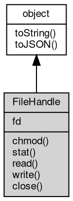

# 对象 FileHandle
文件句柄对象

```JavaScript
var fd = fs.open('test.txt');
```

## 继承关系


## 成员属性
        
### fd
**Integer, 查询当前文件描述符**

```JavaScript
readonly Integer FileHandle.fd;
```

## 成员函数
        
### chmod
**查询当前文件的访问权限，Windows 不支持此方法**

```JavaScript
FileHandle.chmod(Integer mode) async;
```

调用参数:
* mode: Integer, 指定设定的访问权限

--------------------------
### stat
**查询当前文件的基础信息**

```JavaScript
Stat FileHandle.stat() async;
```

返回结果:
* [Stat](Stat.md), 返回文件的基础信息

--------------------------
### read
**根据文件描述符，读取文件内容**

```JavaScript
Integer FileHandle.read(Buffer buffer,
    Integer offset = 0,
    Integer length = 0,
    Integer position = -1) async;
```

调用参数:
* buffer: [Buffer](Buffer.md), 读取结果写入的 [Buffer](Buffer.md) 对象
* offset: Integer, [Buffer](Buffer.md) 写入偏移量， 默认为 0
* length: Integer, 文件读取字节数，默认为 0
* position: Integer, 文件读取位置，默认为当前文件位置

返回结果:
* Integer, 实际读取的字节数

--------------------------
### write
**根据文件描述符，向文件写入内容**

```JavaScript
Integer FileHandle.write(Buffer buffer,
    Integer offset = 0,
    Integer length = -1,
    Integer position = -1) async;
```

调用参数:
* buffer: [Buffer](Buffer.md), 待写入的 [Buffer](Buffer.md) 对象
* offset: Integer, [Buffer](Buffer.md) 数据读取偏移量， 默认为 0
* length: Integer, 文件写入字节数，默认为 -1
* position: Integer, 文件写入取位置，默认为当前文件位置

返回结果:
* Integer, 实际写入的字节数

--------------------------
**根据文件描述符，向文件写入内容**

```JavaScript
Integer FileHandle.write(String string,
    Integer position = -1,
    String encoding = "utf8") async;
```

调用参数:
* string: String, 待写入的字符串
* position: Integer, 文件写入取位置，默认为当前文件位置
* encoding: String, 指定解码方式，缺省解码 utf8

返回结果:
* Integer, 实际写入的字节数

--------------------------
### close
**关闭当前文件句柄**

```JavaScript
FileHandle.close() async;
```

--------------------------
### toString
**返回对象的字符串表示，一般返回 "[Native Object]"，对象可以根据自己的特性重新实现**

```JavaScript
String FileHandle.toString();
```

返回结果:
* String, 返回对象的字符串表示

--------------------------
### toJSON
**返回对象的 JSON 格式表示，一般返回对象定义的可读属性集合**

```JavaScript
Value FileHandle.toJSON(String key = "");
```

调用参数:
* key: String, 未使用

返回结果:
* Value, 返回包含可 JSON 序列化的值

