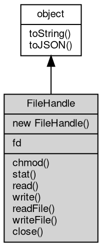

# 对象 FileHandle
文件句柄对象

```JavaScript
var fd = fs.open('test.txt');
```

## 继承关系

```dot
digraph {
    node [fontname="Helvetica,sans-Serif", fontsize=10, shape="record", style="filled", fillcolor="white"];

    object [tooltip="object", URL="object.md", label="{object|toString()\ltoJSON()\l}"];
    FileHandle [tooltip="FileHandle", fillcolor="lightgray", id="me", label="{FileHandle|new FileHandle()\l|fd\l|chmod()\lstat()\lread()\lwrite()\lreadFile()\lwriteFile()\lclose()\l}"];

    object -> FileHandle [dir=back];
}
```

## 构造函数
        
### FileHandle
**FileHandle 构造函数，从文件描述符创建文件句柄**

```JavaScript
new FileHandle(Integer fd);
```

调用参数:
* fd: Integer, 文件描述符数值

## 成员属性
        
### fd
**Integer, 查询当前文件描述符**

```JavaScript
readonly Integer FileHandle.fd;
```

## 成员函数
        
### chmod
**查询当前文件的访问权限，Windows 不支持此方法**

```JavaScript
FileHandle.chmod(Integer mode) async;
```

调用参数:
* mode: Integer, 指定设定的访问权限

--------------------------
### stat
**查询当前文件的基础信息**

```JavaScript
Stat FileHandle.stat() async;
```

返回结果:
* [Stat](Stat.md), 返回文件的基础信息

--------------------------
### read
**根据文件描述符，读取文件内容**

```JavaScript
(Integer bytesRead, Buffer buffer) FileHandle.read(Buffer buffer,
    Integer offset = 0,
    Integer length = 0,
    Integer position = -1) async;
```

调用参数:
* buffer: [Buffer](Buffer.md), 读取结果写入的 [Buffer](Buffer.md) 对象
* offset: Integer, [Buffer](Buffer.md) 写入偏移量， 默认为 0
* length: Integer, 文件读取字节数，默认为 0
* position: Integer, 文件读取位置，默认为当前文件位置

返回结果:
* (Integer bytesRead, [Buffer](Buffer.md) buffer), 返回包含 bytesRead 和 buffer 属性的对象

--------------------------
**根据文件描述符，读取文件内容**

```JavaScript
(Integer bytesRead, Buffer buffer) FileHandle.read(Object options) async;
```

调用参数:
* options: Object, 指定读取选项

返回结果:
* (Integer bytesRead, [Buffer](Buffer.md) buffer), 返回包含 bytesRead 和 buffer 属性的对象

options 支持以下属性：

```JavaScript
{
    "buffer": Buffer.alloc(16384), // 读取结果写入的 Buffer 对象，未提供时自动分配
    "offset": 0, // Buffer 写入偏移量，默认为 0
    "length": 0, // 读取字节数，默认为 buffer.length - offset
    "position": -1 // 文件读取位置，默认为当前文件位置
}
```

--------------------------
### write
**根据文件描述符，向文件写入内容**

```JavaScript
Integer FileHandle.write(Buffer buffer,
    Integer offset = 0,
    Integer length = -1,
    Integer position = -1) async;
```

调用参数:
* buffer: [Buffer](Buffer.md), 待写入的 [Buffer](Buffer.md) 对象
* offset: Integer, [Buffer](Buffer.md) 数据读取偏移量， 默认为 0
* length: Integer, 文件写入字节数，默认为 -1
* position: Integer, 文件写入取位置，默认为当前文件位置

返回结果:
* Integer, 实际写入的字节数

--------------------------
**根据文件描述符，向文件写入内容**

```JavaScript
Integer FileHandle.write(String string,
    Integer position = -1,
    String encoding = "utf8") async;
```

调用参数:
* string: String, 待写入的字符串
* position: Integer, 文件写入取位置，默认为当前文件位置
* encoding: String, 指定解码方式，缺省解码 utf8

返回结果:
* Integer, 实际写入的字节数

--------------------------
### readFile
**读取文件的全部内容**

```JavaScript
Variant FileHandle.readFile(String encoding = "") async;
```

调用参数:
* encoding: String, 指定解码方式，缺省不解码

返回结果:
* Variant, 返回文件内容

--------------------------
**读取文件的全部内容**

```JavaScript
Variant FileHandle.readFile(Object options) async;
```

调用参数:
* options: Object, 指定读取选项

返回结果:
* Variant, 返回文件内容

options 支持以下选项：

```JavaScript
{
    "encoding": "utf8" // 指定编码，默认为 utf8。
}
```

--------------------------
### writeFile
**将数据写入文件，替换其内容**

```JavaScript
Integer FileHandle.writeFile(Buffer data,
    String opt = "binary") async;
```

调用参数:
* data: [Buffer](Buffer.md), 待写入的数据
* opt: String, 指定写入选项，将被忽略

返回结果:
* Integer, 实际写入的字节数

--------------------------
**将数据写入文件，替换其内容**

```JavaScript
Integer FileHandle.writeFile(String data,
    String opt = "utf8") async;
```

调用参数:
* data: String, 待写入的数据
* opt: String, 指定写入选项

返回结果:
* Integer, 实际写入的字节数

--------------------------
**将数据写入文件，替换其内容**

```JavaScript
Integer FileHandle.writeFile(Buffer data,
    Object options) async;
```

调用参数:
* data: [Buffer](Buffer.md), 待写入的数据
* options: Object, 指定写入选项

返回结果:
* Integer, 实际写入的字节数

options 支持以下选项：

```JavaScript
{
    "encoding": "utf8" // 指定编码，默认为 utf8。
}
```

--------------------------
**将数据写入文件，替换其内容**

```JavaScript
Integer FileHandle.writeFile(String data,
    Object options) async;
```

调用参数:
* data: String, 待写入的数据
* options: Object, 指定写入选项

返回结果:
* Integer, 实际写入的字节数

options 支持以下选项：

```JavaScript
{
    "encoding": "utf8" // 指定编码，默认为 utf8。
}
```

--------------------------
### close
**关闭当前文件句柄**

```JavaScript
FileHandle.close() async;
```

--------------------------
### toString
**返回对象的字符串表示，一般返回 "[Native Object]"，对象可以根据自己的特性重新实现**

```JavaScript
String FileHandle.toString();
```

返回结果:
* String, 返回对象的字符串表示

--------------------------
### toJSON
**返回对象的 JSON 格式表示，一般返回对象定义的可读属性集合**

```JavaScript
Value FileHandle.toJSON(String key = "");
```

调用参数:
* key: String, 未使用

返回结果:
* Value, 返回包含可 JSON 序列化的值

