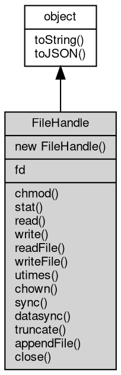

# Object FileHandle
An open file descriptor: reads, writes and inspects one open file by position

A FileHandle keeps a native descriptor open between calls, so one handle can alternate
between reading and writing, use random access, or stay open for a long time. Reach for it
when one operation is not enough: [fs.readFile](../../module/ifs/fs.md#readFile)/[fs.writeFile](../../module/ifs/fs.md#writeFile) open, transfer and close the file
in a single call, while [fs.open](../../module/ifs/fs.md#open) returns a handle that lives until close(). A handle can also
be passed to the descriptor functions of the [fs](../../module/ifs/fs.md) [module](../../module/ifs/module.md) (fstat, fchmod, futimes, read, write
and so on).

Concepts:

- **Descriptor and position**: the handle owns one descriptor with one file position.
  read/write without a position continue at the current position; an explicit position
  (greater than -1) seeks the descriptor first, so a positioned call also moves the position
  for the next sequential call. In Node.js a positioned call leaves the position untouched
  (plans/compat-differences.md 2.14).
- **Lifetime**: the descriptor stays open until close() is called, even when the handle
  becomes unreachable, so an unclosed handle keeps a file busy. No other member closes it.
  After close() the fd property is -1 and the members report an invalid handle; closing an
  already closed handle throws in fibjs while Node.js resolves (2.16).
- **Call forms**: every member marked async works synchronously (the fiber blocks), with a
  trailing callback, or through fs.promises.open. read and write return a result [object](object.md) with
  bytesRead/bytesWritten and buffer in all three forms.
- **writeFile replaces, appendFile does not seek**: writeFile seeks to 0 and truncates before
  writing, appendFile writes at the current position; open with the 'a' flag when appendFile
  must always append. Node.js writeFile writes in place instead (2.15).

Obtained from:
- `fs.open([path](../../module/ifs/path.md)[, flags[, mode]])` — synchronous/callback entry point, flags default to 'r';
- `fs.promises.open([path](../../module/ifs/path.md)[, flags[, mode]])` — promise entry point;
- `new FileHandle(fd)` — the IDL constructor wraps an existing descriptor, but the class is
  not exposed as a JavaScript [global](../../module/ifs/global.md) in fibjs, so user code obtains handles from the open
  functions.

Example 1 — write and read one file through a handle with explicit positions:

```JavaScript
const fs = require('fs');
const os = require('os');
const path = require('path');

const dir = fs.mkdtempSync(path.join(os.tmpdir(), 'fibjs-handle-'));
const file = path.join(dir, 'data.txt');

const handle = fs.open(file, 'w+');
handle.write(Buffer.from('hello world'), 0, -1, 0);
const read = handle.read(Buffer.alloc(5), 0, 5, 6);
console.log(read.bytesRead, read.buffer.toString()); // 5 world

handle.close();
fs.rmSync(dir, {
    recursive: true,
    force: true
});
```

Example 2 — replace, append and inspect the file through the same handle:

```JavaScript
const fs = require('fs');
const os = require('os');
const path = require('path');

const dir = fs.mkdtempSync(path.join(os.tmpdir(), 'fibjs-handle-'));
const file = path.join(dir, 'log.txt');

const handle = fs.open(file, 'a+');
console.log(handle.writeFile('first')); // 5, the content is replaced and truncated
handle.appendFile(' second'); // the 'a' flag appends at the end
console.log(handle.readFile('utf8')); // first second
console.log(handle.stat().size); // 12

handle.close();
fs.rmSync(dir, {
    recursive: true,
    force: true
});
```

Example 3 — the promise form closes the descriptor through await:

```JavaScript
const fs = require('fs');
const os = require('os');
const path = require('path');

const dir = fs.mkdtempSync(path.join(os.tmpdir(), 'fibjs-handle-'));
const file = path.join(dir, 'async.txt');

(async () => {
    const handle = await fs.promises.open(file, 'w+');
    await handle.writeFile('async data');
    console.log(await handle.readFile('utf8')); // async data
    await handle.close();
    fs.rmSync(dir, {
        recursive: true,
        force: true
    });
})();
```

## Inheritance

```dot
digraph {
    node [fontname="Helvetica,sans-Serif", fontsize=10, shape="record", style="filled", fillcolor="white"];

    object [tooltip="object", URL="object.md", label="{object|toString()\ltoJSON()\l}"];
    FileHandle [tooltip="FileHandle", fillcolor="lightgray", id="me", label="{FileHandle|new FileHandle()\l|fd\l|chmod()\lstat()\lread()\lwrite()\lreadFile()\lwriteFile()\lutimes()\lchown()\lsync()\ldatasync()\ltruncate()\lappendFile()\lclose()\l}"];

    object -> FileHandle [dir=back];
}
```

## Constructors
        
### FileHandle
**Wraps an existing file descriptor in a FileHandle**

```JavaScript
new FileHandle(Integer fd);
```

Parameters:
* fd: Integer, the file descriptor value

The descriptor is used as it is and is owned by the returned handle: close() closes it
and every other member reports an invalid handle afterwards. fibjs does not expose the
class as a JavaScript [global](../../module/ifs/global.md) (`typeof FileHandle` is 'undefined'), so in practice handles
are obtained from [fs.open](../../module/ifs/fs.md#open) and fs.promises.open.

## Properties
        
### fd
**Integer, [File](File.md) descriptor number of the open handle**

```JavaScript
readonly Integer FileHandle.fd;
```

A positive integer while the handle is open and -1 after close(). The number can be
passed to the descriptor functions of the [fs](../../module/ifs/fs.md) [module](../../module/ifs/module.md) ([fs.fstat](../../module/ifs/fs.md#fstat), [fs.read](../../module/ifs/fs.md#read), [fs.write](../../module/ifs/fs.md#write),
[fs.fsync](../../module/ifs/fs.md#fsync), [fs.close](../../module/ifs/fs.md#close) and others), which accept an integer or a FileHandle alike.

## Methods
        
### chmod
**Changes the permission bits of the open file (fchmod); effective on POSIX systems**

```JavaScript
FileHandle.chmod(Integer mode) async;
```

Parameters:
* mode: Integer, the access permission to set

Applies mode to the file the descriptor addresses, without a [path](../../module/ifs/path.md) lookup; on Windows only
the write bit is meaningful. Same name and purpose as Node.js filehandle.chmod.

--------------------------
### stat
**Reads the status of the open file (fstat)**

```JavaScript
Stat FileHandle.stat() async;
```

Returns:
* [Stat](Stat.md), returns the basic information of the file

The returned [Stat](Stat.md) describes the file the descriptor addresses and is not bound to a [path](../../module/ifs/path.md),
so its name property is an empty string (unlike [fs.stat](../../module/ifs/fs.md#stat)). Node.js calls this
filehandle.stat().

--------------------------
### read
**Reads bytes from the file into a [Buffer](Buffer.md), optionally at a given position**

```JavaScript
(Integer bytesRead, Buffer buffer) FileHandle.read(Buffer buffer,
    Integer offset = 0,
    Integer length = 0,
    Integer position = -1) async;
```

Parameters:
* buffer: [Buffer](Buffer.md), the [Buffer](Buffer.md) [object](object.md) to write the read result into
* offset: Integer, the [Buffer](Buffer.md) write offset, default is 0
* length: Integer, the number of bytes to read from the file, default is 0
* position: Integer, the file read position, default is the current file position

Returns:
* (Integer bytesRead, [Buffer](Buffer.md) buffer), returns an [object](object.md) containing the bytesRead and buffer properties

Bytes are read into buffer starting at buffer[offset]; at most length bytes are read and
a short read only happens at the end of the file. The default length 0 reads nothing and
returns bytesRead 0; the options form below instead defaults to buffer.length - offset.
position greater than -1 seeks the descriptor before reading (so the position is left
after the data), the default -1 reads from the current position. The result [object](object.md) holds
bytesRead, the number of bytes actually read, and buffer, the same [Buffer](Buffer.md).

The options form read(options) takes the properties below; its buffer is allocated with
16384 bytes when missing and offset/length/position have the same meaning. In Node.js
the result shape and the default buffer are the same, but an explicit position does not
move the current position (plans/compat-differences.md 2.14).

options supports the following properties:

```JavaScript
// fragment: options
({
    "buffer": Buffer.alloc(16384), // the destination; allocated when not provided
    "offset": 0, // the write offset inside the buffer, default 0
    "length": 0, // bytes to read; default buffer.length - offset in this form
    "position": -1 // the file position to read from, default the current position
})
```

Throws RangeError when offset is negative or length is larger than buffer.length -
offset; an invalid or closed handle reports a bad file descriptor error instead.

Example — read a middle slice and then continue sequentially:

```JavaScript
const fs = require('fs');
const os = require('os');
const path = require('path');

const dir = fs.mkdtempSync(path.join(os.tmpdir(), 'fibjs-read-'));
const file = path.join(dir, 'read.txt');
fs.writeFile(file, '0123456789');

const handle = fs.open(file, 'r');
const first = handle.read(Buffer.alloc(3), 0, 3, 0);
const next = handle.read(Buffer.alloc(2), 0, 2);
console.log(first.buffer.toString(), next.buffer.toString()); // 012 34

handle.close();
fs.rmSync(dir, {
    recursive: true,
    force: true
});
```

--------------------------
**Reads bytes from the file with all parameters in one options [object](object.md)**

```JavaScript
(Integer bytesRead, Buffer buffer) FileHandle.read(Object options) async;
```

Parameters:
* options: Object, the read options

Returns:
* (Integer bytesRead, [Buffer](Buffer.md) buffer), returns an [object](object.md) containing the bytesRead and buffer properties

Equivalent to read(buffer, offset, length, position) with the properties of options
filling the parameters; see the first form for the result shape, the defaults (a
16384-byte buffer when buffer is missing) and the position rules.

--------------------------
### write
**Writes bytes from a [Buffer](Buffer.md), optionally at a given position**

```JavaScript
(Integer bytesWritten, Buffer buffer) FileHandle.write(Buffer buffer,
    Integer offset = 0,
    Integer length = -1,
    Integer position = -1) async;
```

Parameters:
* buffer: [Buffer](Buffer.md), the [Buffer](Buffer.md) [object](object.md) to write
* offset: Integer, the [Buffer](Buffer.md) data read offset, default is 0
* length: Integer, the number of bytes to write to the file, default is -1
* position: Integer, the file write position, default is the current file position

Returns:
* (Integer bytesWritten, [Buffer](Buffer.md) buffer), returns an [object](object.md) containing the bytesWritten and buffer properties

Writes length bytes starting at buffer[offset]. The default length -1 means "up to the
end of the buffer" and the default offset 0 starts at the beginning, so the defaults are
usable as a plain write. A position greater than -1 seeks the descriptor first, and the
write also leaves the position after the data (Node.js keeps it, see
plans/compat-differences.md 2.14); the default -1 writes at the current position. The
result [object](object.md) holds bytesWritten and buffer.

The string form write(string, position, [encoding](../../module/ifs/encoding.md)) encodes the string first and then
writes the resulting bytes with the same position rules.

Example — overwrite a range in the middle of a file:

```JavaScript
const fs = require('fs');
const os = require('os');
const path = require('path');

const dir = fs.mkdtempSync(path.join(os.tmpdir(), 'fibjs-write-'));
const file = path.join(dir, 'write.txt');
fs.writeFile(file, '0123456789');

const handle = fs.open(file, 'r+');
const result = handle.write(Buffer.from('AB'), 0, 2, 4);
console.log(result.bytesWritten); // 2
console.log(handle.readFile('utf8')); // 0123AB6789

handle.close();
fs.rmSync(dir, {
    recursive: true,
    force: true
});
```

--------------------------
**Writes a string, [encoding](../../module/ifs/encoding.md) it and optionally seeking first**

```JavaScript
(Integer bytesWritten, Buffer buffer) FileHandle.write(String string,
    Integer position = -1,
    String encoding = "utf8") async;
```

Parameters:
* string: String, the string to write
* position: Integer, the file write position, default is the current file position
* encoding: String, the decoding method, utf8 by default

Returns:
* (Integer bytesWritten, [Buffer](Buffer.md) buffer), returns an [object](object.md) containing the bytesWritten and buffer properties

The string is encoded with [encoding](../../module/ifs/encoding.md) (utf8 by default) and the bytes are written with
the same position rules and result shape as the [Buffer](Buffer.md) form.

--------------------------
### readFile
**Reads the whole file from the beginning and leaves the handle open**

```JavaScript
Variant FileHandle.readFile(Object | String options = "") async;
```

Parameters:
* options: Object | String, the decoding method or the read options

Returns:
* Variant, returns the file content

Seeks to position 0, reads to the end of the file and leaves the position at the end;
the handle stays open. options is either an [encoding](../../module/ifs/encoding.md) or an [object](object.md) with an `[encoding](../../module/ifs/encoding.md)`
property: an empty [encoding](../../module/ifs/encoding.md) (the default) returns a [Buffer](Buffer.md) and any other value decodes
the bytes into a string. Unlike the [fs.readFile](../../module/ifs/fs.md#readFile) descriptor form, the options [object](object.md) of
this method does not default to utf8: readFile({}) still returns a [Buffer](Buffer.md).

options supports the following options:

```JavaScript
// fragment: options
({
    "encoding": "utf8" // the encoding to use; empty (the default) returns a Buffer
})
```

Example — the same content as a [Buffer](Buffer.md) and as a string:

```JavaScript
const fs = require('fs');
const os = require('os');
const path = require('path');

const dir = fs.mkdtempSync(path.join(os.tmpdir(), 'fibjs-readfile-'));
const file = path.join(dir, 'data.txt');
fs.writeFile(file, 'hello');

const handle = fs.open(file, 'r');
console.log(Buffer.isBuffer(handle.readFile())); // true
console.log(handle.readFile({
    encoding: 'utf8'
})); // hello

handle.close();
fs.rmSync(dir, {
    recursive: true,
    force: true
});
```

--------------------------
### writeFile
**Replaces the content of the file and returns the number of bytes written**

```JavaScript
Integer FileHandle.writeFile(Buffer | String data,
    Object | String opt = "utf8") async;
```

Parameters:
* data: [Buffer](Buffer.md) | String, the data to write
* opt: Object | String, the [encoding](../../module/ifs/encoding.md) or the write options

Returns:
* Integer, the number of bytes actually written

Seeks to position 0, writes the data and truncates the file at the end of the written
content, so the previous content is gone; the handle stays open and the position is left
after the data. opt is the [encoding](../../module/ifs/encoding.md) of string data (utf8 by default) or an options
[object](object.md) with an [encoding](../../module/ifs/encoding.md) property; the [encoding](../../module/ifs/encoding.md) of a [Buffer](Buffer.md) is only validated, the bytes
are written as they are.

Node.js filehandle.writeFile writes in place at the current position and returns
undefined, and the descriptor form of [fs.writeFile](../../module/ifs/fs.md#writeFile) does the same truncating rewrite
(plans/compat-differences.md 2.15 and 2.7).

options supports the following options:

```JavaScript
// fragment: options
({
    "encoding": "utf8" // the encoding of string data, default utf8
})
```

Example — replace a long file with short content:

```JavaScript
const fs = require('fs');
const os = require('os');
const path = require('path');

const dir = fs.mkdtempSync(path.join(os.tmpdir(), 'fibjs-writefile-'));
const file = path.join(dir, 'data.txt');
fs.writeFile(file, 'a much longer content');

const handle = fs.open(file, 'r+');
console.log(handle.writeFile('short')); // 5
console.log(handle.readFile('utf8')); // short
console.log(handle.stat().size); // 5

handle.close();
fs.rmSync(dir, {
    recursive: true,
    force: true
});
```

--------------------------
### utimes
**Sets the access and modification times of the open file (futimes)**

```JavaScript
FileHandle.utimes(Variant atime,
    Variant mtime) async;
```

Parameters:
* atime: Variant, the last access time of the file
* mtime: Variant, the last modification time of the file

Accepts a Date, a number of seconds since the Unix epoch or a numeric string, the same
forms as [fs.utimes](../../module/ifs/fs.md#utimes); both times must be given.

--------------------------
### chown
**Changes the owner of the open file (fchown); effective on POSIX systems only**

```JavaScript
FileHandle.chown(Integer uid,
    Integer gid) async;
```

Parameters:
* uid: Integer, the file owner user id
* gid: Integer, the file owner group id

Both ids are numeric POSIX user and group ids; there is no name lookup and no change of
the group list. Node.js calls this filehandle.chown().

--------------------------
### sync
**Flushes file data and metadata to the storage device (fsync)**

```JavaScript
FileHandle.sync() async;
```

Ensures that everything written through the descriptor survives a crash; a more
expensive operation than datasync where the platform distinguishes the two.

--------------------------
### datasync
**Flushes file data to the storage device (fdatasync)**

```JavaScript
FileHandle.datasync() async;
```

Skips the metadata that is not needed to read the data back and is therefore often
cheaper than sync. Same name as Node.js filehandle.datasync.

--------------------------
### truncate
**Truncates the file to the given length (ftruncate)**

```JavaScript
FileHandle.truncate(Integer len = 0) async;
```

Parameters:
* len: Integer, the file size to set, default is 0

A negative length is treated as 0 and the default 0 empties the file; extending a file
fills the new range with zero bytes on POSIX systems. The file position is not changed.

--------------------------
### appendFile
**Writes data at the current position without seeking to the end**

```JavaScript
Integer FileHandle.appendFile(Buffer | String data) async;
```

Parameters:
* data: [Buffer](Buffer.md) | String, the data to write

Returns:
* Integer, the number of bytes actually written

The bytes are written where the descriptor currently points; open the handle with the
'a' or 'a+' flag to make the operating system append at the end of the file regardless
of the position. A string is encoded as utf8 and the number of bytes written is
returned; the handle stays open.

Example — append through a handle opened with the append flag:

```JavaScript
const fs = require('fs');
const os = require('os');
const path = require('path');

const dir = fs.mkdtempSync(path.join(os.tmpdir(), 'fibjs-append-'));
const file = path.join(dir, 'log.txt');
fs.writeFile(file, 'line 1');

const handle = fs.open(file, 'a+');
handle.appendFile('\nline 2');
console.log(handle.readFile('utf8')); // line 1\nline 2

handle.close();
fs.rmSync(dir, {
    recursive: true,
    force: true
});
```

--------------------------
### close
**Releases the descriptor and closes the file**

```JavaScript
FileHandle.close() async;
```

After close() the handle reports fd -1 and every other member fails with an invalid
handle error; the file data itself is unaffected. A second close() throws a bad file
descriptor error in fibjs, while Node.js resolves it (plans/compat-differences.md 2.16).

--------------------------
### toString
**Returns the string form of the [object](object.md)**

```JavaScript
String FileHandle.toString();
```

Returns:
* String, returns the string form of the [object](object.md)

The base implementation reports an error: a native [object](object.md) has no implicit
text form, and only the classes whose value can be written as a string
override the member. [Buffer](Buffer.md) returns its content decoded with the given
[encoding](../../module/ifs/encoding.md), [HttpCookie](HttpCookie.md) returns "name=value", and so on; an override commonly
accepts optional arguments ([Buffer.toString](Buffer.md#toString) takes [encoding](../../module/ifs/encoding.md), start and
end) that are not part of this declaration.

Calling the member on a class that does not override it throws
"<Class>: the [object](object.md) can not be converted to string.", which is the
behavior to rely on when probing whether a value has a string form. See
toJSON for the serialization hook.

--------------------------
### toJSON
**Returns the JSON representation of the [object](object.md)**

```JavaScript
Value FileHandle.toJSON(String key = "");
```

Parameters:
* key: String, the property name of the value being serialized

Returns:
* Value, returns the JSON-serializable value

JSON.stringify(value) calls value.toJSON(key) when the member exists and
serializes the returned value in its place; the key argument carries the
property name of the value inside its parent [object](object.md) (an empty string at
the top level) and may be used to build a keyed form. The base
implementation returns a plain [object](object.md) holding the readable properties of
the instance, so a native [object](object.md) serializes without per-class code; a
class with a portable shape such as [Buffer](Buffer.md) overrides it, and a JavaScript
class may override it in the same way.

The member is normally reached through JSON.stringify rather than called
directly; calling it returns the same value JSON.stringify would
serialize.

