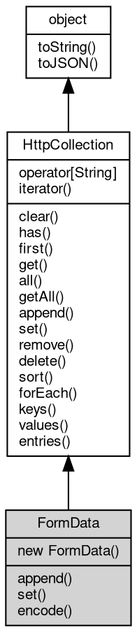

# 对象 FormData
FormData 是用于管理 HTTP 表单数据（multipart/form-data）的容器类，继承自 [HttpCollection](HttpCollection.md)。

FormData 提供了标准的 Web FormData API，支持多种方式初始化和操作表单字段，适用于 HTTP 文件上传、表单数据构建等场景。

主要特性：
1. 支持通过空构造、对象、已有 FormData 实例进行初始化。
2. 支持 append、set 等方法添加和修改字段，支持文件（[Blob](Blob.md)）和文件名参数。
3. 兼容 Web 标准 FormData 行为，允许同名字段多值、文件上传等。

常见用法示例：

```JavaScript
// Create empty form data
const form = new FormData();

// Initialize with object
const form = new FormData({
    foo: 'bar',
    file: blob
});

// Append fields
form.append('name', 'value');
form.append('file', blob, 'filename.txt');

// Overwrite fields
form.set('name', 'newValue');
form.set('file', blob2, 'file2.txt');
```

## 继承关系


## 构造函数
        
### FormData
**FormData 构造函数，创建一个新的空 HTTP 表单数据容器**

```JavaScript
new FormData();
```

创建一个空的 FormData 实例，用于后续动态添加表单字段。

--------------------------
**FormData 构造函数，使用给定的 form 数据字符串初始化表单数据容器**

```JavaScript
new FormData(String init);
```

调用参数:
* init: String, 初始化用的 form 数据字符串，如 "name=value&key=val"

--------------------------
**FormData 构造函数，通过传入一个 [Buffer](Buffer.md)，初始化表单数据。适用于从已有的 multipart/form-data 数据中创建 FormData 实例**

```JavaScript
new FormData(Buffer init,
    String boundary);
```

调用参数:
* init: [Buffer](Buffer.md), 初始化用的 multipart/form-data 二进制数据
* boundary: String, 指定 multipart/form-data 的边界字符串，用于解析数据，格式为：multipart/form-data; boundary=${boundary}

--------------------------
**FormData 构造函数，通过传入一个 [Blob](Blob.md)，初始化表单数据。适用于从 [FormData.encode](FormData.md#encode)() 结果或其他 multipart/form-data [Blob](Blob.md) 中创建 FormData 实例**

```JavaScript
new FormData(Blob init,
    String boundary = "");
```

调用参数:
* init: [Blob](Blob.md), 初始化用的 [Blob](Blob.md) 对象，通常来自 [FormData.encode](FormData.md#encode)() 的结果
* boundary: String, 可选的边界字符串，如果不指定则从 [Blob](Blob.md) 的 type 属性中自动解析（如 "multipart/form-data; boundary=xxx"）

--------------------------
**FormData 构造函数，使用给定的对象初始化 HTTP 表单数据容器**

```JavaScript
new FormData(Object init);
```

调用参数:
* init: Object, 初始化用的字段对象，键为字段名，值为字段值（字符串、[Blob](Blob.md) 或数组）

通过传入一个对象，批量初始化表单字段。对象的键为字段名，值为字段值（可为字符串、[Blob](Blob.md) 或数组）。

--------------------------
**FormData 构造函数，使用给定的 HTTP 表单数据容器初始化 HTTP 表单数据容器**

```JavaScript
new FormData(FormData init);
```

调用参数:
* init: FormData, 初始化用的 HTTP 表单数据容器

通过传入另一个 FormData 实例，复制其所有字段。

## 操作符
        
### @iterator
**查询当前对象元素的迭代器**

```JavaScript
Iterator FormData.@iterator();
```

返回结果:
* [Iterator](Iterator.md), 返回当前对象元素的迭代器

## 成员函数
        
### append
**添加一个键值数据，添加数据并不修改已存在的键值的数据**

```JavaScript
FormData.append(Object map);
```

调用参数:
* map: Object, 指定要添加的键值数据字典

--------------------------
**添加一个键值的一组数据，添加数据并不修改已存在的键值的数据**

```JavaScript
FormData.append(String name,
    Array values);
```

调用参数:
* name: String, 指定要添加的键值
* values: Array, 指定要添加的一组数据

--------------------------
**添加一组数据，添加数据并不修改已存在的键值的数据**

```JavaScript
FormData.append(Array entries);
```

调用参数:
* entries: Array, 指定要添加的一组数据，格式为 [[<key>, <value>]]

--------------------------
**添加一个键值数据，添加数据并不修改已存在的键值的数据**

```JavaScript
FormData.append(String name,
    Variant value);
```

调用参数:
* name: String, 指定要添加的键值
* value: Variant, 指定要添加的数据

--------------------------
**添加一个键值数据，添加数据并不修改已存在的键值的数据**

```JavaScript
FormData.append(String name,
    Blob value);
```

调用参数:
* name: String, 指定要添加的字段名
* value: [Blob](Blob.md), 指定要添加的 [Blob](Blob.md)

向表单中追加一个字段。如果同名字段已存在，则不会覆盖，允许同名多值。

--------------------------
**添加一个键值数据，添加数据并不修改已存在的键值的数据**

```JavaScript
FormData.append(String name,
    Blob value,
    String filename);
```

调用参数:
* name: String, 指定要添加的字段名
* value: [Blob](Blob.md), 指定要添加的 [Blob](Blob.md)
* filename: String, 指定要添加的文件名

向表单中追加一个字段。如果同名字段已存在，则不会覆盖，允许同名多值。

--------------------------
### set
**设定一个键值数据，设定数据将修改键值所对应的第一个数值，并清除相同键值的其余数据**

```JavaScript
FormData.set(Object map);
```

调用参数:
* map: Object, 指定要设定的键值数据字典

--------------------------
**设定一个键值的一组数据，设定数据将修改键值所对应的数值，并清除相同键值的其余数据**

```JavaScript
FormData.set(String name,
    Array values);
```

调用参数:
* name: String, 指定要设定的键值
* values: Array, 指定要设定的一组数据

--------------------------
**设定一个键值数据，设定数据将修改键值所对应的第一个数值，并清除相同键值的其余数据**

```JavaScript
FormData.set(String name,
    Variant value);
```

调用参数:
* name: String, 指定要设定的键值
* value: Variant, 指定要设定的数据

--------------------------
**设定一个键值数据，设定数据将修改键值所对应的第一个数值，并清除相同键值的其余数据**

```JavaScript
FormData.set(String name,
    Blob value);
```

调用参数:
* name: String, 指定要设定的字段名
* value: [Blob](Blob.md), 指定要设定的 [Blob](Blob.md)

设置表单字段。如果同名字段已存在，则只保留第一个并覆盖，移除其余同名字段。

--------------------------
**设定一个键值数据，设定数据将修改键值所对应的第一个数值，并清除相同键值的其余数据**

```JavaScript
FormData.set(String name,
    Blob value,
    String filename);
```

调用参数:
* name: String, 指定要设定的字段名
* value: [Blob](Blob.md), 指定要设定的 [Blob](Blob.md)
* filename: String, 指定要设定的文件名

设置表单字段。如果同名字段已存在，则只保留第一个并覆盖，移除其余同名字段。

--------------------------
### encode
**将当前表单数据编码为 [Buffer](Buffer.md) 对象**

```JavaScript
Blob FormData.encode(String type = "application/x-www-form-urlencoded");
```

调用参数:
* type: String, 指定编码的 content-type，支持 "multipart/form-data" 和 "application/x-www-form-urlencoded"（及其别名），默认为 "application/x-www-form-urlencoded"

返回结果:
* [Blob](Blob.md), 返回编码后的 [Blob](Blob.md) 对象，包含正确的 content-type

根据指定的 content-type 对表单数据进行编码，支持多种编码格式：

编码规则：
1. 当 type 为 "multipart/form-data" 且指定 boundary 时：
   使用指定的 boundary 进行 multipart/form-data 格式编码

2. 当 type 为 "multipart/form-data" 且未指定 boundary 时：
   自动生成一个随机 boundary 进行 multipart/form-data 格式编码

3. 当 type 为 "application/x-www-form-urlencoded" 时：
   使用 URL 编码格式对表单数据进行编码（name=value&name2=value2）
   支持的别名："urlencoded"、"form-urlencoded"、"www-form-urlencoded"
   注意：如果表单包含 [File](File.md)/[Blob](Blob.md) 对象，将抛出错误并指明具体字段名

4. 其他值或不支持的格式：
   抛出错误异常

--------------------------
### clear
**清除容器数据**

```JavaScript
FormData.clear();
```

--------------------------
### has
**检查容器内是否存在指定键值的数据**

```JavaScript
Boolean FormData.has(String name);
```

调用参数:
* name: String, 指定要检查的键值

返回结果:
* Boolean, 返回键值是否存在

--------------------------
### first
**查询指定键值的第一个值**

```JavaScript
Variant FormData.first(String name);
```

调用参数:
* name: String, 指定要查询的键值

返回结果:
* Variant, 返回键值所对应的值，若不存在，则返回 undefined

--------------------------
### get
**查询指定键值的第一个值，等同于 first**

```JavaScript
Variant FormData.get(String name);
```

调用参数:
* name: String, 指定要查询的键值

返回结果:
* Variant, 返回键值所对应的值，若不存在，则返回 undefined

--------------------------
### all
**查询指定键值的全部值**

```JavaScript
NObject FormData.all(String name = "");
```

调用参数:
* name: String, 指定要查询的键值，传递空字符串返回全部键值的结果

返回结果:
* NObject, 返回键值所对应全部值的数组，若数据不存在，则返回 null

--------------------------
### getAll
**查询指定键值的全部值**

```JavaScript
NArray FormData.getAll(String name);
```

调用参数:
* name: String, 指定要查询的键值

返回结果:
* NArray, 返回键值所对应全部值的数组，若数据不存在，则返回 null

--------------------------
### remove
**删除指定键值的全部值**

```JavaScript
FormData.remove(String name);
```

调用参数:
* name: String, 指定要删除的键值

--------------------------
### delete
**删除指定键值的全部值**

```JavaScript
FormData.delete(String name);
```

调用参数:
* name: String, 指定要删除的键值

--------------------------
### sort
**按照键值排序容器内的内容**

```JavaScript
FormData.sort();
```

--------------------------
### forEach
**遍历容器内的内容**

```JavaScript
FormData.forEach(Function callback);
```

调用参数:
* callback: Function, 指定遍历时调用的函数，函数参数为 (value, key, [object](object.md))

--------------------------
**遍历容器内的内容**

```JavaScript
FormData.forEach(Function callback,
    Value thisArg);
```

调用参数:
* callback: Function, 指定遍历时调用的函数，函数参数为 (value, key, [object](object.md))
* thisArg: Value, 指定回调函数的 this 对象

--------------------------
### keys
**查询容器内的键值**

```JavaScript
Iterator FormData.keys();
```

返回结果:
* [Iterator](Iterator.md), 返回包含所有键值的迭代器

--------------------------
### values
**查询容器内的数值**

```JavaScript
Iterator FormData.values();
```

返回结果:
* [Iterator](Iterator.md), 返回包含所有数值的迭代器

--------------------------
### entries
**查询容器内的键值和数值**

```JavaScript
Iterator FormData.entries();
```

返回结果:
* [Iterator](Iterator.md), 返回包含所有键值和数值的迭代器

--------------------------
### toString
**返回对象的字符串表示，一般返回 "[Native Object]"，对象可以根据自己的特性重新实现**

```JavaScript
String FormData.toString();
```

返回结果:
* String, 返回对象的字符串表示

--------------------------
### toJSON
**返回对象的 JSON 格式表示，一般返回对象定义的可读属性集合**

```JavaScript
Value FormData.toJSON(String key = "");
```

调用参数:
* key: String, 未使用

返回结果:
* Value, 返回包含可 JSON 序列化的值

