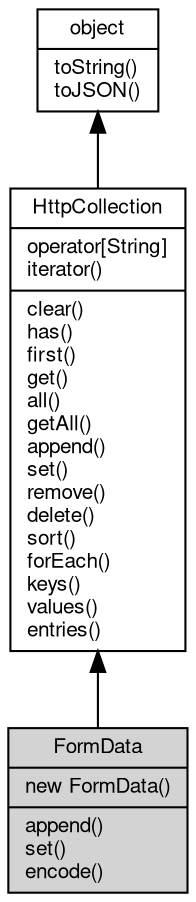

# Object FormData
An ordered collection of form field names and values, inheriting from [HttpCollection](HttpCollection.md)

FormData implements the Web FormData API and is the value type behind form submission: the
entries are strings or [File](File.md) objects, keep their insertion order and may repeat a name. The
body helpers of fibjs use it directly - [http.Request](../../module/ifs/http.md#Request)#form parses a request body into one,
[HttpMessage](HttpMessage.md)#formData does the same on any message and FormData#encode produces the wire
representation of the collection.

A value appended as a [Blob](Blob.md) or [File](File.md) is stored as a [File](File.md): a plain [Blob](Blob.md) becomes a [File](File.md) named
"blob" with the current time as lastModified, a [File](File.md) keeps its name, type and lastModified.
Every other value is converted to a string. This is the WHATWG conversion and is why file
entries survive a round trip through encode() and parse.

Concepts:

- **Fields and files**: get() returns a [File](File.md) for a file entry and a string otherwise;
  multiple values of a name are read with getAll()/all() or the iteration helpers. Names are
  compared case-sensitively and an empty name is allowed, both like the Web standard.
- **Ordering**: entries keep insertion order. set() removes every old value of the name and
  appends the new one, so the name moves to the end; append() never touches existing values.
- **Wire formats**: encode() writes application/x-www-form-urlencoded by default and
  multipart/form-data on request; the urlencoded form rejects file entries while the
  multipart form generates a random boundary unless the type string carries one. The
  parsing constructors accept the matching forms, so encode() plus a constructor is a lossless
  round trip for names, values and file metadata.
- **Not in the standard**: encode() is a fibjs extension (the Web FormData API has no
  serializer), as are the string and multipart constructors; Node.js only accepts the empty
  constructor and an iterable of pairs.

Obtained from:
- `new FormData()` — an empty collection;
- `new FormData(init)` — fields from a urlencoded string, an [object](object.md) or another FormData;
- `new FormData(init, boundary)` — a multipart [Buffer](Buffer.md) or [Blob](Blob.md);
- `[http.Request](../../module/ifs/http.md#Request)#form` / `[HttpMessage](HttpMessage.md)#formData` — the parsed body of a message;
- `FormData#encode` — the wire representation as a [Blob](Blob.md).

Example 1 — build a form and read the entries back:

```JavaScript
const form = new FormData();
form.append('name', 'lion');
form.append('tag', 'a');
form.append('tag', 'b');
form.append('avatar', new Blob(['png'], {
    type: 'image/png'
}), 'avatar.png');

console.log(form.get('name')); // lion
console.log(form.getAll('tag')); // [ 'a', 'b' ]
const file = form.get('avatar');
console.log(file instanceof File); // true
console.log(file.name, file.type, file.size); // avatar.png image/png 3
```

Example 2 — encode as urlencoded text and parse it with [URLSearchParams](URLSearchParams.md):

```JavaScript
const form = new FormData();
form.append('name', 'John Doe');
form.append('city', '北京');

const body = form.encode(); // application/x-www-form-urlencoded
console.log(body.type); // application/x-www-form-urlencoded
console.log(body.textSync());
// name=John%20Doe&city=%E5%8C%97%E4%BA%AC

const parsed = new URLSearchParams(body.textSync());
console.log(parsed.get('name'), parsed.get('city')); // John Doe 北京
```

Example 3 — multipart round trip with a file:

```JavaScript
const form = new FormData();
form.append('note', 'hi');
form.append('doc', new File(['data'], 'd.txt', {
    type: 'text/plain'
}));

const body = form.encode('multipart/form-data');
console.log(body.type.startsWith('multipart/form-data; boundary=')); // true

const copy = new FormData(body, ''); // the boundary comes from the Blob type
console.log(copy.get('note')); // hi
console.log(copy.get('doc').name); // d.txt
console.log(copy.get('doc').textSync()); // data
```

## Inheritance

```dot
digraph {
    node [fontname="Helvetica,sans-Serif", fontsize=10, shape="record", style="filled", fillcolor="white"];

    object [tooltip="object", URL="object.md", label="{object|toString()\ltoJSON()\l}"];
    HttpCollection [tooltip="HttpCollection", URL="HttpCollection.md", label="{HttpCollection|operator[String]\literator()\l|clear()\lhas()\lfirst()\lget()\lall()\lgetAll()\lappend()\lset()\lremove()\ldelete()\lsort()\lforEach()\lkeys()\lvalues()\lentries()\l}"];
    FormData [tooltip="FormData", fillcolor="lightgray", id="me", label="{FormData|new FormData()\l|append()\lset()\lencode()\l}"];

    object -> HttpCollection [dir=back];
    HttpCollection -> FormData [dir=back];
}
```

## Constructors
        
### FormData
**Creates an empty FormData collection**

```JavaScript
new FormData();
```

No entries are stored; fields are added later with append()/set() or by parsing a body
through the other constructors.

--------------------------
**Creates a FormData by parsing a multipart/form-data [Buffer](Buffer.md)**

```JavaScript
new FormData(Buffer init,
    String boundary);
```

Parameters:
* init: [Buffer](Buffer.md), the multipart/form-data binary data to parse
* boundary: String, the boundary string used to parse the data

init must contain a complete multipart body and boundary is the boundary string, either
the bare value or a Content-Type style string such as "multipart/form-data; boundary=x"
(the boundary parameter is extracted; a value of 1-70 RFC 2046 characters is accepted).
Text fields become strings and parts with a filename become [File](File.md) objects. Parsing is
tolerant: a missing or malformed boundary, or data that does not start with the first
delimiter, yields an empty collection instead of throwing.

--------------------------
**Creates a FormData by parsing the bytes of a [Blob](Blob.md)**

```JavaScript
new FormData(Blob init,
    String boundary = "");
```

Parameters:
* init: [Blob](Blob.md), the [Blob](Blob.md) holding the multipart/form-data bytes
* boundary: String, optional boundary, default read from the [Blob](Blob.md) type

The [Blob](Blob.md) content is parsed like the [Buffer](Buffer.md) form. When boundary is empty the boundary is
read from the [Blob](Blob.md) type, which is how the result of encode('multipart/form-data') is
parsed back without copying the boundary by hand; a [Blob](Blob.md) whose type carries no usable
boundary yields an empty collection.

--------------------------
**Creates a FormData from fields, another FormData or a urlencoded string**

```JavaScript
new FormData(Object | FormData | String init);
```

Parameters:
* init: Object | FormData | String, the fields: an [object](object.md), another FormData or a urlencoded string

The three accepted forms behave differently:
- an [object](object.md) appends every own enumerable property in enumeration order; an array value
  appends one entry per element and any other value appends one entry, converted exactly
  like the value argument of append();
- another FormData copies every entry into a new independent collection;
- a string is parsed as application/x-www-form-urlencoded text ("a=1&b=2"): `+` decodes
  to a space, percent escapes are decoded, empty segments are skipped and repeated names
  keep every value. A leading `?` is NOT stripped, so "?a=1" stores the field "?a"
  (unlike the [URLSearchParams](URLSearchParams.md) constructor).
The string and [object](object.md) forms are fibjs extensions; the Web standard accepts only a form
element and Node.js only an iterable of pairs. A value that matches no form (a number,
null) throws TypeError 20005.

Example — initialize from a urlencoded string:

```JavaScript
const form = new FormData('name=lion&tag=a&tag=b');

console.log(form.get('name')); // lion
console.log(form.getAll('tag')); // [ 'a', 'b' ]
console.log(form.get('missing')); // null
```

## Operators
        
### @iterator
**Returns the default iterator over [name, value] pairs, an alias of entries**

```JavaScript
Iterator FormData.@iterator();
```

Returns:
* [Iterator](Iterator.md), an iterator with every [name, value] pair

The member is what `for ... of` and the spread syntax use on a collection; it yields
one [name, value] pair per stored entry, so a repeated name appears once per value.
Containers that sort on iteration sort first.

## Methods
        
### append
**Appends every entry of an [[object](object.md)](object.md)**

```JavaScript
FormData.append(Object map);
```

Parameters:
* map: Object, [[object](object.md)](object.md) whose properties are appended

The own enumerable properties are visited in enumeration order; a property whose value
is an array appends every element in order, any other value appends a single entry,
and existing entries are not modified. Values are converted according to the container
([[Headers](Headers.md)](Headers.md) and [[URLSearchParams](URLSearchParams.md)](URLSearchParams.md) store strings).

Example — append a group of headers:

```JavaScript
const http = require('http');

const headers = new http.Headers();
headers.append({
    'Accept-Encoding': 'gzip',
    'Set-Cookie': ['a=1', 'b=2']
});
console.log(headers.all('set-cookie')); // [ 'a=1', 'b=2' ]
```

--------------------------
**Appends one value, or every element of an array, for a name**

```JavaScript
FormData.append(String name,
    Array | Variant value);
```

Parameters:
* name: String, name to append
* value: Array | Variant, value, or array of values, to append

An array appends every element in order, any other value appends a single entry, and
existing entries are not modified. An empty name is rejected by [[Headers](Headers.md)](Headers.md) with error
20004 and accepted by [[URLSearchParams](URLSearchParams.md)](URLSearchParams.md) and [FormData](FormData.md).

Example — append two values of one name:

```JavaScript
const http = require('http');

const headers = new http.Headers();
headers.append('X-Tag', ['a', 'b']);
console.log(headers.all('x-tag')); // [ 'a', 'b' ]
```

--------------------------
**Appends an array of [name, value] entries**

```JavaScript
FormData.append(Array entries);
```

Parameters:
* entries: Array, array of [name, value] pairs to append

Every element of the argument must be an array of exactly two elements; a different
shape fails with a bad variable type error (20003). Elements are appended in order and
existing entries are not modified.

Example — append pairs through [[URLSearchParams](URLSearchParams.md)](URLSearchParams.md):

```JavaScript
const params = new URLSearchParams();
params.append([
    ['a', '1'],
    ['b', '2']
]);
console.log(params.toString()); // a=1&b=2
```

--------------------------
**Appends a [Blob](Blob.md) or [File](File.md) value under a name, keeping existing values**

```JavaScript
FormData.append(String name,
    Blob value);
```

Parameters:
* name: String, the field name
* value: [Blob](Blob.md), the [Blob](Blob.md) or [File](File.md) to append

A [Blob](Blob.md) is stored as a [File](File.md) named "blob" with the given bytes and type and the current
time as lastModified; a [File](File.md) is stored as it is, keeping its name and lastModified. The
entry is added at the end and existing values of the name are untouched, so a name may
hold several values. The name may be any string, including the empty string.

Example — append a [Blob](Blob.md) and inspect the [File](File.md) entry:

```JavaScript
const form = new FormData();
form.append('doc', new Blob(['abc'], {
    type: 'text/plain'
}));

const file = form.get('doc');
console.log(file instanceof File); // true
console.log(file.name, file.type, file.size); // blob text/plain 3
```

--------------------------
**Appends a [Blob](Blob.md) or [File](File.md) value under a name with an explicit file name**

```JavaScript
FormData.append(String name,
    Variant value,
    String filename);
```

Parameters:
* name: String, the field name
* value: Variant, the [Blob](Blob.md) or [File](File.md) to append
* filename: String, the file name of the stored [File](File.md)

The value must be a [Blob](Blob.md) or a [File](File.md); any other value throws `TypeError [20024] Failed to
execute 'append' on 'FormData': parameter 2 is not of type '[Blob](Blob.md)'.` The entry is stored
as a [File](File.md) with the given filename (it may be empty), the bytes and type of the value and
the current time as lastModified. Use this form when the upload needs a specific name.

--------------------------
### set
**Sets every entry of an [[object](object.md)](object.md), replacing the existing values of each name**

```JavaScript
FormData.set(Object map);
```

Parameters:
* map: Object, [[object](object.md)](object.md) whose properties are set

The own enumerable properties are visited in enumeration order; a property whose value
is an array sets every element in order, any other value sets a single entry. Every
existing value of a name is removed before its new values are appended.

Example — replace a group of headers:

```JavaScript
const http = require('http');

const headers = new http.Headers({
    Accept: 'text/html',
    'X-Tag': 'old'
});
headers.set({
    Accept: 'application/json',
    'X-Tag': ['a', 'b']
});
console.log(headers.all('accept')); // [ 'application/json' ]
console.log(headers.all('x-tag')); // [ 'a', 'b' ]
```

--------------------------
**Sets one value, or every element of an array, for a name**

```JavaScript
FormData.set(String name,
    Array | Variant value);
```

Parameters:
* name: String, name to set
* value: Array | Variant, value, or array of values, to set

Every existing value of the name is removed first, then an array appends every element
in order or another value appends a single entry; a name that already existed therefore
moves to the end of the insertion order. An empty name is rejected by [[Headers](Headers.md)](Headers.md) with
error 20004 and accepted by [[URLSearchParams](URLSearchParams.md)](URLSearchParams.md) and [FormData](FormData.md).

--------------------------
**Sets a [Blob](Blob.md) or [File](File.md) value, replacing every existing value of the name**

```JavaScript
FormData.set(String name,
    Blob value);
```

Parameters:
* name: String, the field name
* value: [Blob](Blob.md), the [Blob](Blob.md) or [File](File.md) to set

All entries of name are removed and one entry is appended, so the name moves to the end
of the insertion order. A plain [Blob](Blob.md) is stored as a [File](File.md) named "blob" and a [File](File.md) keeps
its metadata, exactly like the [Blob](Blob.md) form of append().

--------------------------
**Sets a [Blob](Blob.md) or [File](File.md) value with an explicit file name, replacing the old values**

```JavaScript
FormData.set(String name,
    Variant value,
    String filename);
```

Parameters:
* name: String, the field name
* value: Variant, the [Blob](Blob.md) or [File](File.md) to set
* filename: String, the file name of the stored [File](File.md)

Like the filename form of append() but destructive: every existing value of name is
removed first, then one [File](File.md) with the given filename is appended. A value that is not a
[Blob](Blob.md) or [File](File.md) throws `TypeError [20024] Failed to execute 'set' on 'FormData': parameter 2
is not of type '[Blob](Blob.md)'.`

--------------------------
### encode
**Encodes the collection into a [Blob](Blob.md)**

```JavaScript
Blob FormData.encode(String type = "application/x-www-form-urlencoded");
```

Parameters:
* type: String, the content type to encode with, default "application/x-www-form-urlencoded"

Returns:
* [Blob](Blob.md), the encoded body as a [Blob](Blob.md) whose type is the content type used

The type argument selects the wire format; matching is case-insensitive and aliases are
accepted:
- "application/x-www-form-urlencoded" (the default, also "urlencoded",
  "form-urlencoded", "www-form-urlencoded") serializes the entries as name=value&...
  with percent escapes. A [File](File.md) entry makes the call fail with `[20024] FormData encode:
  field '<name>' contains non-string value ([File](File.md)/[Blob](Blob.md)), use multipart/form-data [encoding](../../module/ifs/encoding.md)
  instead`. Spaces are encoded as %20, not as `+` like the WHATWG urlencoded serializer.
- "multipart/form-data" writes a complete multipart body and generates a random boundary
  when the type string carries none; the type of the returned [Blob](Blob.md) contains the boundary
  actually used ("multipart/form-data; boundary=...").
Any other type, including an empty string, throws `[20024] FormData encode: unsupported
content type: <type>`. The returned [Blob](Blob.md) holds the whole body; send it, write it to a
stream or parse it back with `new FormData(blob, '')`.

Example — inspect the generated multipart body:

```JavaScript
const form = new FormData();
form.append('note', 'hi');
form.append('doc', new Blob(['data'], {
    type: 'text/plain'
}), 'd.txt');

const body = form.encode('multipart/form-data; boundary=Fixed123');
console.log(body.type); // multipart/form-data; boundary=Fixed123
const text = body.textSync();
console.log(text.startsWith('--Fixed123\r\n')); // true
console.log(text.includes('filename="d.txt"')); // true
console.log(text.endsWith('--Fixed123--\r\n')); // true
```

--------------------------
### clear
**Removes every entry from the container**

```JavaScript
FormData.clear();
```

The container becomes empty and the iteration helpers yield nothing afterwards. The
method is available on every concrete container.

--------------------------
### has
**Checks whether a name is present**

```JavaScript
Boolean FormData.has(String name);
```

Parameters:
* name: String, name to check

Returns:
* Boolean, true when the name exists

The comparison follows the case rules of the concrete container; [Headers](Headers.md) rejects an
empty name with error 20004 while [URLSearchParams](URLSearchParams.md) and FormData accept it.

Example — check a header through its case-insensitive name:

```JavaScript
const http = require('http');

const headers = new http.Headers({
    'Content-Type': 'text/plain'
});
console.log(headers.has('content-type')); // true
```

--------------------------
### first
**Queries the first value of a name**

```JavaScript
Variant FormData.first(String name);
```

Parameters:
* name: String, name to query

Returns:
* Variant, the first value, or null when the name does not exist

Values are returned in insertion order, so the first appended value wins. The result
is null when the name does not exist. [Headers](Headers.md) rejects an empty name with error 20004,
while [URLSearchParams](URLSearchParams.md) and FormData accept it.

Example — read the first value of a repeated header:

```JavaScript
const http = require('http');

const headers = new http.Headers();
headers.append('X-Tag', 'a');
headers.append('x-tag', 'b');
console.log(headers.first('X-TAG')); // a
console.log(headers.first('missing')); // null
```

--------------------------
### get
**Queries the first value of a name, an alias of first**

```JavaScript
Variant FormData.get(String name);
```

Parameters:
* name: String, name to query

Returns:
* Variant, the value of the name, or null when it does not exist

[Headers](Headers.md) overrides this member with a different semantic: its get joins every value of
the name with `, ` as required by the Fetch API, while first still returns only the
first raw value. The other containers return the same value as first.

--------------------------
### all
**Queries all values of a name, or the whole container as an [object](object.md)**

```JavaScript
NObject FormData.all(String name = "");
```

Parameters:
* name: String, name to query; an empty string returns the whole container

Returns:
* NObject, an array of values, or an [object](object.md) with every entry when the name is empty

Called with a non-empty name, the method returns an array with every value of that
name in insertion order and an empty array when the name is missing. Called with an
empty string or without an argument, it returns a plain [object](object.md) with every entry, where
a name that has several values becomes an array. [URLSearchParams](URLSearchParams.md) and FormData, which
accept an empty name, return the whole container in that case; use getAll('') to read
the values of the empty name.

Example — collect every value of a name:

```JavaScript
const params = new URLSearchParams('tag=a&tag=b&tag=c');
console.log(params.all('tag')); // [ 'a', 'b', 'c' ]
console.log(params.all('missing')); // []
```

--------------------------
### getAll
**Queries all values of a name as an array**

```JavaScript
NArray FormData.getAll(String name);
```

Parameters:
* name: String, name to query

Returns:
* NArray, an array with every value of the name

Always returns an array, empty when the name is missing and including for the empty
name, so it is the value-oriented counterpart of all. Values keep the insertion order
of the container.

--------------------------
### remove
**Removes every value of a name**

```JavaScript
FormData.remove(String name);
```

Parameters:
* name: String, name to remove

The name is looked up with the case rules of the container and removing a name that
does not exist is not an error. delete is an alias: the two differ only in that
`delete container[name]` can be used as an operator (its return value is not reliable,
see the operator member).

--------------------------
### delete
**Removes every value of a name, an alias of remove**

```JavaScript
FormData.delete(String name);
```

Parameters:
* name: String, name to remove

See remove. The `delete container[name]` operator removes the same entries, but its
result is always true in the current implementation, so [test](../../module/ifs/test.md) the removal with has
instead of relying on the return value.

--------------------------
### sort
**Sorts the entries by name in place**

```JavaScript
FormData.sort();
```

The sort is stable and compares names byte by byte, so upper-case letters sort before
lower-case ones. Sorting changes the order seen by every later operation, including
all() and toJSON(). The iteration helpers of [Headers](Headers.md) and of the collection returned by
[querystring.parse](../../module/ifs/querystring.md#parse) call sort automatically; [URLSearchParams](URLSearchParams.md) and FormData never sort
implicitly.

--------------------------
### forEach
**Visits every entry in order**

```JavaScript
FormData.forEach(Function(Value value, String key, Object obj) callback);
```

Parameters:
* callback: Function(Value value, String key, Object obj), function called with (value, name, collection)

The callback receives (value, name, collection); returning from the callback does not
stop the iteration. Containers that sort on iteration ([Headers](Headers.md) and the [querystring](../../module/ifs/querystring.md)
collection) sort before the first callback, so the names are visited in sorted order.

Example — list every header:

```JavaScript
const http = require('http');

const headers = new http.Headers({
    'B-Header': '1',
    'A-Header': '2'
});
headers.forEach((value, name) => console.log(name, value));
// a-header 2, then b-header 1 (names are lower-cased and sorted)
```

--------------------------
**Visits every entry in order with an explicit this value**

```JavaScript
FormData.forEach(Function(Value value, String key, Object obj) callback,
    Value thisArg);
```

Parameters:
* callback: Function(Value value, String key, Object obj), function called with (value, name, thisArg)
* thisArg: Value, value used as `this` inside the callback

Identical to forEach except that the callback runs with thisArg as `this` and receives
thisArg as its third argument instead of the collection.

--------------------------
### keys
**Returns an iterator over the names**

```JavaScript
Iterator FormData.keys();
```

Returns:
* [Iterator](Iterator.md), an iterator with every name

Repeated names appear once per entry; containers that sort on iteration sort first.
The iterator implements the standard iterator protocol, so it can be used in a
`for ... of` loop or queried with next().

Example — iterate names:

```JavaScript
const http = require('http');

const headers = new http.Headers({
    B: '1',
    A: '2'
});
for (const name of headers.keys())
    console.log(name); // a, then b (Headers sorts on iteration)
```

--------------------------
### values
**Returns an iterator over the values**

```JavaScript
Iterator FormData.values();
```

Returns:
* [Iterator](Iterator.md), an iterator with every value

Values are visited in the same order as the names of keys(), one value per entry.

--------------------------
### entries
**Returns an iterator over [name, value] pairs**

```JavaScript
Iterator FormData.entries();
```

Returns:
* [Iterator](Iterator.md), an iterator with every [name, value] pair

This is also the iterator used by `for ... of` and by spread on the container; a name
with several values appears once per value.

Example — turn query parameters into pairs:

```JavaScript
const params = new URLSearchParams('a=1&a=2');
console.log(JSON.stringify([...params])); // [["a","1"],["a","2"]]
```

--------------------------
### toString
**Returns the string form of the [object](object.md)**

```JavaScript
String FormData.toString();
```

Returns:
* String, returns the string form of the [object](object.md)

The base implementation reports an error: a native [object](object.md) has no implicit
text form, and only the classes whose value can be written as a string
override the member. [Buffer](Buffer.md) returns its content decoded with the given
[encoding](../../module/ifs/encoding.md), [HttpCookie](HttpCookie.md) returns "name=value", and so on; an override commonly
accepts optional arguments ([Buffer.toString](Buffer.md#toString) takes [encoding](../../module/ifs/encoding.md), start and
end) that are not part of this declaration.

Calling the member on a class that does not override it throws
"<Class>: the [object](object.md) can not be converted to string.", which is the
behavior to rely on when probing whether a value has a string form. See
toJSON for the serialization hook.

--------------------------
### toJSON
**Returns the JSON representation of the [object](object.md)**

```JavaScript
Value FormData.toJSON(String key = "");
```

Parameters:
* key: String, the property name of the value being serialized

Returns:
* Value, returns the JSON-serializable value

JSON.stringify(value) calls value.toJSON(key) when the member exists and
serializes the returned value in its place; the key argument carries the
property name of the value inside its parent [object](object.md) (an empty string at
the top level) and may be used to build a keyed form. The base
implementation returns a plain [object](object.md) holding the readable properties of
the instance, so a native [object](object.md) serializes without per-class code; a
class with a portable shape such as [Buffer](Buffer.md) overrides it, and a JavaScript
class may override it in the same way.

The member is normally reached through JSON.stringify rather than called
directly; calling it returns the same value JSON.stringify would
serialize.

