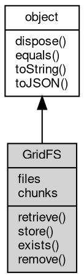

# 对象 GridFS
[MongoDB](MongoDB.md) GridFS 分布式文件系统访问对象

使用 [MongoDB.fs](MongoDB.md#fs) 获取，创建方式：

```JavaScript
var gfs = mdb.fs;
```

## 继承关系


## 成员属性
        
### files
**[MongoCollection](MongoCollection.md), 查询 GridFS 的元数据表**

```JavaScript
readonly MongoCollection GridFS.files;
```

--------------------------
### chunks
**[MongoCollection](MongoCollection.md), 查询 GridFS 的分块数据表**

```JavaScript
readonly MongoCollection GridFS.chunks;
```

## 成员函数
        
### retrieve
**获取一个文件**

```JavaScript
MemoryStream GridFS.retrieve(String name);
```

调用参数:
* name: String, 指定获取的文件名

返回结果:
* [MemoryStream](MemoryStream.md), 返回获取的文件

--------------------------
### store
**保存一个流到文件系统**

```JavaScript
GridFS.store(String name,
    Stream src);
```

调用参数:
* name: String, 指定保存的文件名
* src: [Stream](Stream.md), 存放源数据的流对象

--------------------------
**保存一个二进制数据块到文件系统**

```JavaScript
GridFS.store(String name,
    Buffer data);
```

调用参数:
* name: String, 指定保存的文件名
* data: [Buffer](Buffer.md), 指定要保存的数据块

--------------------------
### exists
**检测指定的文件是否存在**

```JavaScript
Boolean GridFS.exists(String name);
```

调用参数:
* name: String, 指定要检测的文件名

返回结果:
* Boolean, 存在则返回 true

--------------------------
### remove
**删除指定的文件**

```JavaScript
GridFS.remove(String name);
```

调用参数:
* name: String, 指定要删除的文件名

--------------------------
### dispose
**强制回收对象，调用此方法后，对象资源将立即释放**

```JavaScript
GridFS.dispose();
```

--------------------------
### equals
**比较当前对象与给定的对象是否相等**

```JavaScript
Boolean GridFS.equals(object expected);
```

调用参数:
* expected: [object](object.md), 制定比较的目标对象

返回结果:
* Boolean, 返回对象比较的结果

--------------------------
### toString
**返回对象的字符串表示，一般返回 "[Native Object]"，对象可以根据自己的特性重新实现**

```JavaScript
String GridFS.toString();
```

返回结果:
* String, 返回对象的字符串表示

--------------------------
### toJSON
**返回对象的 JSON 格式表示，一般返回对象定义的可读属性集合**

```JavaScript
Value GridFS.toJSON(String key = "");
```

调用参数:
* key: String, 未使用

返回结果:
* Value, 返回包含可 JSON 序列化的值

