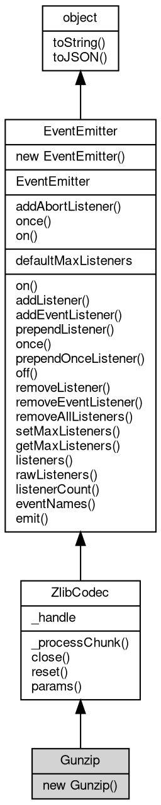

# 对象 Gunzip
Gunzip 解压缩编解码器，解压 gzip 压缩的数据

## 继承关系


## 构造函数
        
### Gunzip
**Gunzip 构造函数**

```JavaScript
new Gunzip(Object opts = {});
```

调用参数:
* opts: Object, 解压缩选项

## 静态函数
        
### addAbortListener
**监听一个 [AbortSignal](AbortSignal.md) 的 abort 事件，返回一个可释放的对象**

```JavaScript
static Object Gunzip.addAbortListener(EventEmitter signal,
    Function func);
```

调用参数:
* signal: [EventEmitter](EventEmitter.md), 要监听的 [AbortSignal](AbortSignal.md) 对象
* func: Function, abort 事件的处理函数

返回结果:
* Object, 返回一个包含 `[Symbol.dispose]` 方法的 Disposable 对象

返回的对象包含 `[Symbol.dispose]()` 方法，调用后将移除监听器。如果信号已中止，则监听器会被立即调用。

--------------------------
### once
**创建一个 Promise，等待指定事件触发一次后解析**

```JavaScript
static Object Gunzip.once(EventEmitter emitter,
    Value ev,
    Object options = {});
```

调用参数:
* emitter: [EventEmitter](EventEmitter.md), 要监听的事件触发器对象
* ev: Value, 指定事件的名称
* options: Object, 可选参数对象

返回结果:
* Object, 返回 Promise，以事件参数数组解析

返回一个 Promise，当目标事件触发时以事件参数数组解析。如果在此期间触发 'error' 事件（且监听的不是 'error' 事件本身），Promise 将被拒绝。

options 参数可包含：
- signal: [AbortSignal](AbortSignal.md)，用于取消等待

--------------------------
### on
**创建一个异步迭代器，持续监听指定事件**

```JavaScript
static Object Gunzip.on(EventEmitter emitter,
    Value ev,
    Object options = {});
```

调用参数:
* emitter: [EventEmitter](EventEmitter.md), 要监听的事件触发器对象
* ev: Value, 指定事件的名称
* options: Object, 可选参数对象

返回结果:
* Object, 返回 AsyncIterator 对象

返回一个 AsyncIterator，每次事件触发时产出事件参数数组。如果触发 'error' 事件，迭代器将抛出错误。

options 参数可包含：
- signal: [AbortSignal](AbortSignal.md)，用于取消迭代
- close: 字符串数组，指定结束迭代的事件名称

## 静态属性
        
### defaultMaxListeners
**Integer, 默认全局最大监听器数**

```JavaScript
static Integer Gunzip.defaultMaxListeners;
```

## 成员属性
        
### _handle
**Value, 底层 handle 对象，用于内部兼容**

```JavaScript
Value Gunzip._handle;
```

## 成员函数
        
### _processChunk
**同步处理一块数据**

```JavaScript
Buffer Gunzip._processChunk(Buffer chunk,
    Integer flushFlag);
```

调用参数:
* chunk: [Buffer](Buffer.md), 要处理的数据
* flushFlag: Integer, 刷新标志，参见 [zlib.constants](../../module/ifs/zlib.md#constants).Z_NO_FLUSH 等

返回结果:
* [Buffer](Buffer.md), 返回处理后的数据

--------------------------
### close
**关闭编解码器，释放资源**

```JavaScript
Gunzip.close();
```

--------------------------
### reset
**重置编解码器状态**

```JavaScript
Gunzip.reset();
```

--------------------------
### params
**动态更新压缩参数**

```JavaScript
Gunzip.params(Integer level,
    Integer strategy);
```

调用参数:
* level: Integer, 压缩级别
* strategy: Integer, 压缩策略

--------------------------
### on
**绑定一个事件处理函数到对象**

```JavaScript
Object Gunzip.on(Value ev,
    Function func);
```

调用参数:
* ev: Value, 指定事件的名称
* func: Function, 指定事件处理函数

返回结果:
* Object, 返回事件对象本身，便于链式调用

--------------------------
**绑定一个事件处理函数到对象**

```JavaScript
Object Gunzip.on(Object map);
```

调用参数:
* map: Object, 指定事件映射关系，对象属性名称将作为事件名称，属性的值将作为事件处理函数

返回结果:
* Object, 返回事件对象本身，便于链式调用

--------------------------
### addListener
**绑定一个事件处理函数到对象**

```JavaScript
Object Gunzip.addListener(Value ev,
    Function func);
```

调用参数:
* ev: Value, 指定事件的名称
* func: Function, 指定事件处理函数

返回结果:
* Object, 返回事件对象本身，便于链式调用

--------------------------
**绑定一个事件处理函数到对象**

```JavaScript
Object Gunzip.addListener(Object map);
```

调用参数:
* map: Object, 指定事件映射关系，对象属性名称将作为事件名称，属性的值将作为事件处理函数

返回结果:
* Object, 返回事件对象本身，便于链式调用

--------------------------
### addEventListener
**绑定一个事件处理函数到对象**

```JavaScript
Object Gunzip.addEventListener(Value ev,
    Function func,
    Object options = {});
```

调用参数:
* ev: Value, 指定事件的名称
* func: Function, 指定事件处理函数
* options: Object, 指定事件处理函数的选项

返回结果:
* Object, 返回事件对象本身，便于链式调用

options 参数是一个对象，它可以包含以下属性：
- once: 如果为 true，则事件处理函数只会触发一次，触发后会被移除

--------------------------
### prependListener
**绑定一个事件处理函数到对象起始**

```JavaScript
Object Gunzip.prependListener(Value ev,
    Function func);
```

调用参数:
* ev: Value, 指定事件的名称
* func: Function, 指定事件处理函数

返回结果:
* Object, 返回事件对象本身，便于链式调用

--------------------------
**绑定一个事件处理函数到对象起始**

```JavaScript
Object Gunzip.prependListener(Object map);
```

调用参数:
* map: Object, 指定事件映射关系，对象属性名称将作为事件名称，属性的值将作为事件处理函数

返回结果:
* Object, 返回事件对象本身，便于链式调用

--------------------------
### once
**绑定一个一次性事件处理函数到对象，一次性处理函数只会触发一次**

```JavaScript
Object Gunzip.once(Value ev,
    Function func);
```

调用参数:
* ev: Value, 指定事件的名称
* func: Function, 指定事件处理函数

返回结果:
* Object, 返回事件对象本身，便于链式调用

--------------------------
**绑定一个一次性事件处理函数到对象，一次性处理函数只会触发一次**

```JavaScript
Object Gunzip.once(Object map);
```

调用参数:
* map: Object, 指定事件映射关系，对象属性名称将作为事件名称，属性的值将作为事件处理函数

返回结果:
* Object, 返回事件对象本身，便于链式调用

--------------------------
### prependOnceListener
**绑定一个事件处理函数到对象起始**

```JavaScript
Object Gunzip.prependOnceListener(Value ev,
    Function func);
```

调用参数:
* ev: Value, 指定事件的名称
* func: Function, 指定事件处理函数

返回结果:
* Object, 返回事件对象本身，便于链式调用

--------------------------
**绑定一个事件处理函数到对象起始**

```JavaScript
Object Gunzip.prependOnceListener(Object map);
```

调用参数:
* map: Object, 指定事件映射关系，对象属性名称将作为事件名称，属性的值将作为事件处理函数

返回结果:
* Object, 返回事件对象本身，便于链式调用

--------------------------
### off
**从对象处理队列中取消指定函数**

```JavaScript
Object Gunzip.off(Value ev,
    Function func);
```

调用参数:
* ev: Value, 指定事件的名称
* func: Function, 指定事件处理函数

返回结果:
* Object, 返回事件对象本身，便于链式调用

--------------------------
**取消对象处理队列中的全部函数**

```JavaScript
Object Gunzip.off(Value ev);
```

调用参数:
* ev: Value, 指定事件的名称

返回结果:
* Object, 返回事件对象本身，便于链式调用

--------------------------
**从对象处理队列中取消指定函数**

```JavaScript
Object Gunzip.off(Object map);
```

调用参数:
* map: Object, 指定事件映射关系，对象属性名称作为事件名称，属性的值作为事件处理函数

返回结果:
* Object, 返回事件对象本身，便于链式调用

--------------------------
### removeListener
**从对象处理队列中取消指定函数**

```JavaScript
Object Gunzip.removeListener(Value ev,
    Function func);
```

调用参数:
* ev: Value, 指定事件的名称
* func: Function, 指定事件处理函数

返回结果:
* Object, 返回事件对象本身，便于链式调用

--------------------------
**取消对象处理队列中的全部函数**

```JavaScript
Object Gunzip.removeListener(Value ev);
```

调用参数:
* ev: Value, 指定事件的名称

返回结果:
* Object, 返回事件对象本身，便于链式调用

--------------------------
**从对象处理队列中取消指定函数**

```JavaScript
Object Gunzip.removeListener(Object map);
```

调用参数:
* map: Object, 指定事件映射关系，对象属性名称作为事件名称，属性的值作为事件处理函数

返回结果:
* Object, 返回事件对象本身，便于链式调用

--------------------------
### removeEventListener
**从对象处理队列中取消指定函数**

```JavaScript
Object Gunzip.removeEventListener(Value ev,
    Function func,
    Object options = {});
```

调用参数:
* ev: Value, 指定事件的名称
* func: Function, 指定事件处理函数
* options: Object, 指定事件处理函数的选项

返回结果:
* Object, 返回事件对象本身，便于链式调用

--------------------------
### removeAllListeners
**从对象处理队列中取消所有事件的所有监听器， 如果指定事件，则移除指定事件的所有监听器。**

```JavaScript
Object Gunzip.removeAllListeners(Value ev);
```

调用参数:
* ev: Value, 指定事件的名称

返回结果:
* Object, 返回事件对象本身，便于链式调用

--------------------------
**从对象处理队列中取消所有事件的所有监听器， 如果指定事件，则移除指定事件的所有监听器。**

```JavaScript
Object Gunzip.removeAllListeners(Array evs = []);
```

调用参数:
* evs: Array, 指定事件的名称

返回结果:
* Object, 返回事件对象本身，便于链式调用

--------------------------
### setMaxListeners
**监听器的默认限制的数量，仅用于兼容**

```JavaScript
Gunzip.setMaxListeners(Integer n);
```

调用参数:
* n: Integer, 指定事件的数量

--------------------------
### getMaxListeners
**获取监听器的默认限制的数量，仅用于兼容**

```JavaScript
Integer Gunzip.getMaxListeners();
```

返回结果:
* Integer, 返回默认限制数量

--------------------------
### listeners
**查询对象指定事件的监听器数组**

```JavaScript
Array Gunzip.listeners(Value ev);
```

调用参数:
* ev: Value, 指定事件的名称

返回结果:
* Array, 返回指定事件的监听器数组

--------------------------
### rawListeners
**查询对象指定事件的监听器数组，包含 once 包装函数**

```JavaScript
Array Gunzip.rawListeners(Value ev);
```

调用参数:
* ev: Value, 指定事件的名称

返回结果:
* Array, 返回指定事件的监听器数组

--------------------------
### listenerCount
**查询对象指定事件的监听器数量**

```JavaScript
Integer Gunzip.listenerCount(Value ev);
```

调用参数:
* ev: Value, 指定事件的名称

返回结果:
* Integer, 返回指定事件的监听器数量

--------------------------
**查询对象指定事件的监听器数量**

```JavaScript
Integer Gunzip.listenerCount(Value o,
    Value ev);
```

调用参数:
* o: Value, 指定查询的对象
* ev: Value, 指定事件的名称

返回结果:
* Integer, 返回指定事件的监听器数量

--------------------------
### eventNames
**查询监听器事件名称**

```JavaScript
Array Gunzip.eventNames();
```

返回结果:
* Array, 返回事件名称数组

--------------------------
### emit
**主动触发一个事件**

```JavaScript
Boolean Gunzip.emit(Value ev,
    ...args);
```

调用参数:
* ev: Value, 事件名称
* args: ..., 事件参数，将会传递给事件处理函数

返回结果:
* Boolean, 返回事件触发状态，有响应事件返回 true，否则返回 false

--------------------------
### toString
**返回对象的字符串表示，一般返回 "[Native Object]"，对象可以根据自己的特性重新实现**

```JavaScript
String Gunzip.toString();
```

返回结果:
* String, 返回对象的字符串表示

--------------------------
### toJSON
**返回对象的 JSON 格式表示，一般返回对象定义的可读属性集合**

```JavaScript
Value Gunzip.toJSON(String key = "");
```

调用参数:
* key: String, 未使用

返回结果:
* Value, 返回包含可 JSON 序列化的值

