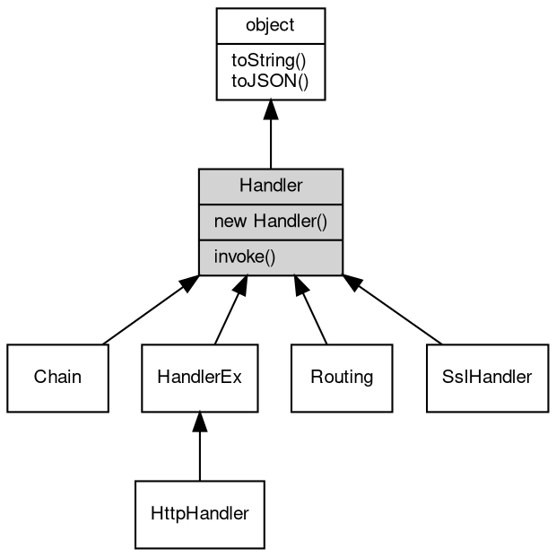

# 对象 Handler
消息处理器接口

## 继承关系


## 构造函数
        
### Handler
**构造一个消息处理器链处理对象**

```JavaScript
new Handler(Array hdlrs);
```

调用参数:
* hdlrs: Array, 处理器数组

--------------------------
**创建一个消息处理器路由对象**

```JavaScript
new Handler(Object map);
```

调用参数:
* map: Object, 初始化路由参数

--------------------------
**创建一个 JavaSvript 消息处理器**

```JavaScript
new Handler(Function hdlr);
```

调用参数:
* hdlr: Function, JavaScript 处理器函数

## 成员函数
        
### invoke
**处理一个消息或对象**

```JavaScript
Handler Handler.invoke(object v) async;
```

调用参数:
* v: [object](object.md), 指定处理的消息或对象

返回结果:
* Handler, 返回下一步的处理器

--------------------------
### toString
**返回对象的字符串表示，一般返回 "[Native Object]"，对象可以根据自己的特性重新实现**

```JavaScript
String Handler.toString();
```

返回结果:
* String, 返回对象的字符串表示

--------------------------
### toJSON
**返回对象的 JSON 格式表示，一般返回对象定义的可读属性集合**

```JavaScript
Value Handler.toJSON(String key = "");
```

调用参数:
* key: String, 未使用

返回结果:
* Value, 返回包含可 JSON 序列化的值

