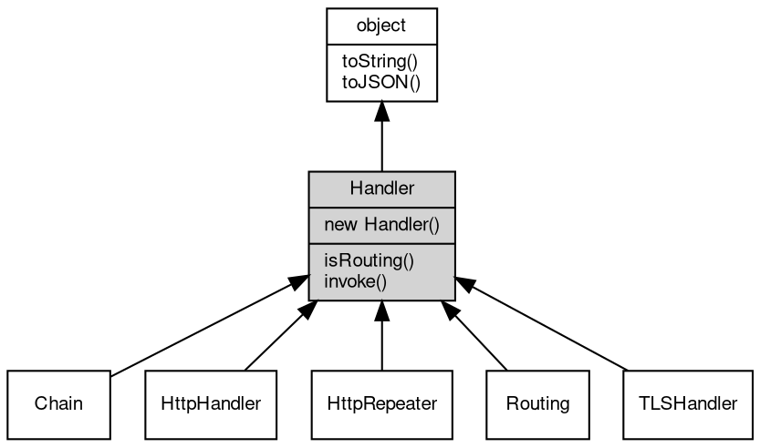

# Object Handler
The message handler contract and the constructor that builds every handler form

Handler is the common type of the fibjs message pipeline: a routing, a chain,
an [http](../../module/ifs/http.md) handler, a static file handler, a request repeater and a JavaScript
function all become a Handler, so any of them can be passed wherever a handler
is expected ([http.Server](../../module/ifs/http.md#Server), [net.TcpServer](../../module/ifs/net.md#TcpServer), [mq.invoke](../../module/ifs/mq.md#invoke), [Chain.append](Chain.md#append),
[Routing.append](Routing.md#append) and so on). The interface has no instances of its own — its
constructors convert the argument to the concrete class of the given form,
and every instance belongs to one of those classes.

Concepts:
- **One stage or the whole pipeline**: invoke processes the message once and
  returns the next handler to run, or null when the processing ends.
  [mq.invoke](../../module/ifs/mq.md#invoke)(...) is the loop on top of it: it calls invoke repeatedly, feeding
  each returned handler back, until null comes back. Use [mq.invoke](../../module/ifs/mq.md#invoke) to run a
  pipeline and invoke to place a single step.
- **Returning a handler from a function**: a JavaScript handler function may
  return another handler, a handling function, an array (a new [Chain](Chain.md)) or a
  routing map (a new [Routing](Routing.md)) to continue the processing, and may return
  nothing to finish its stage. Any other returned value is an error, so write
  braces when the last expression is not a handler — res.write returns a drain
  flag, not a handler.
- **isRouting**: tells whether the handler matches messages by itself.
  [Routing](Routing.md), [HttpRepeater](HttpRepeater.md) and file handlers do; a plain function and a [Chain](Chain.md) of
  plain functions do not. [Routing.append](Routing.md#append) uses it to decide whether the
  remaining [path](../../module/ifs/path.md) must be handed to the handler.
- **Construction forms**: an array becomes a [Chain](Chain.md), a routing map becomes a
  [Routing](Routing.md), a function becomes a JavaScript handler, and a string becomes a
  file handler (a directory) or a request repeater (an `http(s)://` address).
  The concrete classes can also be constructed directly.

Obtained from:
- `new Handler(hdlrs)` — an array becomes a [Chain](Chain.md);
- `new Handler(map)` — a routing map becomes a [Routing](Routing.md);
- `new Handler(fn)` — a function becomes a JavaScript handler;
- `new Handler([path](../../module/ifs/path.md))` — a directory becomes a file handler and an
  `http(s)://` address becomes a request repeater.

Example 1 — the constructor selects the concrete class:

```JavaScript
const mq = require('mq');

console.log(new mq.Handler([() => {}]).isRouting()); // false: a Chain
console.log(new mq.Handler({
    '/a': () => {}
}).isRouting()); // true: a Routing
console.log(new mq.Handler(() => {}).isRouting()); // false
console.log(new mq.Handler('.').isRouting()); // true: a file handler
```

Example 2 — a function handler and the request/response form:

```JavaScript
const mq = require('mq');
const http = require('http');

const handler = new mq.Handler((req, res) => {
    res.write('handled ' + req.address);
});

const req = new http.Request();
req.value = '/';
mq.invoke(handler, req);

req.response.body.rewind();
console.log(req.response.body.readAll().toString()); // handled /
```

Example 3 — invoke runs one stage and returns the next handler:

```JavaScript
const mq = require('mq');

const step = new mq.Handler((v) => {
    console.log('first stage: ' + v.value);
    return new mq.Handler((v) => console.log('second stage: ' + v.value));
});

const msg = new mq.Message();
msg.value = 'x';

const next = step.invoke(msg);
next.invoke(msg);
```

## Inheritance

```dot
digraph {
    node [fontname="Helvetica,sans-Serif", fontsize=10, shape="record", style="filled", fillcolor="white"];

    object [tooltip="object", URL="object.md", label="{object|toString()\ltoJSON()\l}"];
    Handler [tooltip="Handler", fillcolor="lightgray", id="me", label="{Handler|new Handler()\l|isRouting()\linvoke()\l}"];
    Chain [tooltip="Chain", URL="Chain.md", label="{Chain}"];
    HttpHandler [tooltip="HttpHandler", URL="HttpHandler.md", label="{HttpHandler}"];
    HttpRepeater [tooltip="HttpRepeater", URL="HttpRepeater.md", label="{HttpRepeater}"];
    Routing [tooltip="Routing", URL="Routing.md", label="{Routing}"];
    TLSHandler [tooltip="TLSHandler", URL="TLSHandler.md", label="{TLSHandler}"];

    object -> Handler [dir=back];
    Handler -> Chain [dir=back];
    Handler -> HttpHandler [dir=back];
    Handler -> HttpRepeater [dir=back];
    Handler -> Routing [dir=back];
    Handler -> TLSHandler [dir=back];
}
```

## Constructors
        
### Handler
**Constructs a message handler chain [object](object.md)**

```JavaScript
new Handler(Handler hdlrs[]);
```

Parameters:
* hdlrs[]: Handler, handler array; each element is converted like a single handler (a Handler [object](object.md), an array of handlers, a handler function, a routing map [object](object.md), or a [path](../../module/ifs/path.md)/address string)

The array is converted through the [Chain](Chain.md) constructor, so the result is a
[Chain](Chain.md) whose elements run in order; each element is converted like a single
handler (a Handler [object](object.md), an array of handlers, a handler function, a
routing map [object](object.md), or a [path](../../module/ifs/path.md)/address string). This form is equivalent to
`new [mq.Chain](../../module/ifs/mq.md#Chain)(hdlrs)`.

--------------------------
**Creates a message handler routing [object](object.md)**

```JavaScript
new Handler(Object map);
```

Parameters:
* map: Object, initialization routing parameters

The keys of map are match patterns and the values are handlers; the result
is a [Routing](Routing.md) built with the same constructor, so `new Handler(map)` and
`new [mq.Routing](../../module/ifs/mq.md#Routing)(map)` are interchangeable. Patterns may use the express
style `:name` captures or be raw regular expressions, and the handler
forms accepted as values are the usual ones (see [Routing](Routing.md)).

--------------------------
**Creates a JavaScript message handler**

```JavaScript
new Handler(Function(Value req, ...params) => Value hdlr);
```

Parameters:
* hdlr: Function(Value req, ...params) => Value, JavaScript handler function

The function is called as `(req, ...params) => any` with the message (and
the captures of the arriving route, if any) and may return the handler for
the next stage. When the message is an [HttpRequest](HttpRequest.md) the response is passed
as the last argument, so the usual HTTP form is `(req, res) => any`; the
declared `(Value req, ...params)` shape covers both because the response
is appended after the captures.

A function marked with [util.sync](../../module/ifs/util.md#sync) (or an async function) is detected and
awaited, so asynchronous handlers can finish their stage before the
pipeline continues. This form is equivalent to `new [mq.Handler](../../module/ifs/mq.md#Handler)(fn)` used
by everything that accepts a handler.

--------------------------
**Constructs a file handler or a request repeater**

```JavaScript
new Handler(String hdlr);
```

Parameters:
* hdlr: String, the address parameter of the handler

The address decides the class: a local directory (or a file [path](../../module/ifs/path.md)) becomes
a static file handler, while an `[http](../../module/ifs/http.md)://` or `https://` address becomes an
[HttpRepeater](HttpRepeater.md) that forwards requests to it. The [path](../../module/ifs/path.md) must exist for a file
handler; a repeater validates its URL when it is built (a hostname is
required, a query string and a fragment are rejected).

## Methods
        
### isRouting
**Queries whether the current handler supports routing**

```JavaScript
Boolean Handler.isRouting();
```

Returns:
* Boolean, returns whether the current handler supports routing

A routing handler matches messages by itself and is used for the message
as it is; a non-routing handler is a terminal stage of a chain or a
function. [Routing](Routing.md), [HttpRepeater](HttpRepeater.md) and file handlers return true, while
JavaScript handlers and chains made only of them return false. [Chain](Chain.md)
returns true when at least one of its elements routes; [Routing.append](Routing.md#append)
reads the flag to decide whether the remaining [path](../../module/ifs/path.md) must be handed to the
handler as a sub-route.

Example — the flag of the concrete classes:

```JavaScript
const mq = require('mq');

console.log(new mq.Routing({
    '/a': () => {}
}).isRouting()); // true
console.log(new mq.Chain([() => {}]).isRouting()); // false

const repeater = new mq.Handler('http://127.0.0.1:8080/');
console.log(repeater.isRouting()); // true
```

--------------------------
### invoke
**Processes a message or [object](object.md)**

```JavaScript
Handler Handler.invoke(object v) async;
```

Parameters:
* v: [object](object.md), the message or [object](object.md) to [process](../../module/ifs/process.md)

Returns:
* Handler, returns the next handler

The call is a single stage of the pipeline: the handler processes v and
the returned value is the next handler to run, or null when the message
processing is finished. For a JavaScript handler this is the value the
function returned (converted to a handler); for a routing it is the
handler of the matched rule; for a chain it is the handler that should run
next. The method is asynchronous and blocks the current fiber until the
stage completes; [mq.invoke](../../module/ifs/mq.md#invoke) is the loop that keeps invoking the returned
handler until null.

Example — run one stage and continue with the returned handler:

```JavaScript
const mq = require('mq');

const step = new mq.Handler((v) => {
    console.log('stage: ' + v.value);
    return new mq.Handler((v) => console.log('returned handler ran'));
});

const msg = new mq.Message();
msg.value = 'x';
const next = step.invoke(msg);
console.log(next instanceof mq.Handler); // true
next.invoke(msg);
```

--------------------------
### toString
**Returns the string form of the [object](object.md)**

```JavaScript
String Handler.toString();
```

Returns:
* String, returns the string form of the [object](object.md)

The base implementation reports an error: a native [object](object.md) has no implicit
text form, and only the classes whose value can be written as a string
override the member. [Buffer](Buffer.md) returns its content decoded with the given
[encoding](../../module/ifs/encoding.md), [HttpCookie](HttpCookie.md) returns "name=value", and so on; an override commonly
accepts optional arguments ([Buffer.toString](Buffer.md#toString) takes [encoding](../../module/ifs/encoding.md), start and
end) that are not part of this declaration.

Calling the member on a class that does not override it throws
"<Class>: the [object](object.md) can not be converted to string.", which is the
behavior to rely on when probing whether a value has a string form. See
toJSON for the serialization hook.

--------------------------
### toJSON
**Returns the JSON representation of the [object](object.md)**

```JavaScript
Value Handler.toJSON(String key = "");
```

Parameters:
* key: String, the property name of the value being serialized

Returns:
* Value, returns the JSON-serializable value

JSON.stringify(value) calls value.toJSON(key) when the member exists and
serializes the returned value in its place; the key argument carries the
property name of the value inside its parent [object](object.md) (an empty string at
the top level) and may be used to build a keyed form. The base
implementation returns a plain [object](object.md) holding the readable properties of
the instance, so a native [object](object.md) serializes without per-class code; a
class with a portable shape such as [Buffer](Buffer.md) overrides it, and a JavaScript
class may override it in the same way.

The member is normally reached through JSON.stringify rather than called
directly; calling it returns the same value JSON.stringify would
serialize.

