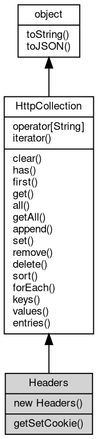

# 对象 Headers
Headers 是一个专门用于处理 HTTP 头部信息的容器类，继承自 [HttpCollection](HttpCollection.md)

Headers 实现了标准的 HTTP Headers API，同时作为全局 Headers 对象和 [http.Headers](../../module/ifs/http.md#Headers) 的实现类。它提供了完整的 HTTP 头部管理功能，支持标准的 HTTP 头部字段操作，继承了 [HttpCollection](HttpCollection.md) 的所有功能，包括添加、设置、查询和删除头部字段。

Headers 支持以下几种使用方式：

1. 作为全局 Headers API 使用（Web 标准）：

```JavaScript
// Create empty Headers object
const headers = new Headers();

// Initialize with object
const headers = new Headers({
    'Content-Type': 'application/json',
    'Accept': 'application/json'
});

// Initialize with array
const headers = new Headers([
    ['Content-Type', 'application/json'],
    ['Accept', 'application/json']
]);

// Copy from another Headers object
const copy = new Headers(headers);
```

2. 作为 [http.Headers](../../module/ifs/http.md#Headers) 使用（fibjs 扩展）：

```JavaScript
const headers = new http.Headers({
    'User-Agent': 'fibjs/1.0',
    'Accept': 'text/html'
});
```

Headers API 标准方法示例：

```JavaScript
// Standard Headers API methods
headers.set('Content-Type', 'text/html; charset=utf-8');
headers.append('Accept', 'application/json');
headers.get('Content-Type'); // 'text/html; charset=utf-8'
headers.has('Accept'); // true
headers.delete('User-Agent');

// Iterator support
for (const [name, value] of headers) {
    console.log(`${name}: ${value}`);
}

// Iterate over keys
for (const name of headers.keys()) {
    console.log(name);
}

// Iterate over values
for (const value of headers.values()) {
    console.log(value);
}

// forEach method
headers.forEach((value, name) => {
    console.log(`${name}: ${value}`);
});
```

fibjs 扩展方法示例（继承自 [HttpCollection](HttpCollection.md)）：

```JavaScript
// Add multiple values (without overwriting existing)
headers.add('Cache-Control', 'no-cache');

// Get first value
const auth = headers.first('Authorization');

// Get all values
const cookies = headers.all('Set-Cookie');

// Set multiple cookies
headers.set('Set-Cookie', [
    'sessionId=abc123; Path=/',
    'userId=456; Path=/; HttpOnly'
]);
```

Headers 自动处理头部字段名的大小写不敏感特性，完全遵循 HTTP 协议规范和 Web 标准 Headers API。

## 继承关系


## 构造函数
        
### Headers
**Headers 构造函数，创建一个新的空 HTTP 头部容器**

```JavaScript
new Headers();
```

--------------------------
**Headers 构造函数，使用给定的对象初始化 HTTP 头部容器**

```JavaScript
new Headers(Object init);
```

调用参数:
* init: Object, 初始化用的头部字段对象，键为头部字段名，值为头部字段值

--------------------------
**Headers 构造函数，使用给定的数组初始化 HTTP 头部容器**

```JavaScript
new Headers(Array init);
```

调用参数:
* init: Array, 初始化用的头部字段数组，每个元素为一个包含头部字段名和头部字段值的数组

--------------------------
**Headers 构造函数，使用给定的 HTTP 头部容器初始化 HTTP 头部容器**

```JavaScript
new Headers(Headers init);
```

调用参数:
* init: Headers, 初始化用的 HTTP 头部容器

## 操作符
        
### @iterator
**查询当前对象元素的迭代器**

```JavaScript
Iterator Headers.@iterator();
```

返回结果:
* [Iterator](Iterator.md), 返回当前对象元素的迭代器

## 成员函数
        
### getSetCookie
**返回所有 Set-Cookie 头部值组成的数组**

```JavaScript
NArray Headers.getSetCookie();
```

返回结果:
* NArray, 返回包含所有 Set-Cookie 值的数组

--------------------------
### clear
**清除容器数据**

```JavaScript
Headers.clear();
```

--------------------------
### has
**检查容器内是否存在指定键值的数据**

```JavaScript
Boolean Headers.has(String name);
```

调用参数:
* name: String, 指定要检查的键值

返回结果:
* Boolean, 返回键值是否存在

--------------------------
### first
**查询指定键值的第一个值**

```JavaScript
Variant Headers.first(String name);
```

调用参数:
* name: String, 指定要查询的键值

返回结果:
* Variant, 返回键值所对应的值，若不存在，则返回 undefined

--------------------------
### get
**查询指定键值的第一个值，等同于 first**

```JavaScript
Variant Headers.get(String name);
```

调用参数:
* name: String, 指定要查询的键值

返回结果:
* Variant, 返回键值所对应的值，若不存在，则返回 undefined

--------------------------
### all
**查询指定键值的全部值**

```JavaScript
NObject Headers.all(String name = "");
```

调用参数:
* name: String, 指定要查询的键值，传递空字符串返回全部键值的结果

返回结果:
* NObject, 返回键值所对应全部值的数组，若数据不存在，则返回 null

--------------------------
### getAll
**查询指定键值的全部值**

```JavaScript
NArray Headers.getAll(String name);
```

调用参数:
* name: String, 指定要查询的键值

返回结果:
* NArray, 返回键值所对应全部值的数组，若数据不存在，则返回 null

--------------------------
### append
**添加一个键值数据，添加数据并不修改已存在的键值的数据**

```JavaScript
Headers.append(Object map);
```

调用参数:
* map: Object, 指定要添加的键值数据字典

--------------------------
**添加一个键值的一组数据，添加数据并不修改已存在的键值的数据**

```JavaScript
Headers.append(String name,
    Array values);
```

调用参数:
* name: String, 指定要添加的键值
* values: Array, 指定要添加的一组数据

--------------------------
**添加一组数据，添加数据并不修改已存在的键值的数据**

```JavaScript
Headers.append(Array entries);
```

调用参数:
* entries: Array, 指定要添加的一组数据，格式为 [[<key>, <value>]]

--------------------------
**添加一个键值数据，添加数据并不修改已存在的键值的数据**

```JavaScript
Headers.append(String name,
    Variant value);
```

调用参数:
* name: String, 指定要添加的键值
* value: Variant, 指定要添加的数据

--------------------------
### set
**设定一个键值数据，设定数据将修改键值所对应的第一个数值，并清除相同键值的其余数据**

```JavaScript
Headers.set(Object map);
```

调用参数:
* map: Object, 指定要设定的键值数据字典

--------------------------
**设定一个键值的一组数据，设定数据将修改键值所对应的数值，并清除相同键值的其余数据**

```JavaScript
Headers.set(String name,
    Array values);
```

调用参数:
* name: String, 指定要设定的键值
* values: Array, 指定要设定的一组数据

--------------------------
**设定一个键值数据，设定数据将修改键值所对应的第一个数值，并清除相同键值的其余数据**

```JavaScript
Headers.set(String name,
    Variant value);
```

调用参数:
* name: String, 指定要设定的键值
* value: Variant, 指定要设定的数据

--------------------------
### remove
**删除指定键值的全部值**

```JavaScript
Headers.remove(String name);
```

调用参数:
* name: String, 指定要删除的键值

--------------------------
### delete
**删除指定键值的全部值**

```JavaScript
Headers.delete(String name);
```

调用参数:
* name: String, 指定要删除的键值

--------------------------
### sort
**按照键值排序容器内的内容**

```JavaScript
Headers.sort();
```

--------------------------
### forEach
**遍历容器内的内容**

```JavaScript
Headers.forEach(Function callback);
```

调用参数:
* callback: Function, 指定遍历时调用的函数，函数参数为 (value, key, [object](object.md))

--------------------------
**遍历容器内的内容**

```JavaScript
Headers.forEach(Function callback,
    Value thisArg);
```

调用参数:
* callback: Function, 指定遍历时调用的函数，函数参数为 (value, key, [object](object.md))
* thisArg: Value, 指定回调函数的 this 对象

--------------------------
### keys
**查询容器内的键值**

```JavaScript
Iterator Headers.keys();
```

返回结果:
* [Iterator](Iterator.md), 返回包含所有键值的迭代器

--------------------------
### values
**查询容器内的数值**

```JavaScript
Iterator Headers.values();
```

返回结果:
* [Iterator](Iterator.md), 返回包含所有数值的迭代器

--------------------------
### entries
**查询容器内的键值和数值**

```JavaScript
Iterator Headers.entries();
```

返回结果:
* [Iterator](Iterator.md), 返回包含所有键值和数值的迭代器

--------------------------
### toString
**返回对象的字符串表示，一般返回 "[Native Object]"，对象可以根据自己的特性重新实现**

```JavaScript
String Headers.toString();
```

返回结果:
* String, 返回对象的字符串表示

--------------------------
### toJSON
**返回对象的 JSON 格式表示，一般返回对象定义的可读属性集合**

```JavaScript
Value Headers.toJSON(String key = "");
```

调用参数:
* key: String, 未使用

返回结果:
* Value, 返回包含可 JSON 序列化的值

