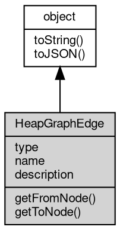

# Object HeapGraphEdge
A directed reference between two [HeapGraphNode](HeapGraphNode.md) objects

An edge records that a node references another value: `getFromNode` is the source (the
container) and `getToNode` is the destination (the referenced value). Edges are
produced by `HeapGraphNode.childs` and are read-only views into their snapshot.

Concepts:

- **Direction**: following `childs` walks from a container to the values it
 references. A snapshot has no reverse index, so finding the retainers of a node
 means searching the graph for edges whose destination is that node.
- **Types**: the `v8.Edge_*` [constants](../../module/ifs/constants.md) classify references into context variables,
 array elements, [object](object.md) properties, internal V8 links, hidden links used for size
 computation, shortcuts that must not be followed and weak references (ignored by
 the garbage collector).
- **Names**: property and context edges carry the property or variable name. Element
 and hidden edges carry a numeric index: for a snapshot loaded from a file `name`
 returns it as a string, while for a live snapshot reading `name` throws a TypeError
 with number 20005, because the underlying V8 value is a number rather than a
 string. Check `type` before reading `name`, or use `description`, which never
 throws.
- **description**: a convenience string `name[Type]`, for example
 `payload[Property]`. For element edges of a live snapshot the name part is empty,
 as in `[Element]`.

Obtained from:
- `node.childs` — the outgoing edges of a [HeapGraphNode](HeapGraphNode.md).

Example 1 — classify the outgoing edges of an [object](object.md):

```JavaScript
const v8 = require('v8');

class TypeMarker42 {
    constructor() {
        this.items = [7, 8];
    }
}
const probe = new TypeMarker42();

const nodes = v8.takeSnapshot().nodes;
const objectNode = nodes.find((n) => n.type === v8.Node_Object && n.name === 'TypeMarker42');

for (const edge of objectNode.childs) {
    if (edge.type === v8.Edge_Property && edge.name === 'items')
        console.log(edge.description, '->', edge.getToNode().name); // items[Property] -> Array
    if (edge.type === v8.Edge_Internal)
        console.log('internal link:', edge.description); // e.g. map[Internal]
}
```

Example 2 — read an edge in both directions:

```JavaScript
const v8 = require('v8');

class EdgeMarker42 {
    constructor() {
        this.answer = 'forty-two';
    }
}
const probe = new EdgeMarker42();

const nodes = v8.takeSnapshot().nodes;
const objectNode = nodes.find((n) => n.type === v8.Node_Object && n.name === 'EdgeMarker42');
const edge = objectNode.childs.find((e) => e.type === v8.Edge_Property && e.name === 'answer');

console.log(edge.getFromNode().id === objectNode.id); // true
console.log(edge.getToNode().type === v8.Node_String); // true
```

## Inheritance


## Properties
        
### type
**Integer, Link type of the downstream node, possible values:**

```JavaScript
readonly Integer HeapGraphEdge.type;
```

- [v8.Edge_ContextVariable](../../module/ifs/v8.md#Edge_ContextVariable),   Variable from a function context
- [v8.Edge_Element](../../module/ifs/v8.md#Edge_Element),           Element of an array; the name is the numeric index
- [v8.Edge_Property](../../module/ifs/v8.md#Edge_Property),          Named [object](object.md) property
- [v8.Edge_Internal](../../module/ifs/v8.md#Edge_Internal),          Link that cannot be accessed from JS
- [v8.Edge_Hidden](../../module/ifs/v8.md#Edge_Hidden),            Link needed for size calculation, hidden from the user
- [v8.Edge_Shortcut](../../module/ifs/v8.md#Edge_Shortcut),          Link that must not be followed during size calculation
- [v8.Edge_Weak](../../module/ifs/v8.md#Edge_Weak),              Weak reference, ignored by the garbage collector

See the class Concepts section for how the type affects `name` and
`description`.

--------------------------
### name
**String, Link name**

```JavaScript
readonly String HeapGraphEdge.name;
```

The property or variable name for `v8.Edge_Property` and
`v8.Edge_ContextVariable` edges. For element and hidden edges the underlying V8
value is a number: a snapshot loaded from a file returns the index as a string,
while a live snapshot throws a TypeError with number 20005, so check `type`
before reading `name` or use `description` instead.

--------------------------
### description
**String, Link description**

```JavaScript
readonly String HeapGraphEdge.description;
```

A convenience form of the link for logs and grouping: the name followed by the
type in brackets, for example `payload[Property]`. For element edges of a live
snapshot the name part is empty, as in `[Element]`. Unlike `name`, reading it
never throws.

## Methods
        
### getFromNode
**Gets the upstream [HeapGraphNode](HeapGraphNode.md) node of the HeapGraphEdge**

```JavaScript
HeapGraphNode HeapGraphEdge.getFromNode();
```

Returns:
* [HeapGraphNode](HeapGraphNode.md), returns the source [HeapGraphNode](HeapGraphNode.md) node

Returns the node that owns this reference (the container). Every call returns a
new node [object](object.md), so compare nodes by `id` when identity matters.

--------------------------
### getToNode
**Gets the downstream [HeapGraphNode](HeapGraphNode.md) node of the HeapGraphEdge**

```JavaScript
HeapGraphNode HeapGraphEdge.getToNode();
```

Returns:
* [HeapGraphNode](HeapGraphNode.md), returns the destination [HeapGraphNode](HeapGraphNode.md) node

Returns the referenced value. For a weak edge this is the target of the weak
reference, which the garbage collector ignores; for an element edge of an array
it is the element value. Every call returns a new node [object](object.md), so compare nodes
by `id`.

Example — resolve a property edge and inspect the referenced value:

```JavaScript
const v8 = require('v8');

class EdgeSize42 {
    constructor() {
        this.rows = ['a', 'b', 'c'];
    }
}
const probe = new EdgeSize42();

const nodes = v8.takeSnapshot().nodes;
const objectNode = nodes.find((n) => n.type === v8.Node_Object && n.name === 'EdgeSize42');
const edge = objectNode.childs.find((e) => e.type === v8.Edge_Property && e.name === 'rows');
const rows = edge.getToNode();

console.log(rows.type === v8.Node_Object); // true: a JS array is an object node
console.log(rows.shallowSize >= 0); // true

// The element links of the array carry a numeric index, so use description.
for (const edge of rows.childs) {
    if (edge.type === v8.Edge_Element)
        console.log('element link:', edge.description); // [Element]
}
```

--------------------------
### toString
**Returns the string form of the [object](object.md)**

```JavaScript
String HeapGraphEdge.toString();
```

Returns:
* String, returns the string form of the [object](object.md)

The base implementation reports an error: a native [object](object.md) has no implicit
text form, and only the classes whose value can be written as a string
override the member. [Buffer](Buffer.md) returns its content decoded with the given
[encoding](../../module/ifs/encoding.md), [HttpCookie](HttpCookie.md) returns "name=value", and so on; an override commonly
accepts optional arguments ([Buffer.toString](Buffer.md#toString) takes [encoding](../../module/ifs/encoding.md), start and
end) that are not part of this declaration.

Calling the member on a class that does not override it throws
"<Class>: the [object](object.md) can not be converted to string.", which is the
behavior to rely on when probing whether a value has a string form. See
toJSON for the serialization hook.

--------------------------
### toJSON
**Returns the JSON representation of the [object](object.md)**

```JavaScript
Value HeapGraphEdge.toJSON(String key = "");
```

Parameters:
* key: String, the property name of the value being serialized

Returns:
* Value, returns the JSON-serializable value

JSON.stringify(value) calls value.toJSON(key) when the member exists and
serializes the returned value in its place; the key argument carries the
property name of the value inside its parent [object](object.md) (an empty string at
the top level) and may be used to build a keyed form. The base
implementation returns a plain [object](object.md) holding the readable properties of
the instance, so a native [object](object.md) serializes without per-class code; a
class with a portable shape such as [Buffer](Buffer.md) overrides it, and a JavaScript
class may override it in the same way.

The member is normally reached through JSON.stringify rather than called
directly; calling it returns the same value JSON.stringify would
serialize.

