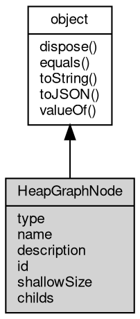

# 对象 HeapGraphNode
HeapGraphNode表示堆视图中的一个节点

## 继承关系


## 成员属性
        
### type
**Integer, 节点类型，可能的值：**

```JavaScript
readonly Integer HeapGraphNode.type;
```

- [profiler.Node_Hidden](../../module/ifs/profiler.md#node_hidden),         隐藏节点，当显示给用户时可以被过滤掉
- [profiler.Node_Array](../../module/ifs/profiler.md#node_array),          数组
- [profiler.Node_String](../../module/ifs/profiler.md#node_string),         字符串
- [profiler.Node_Object](../../module/ifs/profiler.md#node_object),         JS对象（字符串和数组除外）
- [profiler.Node_Code](../../module/ifs/profiler.md#node_code),           编译后的代码
- [profiler.Node_Closure](../../module/ifs/profiler.md#node_closure),        函数闭包
- [profiler.Node_RegExp](../../module/ifs/profiler.md#node_regexp),         正则表达式
- [profiler.Node_HeapNumber](../../module/ifs/profiler.md#node_heapnumber),     堆中排好序的数字
- [profiler.Node_Native](../../module/ifs/profiler.md#node_native),         Native对象（非v8堆上的）
- [profiler.Node_Synthetic](../../module/ifs/profiler.md#node_synthetic),      Synthetic对象
- [profiler.Node_ConsString](../../module/ifs/profiler.md#node_consstring),     拼接的字符串
- [profiler.Node_SlicedString](../../module/ifs/profiler.md#node_slicedstring),   分割的字符串
- [profiler.Node_Symbol](../../module/ifs/profiler.md#node_symbol),         符号（ES6）
- [profiler.Node_SimdValue](../../module/ifs/profiler.md#node_simdvalue),      堆中排好序的SIMD值(ES7)

--------------------------
### name
**String, 节点名称**

```JavaScript
readonly String HeapGraphNode.name;
```

--------------------------
### description
**String, 节点的描述**

```JavaScript
readonly String HeapGraphNode.description;
```

--------------------------
### id
**Integer, 节点ID**

```JavaScript
readonly Integer HeapGraphNode.id;
```

--------------------------
### shallowSize
**Integer, 节点大小，单位为字节**

```JavaScript
readonly Integer HeapGraphNode.shallowSize;
```

--------------------------
### childs
**[List](List.md), 子节点列表，由[HeapGraphEdge](HeapGraphEdge.md)类型对象组成**

```JavaScript
readonly List HeapGraphNode.childs;
```

## 成员函数
        
### dispose
**强制回收对象，调用此方法后，对象资源将立即释放**

```JavaScript
HeapGraphNode.dispose();
```

--------------------------
### equals
**比较当前对象与给定的对象是否相等**

```JavaScript
Boolean HeapGraphNode.equals(object expected);
```

调用参数:
* expected: [object](object.md), 制定比较的目标对象

返回结果:
* Boolean, 返回对象比较的结果

--------------------------
### toString
**返回对象的字符串表示，一般返回 "[Native Object]"，对象可以根据自己的特性重新实现**

```JavaScript
String HeapGraphNode.toString();
```

返回结果:
* String, 返回对象的字符串表示

--------------------------
### toJSON
**返回对象的 JSON 格式表示，一般返回对象定义的可读属性集合**

```JavaScript
Value HeapGraphNode.toJSON(String key = "");
```

调用参数:
* key: String, 未使用

返回结果:
* Value, 返回包含可 JSON 序列化的值

--------------------------
### valueOf
**返回对象本身的数值**

```JavaScript
Value HeapGraphNode.valueOf();
```

返回结果:
* Value, 返回对象本身的数值

