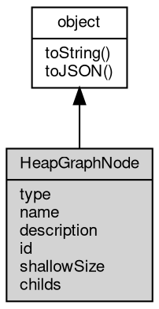

# Object HeapGraphNode
A single [object](object.md) node in a heap snapshot graph

A node describes one value in the captured heap: its `type`, `name`, `id` and
`shallowSize`. The references held by the value are exposed as outgoing
`HeapGraphEdge` objects through `childs`. Nodes are read-only views into the
`HeapSnapshot` they came from; keep that snapshot referenced while the nodes are in
use.

Concepts:

- **Types**: the `v8.Node_*` [constants](../../module/ifs/constants.md) name the classic V8 node [types](../../module/ifs/types.md). The bundled
 V8 reports more [types](../../module/ifs/types.md) than the [constants](../../module/ifs/constants.md) enumerate: 13 is BigInt (whose legacy
 constant name is `v8.Node_SimdValue`), 14 is the shape of an [object](object.md) (no constant),
 and `description` falls back to `Unknown` for unknown values.
- **Names**: for objects the name is the constructor (class) name, for closures the
 function name, for strings the string value itself and for internal nodes a label
 such as `system / ScopeInfo`. Code and some synthetic nodes have an empty name, so
 a name is a hint, not a unique key.
- **Sizes**: `shallowSize` is the memory held by the node itself, not by the objects
 it references; no retained-size property exists, compute it by walking `childs`.
- **description**: a convenience string `name[Type]` (for example
 `HeapMarker[Object]`); it is also the grouping key used by the `details` of
 `HeapSnapshot.diff`.
- **childs**: the outgoing edges, named `childs` rather than the `children`/`edges`
 of Node.js heap tools. Each access re-wraps the edges, so cache the array when
 iterating.

Obtained from:
- `snapshot.nodes` — the flat list of all nodes;
- `snapshot.root` — the synthetic root node;
- `HeapSnapshot.getNodeById(id)` — lookup by id;
- `edge.getFromNode()` / `edge.getToNode()` — the endpoints of an edge.

Example 1 — locate an [object](object.md) by class name and follow a property edge:

```JavaScript
const v8 = require('v8');

class NodeMarker42 {
    constructor() {
        this.payload = [1, 2, 3];
    }
}
const probe = new NodeMarker42(); // reachable from this scope

const nodes = v8.takeSnapshot().nodes; // cache it: the getter rebuilds the array
const objectNode = nodes.find((n) => n.type === v8.Node_Object && n.name === 'NodeMarker42');

const edge = objectNode.childs.find((e) => e.type === v8.Edge_Property && e.name === 'payload');
const payload = edge.getToNode();
console.log(payload.name); // Array
console.log(payload.childs.length > 0); // true
```

Example 2 — survey the first nodes of a graph:

```JavaScript
const v8 = require('v8');

const snapshot = v8.takeSnapshot();
const nodes = snapshot.nodes; // cache it: the getter rebuilds the array on each access

// The first node is the root; the next ones are the entry groups of the graph.
for (const node of nodes.slice(0, 5)) {
    console.log(node.id, node.type, JSON.stringify(node.name), node.description);
}

// Names are empty for some internal nodes, so type is the reliable classifier.
console.log(nodes.every((node) => typeof node.type === 'number')); // true
```

## Inheritance

```dot
digraph {
    node [fontname="Helvetica,sans-Serif", fontsize=10, shape="record", style="filled", fillcolor="white"];

    object [tooltip="object", URL="object.md", label="{object|toString()\ltoJSON()\l}"];
    HeapGraphNode [tooltip="HeapGraphNode", fillcolor="lightgray", id="me", label="{HeapGraphNode|type\lname\ldescription\lid\lshallowSize\lchilds\l}"];

    object -> HeapGraphNode [dir=back];
}
```

## Properties
        
### type
**Integer, Node type, one of the v8.Node_* [constants](../../module/ifs/constants.md):**

```JavaScript
readonly Integer HeapGraphNode.type;
```

- [v8.Node_Hidden](../../module/ifs/v8.md#Node_Hidden),         Hidden node, filtered out when shown to the user
- [v8.Node_Array](../../module/ifs/v8.md#Node_Array),          Element storage of an array
- [v8.Node_String](../../module/ifs/v8.md#Node_String),         String
- [v8.Node_Object](../../module/ifs/v8.md#Node_Object),         JS [object](object.md), including arrays and functions
- [v8.Node_Code](../../module/ifs/v8.md#Node_Code),           Compiled code
- [v8.Node_Closure](../../module/ifs/v8.md#Node_Closure),        Function closure
- [v8.Node_RegExp](../../module/ifs/v8.md#Node_RegExp),         Regular expression
- [v8.Node_HeapNumber](../../module/ifs/v8.md#Node_HeapNumber),     Number stored in the heap (a boxed double)
- [v8.Node_Native](../../module/ifs/v8.md#Node_Native),         Native [object](object.md) (not from the [v8](../../module/ifs/v8.md) heap)
- [v8.Node_Synthetic](../../module/ifs/v8.md#Node_Synthetic),      Synthetic [object](object.md), used to group snapshot items
- [v8.Node_ConsString](../../module/ifs/v8.md#Node_ConsString),     Concatenated string
- [v8.Node_SlicedString](../../module/ifs/v8.md#Node_SlicedString),   Sliced string
- [v8.Node_Symbol](../../module/ifs/v8.md#Node_Symbol),         Symbol (ES6)
- [v8.Node_SimdValue](../../module/ifs/v8.md#Node_SimdValue),      Legacy name of type 13, which current V8 uses for BigInt

Values beyond this list can appear with newer V8 versions; see the class Concepts
section. The property is cheap to read, but every node is a view into its
snapshot, so cache the node array before iterating.

--------------------------
### name
**String, Node name**

```JavaScript
readonly String HeapGraphNode.name;
```

The constructor (class) name for objects, the function name for closures, the
string value for strings and a label such as `system / ScopeInfo` for internal
nodes. Code and some synthetic nodes report an empty string, so treat the name as
a search hint rather than as a unique key.

--------------------------
### description
**String, Node description**

```JavaScript
readonly String HeapGraphNode.description;
```

A convenience form of the node for logs and grouping: the name followed by the
type in brackets, for example `HeapMarker[Object]`. For nodes without a name the
name part is empty, as in `[Synthetic]`; unknown type values are rendered as
`Unknown`. It is the grouping key of the `details` array returned by
`HeapSnapshot.diff`.

Example — describe an [object](object.md) found by class name:

```JavaScript
const v8 = require('v8');

class DescMarker42 {
    constructor() {
        this.payload = [1, 2, 3];
    }
}
const probe = new DescMarker42();

const nodes = v8.takeSnapshot().nodes;
const objectNode = nodes.find((n) => n.type === v8.Node_Object && n.name === 'DescMarker42');

console.log(objectNode.description); // DescMarker42[Object]
console.log(objectNode.name); // DescMarker42
console.log(objectNode.type === v8.Node_Object); // true
```

--------------------------
### id
**Integer, Node ID**

```JavaScript
readonly Integer HeapGraphNode.id;
```

A numeric identifier assigned by V8. It stays the same for the same heap [object](object.md)
across snapshots of one isolate, which lets `HeapSnapshot.diff` match nodes and
`HeapSnapshot.getNodeById` find a node again. Ids are not stable across processes,
and loaded snapshots preserve the ids stored in the file.

--------------------------
### shallowSize
**Integer, Node size, in bytes**

```JavaScript
readonly Integer HeapGraphNode.shallowSize;
```

The memory held by this node itself, not counting the objects it references: for
a JS [object](object.md) this is the [object](object.md) header and its inline fields, while the element
storage it points at is a separate node. No retained-size property exists,
compute it by summing the nodes reachable through `childs`.

--------------------------
### childs
**[HeapGraphEdge](HeapGraphEdge.md), Child node list, composed of [HeapGraphEdge](HeapGraphEdge.md) type objects**

```JavaScript
readonly HeapGraphEdge HeapGraphNode.childs;
```

The outgoing references of the node; each edge reaches the referenced value
through `getToNode`. The list is rebuilt on every access, so store it in a local
variable when iterating. There is no reverse list: to find who references a node,
search the snapshot for edges whose destination is that node.

Example — follow a property edge of an [object](object.md) and inspect the element storage:

```JavaScript
const v8 = require('v8');

class ChildMarker42 {
    constructor() {
        this.payload = [1, 2, 3];
    }
}
const probe = new ChildMarker42();

const nodes = v8.takeSnapshot().nodes;
const objectNode = nodes.find((n) => n.type === v8.Node_Object && n.name === 'ChildMarker42');
const children = objectNode.childs;
const edge = children.find((e) => e.type === v8.Edge_Property && e.name === 'payload');
const arrayNode = edge.getToNode();

console.log(arrayNode.childs.length > 0); // true
console.log(arrayNode.childs.some((e) => e.type === v8.Edge_Internal)); // true
```

## Methods
        
### toString
**Returns the string form of the [object](object.md)**

```JavaScript
String HeapGraphNode.toString();
```

Returns:
* String, returns the string form of the [object](object.md)

The base implementation reports an error: a native [object](object.md) has no implicit
text form, and only the classes whose value can be written as a string
override the member. [Buffer](Buffer.md) returns its content decoded with the given
[encoding](../../module/ifs/encoding.md), [HttpCookie](HttpCookie.md) returns "name=value", and so on; an override commonly
accepts optional arguments ([Buffer.toString](Buffer.md#toString) takes [encoding](../../module/ifs/encoding.md), start and
end) that are not part of this declaration.

Calling the member on a class that does not override it throws
"<Class>: the [object](object.md) can not be converted to string.", which is the
behavior to rely on when probing whether a value has a string form. See
toJSON for the serialization hook.

--------------------------
### toJSON
**Returns the JSON representation of the [object](object.md)**

```JavaScript
Value HeapGraphNode.toJSON(String key = "");
```

Parameters:
* key: String, the property name of the value being serialized

Returns:
* Value, returns the JSON-serializable value

JSON.stringify(value) calls value.toJSON(key) when the member exists and
serializes the returned value in its place; the key argument carries the
property name of the value inside its parent [object](object.md) (an empty string at
the top level) and may be used to build a keyed form. The base
implementation returns a plain [object](object.md) holding the readable properties of
the instance, so a native [object](object.md) serializes without per-class code; a
class with a portable shape such as [Buffer](Buffer.md) overrides it, and a JavaScript
class may override it in the same way.

The member is normally reached through JSON.stringify rather than called
directly; calling it returns the same value JSON.stringify would
serialize.

