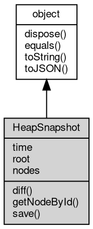

# 对象 HeapSnapshot
HeapSnapshots记录JS堆在某个时刻的状态

## 继承关系


## 成员属性
        
### time
**Date, 时间信息**

```JavaScript
readonly Date HeapSnapshot.time;
```

--------------------------
### root
**[HeapGraphNode](HeapGraphNode.md), 堆视图的根节点**

```JavaScript
readonly HeapGraphNode HeapSnapshot.root;
```

--------------------------
### nodes
**[List](List.md), 堆视图节点组成的列表**

```JavaScript
readonly List HeapSnapshot.nodes;
```

## 成员函数
        
### diff
**和指定的堆快照进行比较**

```JavaScript
Object HeapSnapshot.diff(HeapSnapshot before);
```

调用参数:
* before: HeapSnapshot, 待比较的堆快照

返回结果:
* Object, 返回堆快照的比较结果

--------------------------
### getNodeById
**根据ID获取堆视图节点**

```JavaScript
HeapGraphNode HeapSnapshot.getNodeById(Integer id);
```

调用参数:
* id: Integer, 数字类型的节点ID

返回结果:
* [HeapGraphNode](HeapGraphNode.md), 返回获取到的堆视图节点

--------------------------
### save
**根据指定名称保存HeapSnapshot**

```JavaScript
HeapSnapshot.save(String fname) async;
```

调用参数:
* fname: String, 快照名称

--------------------------
### dispose
**强制回收对象，调用此方法后，对象资源将立即释放**

```JavaScript
HeapSnapshot.dispose();
```

--------------------------
### equals
**比较当前对象与给定的对象是否相等**

```JavaScript
Boolean HeapSnapshot.equals(object expected);
```

调用参数:
* expected: [object](object.md), 制定比较的目标对象

返回结果:
* Boolean, 返回对象比较的结果

--------------------------
### toString
**返回对象的字符串表示，一般返回 "[Native Object]"，对象可以根据自己的特性重新实现**

```JavaScript
String HeapSnapshot.toString();
```

返回结果:
* String, 返回对象的字符串表示

--------------------------
### toJSON
**返回对象的 JSON 格式表示，一般返回对象定义的可读属性集合**

```JavaScript
Value HeapSnapshot.toJSON(String key = "");
```

调用参数:
* key: String, 未使用

返回结果:
* Value, 返回包含可 JSON 序列化的值

