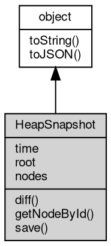

# Object HeapSnapshot
A captured view of the V8 heap as a graph of nodes and edges

A HeapSnapshot records the JavaScript heap at one moment. Every heap value becomes a
`HeapGraphNode` and every reference between values becomes a `HeapGraphEdge`, so the
snapshot can be traversed, filtered and compared without touching the live heap. The
graph is obtained from `v8.takeSnapshot` (live heap) or `v8.loadSnapshot` (a
`.heapsnapshot` file), while `v8.diff` and `HeapSnapshot.diff` return a comparison
[object](object.md) that is not a new heap graph. A snapshot is read-only, independent of the live
heap and large: a trivial [process](../../module/ifs/process.md) already has tens of thousands of nodes.

Concepts:

- **Graph model**: `nodes` is the flat list of every node; `root` is the synthetic
 entry point; `childs` of a node lists its outgoing edges. Nodes are identified by a
 numeric `id` that V8 keeps stable for the same heap [object](object.md) across snapshots of one
 isolate, which is what makes comparisons possible.
- **Consumption patterns**: look a node up by id (`getNodeById`), find one by class
 name or label over `nodes`, walk the graph along `childs`, compare two snapshots
 with `diff`, or hand the graph to Chrome DevTools with `save`. There is no reverse
 index, so finding the retainers of a node means searching the graph for edges that
 point at it.
- **Cost**: taking a snapshot performs a full garbage collection and serializes the
 whole heap; reading `nodes` rebuilds the array and re-wraps every node, and each
 node or edge accessed afterwards crosses into the isolate that owns the snapshot.
 Cache the arrays and filter early.
- **Node.js differences**: Node.js exposes the heap as a JSON stream through
 `getHeapSnapshot`/`writeHeapSnapshot` without an [object](object.md) model; this class and
 `loadSnapshot`/`diff` are fibjs additions. The property names also differ from the
 JSON fields (`shallowSize` against `self_size`, `childs` against `children`).

Obtained from:
- `v8.takeSnapshot()` — capture the live heap;
- `v8.loadSnapshot([path](../../module/ifs/path.md))` — parse a `.heapsnapshot` file;
- `v8.saveSnapshot([path](../../module/ifs/path.md))` — capture and write to a file (returns nothing).

Example 1 — walk down from the root to the GC roots group:

```JavaScript
const v8 = require('v8');

const snapshot = v8.takeSnapshot();
const root = snapshot.root; // the synthetic root node of the graph

// The root links to the GC roots group and the global handles.
const gcRoots = root.childs.find((edge) => edge.getToNode().name === '(GC roots)').getToNode();
console.log(gcRoots.description); // (GC roots)[Synthetic]

// Its children are the individual root groups; element links carry a numeric index,
// so use description instead of name when the type is not known.
for (const edge of gcRoots.childs.slice(0, 3))
    console.log(edge.type, edge.description);
```

Example 2 — compare two snapshots of the same isolate through files:

```JavaScript
const v8 = require('v8');
const fs = require('fs');
const os = require('os');
const path = require('path');

const dir = fs.mkdtempSync(path.join(os.tmpdir(), 'fibjs-v8-'));
const file = path.join(dir, 'compare.heapsnapshot');

// Two snapshots of the same isolate share node ids, so they can be compared.
v8.saveSnapshot(file);
const first = v8.loadSnapshot(file);
v8.saveSnapshot(file);
const second = v8.loadSnapshot(file);

const delta = second.diff(first);
console.log(delta.change.freed_nodes >= 0); // true
console.log(delta.change.allocated_nodes >= 0); // true

fs.rmSync(dir, {
    recursive: true,
    force: true
});
```

## Inheritance

```dot
digraph {
    node [fontname="Helvetica,sans-Serif", fontsize=10, shape="record", style="filled", fillcolor="white"];

    object [tooltip="object", URL="object.md", label="{object|toString()\ltoJSON()\l}"];
    HeapSnapshot [tooltip="HeapSnapshot", fillcolor="lightgray", id="me", label="{HeapSnapshot|time\lroot\lnodes\l|diff()\lgetNodeById()\lsave()\l}"];

    object -> HeapSnapshot [dir=back];
}
```

## Properties
        
### time
**Date, Time information**

```JavaScript
readonly Date HeapSnapshot.time;
```

Intended to hold the creation time of the snapshot as a Date. In the current
implementation the field is never populated: snapshots taken by `takeSnapshot`
and snapshots loaded by `loadSnapshot` both report an Invalid Date, and the
`time` values inside a `diff` result are invalid as well. Record `Date.now()`
around the capture when a timestamp is needed.

--------------------------
### root
**[HeapGraphNode](HeapGraphNode.md), Root node of the heap view**

```JavaScript
readonly HeapGraphNode HeapSnapshot.root;
```

The synthetic entry point of the graph: its `type` is `v8.Node_Synthetic`, its
name is usually an empty string and its id is 1. Start a traversal here, or use
`getNodeById` when a specific id is known. Every access returns a new node
[object](object.md), so compare nodes by `id` rather than by identity.

--------------------------
### nodes
**[HeapGraphNode](HeapGraphNode.md), List composed of heap view nodes**

```JavaScript
readonly HeapGraphNode HeapSnapshot.nodes;
```

A flat array with every node of the heap, including hidden and internal nodes
whose names start with `system /`; the snapshot has no edge list of its own, only
the `childs` of each node. The array is rebuilt (and every node re-wrapped) on
each property access, which takes milliseconds for a real heap, so read it once
into a local variable before filtering or iterating; `find` over the cached array
is the usual way to locate an [object](object.md) by class name. Node counts of tens of
thousands are normal for an idle [process](../../module/ifs/process.md).

## Methods
        
### diff
**Compares with the specified heap snapshot**

```JavaScript
Object HeapSnapshot.diff(HeapSnapshot before);
```

Parameters:
* before: HeapSnapshot, the heap snapshot to compare with

Returns:
* Object, returns the heap snapshot comparison result

Compares this snapshot as the "after" state with `before` and returns an [object](object.md)
with the `before`, `after` and `change` sections. `before` and `after` hold
`nodes` (the node count), `time` and the human readable `size` with its
`size_bytes`; `change` holds the [net](../../module/ifs/net.md) `size`/`size_bytes` difference, the
`freed_nodes` and `allocated_nodes` counts (ids present on one side only) and
`details`, an array of `{ type, size_bytes, size, "+", "-" }` entries grouped by
node description and sorted by size. Nodes are matched by id, so the two
snapshots must come from the same isolate to be meaningful; comparing unrelated
snapshots reports every node as freed and allocated. The comparison itself does
not trigger a garbage collection.

Example — compare the heap around an allocation:

```JavaScript
const v8 = require('v8');

const before = v8.takeSnapshot();

const retained = [];
for (let i = 0; i < 2000; i++) retained.push({
    index: i
});

const after = v8.takeSnapshot();
const result = after.diff(before);

console.log(result.change.allocated_nodes > 0); // true
console.log(result.change.freed_nodes >= 0); // true
console.log(result.change.details.length > 0); // true
```

--------------------------
### getNodeById
**Gets a heap view node by ID**

```JavaScript
HeapGraphNode HeapSnapshot.getNodeById(Integer id);
```

Parameters:
* id: Integer, the node ID, of number type

Returns:
* [HeapGraphNode](HeapGraphNode.md), returns the obtained heap view node

Returns the node whose `id` equals the argument, or null when the snapshot has no
such node. The argument is coerced to an integer, so a numeric string is accepted
and a fractional number is truncated. Node ids are stable for the same heap
[object](object.md) across snapshots of one isolate, which is what `diff` and cross-snapshot
lookups rely on; they are not stable across processes.

Example — look up the root node by id:

```JavaScript
const v8 = require('v8');

const snapshot = v8.takeSnapshot();
const root = snapshot.getNodeById(snapshot.root.id);

console.log(root.type === v8.Node_Synthetic); // true
console.log(snapshot.getNodeById(-1)); // null
```

--------------------------
### save
**Saves the HeapSnapshot under the specified name**

```JavaScript
HeapSnapshot.save(String fname) async;
```

Parameters:
* fname: String, the snapshot name

Serializes this snapshot as a Chrome DevTools `.heapsnapshot` JSON file,
replacing an existing file. Both snapshots taken from the live heap and snapshots
loaded from a file can be saved again. Because the member is async it can be
called in blocking style, with a trailing callback (`saveAsync`/`saveSync` are
the generated aliases) or awaited as a promise. The [path](../../module/ifs/path.md) is normalized and
resolved against the current working directory; throws an ENOENT error when the
parent directory does not exist.

Example — save a live snapshot and read the file back:

```JavaScript
const v8 = require('v8');
const fs = require('fs');
const os = require('os');
const path = require('path');

const dir = fs.mkdtempSync(path.join(os.tmpdir(), 'fibjs-v8-'));
const file = path.join(dir, 'live.heapsnapshot');

const snapshot = v8.takeSnapshot();
snapshot.save(file); // blocking call style; saveAsync(file, cb) is the callback form

const reloaded = v8.loadSnapshot(file);
console.log(reloaded.nodes.length > 0); // true

fs.rmSync(dir, {
    recursive: true,
    force: true
});
```

--------------------------
### toString
**Returns the string form of the [object](object.md)**

```JavaScript
String HeapSnapshot.toString();
```

Returns:
* String, returns the string form of the [object](object.md)

The base implementation reports an error: a native [object](object.md) has no implicit
text form, and only the classes whose value can be written as a string
override the member. [Buffer](Buffer.md) returns its content decoded with the given
[encoding](../../module/ifs/encoding.md), [HttpCookie](HttpCookie.md) returns "name=value", and so on; an override commonly
accepts optional arguments ([Buffer.toString](Buffer.md#toString) takes [encoding](../../module/ifs/encoding.md), start and
end) that are not part of this declaration.

Calling the member on a class that does not override it throws
"<Class>: the [object](object.md) can not be converted to string.", which is the
behavior to rely on when probing whether a value has a string form. See
toJSON for the serialization hook.

--------------------------
### toJSON
**Returns the JSON representation of the [object](object.md)**

```JavaScript
Value HeapSnapshot.toJSON(String key = "");
```

Parameters:
* key: String, the property name of the value being serialized

Returns:
* Value, returns the JSON-serializable value

JSON.stringify(value) calls value.toJSON(key) when the member exists and
serializes the returned value in its place; the key argument carries the
property name of the value inside its parent [object](object.md) (an empty string at
the top level) and may be used to build a keyed form. The base
implementation returns a plain [object](object.md) holding the readable properties of
the instance, so a native [object](object.md) serializes without per-class code; a
class with a portable shape such as [Buffer](Buffer.md) overrides it, and a JavaScript
class may override it in the same way.

The member is normally reached through JSON.stringify rather than called
directly; calling it returns the same value JSON.stringify would
serialize.

