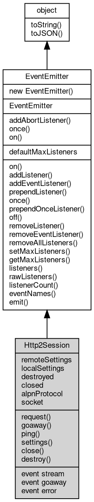

# 对象 Http2Session
Http2Session 表示活动的 HTTP/2 会话，管理连接和所有流

Http2Session 实例不应由用户直接构造。服务端在接收到新的 HTTP/2 连接时创建。客户端使用 [http2.connect](../../module/ifs/http2.md#connect)() 创建会话。

## 继承关系


## 静态函数
        
### addAbortListener
**监听一个 [AbortSignal](AbortSignal.md) 的 abort 事件，返回一个可释放的对象**

```JavaScript
static Object Http2Session.addAbortListener(EventEmitter signal,
    Function func);
```

调用参数:
* signal: [EventEmitter](EventEmitter.md), 要监听的 [AbortSignal](AbortSignal.md) 对象
* func: Function, abort 事件的处理函数

返回结果:
* Object, 返回一个包含 `[Symbol.dispose]` 方法的 Disposable 对象

返回的对象包含 `[Symbol.dispose]()` 方法，调用后将移除监听器。如果信号已中止，则监听器会被立即调用。

--------------------------
### once
**创建一个 Promise，等待指定事件触发一次后解析**

```JavaScript
static Object Http2Session.once(EventEmitter emitter,
    Value ev,
    Object options = {});
```

调用参数:
* emitter: [EventEmitter](EventEmitter.md), 要监听的事件触发器对象
* ev: Value, 指定事件的名称
* options: Object, 可选参数对象

返回结果:
* Object, 返回 Promise，以事件参数数组解析

返回一个 Promise，当目标事件触发时以事件参数数组解析。如果在此期间触发 'error' 事件（且监听的不是 'error' 事件本身），Promise 将被拒绝。

options 参数可包含：
- signal: [AbortSignal](AbortSignal.md)，用于取消等待

--------------------------
### on
**创建一个异步迭代器，持续监听指定事件**

```JavaScript
static Object Http2Session.on(EventEmitter emitter,
    Value ev,
    Object options = {});
```

调用参数:
* emitter: [EventEmitter](EventEmitter.md), 要监听的事件触发器对象
* ev: Value, 指定事件的名称
* options: Object, 可选参数对象

返回结果:
* Object, 返回 AsyncIterator 对象

返回一个 AsyncIterator，每次事件触发时产出事件参数数组。如果触发 'error' 事件，迭代器将抛出错误。

options 参数可包含：
- signal: [AbortSignal](AbortSignal.md)，用于取消迭代
- close: 字符串数组，指定结束迭代的事件名称

## 静态属性
        
### defaultMaxListeners
**Integer, 默认全局最大监听器数**

```JavaScript
static Integer Http2Session.defaultMaxListeners;
```

## 成员属性
        
### remoteSettings
**Object, 查询此会话的远端设置**

```JavaScript
readonly Object Http2Session.remoteSettings;
```

--------------------------
### localSettings
**Object, 查询此会话的本地设置**

```JavaScript
readonly Object Http2Session.localSettings;
```

--------------------------
### destroyed
**Boolean, 查询会话是否已销毁**

```JavaScript
readonly Boolean Http2Session.destroyed;
```

--------------------------
### closed
**Boolean, 查询会话是否已关闭**

```JavaScript
readonly Boolean Http2Session.closed;
```

--------------------------
### alpnProtocol
**String, 查询此会话协商的 ALPN 协议**

```JavaScript
readonly String Http2Session.alpnProtocol;
```

--------------------------
### socket
**[Stream](Stream.md), 查询此会话的底层 [TLSSocket](TLSSocket.md)**

```JavaScript
readonly Stream Http2Session.socket;
```

## 成员函数
        
### request
**发起新的 HTTP/2 流以发送请求（仅客户端）**

```JavaScript
Http2Stream Http2Session.request(Object headers,
    Object options = {});
```

调用参数:
* headers: Object, 包含请求头的对象，必须包含 :method 和 :[path](../../module/ifs/path.md) 伪头部
* options: Object, 可选的流创建选项

返回结果:
* [Http2Stream](Http2Stream.md), 返回新请求的 [Http2Stream](Http2Stream.md) 对象

--------------------------
### goaway
**向远端发送 GOAWAY 帧并优雅关闭会话**

```JavaScript
Http2Session.goaway(Integer code = 0,
    Integer lastStreamId = 0);
```

调用参数:
* code: Integer, HTTP/2 错误码，默认为 NGHTTP2_NO_ERROR (0)
* lastStreamId: Integer, 本地处理的最后一个流 ID，默认为 0

--------------------------
### ping
**向远端发送 PING 帧**

```JavaScript
Integer Http2Session.ping() async;
```

返回结果:
* Integer, 返回往返时间（毫秒）

--------------------------
### settings
**更新此会话的本地设置**

```JavaScript
Http2Session.settings(Object settings);
```

调用参数:
* settings: Object, 包含要更新的设置的对象

--------------------------
### close
**优雅关闭会话，允许现有流完成**

```JavaScript
Http2Session.close() async;
```

--------------------------
### destroy
**立即销毁会话，中止所有流**

```JavaScript
Http2Session.destroy();
```

--------------------------
### on
**绑定一个事件处理函数到对象**

```JavaScript
Object Http2Session.on(Value ev,
    Function func);
```

调用参数:
* ev: Value, 指定事件的名称
* func: Function, 指定事件处理函数

返回结果:
* Object, 返回事件对象本身，便于链式调用

--------------------------
**绑定一个事件处理函数到对象**

```JavaScript
Object Http2Session.on(Object map);
```

调用参数:
* map: Object, 指定事件映射关系，对象属性名称将作为事件名称，属性的值将作为事件处理函数

返回结果:
* Object, 返回事件对象本身，便于链式调用

--------------------------
### addListener
**绑定一个事件处理函数到对象**

```JavaScript
Object Http2Session.addListener(Value ev,
    Function func);
```

调用参数:
* ev: Value, 指定事件的名称
* func: Function, 指定事件处理函数

返回结果:
* Object, 返回事件对象本身，便于链式调用

--------------------------
**绑定一个事件处理函数到对象**

```JavaScript
Object Http2Session.addListener(Object map);
```

调用参数:
* map: Object, 指定事件映射关系，对象属性名称将作为事件名称，属性的值将作为事件处理函数

返回结果:
* Object, 返回事件对象本身，便于链式调用

--------------------------
### addEventListener
**绑定一个事件处理函数到对象**

```JavaScript
Object Http2Session.addEventListener(Value ev,
    Function func,
    Object options = {});
```

调用参数:
* ev: Value, 指定事件的名称
* func: Function, 指定事件处理函数
* options: Object, 指定事件处理函数的选项

返回结果:
* Object, 返回事件对象本身，便于链式调用

options 参数是一个对象，它可以包含以下属性：
- once: 如果为 true，则事件处理函数只会触发一次，触发后会被移除

--------------------------
### prependListener
**绑定一个事件处理函数到对象起始**

```JavaScript
Object Http2Session.prependListener(Value ev,
    Function func);
```

调用参数:
* ev: Value, 指定事件的名称
* func: Function, 指定事件处理函数

返回结果:
* Object, 返回事件对象本身，便于链式调用

--------------------------
**绑定一个事件处理函数到对象起始**

```JavaScript
Object Http2Session.prependListener(Object map);
```

调用参数:
* map: Object, 指定事件映射关系，对象属性名称将作为事件名称，属性的值将作为事件处理函数

返回结果:
* Object, 返回事件对象本身，便于链式调用

--------------------------
### once
**绑定一个一次性事件处理函数到对象，一次性处理函数只会触发一次**

```JavaScript
Object Http2Session.once(Value ev,
    Function func);
```

调用参数:
* ev: Value, 指定事件的名称
* func: Function, 指定事件处理函数

返回结果:
* Object, 返回事件对象本身，便于链式调用

--------------------------
**绑定一个一次性事件处理函数到对象，一次性处理函数只会触发一次**

```JavaScript
Object Http2Session.once(Object map);
```

调用参数:
* map: Object, 指定事件映射关系，对象属性名称将作为事件名称，属性的值将作为事件处理函数

返回结果:
* Object, 返回事件对象本身，便于链式调用

--------------------------
### prependOnceListener
**绑定一个事件处理函数到对象起始**

```JavaScript
Object Http2Session.prependOnceListener(Value ev,
    Function func);
```

调用参数:
* ev: Value, 指定事件的名称
* func: Function, 指定事件处理函数

返回结果:
* Object, 返回事件对象本身，便于链式调用

--------------------------
**绑定一个事件处理函数到对象起始**

```JavaScript
Object Http2Session.prependOnceListener(Object map);
```

调用参数:
* map: Object, 指定事件映射关系，对象属性名称将作为事件名称，属性的值将作为事件处理函数

返回结果:
* Object, 返回事件对象本身，便于链式调用

--------------------------
### off
**从对象处理队列中取消指定函数**

```JavaScript
Object Http2Session.off(Value ev,
    Function func);
```

调用参数:
* ev: Value, 指定事件的名称
* func: Function, 指定事件处理函数

返回结果:
* Object, 返回事件对象本身，便于链式调用

--------------------------
**取消对象处理队列中的全部函数**

```JavaScript
Object Http2Session.off(Value ev);
```

调用参数:
* ev: Value, 指定事件的名称

返回结果:
* Object, 返回事件对象本身，便于链式调用

--------------------------
**从对象处理队列中取消指定函数**

```JavaScript
Object Http2Session.off(Object map);
```

调用参数:
* map: Object, 指定事件映射关系，对象属性名称作为事件名称，属性的值作为事件处理函数

返回结果:
* Object, 返回事件对象本身，便于链式调用

--------------------------
### removeListener
**从对象处理队列中取消指定函数**

```JavaScript
Object Http2Session.removeListener(Value ev,
    Function func);
```

调用参数:
* ev: Value, 指定事件的名称
* func: Function, 指定事件处理函数

返回结果:
* Object, 返回事件对象本身，便于链式调用

--------------------------
**取消对象处理队列中的全部函数**

```JavaScript
Object Http2Session.removeListener(Value ev);
```

调用参数:
* ev: Value, 指定事件的名称

返回结果:
* Object, 返回事件对象本身，便于链式调用

--------------------------
**从对象处理队列中取消指定函数**

```JavaScript
Object Http2Session.removeListener(Object map);
```

调用参数:
* map: Object, 指定事件映射关系，对象属性名称作为事件名称，属性的值作为事件处理函数

返回结果:
* Object, 返回事件对象本身，便于链式调用

--------------------------
### removeEventListener
**从对象处理队列中取消指定函数**

```JavaScript
Object Http2Session.removeEventListener(Value ev,
    Function func,
    Object options = {});
```

调用参数:
* ev: Value, 指定事件的名称
* func: Function, 指定事件处理函数
* options: Object, 指定事件处理函数的选项

返回结果:
* Object, 返回事件对象本身，便于链式调用

--------------------------
### removeAllListeners
**从对象处理队列中取消所有事件的所有监听器， 如果指定事件，则移除指定事件的所有监听器。**

```JavaScript
Object Http2Session.removeAllListeners(Value ev);
```

调用参数:
* ev: Value, 指定事件的名称

返回结果:
* Object, 返回事件对象本身，便于链式调用

--------------------------
**从对象处理队列中取消所有事件的所有监听器， 如果指定事件，则移除指定事件的所有监听器。**

```JavaScript
Object Http2Session.removeAllListeners(Array evs = []);
```

调用参数:
* evs: Array, 指定事件的名称

返回结果:
* Object, 返回事件对象本身，便于链式调用

--------------------------
### setMaxListeners
**监听器的默认限制的数量，仅用于兼容**

```JavaScript
Http2Session.setMaxListeners(Integer n);
```

调用参数:
* n: Integer, 指定事件的数量

--------------------------
### getMaxListeners
**获取监听器的默认限制的数量，仅用于兼容**

```JavaScript
Integer Http2Session.getMaxListeners();
```

返回结果:
* Integer, 返回默认限制数量

--------------------------
### listeners
**查询对象指定事件的监听器数组**

```JavaScript
Array Http2Session.listeners(Value ev);
```

调用参数:
* ev: Value, 指定事件的名称

返回结果:
* Array, 返回指定事件的监听器数组

--------------------------
### rawListeners
**查询对象指定事件的监听器数组，包含 once 包装函数**

```JavaScript
Array Http2Session.rawListeners(Value ev);
```

调用参数:
* ev: Value, 指定事件的名称

返回结果:
* Array, 返回指定事件的监听器数组

--------------------------
### listenerCount
**查询对象指定事件的监听器数量**

```JavaScript
Integer Http2Session.listenerCount(Value ev);
```

调用参数:
* ev: Value, 指定事件的名称

返回结果:
* Integer, 返回指定事件的监听器数量

--------------------------
**查询对象指定事件的监听器数量**

```JavaScript
Integer Http2Session.listenerCount(Value o,
    Value ev);
```

调用参数:
* o: Value, 指定查询的对象
* ev: Value, 指定事件的名称

返回结果:
* Integer, 返回指定事件的监听器数量

--------------------------
### eventNames
**查询监听器事件名称**

```JavaScript
Array Http2Session.eventNames();
```

返回结果:
* Array, 返回事件名称数组

--------------------------
### emit
**主动触发一个事件**

```JavaScript
Boolean Http2Session.emit(Value ev,
    ...args);
```

调用参数:
* ev: Value, 事件名称
* args: ..., 事件参数，将会传递给事件处理函数

返回结果:
* Boolean, 返回事件触发状态，有响应事件返回 true，否则返回 false

--------------------------
### toString
**返回对象的字符串表示，一般返回 "[Native Object]"，对象可以根据自己的特性重新实现**

```JavaScript
String Http2Session.toString();
```

返回结果:
* String, 返回对象的字符串表示

--------------------------
### toJSON
**返回对象的 JSON 格式表示，一般返回对象定义的可读属性集合**

```JavaScript
Value Http2Session.toJSON(String key = "");
```

调用参数:
* key: String, 未使用

返回结果:
* Value, 返回包含可 JSON 序列化的值

## 事件
        
### stream
**当创建新流时触发（服务端）**

```JavaScript
event Http2Session.stream(Http2Stream stream,
    Object headers);
```

调用参数:
* stream: [Http2Stream](Http2Stream.md), 新创建的 [Http2Stream](Http2Stream.md)
* headers: Object, 请求头对象

--------------------------
### goaway
**当会话收到 GOAWAY 帧时触发**

```JavaScript
event Http2Session.goaway();
```

--------------------------
### error
**当会话发生错误时触发**

```JavaScript
event Http2Session.error(Object err);
```

调用参数:
* err: Object, 错误对象

