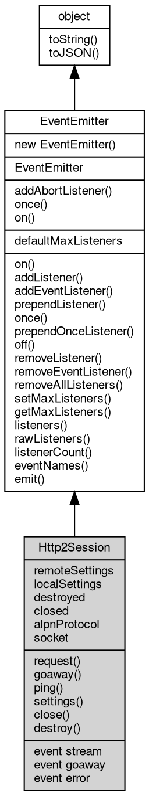

# Object Http2Session
an HTTP/2 session: a TLS connection shared by many concurrent streams with its settings and lifecycle

Http2Session represents a connection that has completed the HTTP/2 handshake
(SETTINGS exchange). It multiplexes independent [Http2Stream](Http2Stream.md) objects and owns the
connection-level state: local and remote settings, flow-control windows, PING and
GOAWAY. Instances are created by fibjs, never by `new Http2Session()`.

Concepts:

- **Settings exchange**: each peer sends a SETTINGS frame with its limits (header table
  size, push, max concurrent streams, initial window size, max frame size, max header
  list size); `localSettings`/`remoteSettings` report the effective values of each side.
  Until the exchange completes the returned values can still be the protocol defaults.
- **Flow control**: streams and the connection have independent receive windows; fibjs
  enlarges them automatically while data is consumed, so applications rarely manage
  windows or WINDOW_UPDATE frames explicitly.
- **Lifecycle**: `close()` is graceful - it sends GOAWAY(NO_ERROR), lets pending data
  finish and closes the connection; `destroy()` is immediate - it aborts the transport
  and kills every stream (a blocked read returns null). Both are idempotent. `closed`
  becomes true on close(), on a sent/received GOAWAY or when the transport ends;
  `destroyed` is true after destroy() or a transport failure.
- **Request dispatch**: on a server session, `stream` is emitted for every request with
  the request headers; on a client session, use `request()` to create streams. In
  Node.js this event is emitted on the server [object](object.md) instead.
- **Node.js differences**: there is no `session.close` event and the declared `goaway`
  and `error` events are not dispatched by the current implementation - check `closed`
  instead; `ping()` returns 0 and takes no callback (the round-trip time is not
  measured); `request()` supports only the `endStream` option; there is no settings
  callback, no `type`/`originSet`/`connecting` properties and no server push API.

Obtained from:
- `http2.connect(authority, options)` — the client session of a new connection;
- the `session` event of [Http2Server](Http2Server.md) — the server session of an accepted connection.

Example 1 — a client session: properties, one request, and close:

```JavaScript
const http2 = require('http2');
const tls = require('tls');
const crypto = require('crypto');

const caKey = crypto.generateKeyPair('rsa', {
    modulusLength: 2048
});
const srvKey = crypto.generateKeyPair('rsa', {
    modulusLength: 2048
});
const ca = crypto.createCertificateRequest({
    key: caKey.privateKey,
    subject: {
        CN: 'fibjs.org'
    }
}).issue({
    key: caKey.privateKey,
    ca: true,
    issuer: {
        CN: 'fibjs.org'
    }
});
const crt = crypto.createCertificateRequest({
    key: srvKey.privateKey,
    subject: {
        CN: 'localhost'
    }
}).issue({
    key: caKey.privateKey,
    issuer: {
        CN: 'fibjs.org'
    }
});
const ctx = tls.createSecureContext({
    key: srvKey.privateKey.export(),
    cert: crt.pem,
    requestCert: false,
    alpnProtocols: ['h2']
}, true);

const server = new http2.Server(ctx, 0, function() {});
server.on('session', (session) => {
    session.on('stream', (stream, headers) => {
        stream.respond({
            ':status': 200,
            'content-type': 'text/plain'
        });
        stream.write('session demo');
        stream.close();
    });
});
server.start();

const session = http2.connect('https://localhost:' + server.socket.localPort, {
    rejectUnauthorized: false,
    rejectUnverified: false
});
console.log(session.closed, session.destroyed); // false false
console.log(session.alpnProtocol); // h2

const stream = session.request({
    ':method': 'GET',
    ':path': '/'
});
console.log(stream.read().toString()); // session demo

session.close();
console.log(session.closed); // true
server.stop();
```

Example 2 — a server session serves two requests over one connection:

```JavaScript
const http2 = require('http2');
const tls = require('tls');
const crypto = require('crypto');

const caKey = crypto.generateKeyPair('rsa', {
    modulusLength: 2048
});
const srvKey = crypto.generateKeyPair('rsa', {
    modulusLength: 2048
});
const ca = crypto.createCertificateRequest({
    key: caKey.privateKey,
    subject: {
        CN: 'fibjs.org'
    }
}).issue({
    key: caKey.privateKey,
    ca: true,
    issuer: {
        CN: 'fibjs.org'
    }
});
const crt = crypto.createCertificateRequest({
    key: srvKey.privateKey,
    subject: {
        CN: 'localhost'
    }
}).issue({
    key: caKey.privateKey,
    issuer: {
        CN: 'fibjs.org'
    }
});
const ctx = tls.createSecureContext({
    key: srvKey.privateKey.export(),
    cert: crt.pem,
    requestCert: false,
    alpnProtocols: ['h2']
}, true);

let connections = 0;
const server = new http2.Server(ctx, 0, function() {});
server.on('session', (session) => {
    connections += 1;
    session.on('stream', (stream, headers) => {
        stream.respond({
            ':status': 200
        });
        stream.write('request ' + headers[':path']);
        stream.close();
    });
});
server.start();

const session = http2.connect('https://localhost:' + server.socket.localPort, {
    rejectUnauthorized: false,
    rejectUnverified: false
});
const one = session.request({
    ':method': 'GET',
    ':path': '/one'
});
const two = session.request({
    ':method': 'GET',
    ':path': '/two'
});
console.log(one.read().toString()); // request /one
console.log(two.read().toString()); // request /two
console.log('connections:', connections); // connections: 1

session.close();
server.stop();
```

## Inheritance

```dot
digraph {
    node [fontname="Helvetica,sans-Serif", fontsize=10, shape="record", style="filled", fillcolor="white"];

    object [tooltip="object", URL="object.md", label="{object|toString()\ltoJSON()\l}"];
    EventEmitter [tooltip="EventEmitter", URL="EventEmitter.md", label="{EventEmitter|new EventEmitter()\l|EventEmitter\l|addAbortListener()\lonce()\lon()\l|defaultMaxListeners\l|on()\laddListener()\laddEventListener()\lprependListener()\lonce()\lprependOnceListener()\loff()\lremoveListener()\lremoveEventListener()\lremoveAllListeners()\lsetMaxListeners()\lgetMaxListeners()\llisteners()\lrawListeners()\llistenerCount()\leventNames()\lemit()\l}"];
    Http2Session [tooltip="Http2Session", fillcolor="lightgray", id="me", label="{Http2Session|remoteSettings\llocalSettings\ldestroyed\lclosed\lalpnProtocol\lsocket\l|request()\lgoaway()\lping()\lsettings()\lclose()\ldestroy()\l|event stream\levent goaway\levent error\l}"];

    object -> EventEmitter [dir=back];
    EventEmitter -> Http2Session [dir=back];
}
```

## Static Methods
        
### addAbortListener
**Registers a one-shot abort handler on an [AbortSignal](AbortSignal.md)**

```JavaScript
static Object Http2Session.addAbortListener(EventEmitter signal,
    Function(Object ev) func);
```

Parameters:
* signal: [EventEmitter](EventEmitter.md), the [AbortSignal](AbortSignal.md) [object](object.md) to listen to
* func: Function(Object ev), the handler for the abort event

Returns:
* Object, returns a Disposable [object](object.md) containing a `[Symbol.dispose]` method

The handler is called at most once when the signal is aborted, and it is removed from the
signal afterwards. If the signal is already aborted the handler is invoked synchronously.
The returned [object](object.md) has a `[Symbol.dispose]()` method that removes the handler, so it can be
released before the abort happens.

Example — abort handling with automatic cleanup:

```JavaScript
const events = require('events');

const controller = new AbortController();
const disposable = events.addAbortListener(controller.signal,
    () => console.log('aborted'));

controller.abort(); // aborted
disposable[Symbol.dispose](); // safe to call after the listener fired
console.log(controller.signal.listenerCount('abort')); // 0
```

--------------------------
### once
**Creates a Promise resolved by the next occurrence of an event**

```JavaScript
static Object Http2Session.once(EventEmitter emitter,
    Value ev,
    Object options = {});
```

Parameters:
* emitter: [EventEmitter](EventEmitter.md), the event emitter [object](object.md) to listen to
* ev: Value, the event name to listen for
* options: Object, optional parameter [object](object.md)

Returns:
* Object, returns a Promise that resolves with the array of event parameters

The Promise resolves with the array of the emit arguments when the event fires; it rejects
when `error` is emitted while waiting, unless the waited event is `error` itself, or when
the signal option aborts. The temporary listeners are removed when the Promise settles.

options supports the following option:

```JavaScript
// fragment: options
({
    "signal": null // AbortSignal; aborting rejects the Promise with an AbortError
});
```

Example — awaiting the next occurrence of an event:

```JavaScript
const EventEmitter = require('events');

(async () => {
    const emitter = new EventEmitter();
    const waiting = EventEmitter.once(emitter, 'ready');

    emitter.emit('ready', 200, 'ok');
    console.log(JSON.stringify(await waiting)); // [200,"ok"]
})();
```

--------------------------
### on
**Creates an async iterator that yields event occurrences**

```JavaScript
static Object Http2Session.on(EventEmitter emitter,
    Value ev,
    Object options = {});
```

Parameters:
* emitter: [EventEmitter](EventEmitter.md), the event emitter [object](object.md) to listen to
* ev: Value, the event name to listen for
* options: Object, optional parameter [object](object.md)

Returns:
* Object, returns an AsyncIterator [object](object.md)

Each next() resolves with `{ value: [args...], done: false }` when the event fires and with
`{ done: true }` after an event named in the `close` option fires or the signal aborts; an
`error` event rejects the pending call. The listeners are registered when the iterator is
created and removed when the iteration ends or the signal aborts.

options supports the following options:

```JavaScript
// fragment: options
({
    "signal": null, // AbortSignal; aborting rejects pending and future next() calls
    "close": [] // event names; the first one to fire ends the iteration
});
```

Example — iterating the occurrences of an event:

```JavaScript
const EventEmitter = require('events');

(async () => {
    const emitter = new EventEmitter();
    const iterator = EventEmitter.on(emitter, 'data', {
        close: ['end']
    });

    emitter.emit('data', 1);
    emitter.emit('data', 2);
    emitter.emit('end');

    for await (const args of iterator)
    console.log(JSON.stringify(args)); // [1] then [2]
})();
```

## Static Properties
        
### defaultMaxListeners
**Integer, The [process](../../module/ifs/process.md)-wide default listener limit reported by getMaxListeners()**

```JavaScript
static Integer Http2Session.defaultMaxListeners;
```

Defaults to 10. Assigning a value changes getMaxListeners() for every emitter that never
called setMaxListeners(); an emitter with an explicit limit keeps it. The limit is
informational: fibjs never warns when the number of listeners exceeds it.

## Properties
        
### remoteSettings
**(Number headerTableSize, Boolean enablePush, Number maxConcurrentStreams, Number initialWindowSize, Number maxFrameSize, Number maxHeaderListSize), queries the effective settings advertised by the remote peer**

```JavaScript
readonly(Number headerTableSize, Boolean enablePush, Number maxConcurrentStreams, Number initialWindowSize, Number maxFrameSize, Number maxHeaderListSize) Http2Session.remoteSettings;
```

Returns a new [object](object.md) with headerTableSize, enablePush, maxConcurrentStreams,
initialWindowSize, maxFrameSize and maxHeaderListSize. The values describe the
limits the peer asked this session to respect. Before the peer's SETTINGS frame has
been processed they can still be protocol defaults (maxConcurrentStreams
4294967295, initialWindowSize 65535, maxFrameSize 16384); after a round trip they
reflect the exchange. Throws when the session is destroyed.

--------------------------
### localSettings
**(Number headerTableSize, Boolean enablePush, Number maxConcurrentStreams, Number initialWindowSize, Number maxFrameSize, Number maxHeaderListSize), queries the settings this session advertises to the peer**

```JavaScript
readonly(Number headerTableSize, Boolean enablePush, Number maxConcurrentStreams, Number initialWindowSize, Number maxFrameSize, Number maxHeaderListSize) Http2Session.localSettings;
```

Returns a new [object](object.md) with headerTableSize, enablePush, maxConcurrentStreams,
initialWindowSize, maxFrameSize and maxHeaderListSize. A new session advertises
maxConcurrentStreams 100 and initialWindowSize 1 MiB in its initial SETTINGS frame;
the values become visible here after the peer acknowledges them, and settings()
updates them. Throws when the session is destroyed.

--------------------------
### destroyed
**Boolean, queries whether the session has been destroyed**

```JavaScript
readonly Boolean Http2Session.destroyed;
```

True after destroy() or a transport failure; a destroyed session is also closed and
every stream on it is destroyed. Reads on such streams return null (or throw when
they were reset) and new requests are refused.

--------------------------
### closed
**Boolean, queries whether the session is closed**

```JavaScript
readonly Boolean Http2Session.closed;
```

True after close(), after a GOAWAY frame has been sent or received, or when the
transport ended; `destroyed` implies `closed`. A closed session accepts no new
request() calls; streams that are still open can keep receiving data until the peer
finishes them.

--------------------------
### alpnProtocol
**String, queries the ALPN protocol negotiated by the underlying TLS connection**

```JavaScript
readonly String Http2Session.alpnProtocol;
```

Returns 'h2' when the TLS handshake negotiated HTTP/2 (the normal case) and
undefined when no ALPN protocol was agreed, for example when the server
[SecureContext](SecureContext.md) has no `alpnProtocols`. fibjs creates HTTP/2 sessions over TLS only,
so this is 'h2' or undefined, never 'h2c'.

--------------------------
### socket
**[Stream](Stream.md), queries the underlying transport of the session**

```JavaScript
readonly Stream Http2Session.socket;
```

Returns the [TLSSocket](TLSSocket.md) of the connection (a [Stream](Stream.md)), stable for the life of the
session. The socket can be used to inspect the peer or to abort() the connection,
which closes the session and all its streams (the session then reports `closed`).

## Methods
        
### request
**creates a new stream and sends a request (client session only)**

```JavaScript
Http2Stream Http2Session.request(Object headers,
    Object options = {});
```

Parameters:
* headers: Object, an [object](object.md) containing the request headers; missing pseudo-headers are filled in
* options: Object, optional stream creation options; only endStream is used

Returns:
* [Http2Stream](Http2Stream.md), returns the [Http2Stream](Http2Stream.md) of the new request

headers is a plain [object](object.md) with the request headers. The pseudo-headers `:method`
(default GET), `:[path](../../module/ifs/path.md)` (default /), `:scheme` (default https) and `:authority`
(default the connect target) are filled in when missing and sent before the regular
headers.

options supports the following options:

```JavaScript
// fragment: options object
({
    "endStream": true // send the request headers with END_STREAM (no body);
    // default true for GET/HEAD, false for other methods
})
```

With `endStream` true the returned stream has no request body to write; with false
the body must be sent with write()/end(), but closing a client stream closes the
whole stream in the current implementation, so the response can no longer be read.
Use [HttpClient](HttpClient.md) for requests with a body. Throws when called on a server session or
on a closed/destroyed session.

Example — a request with custom headers:

```JavaScript
const http2 = require('http2');
const tls = require('tls');
const crypto = require('crypto');

const caKey = crypto.generateKeyPair('rsa', {
    modulusLength: 2048
});
const srvKey = crypto.generateKeyPair('rsa', {
    modulusLength: 2048
});
const ca = crypto.createCertificateRequest({
    key: caKey.privateKey,
    subject: {
        CN: 'fibjs.org'
    }
}).issue({
    key: caKey.privateKey,
    ca: true,
    issuer: {
        CN: 'fibjs.org'
    }
});
const crt = crypto.createCertificateRequest({
    key: srvKey.privateKey,
    subject: {
        CN: 'localhost'
    }
}).issue({
    key: caKey.privateKey,
    issuer: {
        CN: 'fibjs.org'
    }
});
const ctx = tls.createSecureContext({
    key: srvKey.privateKey.export(),
    cert: crt.pem,
    requestCert: false,
    alpnProtocols: ['h2']
}, true);

const server = new http2.Server(ctx, 0, function() {});
server.on('session', (session) => {
    session.on('stream', (stream, headers) => {
        stream.respond({
            ':status': 200,
            'content-type': 'text/plain'
        });
        stream.write(headers['x-token'] + ' ' + headers[':path']);
        stream.close();
    });
});
server.start();

const session = http2.connect('https://localhost:' + server.socket.localPort, {
    rejectUnauthorized: false,
    rejectUnverified: false
});
const stream = session.request({
    ':method': 'GET',
    ':path': '/headers',
    'x-token': 'abc'
});
console.log(stream.read().toString()); // abc /headers
console.log(stream.headers[':status']); // 200

session.close();
server.stop();
```

--------------------------
### goaway
**sends a GOAWAY frame to the peer**

```JavaScript
Http2Session.goaway(Integer code = 0,
    Integer lastStreamId = 0);
```

Parameters:
* code: Integer, HTTP/2 error code, default is NGHTTP2_NO_ERROR (0)
* lastStreamId: Integer, the last locally processed stream ID, default is 0

code is an HTTP/2 error code (0 = NGHTTP2_NO_ERROR; see [http2_constants](../../module/ifs/http2_constants.md)) and
lastStreamId the last stream this side will [process](../../module/ifs/process.md) (0 = none). The frame is queued
and flushed; the session is not closed locally by this call (`closed` stays false
until close(), destroy() or the transport ends, and a received GOAWAY also sets
`closed`). The declared `goaway` event is not dispatched by the current
implementation; poll `closed` instead. Throws when the session is destroyed.

--------------------------
### ping
**sends a PING frame to the peer**

```JavaScript
Integer Http2Session.ping() async;
```

Returns:
* Integer, returns 0; the round-trip time is not measured currently

The PING is submitted and written, and the call returns 0; it does not wait for the
PING ACK and the current implementation does not measure the round-trip time (the
Node.js `ping(callback)` reports the RTT through the callback instead). Throws when
the session is destroyed; a broken transport fails with EPIPE.

--------------------------
### settings
**updates the settings this session advertises to the peer**

```JavaScript
Http2Session.settings(Object settings);
```

Parameters:
* settings: Object, an [object](object.md) containing the settings to update

settings may contain headerTableSize, enablePush, maxConcurrentStreams,
initialWindowSize, maxFrameSize and maxHeaderListSize; unknown keys are ignored. A
SETTINGS frame with the given values is submitted and flushed asynchronously, and
the peer applies them after acknowledging the frame. Throws when the session is
destroyed.

Example — tune the session and ping the peer:

```JavaScript
const http2 = require('http2');
const tls = require('tls');
const crypto = require('crypto');

const caKey = crypto.generateKeyPair('rsa', {
    modulusLength: 2048
});
const srvKey = crypto.generateKeyPair('rsa', {
    modulusLength: 2048
});
const ca = crypto.createCertificateRequest({
    key: caKey.privateKey,
    subject: {
        CN: 'fibjs.org'
    }
}).issue({
    key: caKey.privateKey,
    ca: true,
    issuer: {
        CN: 'fibjs.org'
    }
});
const crt = crypto.createCertificateRequest({
    key: srvKey.privateKey,
    subject: {
        CN: 'localhost'
    }
}).issue({
    key: caKey.privateKey,
    issuer: {
        CN: 'fibjs.org'
    }
});
const ctx = tls.createSecureContext({
    key: srvKey.privateKey.export(),
    cert: crt.pem,
    requestCert: false,
    alpnProtocols: ['h2']
}, true);

const server = new http2.Server(ctx, 0, function() {});
server.on('session', (session) => {
    session.on('stream', (stream, headers) => {
        stream.respond({
            ':status': 200
        });
        stream.write('ok');
        stream.close();
    });
});
server.start();

const session = http2.connect('https://localhost:' + server.socket.localPort, {
    rejectUnauthorized: false,
    rejectUnverified: false
});
session.settings({
    maxConcurrentStreams: 50,
    initialWindowSize: 1 << 20
});
const stream = session.request({
    ':method': 'GET',
    ':path': '/'
});
console.log(stream.read().toString()); // ok
console.log(session.ping()); // 0

session.close();
server.stop();
```

--------------------------
### close
**gracefully closes the session**

```JavaScript
Http2Session.close() async;
```

Sends GOAWAY(NO_ERROR, 0), stops creating new streams, closes the transport and sets
`closed`. Streams that are still open finish (their reads return null, or throw when
they were reset); a broken transport is ignored. Calling close() on an already
closed session is a no-op; the method can be awaited.

See Example 1 of Http2Session for the full client lifecycle.

--------------------------
### destroy
**immediately destroys the session and all its streams**

```JavaScript
Http2Session.destroy();
```

Aborts the underlying transport, destroys every [Http2Stream](Http2Stream.md) (a blocked read()
returns null) and sets both `destroyed` and `closed`. Unlike close(), no GOAWAY is
sent and no pending data is flushed. Calling it again is a no-op.

Example — destroy a session with a request in flight:

```JavaScript
const http2 = require('http2');
const tls = require('tls');
const crypto = require('crypto');

const caKey = crypto.generateKeyPair('rsa', {
    modulusLength: 2048
});
const srvKey = crypto.generateKeyPair('rsa', {
    modulusLength: 2048
});
const ca = crypto.createCertificateRequest({
    key: caKey.privateKey,
    subject: {
        CN: 'fibjs.org'
    }
}).issue({
    key: caKey.privateKey,
    ca: true,
    issuer: {
        CN: 'fibjs.org'
    }
});
const crt = crypto.createCertificateRequest({
    key: srvKey.privateKey,
    subject: {
        CN: 'localhost'
    }
}).issue({
    key: caKey.privateKey,
    issuer: {
        CN: 'fibjs.org'
    }
});
const ctx = tls.createSecureContext({
    key: srvKey.privateKey.export(),
    cert: crt.pem,
    requestCert: false,
    alpnProtocols: ['h2']
}, true);

const server = new http2.Server(ctx, 0, function() {});
server.on('session', (session) => {
    // the request is deliberately left unanswered
});
server.start();

const session = http2.connect('https://localhost:' + server.socket.localPort, {
    rejectUnauthorized: false,
    rejectUnverified: false
});
const stream = session.request({
    ':method': 'GET',
    ':path': '/never'
});
session.destroy();
console.log(stream.read()); // null
console.log(stream.destroyed, session.destroyed); // true true

server.stop();
```

--------------------------
### on
**Appends an event handler to the emitter**

```JavaScript
Object Http2Session.on(Value ev,
    Function(...args) func);
```

Parameters:
* ev: Value, the event name to bind
* func: Function(...args), the event handler function, called with the emit arguments

Returns:
* Object, returns the event [object](object.md) itself for chaining

The listener is called with the arguments of emit() and `this` set to the emitter; the
emitter itself is returned so registrations can be chained. The same function may be
registered several times for one event and each copy is called. See the class documentation
for the dispatch order.

--------------------------
**Appends several event handlers to the emitter**

```JavaScript
Object Http2Session.on(Object map);
```

Parameters:
* map: Object, the event mapping; [object](object.md) property names are used as event names

Returns:
* Object, returns the event [object](object.md) itself for chaining

Every enumerable property of the map whose value is a function is registered under its
property name. Properties are processed in order; a value that is not a function makes the
call fail with an invalid-type error while entries processed before it stay registered.

Example — registering several handlers at once:

```JavaScript
const EventEmitter = require('events');

const emitter = new EventEmitter();
emitter.on({
    connect: () => console.log('connect'),
    close: () => console.log('close')
});

emitter.emit('connect'); // connect
emitter.emit('close'); // close
```

--------------------------
### addListener
**Appends an event handler to the emitter**

```JavaScript
Object Http2Session.addListener(Value ev,
    Function(...args) func);
```

Parameters:
* ev: Value, the event name to bind
* func: Function(...args), the event handler function

Returns:
* Object, returns the event [object](object.md) itself for chaining

Alias of on(ev, func), provided for Node.js compatibility.

--------------------------
**Appends several event handlers to the emitter**

```JavaScript
Object Http2Session.addListener(Object map);
```

Parameters:
* map: Object, the event mapping; [object](object.md) property names are used as event names

Returns:
* Object, returns the event [object](object.md) itself for chaining

Alias of on(map), provided for Node.js compatibility.

--------------------------
### addEventListener
**Appends an event handler to the emitter with an options [object](object.md)**

```JavaScript
Object Http2Session.addEventListener(Value ev,
    Function(...args) func,
    Object options = {});
```

Parameters:
* ev: Value, the event name to bind
* func: Function(...args), the event handler function, called with the emit arguments
* options: Object, the options of the event handler

Returns:
* Object, returns the event [object](object.md) itself for chaining

Web-style alias of on(); the only supported option is `once`, which registers a one-shot
handler exactly like once(). The listener receives the plain emit arguments and not an [Event](Event.md)
[object](object.md); see the [DOMEvent](DOMEvent.md) class for the DOM-style event [object](object.md) used by [AbortSignal](AbortSignal.md) and
fetch-style APIs.

options supports the following option:

```JavaScript
// fragment: options
({
    "once": false // when true, the handler is removed before its single invocation
});
```

Example — a one-shot DOM-style registration:

```JavaScript
const EventEmitter = require('events');

const emitter = new EventEmitter();
emitter.addEventListener('ping', () => console.log('ping'), {
    once: true
});

emitter.emit('ping'); // ping
console.log(emitter.emit('ping')); // false
console.log(emitter.listenerCount('ping')); // 0
```

--------------------------
### prependListener
**Inserts an event handler at the front of the queue**

```JavaScript
Object Http2Session.prependListener(Value ev,
    Function(...args) func);
```

Parameters:
* ev: Value, the event name to bind
* func: Function(...args), the event handler function

Returns:
* Object, returns the event [object](object.md) itself for chaining

The listener is called before the listeners registered with on()/addListener() the next time
the event is emitted. When several prependListener() calls are made, the last one registered
is called first, because every call inserts at the same position.

Example — insertion at the front of the queue:

```JavaScript
const EventEmitter = require('events');

const emitter = new EventEmitter();
emitter.on('order', () => console.log('on'));
emitter.prependListener('order', () => console.log('prepend'));

emitter.emit('order'); // prepend, then on
```

--------------------------
**Inserts several event handlers at the front of the queue**

```JavaScript
Object Http2Session.prependListener(Object map);
```

Parameters:
* map: Object, the event mapping; [object](object.md) property names are used as event names

Returns:
* Object, returns the event [object](object.md) itself for chaining

Map form of prependListener(); every function property is inserted at the front, so the
properties of the map are called in reverse order.

--------------------------
### once
**Appends a one-shot event handler to the emitter**

```JavaScript
Object Http2Session.once(Value ev,
    Function(...args) func);
```

Parameters:
* ev: Value, the event name to bind
* func: Function(...args), the event handler function

Returns:
* Object, returns the event [object](object.md) itself for chaining

The handler is wrapped and removes itself from the queue before it is called, so it runs at
most once. off() removes it when passed the original function, listeners() returns the
original function, and rawListeners() returns the internal wrapper whose `_func` property
holds the original. See Example 2 in the class documentation.

--------------------------
**Appends several one-shot event handlers to the emitter**

```JavaScript
Object Http2Session.once(Object map);
```

Parameters:
* map: Object, the event mapping; [object](object.md) property names are used as event names

Returns:
* Object, returns the event [object](object.md) itself for chaining

Map form of once(); every function property is registered as a one-shot listener under its
property name.

--------------------------
### prependOnceListener
**Inserts a one-shot event handler at the front of the queue**

```JavaScript
Object Http2Session.prependOnceListener(Value ev,
    Function(...args) func);
```

Parameters:
* ev: Value, the event name to bind
* func: Function(...args), the event handler function

Returns:
* Object, returns the event [object](object.md) itself for chaining

Combines prependListener() and once(): the handler is called first and only once, and it is
removed before its invocation.

--------------------------
**Inserts several one-shot event handlers at the front of the queue**

```JavaScript
Object Http2Session.prependOnceListener(Object map);
```

Parameters:
* map: Object, the event mapping; [object](object.md) property names are used as event names

Returns:
* Object, returns the event [object](object.md) itself for chaining

Map form of prependOnceListener(); every function property is inserted as a one-shot
listener, and the properties of the map are called in reverse order.

--------------------------
### off
**Removes an event handler from the emitter**

```JavaScript
Object Http2Session.off(Value ev,
    Function(...args) func);
```

Parameters:
* ev: Value, the event name to unbind
* func: Function(...args), the event handler function

Returns:
* Object, returns the event [object](object.md) itself for chaining

The first matching listener is removed; when the same function was registered several times
only one copy is removed per call, so repeat the call to remove the others. A once() wrapper
is matched by its original function as well. Removing a listener emits the `removeListener`
meta event after the removal.

--------------------------
**Removes all event handlers of one event**

```JavaScript
Object Http2Session.off(Value ev);
```

Parameters:
* ev: Value, the event name to unbind

Returns:
* Object, returns the event [object](object.md) itself for chaining

Every listener of the event is removed and `removeListener` is emitted once per removed
listener. The call succeeds when the event has no listener.

Example — removing every listener of one event:

```JavaScript
const EventEmitter = require('events');

const emitter = new EventEmitter();
emitter.on('data', () => console.log('first'));
emitter.on('data', () => console.log('second'));

emitter.off('data');
console.log(emitter.emit('data')); // false
```

--------------------------
**Removes several event handlers from the emitter**

```JavaScript
Object Http2Session.off(Object map);
```

Parameters:
* map: Object, the event mapping; [object](object.md) property names are used as event names

Returns:
* Object, returns the event [object](object.md) itself for chaining

Every enumerable property of the map whose value is a function names an event from which
that function is removed (one copy per event). A value that is not a function makes the call
fail with an invalid-type error.

--------------------------
### removeListener
**Removes an event handler from the emitter**

```JavaScript
Object Http2Session.removeListener(Value ev,
    Function(...args) func);
```

Parameters:
* ev: Value, the event name to unbind
* func: Function(...args), the event handler function

Returns:
* Object, returns the event [object](object.md) itself for chaining

Alias of off(ev, func), provided for Node.js compatibility.

--------------------------
**Removes all event handlers of one event**

```JavaScript
Object Http2Session.removeListener(Value ev);
```

Parameters:
* ev: Value, the event name to unbind

Returns:
* Object, returns the event [object](object.md) itself for chaining

Alias of off(ev), provided for Node.js compatibility.

--------------------------
**Removes several event handlers from the emitter**

```JavaScript
Object Http2Session.removeListener(Object map);
```

Parameters:
* map: Object, the event mapping; [object](object.md) property names are used as event names

Returns:
* Object, returns the event [object](object.md) itself for chaining

Alias of off(map), provided for Node.js compatibility.

--------------------------
### removeEventListener
**Removes an event handler with an options [object](object.md)**

```JavaScript
Object Http2Session.removeEventListener(Value ev,
    Function(...args) func,
    Object options = {});
```

Parameters:
* ev: Value, the event name to unbind
* func: Function(...args), the event handler function
* options: Object, the options of the event handler, ignored

Returns:
* Object, returns the event [object](object.md) itself for chaining

Web-style alias of off(ev, func); the options [object](object.md) is accepted and ignored, and a once()
wrapper is matched by its original function like off().

--------------------------
### removeAllListeners
**Removes all listeners of one event**

```JavaScript
Object Http2Session.removeAllListeners(Value ev);
```

Parameters:
* ev: Value, the event name to remove

Returns:
* Object, returns the event [object](object.md) itself for chaining

Equivalent to off(ev): every listener of the event is removed, including once() wrappers
matched by their original function, and `removeListener` is emitted once per removal.

--------------------------
**Removes all listeners of the given events, or of the whole emitter**

```JavaScript
Object Http2Session.removeAllListeners(Array evs = []);
```

Parameters:
* evs: Array, the event names to remove

Returns:
* Object, returns the event [object](object.md) itself for chaining

An empty array — including the no-argument call, because the parameter defaults to [] —
clears every string-keyed event; symbol-keyed listeners are left in place, unlike Node.js
which removes them too. A non-empty array clears each named event as
removeAllListeners(ev) does.

Example — clearing selected events and the whole emitter:

```JavaScript
const EventEmitter = require('events');

const emitter = new EventEmitter();
emitter.on('a', () => {});
emitter.on('b', () => {});
emitter.on('c', () => {});

emitter.removeAllListeners(['a', 'b']);
console.log(emitter.listenerCount('a'), emitter.listenerCount('c')); // 0 1

emitter.removeAllListeners();
console.log(emitter.eventNames().length); // 0
```

--------------------------
### setMaxListeners
**Stores a per-emitter listener limit**

```JavaScript
Http2Session.setMaxListeners(Integer n);
```

Parameters:
* n: Integer, the number of events

The value is reported by getMaxListeners() and is otherwise informational: fibjs never warns
when the number of listeners exceeds it. This member exists for Node.js compatibility. A
negative value throws; 0 is accepted and stored as-is, while Node.js treats 0 as unlimited.

--------------------------
### getMaxListeners
**Returns the listener limit of the emitter**

```JavaScript
Integer Http2Session.getMaxListeners();
```

Returns:
* Integer, returns the default limit

Returns the value set by setMaxListeners(), or the [process](../../module/ifs/process.md)-wide defaultMaxListeners (10)
when no explicit value was set.

--------------------------
### listeners
**Returns a copy of the listener array of an event**

```JavaScript
Array Http2Session.listeners(Value ev);
```

Parameters:
* ev: Value, the event name to query

Returns:
* Array, returns the listener array of the specified event

One-shot wrappers are unwrapped, so the result contains the functions passed to
on()/once() and can be passed to off(); an unknown event produces an empty array.

Example — once() listeners are returned unwrapped:

```JavaScript
const EventEmitter = require('events');

const emitter = new EventEmitter();

function onTick() {
    console.log('tick');
}

emitter.once('tick', onTick);
console.log(emitter.listeners('tick')[0] === onTick); // true
console.log(emitter.rawListeners('tick')[0] === onTick); // false
```

--------------------------
### rawListeners
**Returns the internal listener array of an event**

```JavaScript
Array Http2Session.rawListeners(Value ev);
```

Parameters:
* ev: Value, the event name to query

Returns:
* Array, returns the listener array of the specified event

The array is not unwrapped: a listener registered with once() appears as the internal
wrapper function whose `_func` property holds the original function. An unknown event
produces an empty array.

--------------------------
### listenerCount
**Returns the number of listeners of an event**

```JavaScript
Integer Http2Session.listenerCount(Value ev);
```

Parameters:
* ev: Value, the event name to query

Returns:
* Integer, returns the number of listeners of the specified event

One-shot listeners count as one and an unknown event returns 0.

--------------------------
**Returns the number of listeners of an event on another [object](object.md)**

```JavaScript
Integer Http2Session.listenerCount(Value o,
    Value ev);
```

Parameters:
* o: Value, the [object](object.md) to query
* ev: Value, the event name to query

Returns:
* Integer, returns the number of listeners of the specified event

Counts without requiring the target to be an [EventEmitter](EventEmitter.md): any [object](object.md) with registered
events can be queried. The call is normally written as
`EventEmitter.listenerCount(target, 'data')`.

Example — counting the listeners of another [object](object.md):

```JavaScript
const EventEmitter = require('events');

const emitter = new EventEmitter();
emitter.on('data', () => {});
emitter.on('data', () => {});

console.log(EventEmitter.listenerCount(emitter, 'data')); // 2
```

--------------------------
### eventNames
**Returns the names of the events with at least one listener**

```JavaScript
Array Http2Session.eventNames();
```

Returns:
* Array, returns the array of event names

Only string-keyed events are reported; symbol-keyed events are omitted and numeric event
names are returned as numbers (Node.js also reports symbol events).

--------------------------
### emit
**Emits an event and returns whether a listener was called**

```JavaScript
Boolean Http2Session.emit(Value ev,
    ...args);
```

Parameters:
* ev: Value, event name
* args: ..., event parameters, which are passed to the event handler

Returns:
* Boolean, returns whether the event had a listener to respond to it

Listeners are called as described by the dispatch model in the class documentation: the
first one runs synchronously on the current fiber, the remaining ones run in parallel
fibers, and the call returns after all of them finish; an exception raised by a listener is
thrown back to the caller. Emitting `error` with no listener throws instead of returning
false: an Error argument is thrown as-is and any other value is wrapped in
`Error("Unhandled error. (...)")`. [Event](Event.md) names are strings or symbols; `emit()` does not
match a listener registered with a numeric name.

--------------------------
### toString
**Returns the string form of the [object](object.md)**

```JavaScript
String Http2Session.toString();
```

Returns:
* String, returns the string form of the [object](object.md)

The base implementation reports an error: a native [object](object.md) has no implicit
text form, and only the classes whose value can be written as a string
override the member. [Buffer](Buffer.md) returns its content decoded with the given
[encoding](../../module/ifs/encoding.md), [HttpCookie](HttpCookie.md) returns "name=value", and so on; an override commonly
accepts optional arguments ([Buffer.toString](Buffer.md#toString) takes [encoding](../../module/ifs/encoding.md), start and
end) that are not part of this declaration.

Calling the member on a class that does not override it throws
"<Class>: the [object](object.md) can not be converted to string.", which is the
behavior to rely on when probing whether a value has a string form. See
toJSON for the serialization hook.

--------------------------
### toJSON
**Returns the JSON representation of the [object](object.md)**

```JavaScript
Value Http2Session.toJSON(String key = "");
```

Parameters:
* key: String, the property name of the value being serialized

Returns:
* Value, returns the JSON-serializable value

JSON.stringify(value) calls value.toJSON(key) when the member exists and
serializes the returned value in its place; the key argument carries the
property name of the value inside its parent [object](object.md) (an empty string at
the top level) and may be used to build a keyed form. The base
implementation returns a plain [object](object.md) holding the readable properties of
the instance, so a native [object](object.md) serializes without per-class code; a
class with a portable shape such as [Buffer](Buffer.md) overrides it, and a JavaScript
class may override it in the same way.

The member is normally reached through JSON.stringify rather than called
directly; calling it returns the same value JSON.stringify would
serialize.

## Events
        
### stream
**emitted for every request on a server session**

```JavaScript
event Http2Session.stream(Http2Stream stream,
    Object headers);
```

Parameters:
* stream: [Http2Stream](Http2Stream.md), the newly created [Http2Stream](Http2Stream.md)
* headers: Object, request headers [object](object.md)

The listener receives the newly created [Http2Stream](Http2Stream.md) and the request headers [object](object.md)
(`:method`, `:[path](../../module/ifs/path.md)`, ...). Register the listener synchronously inside the server
`session` event: the server emits `session` before it starts reading, and a stream
that arrives before registration would not be delivered. Client sessions do not emit
this event; use request() there.

--------------------------
### goaway
**emitted when the session receives a GOAWAY frame**

```JavaScript
event Http2Session.goaway();
```

Note: the current implementation records a received GOAWAY in `closed` but does not
dispatch this event; listen on it only for forward compatibility and poll `closed`
instead.

--------------------------
### error
**emitted when an error occurs on the session**

```JavaScript
event Http2Session.error(Object err);
```

Parameters:
* err: Object, error [object](object.md)

Note: the current implementation does not dispatch this event; transport failures
surface on the affected streams (read() throws or returns null) and on `closed`.

