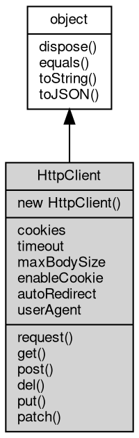

# 对象 HttpClient
[http](../../module/ifs/http.md)客户端对象

[http](../../module/ifs/http.md)客户端对象模拟浏览器环境缓存cookie，并在访问[url](../../module/ifs/url.md)的时候携带对应的cookie，不同的[http](../../module/ifs/http.md)客户端对象是相互隔离的，提供[http](../../module/ifs/http.md)的request、get、post等方法。
用法如下：

```JavaScript
var http = require('http');
var httpClient = new http.Client();
httpClient.request('GET', 'http://fibjs.org');
```

## 继承关系


## 构造函数
        
### HttpClient
**HttpClient 构造函数，创建一个新的HttpClient对象**

```JavaScript
new HttpClient();
```

## 成员属性
        
### cookies
**[List](List.md), 返回[http](../../module/ifs/http.md)客户端的 [HttpCookie](HttpCookie.md) 对象列表**

```JavaScript
readonly List HttpClient.cookies;
```

--------------------------
### timeout
**Integer, 查询和设置超时时间 单位毫秒**

```JavaScript
Integer HttpClient.timeout;
```

--------------------------
### maxBodySize
**Integer, 查询和设置 body 最大尺寸，以 MB 为单位，缺省为 -1，不限制尺寸**

```JavaScript
Integer HttpClient.maxBodySize;
```

--------------------------
### enableCookie
**Boolean, cookie功能开关，默认开启**

```JavaScript
Boolean HttpClient.enableCookie;
```

--------------------------
### autoRedirect
**Boolean, 自动redirect功能开关，默认开启**

```JavaScript
Boolean HttpClient.autoRedirect;
```

--------------------------
### userAgent
**String, 查询和设置 [http](../../module/ifs/http.md) 请求中的浏览器标识**

```JavaScript
String HttpClient.userAgent;
```

## 成员函数
        
### request
**发送 [http](../../module/ifs/http.md) 请求到指定的流对象，并返回结果**

```JavaScript
HttpResponse HttpClient.request(Stream conn,
    HttpRequest req) async;
```

调用参数:
* conn: [Stream](Stream.md), 指定处理请求的流对象
* req: [HttpRequest](HttpRequest.md), 要发送的 [HttpRequest](HttpRequest.md) 对象

返回结果:
* [HttpResponse](HttpResponse.md), 返回服务器响应

--------------------------
**请求指定的 [url](../../module/ifs/url.md)，并返回结果**

```JavaScript
HttpResponse HttpClient.request(String method,
    String url,
    Object headers = {}) async;
```

调用参数:
* method: String, 指定 [http](../../module/ifs/http.md) 请求方法：GET, POST 等
* url: String, 指定 [url](../../module/ifs/url.md)，必须是包含主机的完整 [url](../../module/ifs/url.md)
* headers: Object, 指定附加的 [http](../../module/ifs/http.md) 头，缺省无附加头

返回结果:
* [HttpResponse](HttpResponse.md), 返回服务器响应

--------------------------
**请求指定的 [url](../../module/ifs/url.md)，并返回结果**

```JavaScript
HttpResponse HttpClient.request(String method,
    String url,
    SeekableStream body,
    Map headers) async;
```

调用参数:
* method: String, 指定 [http](../../module/ifs/http.md) 请求方法：GET, POST 等
* url: String, 指定 [url](../../module/ifs/url.md)，必须是包含主机的完整 [url](../../module/ifs/url.md)
* body: [SeekableStream](SeekableStream.md), 指定发送的 body 内容
* headers: [Map](Map.md), 指定附加的 [http](../../module/ifs/http.md) 头

返回结果:
* [HttpResponse](HttpResponse.md), 返回服务器响应

--------------------------
**请求指定的 [url](../../module/ifs/url.md)，并返回结果**

```JavaScript
HttpResponse HttpClient.request(String method,
    String url,
    SeekableStream body,
    Object headers = {}) async;
```

调用参数:
* method: String, 指定 [http](../../module/ifs/http.md) 请求方法：GET, POST 等
* url: String, 指定 [url](../../module/ifs/url.md)，必须是包含主机的完整 [url](../../module/ifs/url.md)
* body: [SeekableStream](SeekableStream.md), 指定发送的 body 内容
* headers: Object, 指定附加的 [http](../../module/ifs/http.md) 头，缺省无附加头

返回结果:
* [HttpResponse](HttpResponse.md), 返回服务器响应

--------------------------
**请求指定的 [url](../../module/ifs/url.md)，并返回结果**

```JavaScript
HttpResponse HttpClient.request(String method,
    String url,
    Buffer body,
    Object headers = {}) async;
```

调用参数:
* method: String, 指定 [http](../../module/ifs/http.md) 请求方法：GET, POST 等
* url: String, 指定 [url](../../module/ifs/url.md)，必须是包含主机的完整 [url](../../module/ifs/url.md)
* body: [Buffer](Buffer.md), 指定发送的 body 内容
* headers: Object, 指定附加的 [http](../../module/ifs/http.md) 头，缺省无附加头

返回结果:
* [HttpResponse](HttpResponse.md), 返回服务器响应

--------------------------
### get
**用 GET 方法请求指定的 [url](../../module/ifs/url.md)，并返回结果，等同于 request("GET", ...)**

```JavaScript
HttpResponse HttpClient.get(String url,
    Object headers = {}) async;
```

调用参数:
* url: String, 指定 [url](../../module/ifs/url.md)，必须是包含主机的完整 [url](../../module/ifs/url.md)
* headers: Object, 指定附加的 [http](../../module/ifs/http.md) 头，缺省无附加头

返回结果:
* [HttpResponse](HttpResponse.md), 返回服务器响应

--------------------------
### post
**用 POST 方法请求指定的 [url](../../module/ifs/url.md)，并返回结果，等同于 request("POST", ...)**

```JavaScript
HttpResponse HttpClient.post(String url,
    SeekableStream body,
    Object headers = {}) async;
```

调用参数:
* url: String, 指定 [url](../../module/ifs/url.md)，必须是包含主机的完整 [url](../../module/ifs/url.md)
* body: [SeekableStream](SeekableStream.md), 指定发送的 body 内容
* headers: Object, 指定附加的 [http](../../module/ifs/http.md) 头，缺省无附加头

返回结果:
* [HttpResponse](HttpResponse.md), 返回服务器响应

--------------------------
**用 POST 方法请求指定的 [url](../../module/ifs/url.md)，并返回结果，等同于 request("POST", ...)**

```JavaScript
HttpResponse HttpClient.post(String url,
    Buffer body,
    Object headers = {}) async;
```

调用参数:
* url: String, 指定 [url](../../module/ifs/url.md)，必须是包含主机的完整 [url](../../module/ifs/url.md)
* body: [Buffer](Buffer.md), 指定发送的 body 内容
* headers: Object, 指定附加的 [http](../../module/ifs/http.md) 头，缺省无附加头

返回结果:
* [HttpResponse](HttpResponse.md), 返回服务器响应

--------------------------
**用 POST 方法请求指定的 [url](../../module/ifs/url.md)，并返回结果，等同于 request("POST", ...)**

```JavaScript
HttpResponse HttpClient.post(String url,
    Object headers = {}) async;
```

调用参数:
* url: String, 指定 [url](../../module/ifs/url.md)，必须是包含主机的完整 [url](../../module/ifs/url.md)
* headers: Object, 指定附加的 [http](../../module/ifs/http.md) 头，缺省无附加头

返回结果:
* [HttpResponse](HttpResponse.md), 返回服务器响应

--------------------------
### del
**用 DELETE 方法请求指定的 [url](../../module/ifs/url.md)，并返回结果，等同于 request("DELETE", ...)**

```JavaScript
HttpResponse HttpClient.del(String url,
    Object headers = {}) async;
```

调用参数:
* url: String, 指定 [url](../../module/ifs/url.md)，必须是包含主机的完整 [url](../../module/ifs/url.md)
* headers: Object, 指定附加的 [http](../../module/ifs/http.md) 头，缺省无附加头

返回结果:
* [HttpResponse](HttpResponse.md), 返回服务器响应

--------------------------
### put
**用 PUT 方法请求指定的 [url](../../module/ifs/url.md)，并返回结果，等同于 request("PUT", ...)**

```JavaScript
HttpResponse HttpClient.put(String url,
    SeekableStream body,
    Object headers = {}) async;
```

调用参数:
* url: String, 指定 [url](../../module/ifs/url.md)，必须是包含主机的完整 [url](../../module/ifs/url.md)
* body: [SeekableStream](SeekableStream.md), 指定发送的 body 内容
* headers: Object, 指定附加的 [http](../../module/ifs/http.md) 头，缺省无附加头

返回结果:
* [HttpResponse](HttpResponse.md), 返回服务器响应

--------------------------
**用 PUT 方法请求指定的 [url](../../module/ifs/url.md)，并返回结果，等同于 request("PUT", ...)**

```JavaScript
HttpResponse HttpClient.put(String url,
    Buffer body,
    Object headers = {}) async;
```

调用参数:
* url: String, 指定 [url](../../module/ifs/url.md)，必须是包含主机的完整 [url](../../module/ifs/url.md)
* body: [Buffer](Buffer.md), 指定发送的 body 内容
* headers: Object, 指定附加的 [http](../../module/ifs/http.md) 头，缺省无附加头

返回结果:
* [HttpResponse](HttpResponse.md), 返回服务器响应

--------------------------
**用 PUT 方法请求指定的 [url](../../module/ifs/url.md)，并返回结果，等同于 request("PUT", ...)**

```JavaScript
HttpResponse HttpClient.put(String url,
    Object headers = {}) async;
```

调用参数:
* url: String, 指定 [url](../../module/ifs/url.md)，必须是包含主机的完整 [url](../../module/ifs/url.md)
* headers: Object, 指定附加的 [http](../../module/ifs/http.md) 头，缺省无附加头

返回结果:
* [HttpResponse](HttpResponse.md), 返回服务器响应

--------------------------
### patch
**用 PATCH 方法请求指定的 [url](../../module/ifs/url.md)，并返回结果，等同于 request("PATCH", ...)**

```JavaScript
HttpResponse HttpClient.patch(String url,
    SeekableStream body,
    Object headers = {}) async;
```

调用参数:
* url: String, 指定 [url](../../module/ifs/url.md)，必须是包含主机的完整 [url](../../module/ifs/url.md)
* body: [SeekableStream](SeekableStream.md), 指定发送的 body 内容
* headers: Object, 指定附加的 [http](../../module/ifs/http.md) 头，缺省无附加头

返回结果:
* [HttpResponse](HttpResponse.md), 返回服务器响应

--------------------------
**用 PATCH 方法请求指定的 [url](../../module/ifs/url.md)，并返回结果，等同于 request("PATCH", ...)**

```JavaScript
HttpResponse HttpClient.patch(String url,
    Buffer body,
    Object headers = {}) async;
```

调用参数:
* url: String, 指定 [url](../../module/ifs/url.md)，必须是包含主机的完整 [url](../../module/ifs/url.md)
* body: [Buffer](Buffer.md), 指定发送的 body 内容
* headers: Object, 指定附加的 [http](../../module/ifs/http.md) 头，缺省无附加头

返回结果:
* [HttpResponse](HttpResponse.md), 返回服务器响应

--------------------------
**用 PATCH 方法请求指定的 [url](../../module/ifs/url.md)，并返回结果，等同于 request("PATCH", ...)**

```JavaScript
HttpResponse HttpClient.patch(String url,
    Object headers = {}) async;
```

调用参数:
* url: String, 指定 [url](../../module/ifs/url.md)，必须是包含主机的完整 [url](../../module/ifs/url.md)
* headers: Object, 指定附加的 [http](../../module/ifs/http.md) 头，缺省无附加头

返回结果:
* [HttpResponse](HttpResponse.md), 返回服务器响应

--------------------------
### dispose
**强制回收对象，调用此方法后，对象资源将立即释放**

```JavaScript
HttpClient.dispose();
```

--------------------------
### equals
**比较当前对象与给定的对象是否相等**

```JavaScript
Boolean HttpClient.equals(object expected);
```

调用参数:
* expected: [object](object.md), 制定比较的目标对象

返回结果:
* Boolean, 返回对象比较的结果

--------------------------
### toString
**返回对象的字符串表示，一般返回 "[Native Object]"，对象可以根据自己的特性重新实现**

```JavaScript
String HttpClient.toString();
```

返回结果:
* String, 返回对象的字符串表示

--------------------------
### toJSON
**返回对象的 JSON 格式表示，一般返回对象定义的可读属性集合**

```JavaScript
Value HttpClient.toJSON(String key = "");
```

调用参数:
* key: String, 未使用

返回结果:
* Value, 返回包含可 JSON 序列化的值

