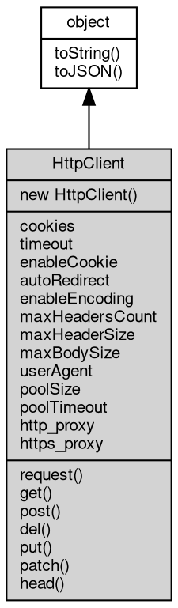

# 对象 HttpClient
HttpClient 是针对 HTTP 客户端功能设计的类库，提供了基本的 HTTP/HTTPS 请求、代理访问、cookie 管理等功能

使用 HttpClient 可以轻松地访问和操作 web 页面，这里举一个简单的例子——在一个 web 页面上打印出其源代码：

```JavaScript
const http = require('http');

const res = http.get('http://www.example.com/');

console.log(res.body.readAll().toString());
```

在该例子中，通过 require 引入 [http](../../module/ifs/http.md) 模块，然后使用 [http.get](../../module/ifs/http.md#get) 发起一个 get 请求，其中 [url](../../module/ifs/url.md) 参数指定了请求的网址。因为 [http.get](../../module/ifs/http.md#get) 方法返回的是一个 [HttpResponse](HttpResponse.md) 对象，所以可以通过其 body 属性来访问请求返回的主体内容并通过 toString 方法将其转化为字符串。

当请求的 [url](../../module/ifs/url.md) 是 https 类型而不是 [http](../../module/ifs/http.md) 类型时，代码只需要将 [http](../../module/ifs/http.md) 改为 https 即可：

```JavaScript
const http = require('http');

const res = http.get('https://www.example.com/');

console.log(res.body.readAll().toString());
```

除此之外，还有通过 HttpClient 直接发起 POST 请求、设置 User-Agent 的例子：

```JavaScript
const http = require('http');

const httpClient = new http.Client();
httpClient.userAgent = 'Mozilla/5.0 (Windows NT 10.0; Win64; x64) AppleWebKit/537.36 (KHTML, like Gecko) Chrome/58.0.3029.110 Safari/537.36';
const res = httpClient.post('http://www.example.com/post', {
    json: {
        name: 'fibjs',
        version: '0.31.0'
    }
});
console.log(res.body.readAll().toString());
```

在该例子中，首先创建了一个 HttpClient 对象 httpClient，并设置其 userAgent 为浏览器的 User-Agent。然后通过它的 post 方法来发起一个 post 请求，其中参数 name 和 version 来指定请求的主体内容。最后将返回值的主体内容输出。

## 继承关系


## 构造函数
        
### HttpClient
**HttpClient 构造函数，创建一个新的HttpClient对象**

```JavaScript
new HttpClient();
```

--------------------------
**HttpClient 构造函数，创建一个新的HttpClient对象**

```JavaScript
new HttpClient(SecureContext context);
```

调用参数:
* context: [SecureContext](SecureContext.md), 指定创建 HttpClient 使用的安全上下文

--------------------------
**HttpClient 构造函数，创建一个新的HttpClient对象**

```JavaScript
new HttpClient(Object options);
```

调用参数:
* options: Object, 使用 [tls.createSecureContext](../../module/ifs/tls.md#createSecureContext) 创建安全上下文需要的选项

options 除用于创建 [SecureContext](SecureContext.md) 的属性之外，还需提供以下属性：
- timeout: 指定超时时间
- enableCookie: 指定是否启用 cookie 功能
- autoRedirect: 指定是否启用自动重定向功能
- enableEncoding: 指定是否启用自动解压缩功能
- maxHeadersCount: 指定最大请求头个数
- maxHeaderSize: 指定最大请求头长度
- maxBodySize: 指定 body 最大尺寸
- userAgent: 指定浏览器标识
- poolSize: 指定 keep-alive 最大缓存连接数
- poolTimeout: 指定 keep-alive 缓存连接超时时间
- http_proxy: 指定 [http](../../module/ifs/http.md) 代理地址
- https_Proxy: 指定 https 代理地址

## 成员属性
        
### cookies
**NArray, 返回[http](../../module/ifs/http.md)客户端的 [HttpCookie](HttpCookie.md) 对象列表**

```JavaScript
readonly NArray HttpClient.cookies;
```

--------------------------
### timeout
**Integer, 查询和设置超时时间 单位毫秒**

```JavaScript
Integer HttpClient.timeout;
```

--------------------------
### enableCookie
**Boolean, cookie 功能开关，默认开启**

```JavaScript
Boolean HttpClient.enableCookie;
```

--------------------------
### autoRedirect
**Boolean, 自动 redirect 功能开关，默认开启**

```JavaScript
Boolean HttpClient.autoRedirect;
```

--------------------------
### enableEncoding
**Boolean, 自动解压缩功能开关，默认开启**

```JavaScript
Boolean HttpClient.enableEncoding;
```

--------------------------
### maxHeadersCount
**Integer, 查询和设置最大请求头个数，缺省为 128**

```JavaScript
Integer HttpClient.maxHeadersCount;
```

--------------------------
### maxHeaderSize
**Integer, 查询和设置最大请求头长度，缺省为 8192**

```JavaScript
Integer HttpClient.maxHeaderSize;
```

--------------------------
### maxBodySize
**Integer, 查询和设置 body 最大尺寸，以 MB 为单位，缺省为 -1，不限制尺寸**

```JavaScript
Integer HttpClient.maxBodySize;
```

--------------------------
### userAgent
**String, 查询和设置 [http](../../module/ifs/http.md) 请求中的浏览器标识**

```JavaScript
String HttpClient.userAgent;
```

--------------------------
### poolSize
**Integer, 查询和设置 keep-alive 最大缓存连接数，缺省 128**

```JavaScript
Integer HttpClient.poolSize;
```

--------------------------
### poolTimeout
**Integer, 查询和设置 keep-alive 缓存连接超时时间，缺省 10000 ms**

```JavaScript
Integer HttpClient.poolTimeout;
```

--------------------------
### http_proxy
**String, 查询和设置 [http](../../module/ifs/http.md) 请求代理，支持 [http](../../module/ifs/http.md)/https/socks5 代理**

```JavaScript
String HttpClient.http_proxy;
```

--------------------------
### https_proxy
**String, 查询和设置 https 请求代理，支持 [http](../../module/ifs/http.md)/https/socks5 代理，不设置，或者设置为空，则复用 http_proxy**

```JavaScript
String HttpClient.https_proxy;
```

## 成员函数
        
### request
**发送 [http](../../module/ifs/http.md) 请求到指定的流对象，并返回结果**

```JavaScript
HttpResponse HttpClient.request(Stream conn,
    HttpRequest req) async;
```

调用参数:
* conn: [Stream](Stream.md), 指定处理请求的流对象
* req: [HttpRequest](HttpRequest.md), 要发送的 [HttpRequest](HttpRequest.md) 对象

返回结果:
* [HttpResponse](HttpResponse.md), 返回服务器响应

--------------------------
**发送 [http](../../module/ifs/http.md) 请求到指定的流对象，并返回结果**

```JavaScript
HttpResponse HttpClient.request(Stream conn,
    HttpRequest req,
    SeekableStream response_body) async;
```

调用参数:
* conn: [Stream](Stream.md), 指定处理请求的流对象
* req: [HttpRequest](HttpRequest.md), 要发送的 [HttpRequest](HttpRequest.md) 对象
* response_body: [SeekableStream](SeekableStream.md), 指定 response.body 的流

返回结果:
* [HttpResponse](HttpResponse.md), 返回服务器响应

--------------------------
**请求指定的 [url](../../module/ifs/url.md)，并返回结果**

```JavaScript
HttpResponse HttpClient.request(String method,
    String url,
    Object opts = {}) async;
```

调用参数:
* method: String, 指定 [http](../../module/ifs/http.md) 请求方法：GET, POST 等
* url: String, 指定 [url](../../module/ifs/url.md)，必须是包含主机的完整 [url](../../module/ifs/url.md)
* opts: Object, 指定附加信息

返回结果:
* [HttpResponse](HttpResponse.md), 返回服务器响应

opts 包含请求的附加选项，支持的内容如下：

```JavaScript
{
    "method": "GET", // specify the http request method: GET, POST, etc, default: GET.
    "protocol": "http",
    "slashes": true,
    "username": "",
    "password": "",
    "hostname": "",
    "port": "",
    "pathname": "",
    "query": {},
    "body": SeekableStream | Buffer | String | {},
    "json": {},
    "pack": {},
    "headers": {},
    "response_body": SeekableStream // specify the response.body stream
}
```

其中 body，[json](../../module/ifs/json.md)，pack 不得同时出现。缺省为 {}，不包含任何附加信息

--------------------------
**用 GET 方法请求指定的 [url](../../module/ifs/url.md)，并返回结果，等同于 request("GET", ...)**

```JavaScript
HttpResponse HttpClient.request(String url,
    Object opts = {}) async;
```

调用参数:
* url: String, 指定 [url](../../module/ifs/url.md)，必须是包含主机的完整 [url](../../module/ifs/url.md)
* opts: Object, 指定附加信息

返回结果:
* [HttpResponse](HttpResponse.md), 返回服务器响应

opts 包含请求的附加选项，支持的内容如下：

```JavaScript
{
    "method": "GET", // specify the http request method: GET, POST, etc, default: GET.
    "protocol": "http",
    "slashes": true,
    "username": "",
    "password": "",
    "hostname": "",
    "port": "",
    "pathname": "",
    "query": {},
    "body": SeekableStream | Buffer | String | {},
    "json": {},
    "pack": {},
    "headers": {}
}
```

其中 body，[json](../../module/ifs/json.md)，pack 不得同时出现。缺省为 {}，不包含任何附加信息

--------------------------
**请求 opts 指定的 [url](../../module/ifs/url.md)，并返回结果**

```JavaScript
HttpResponse HttpClient.request(Object opts) async;
```

调用参数:
* opts: Object, 指定附加信息

返回结果:
* [HttpResponse](HttpResponse.md), 返回服务器响应

opts 包含请求的附加选项，支持的内容如下：

```JavaScript
{
    "method": "GET", // specify the http request method: GET, POST, etc, default: GET.
    "protocol": "http",
    "slashes": true,
    "username": "",
    "password": "",
    "hostname": "",
    "port": "",
    "pathname": "",
    "query": {},
    "body": SeekableStream | Buffer | String | {},
    "json": {},
    "pack": {},
    "headers": {}
}
```

其中 body，[json](../../module/ifs/json.md)，pack 不得同时出现。缺省为 {}，不包含任何附加信息

--------------------------
### get
**用 GET 方法请求指定的 [url](../../module/ifs/url.md)，并返回结果，等同于 request("GET", ...)**

```JavaScript
HttpResponse HttpClient.get(String url,
    Object opts = {}) async;
```

调用参数:
* url: String, 指定 [url](../../module/ifs/url.md)，必须是包含主机的完整 [url](../../module/ifs/url.md)
* opts: Object, 指定附加信息

返回结果:
* [HttpResponse](HttpResponse.md), 返回服务器响应

opts 包含请求的附加选项，支持的内容如下：

```JavaScript
{
    "method": "GET", // specify the http request method: GET, POST, etc, default: GET.
    "protocol": "http",
    "slashes": true,
    "username": "",
    "password": "",
    "hostname": "",
    "port": "",
    "pathname": "",
    "query": {},
    "body": SeekableStream | Buffer | String | {},
    "json": {},
    "pack": {},
    "headers": {}
}
```

其中 body，[json](../../module/ifs/json.md)，pack 不得同时出现。缺省为 {}，不包含任何附加信息

--------------------------
### post
**用 POST 方法请求指定的 [url](../../module/ifs/url.md)，并返回结果，等同于 request("POST", ...)**

```JavaScript
HttpResponse HttpClient.post(String url,
    Object opts = {}) async;
```

调用参数:
* url: String, 指定 [url](../../module/ifs/url.md)，必须是包含主机的完整 [url](../../module/ifs/url.md)
* opts: Object, 指定附加信息

返回结果:
* [HttpResponse](HttpResponse.md), 返回服务器响应

opts 包含请求的附加选项，支持的内容如下：

```JavaScript
{
    "method": "GET", // specify the http request method: GET, POST, etc, default: GET.
    "protocol": "http",
    "slashes": true,
    "username": "",
    "password": "",
    "hostname": "",
    "port": "",
    "pathname": "",
    "query": {},
    "body": SeekableStream | Buffer | String | {},
    "json": {},
    "pack": {},
    "headers": {}
}
```

其中 body，[json](../../module/ifs/json.md)，pack 不得同时出现。缺省为 {}，不包含任何附加信息

--------------------------
### del
**用 DELETE 方法请求指定的 [url](../../module/ifs/url.md)，并返回结果，等同于 request("DELETE", ...)**

```JavaScript
HttpResponse HttpClient.del(String url,
    Object opts = {}) async;
```

调用参数:
* url: String, 指定 [url](../../module/ifs/url.md)，必须是包含主机的完整 [url](../../module/ifs/url.md)
* opts: Object, 指定附加信息

返回结果:
* [HttpResponse](HttpResponse.md), 返回服务器响应

opts 包含请求的附加选项，支持的内容如下：

```JavaScript
{
    "method": "GET", // specify the http request method: GET, POST, etc, default: GET.
    "protocol": "http",
    "slashes": true,
    "username": "",
    "password": "",
    "hostname": "",
    "port": "",
    "pathname": "",
    "query": {},
    "body": SeekableStream | Buffer | String | {},
    "json": {},
    "pack": {},
    "headers": {}
}
```

其中 body，[json](../../module/ifs/json.md)，pack 不得同时出现。缺省为 {}，不包含任何附加信息

--------------------------
### put
**用 PUT 方法请求指定的 [url](../../module/ifs/url.md)，并返回结果，等同于 request("PUT", ...)**

```JavaScript
HttpResponse HttpClient.put(String url,
    Object opts = {}) async;
```

调用参数:
* url: String, 指定 [url](../../module/ifs/url.md)，必须是包含主机的完整 [url](../../module/ifs/url.md)
* opts: Object, 指定附加信息

返回结果:
* [HttpResponse](HttpResponse.md), 返回服务器响应

opts 包含请求的附加选项，支持的内容如下：

```JavaScript
{
    "method": "GET", // specify the http request method: GET, POST, etc, default: GET.
    "protocol": "http",
    "slashes": true,
    "username": "",
    "password": "",
    "hostname": "",
    "port": "",
    "pathname": "",
    "query": {},
    "body": SeekableStream | Buffer | String | {},
    "json": {},
    "pack": {},
    "headers": {}
}
```

其中 body，[json](../../module/ifs/json.md)，pack 不得同时出现。缺省为 {}，不包含任何附加信息

--------------------------
### patch
**用 PATCH 方法请求指定的 [url](../../module/ifs/url.md)，并返回结果，等同于 request("PATCH", ...)**

```JavaScript
HttpResponse HttpClient.patch(String url,
    Object opts = {}) async;
```

调用参数:
* url: String, 指定 [url](../../module/ifs/url.md)，必须是包含主机的完整 [url](../../module/ifs/url.md)
* opts: Object, 指定附加信息

返回结果:
* [HttpResponse](HttpResponse.md), 返回服务器响应

opts 包含请求的附加选项，支持的内容如下：

```JavaScript
{
    "method": "GET", // specify the http request method: GET, POST, etc, default: GET.
    "protocol": "http",
    "slashes": true,
    "username": "",
    "password": "",
    "hostname": "",
    "port": "",
    "pathname": "",
    "query": {},
    "body": SeekableStream | Buffer | String | {},
    "json": {},
    "pack": {},
    "headers": {}
}
```

其中 body，[json](../../module/ifs/json.md)，pack 不得同时出现。缺省为 {}，不包含任何附加信息

--------------------------
### head
**用 HEAD 方法请求指定的 [url](../../module/ifs/url.md)，并返回结果，等同于 request("PATCH", ...)**

```JavaScript
HttpResponse HttpClient.head(String url,
    Object opts = {}) async;
```

调用参数:
* url: String, 指定 [url](../../module/ifs/url.md)，必须是包含主机的完整 [url](../../module/ifs/url.md)
* opts: Object, 指定附加信息

返回结果:
* [HttpResponse](HttpResponse.md), 返回服务器响应

opts 包含请求的附加选项，支持的内容如下：

```JavaScript
{
    "method": "GET", // specify the http request method: GET, POST, etc, default: GET.
    "protocol": "http",
    "slashes": true,
    "username": "",
    "password": "",
    "hostname": "",
    "port": "",
    "pathname": "",
    "query": {},
    "body": SeekableStream | Buffer | String | {},
    "json": {},
    "pack": {},
    "headers": {}
}
```

其中 body，[json](../../module/ifs/json.md)，pack 不得同时出现。缺省为 {}，不包含任何附加信息

--------------------------
### toString
**返回对象的字符串表示，一般返回 "[Native Object]"，对象可以根据自己的特性重新实现**

```JavaScript
String HttpClient.toString();
```

返回结果:
* String, 返回对象的字符串表示

--------------------------
### toJSON
**返回对象的 JSON 格式表示，一般返回对象定义的可读属性集合**

```JavaScript
Value HttpClient.toJSON(String key = "");
```

调用参数:
* key: String, 未使用

返回结果:
* Value, 返回包含可 JSON 序列化的值

