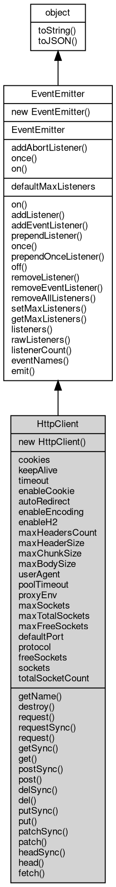

# 对象 HttpClient
HttpClient 是针对 HTTP 客户端功能设计的类库，提供了基本的 HTTP/HTTPS 请求、代理访问、cookie 管理等功能

使用 HttpClient 可以轻松地访问和操作 web 页面，这里举一个简单的例子——在一个 web 页面上打印出其源代码：

```JavaScript
const http = require('http');

const res = http.get('http://www.example.com/');

console.log(res.body.readAll().toString());
```

在该例子中，通过 require 引入 [http](../../module/ifs/http.md) 模块，然后使用 [http.get](../../module/ifs/http.md#get) 发起一个 get 请求，其中 [url](../../module/ifs/url.md) 参数指定了请求的网址。因为 [http.get](../../module/ifs/http.md#get) 方法返回的是一个 [HttpResponse](HttpResponse.md) 对象，所以可以通过其 body 属性来访问请求返回的主体内容并通过 toString 方法将其转化为字符串。

当请求的 [url](../../module/ifs/url.md) 是 https 类型而不是 [http](../../module/ifs/http.md) 类型时，代码只需要将 [http](../../module/ifs/http.md) 改为 https 即可：

```JavaScript
const http = require('http');

const res = http.get('https://www.example.com/');

console.log(res.body.readAll().toString());
```

除此之外，还有通过 HttpClient 直接发起 POST 请求、设置 User-Agent 的例子：

```JavaScript
const http = require('http');

const httpClient = new http.Client();
httpClient.userAgent = 'Mozilla/5.0 (Windows NT 10.0; Win64; x64) AppleWebKit/537.36 (KHTML, like Gecko) Chrome/58.0.3029.110 Safari/537.36';
const res = httpClient.post('http://www.example.com/post', {
    json: {
        name: 'fibjs',
        version: '0.31.0'
    }
});
console.log(res.body.readAll().toString());
```

在该例子中，首先创建了一个 HttpClient 对象 httpClient，并设置其 userAgent 为浏览器的 User-Agent。然后通过它的 post 方法来发起一个 post 请求，其中参数 name 和 version 来指定请求的主体内容。最后将返回值的主体内容输出。

## 继承关系

```dot
digraph {
    node [fontname="Helvetica,sans-Serif", fontsize=10, shape="record", style="filled", fillcolor="white"];

    object [tooltip="object", URL="object.md", label="{object|toString()\ltoJSON()\l}"];
    EventEmitter [tooltip="EventEmitter", URL="EventEmitter.md", label="{EventEmitter|new EventEmitter()\l|EventEmitter\l|addAbortListener()\lonce()\lon()\l|defaultMaxListeners\l|on()\laddListener()\laddEventListener()\lprependListener()\lonce()\lprependOnceListener()\loff()\lremoveListener()\lremoveEventListener()\lremoveAllListeners()\lsetMaxListeners()\lgetMaxListeners()\llisteners()\lrawListeners()\llistenerCount()\leventNames()\lemit()\l}"];
    HttpClient [tooltip="HttpClient", fillcolor="lightgray", id="me", label="{HttpClient|new HttpClient()\l|cookies\lkeepAlive\ltimeout\lenableCookie\lautoRedirect\lenableEncoding\lenableH2\lmaxHeadersCount\lmaxHeaderSize\lmaxChunkSize\lmaxBodySize\luserAgent\lpoolTimeout\lproxyEnv\lmaxSockets\lmaxTotalSockets\lmaxFreeSockets\ldefaultPort\lprotocol\lfreeSockets\lsockets\ltotalSocketCount\l|getName()\ldestroy()\lrequest()\lrequestSync()\lrequest()\lgetSync()\lget()\lpostSync()\lpost()\ldelSync()\ldel()\lputSync()\lput()\lpatchSync()\lpatch()\lheadSync()\lhead()\lfetch()\l}"];

    object -> EventEmitter [dir=back];
    EventEmitter -> HttpClient [dir=back];
}
```

## 构造函数
        
### HttpClient
**HttpClient 构造函数，创建一个新的HttpClient对象**

```JavaScript
new HttpClient();
```

--------------------------
**HttpClient 构造函数，创建一个新的HttpClient对象**

```JavaScript
new HttpClient(SecureContext context);
```

调用参数:
* context: [SecureContext](SecureContext.md), 指定创建 HttpClient 使用的安全上下文

--------------------------
**HttpClient 构造函数，创建一个新的HttpClient对象**

```JavaScript
new HttpClient(Object options);
```

调用参数:
* options: Object, 使用 [tls.createSecureContext](../../module/ifs/tls.md#createSecureContext) 创建安全上下文需要的选项

options 除用于创建 [SecureContext](SecureContext.md) 的属性之外，还需提供以下属性：
- keepAlive: 指定是否保持连接
- timeout: 指定超时时间
- enableCookie: 指定是否启用 cookie 功能
- autoRedirect: 指定是否启用自动重定向功能
- enableEncoding: 指定是否启用自动解压缩功能
- enableH2: 指定是否启用 HTTP/2 自动升级
- maxHeadersCount: 指定最大请求头个数
- maxHeaderSize: 指定最大请求头长度
- maxBodySize: 指定 body 最大尺寸
- userAgent: 指定浏览器标识
- poolTimeout: 指定 keep-alive 缓存连接超时时间
- proxyEnv: 指定代理配置环境变量，包含 HTTP_PROXY、HTTPS_PROXY、NO_PROXY 及其小写形式

## 静态函数
        
### addAbortListener
**监听一个 [AbortSignal](AbortSignal.md) 的 abort 事件，返回一个可释放的对象**

```JavaScript
static Object HttpClient.addAbortListener(EventEmitter signal,
    Function func);
```

调用参数:
* signal: [EventEmitter](EventEmitter.md), 要监听的 [AbortSignal](AbortSignal.md) 对象
* func: Function, abort 事件的处理函数

返回结果:
* Object, 返回一个包含 `[Symbol.dispose]` 方法的 Disposable 对象

返回的对象包含 `[Symbol.dispose]()` 方法，调用后将移除监听器。如果信号已中止，则监听器会被立即调用。

--------------------------
### once
**创建一个 Promise，等待指定事件触发一次后解析**

```JavaScript
static Object HttpClient.once(EventEmitter emitter,
    Value ev,
    Object options = {});
```

调用参数:
* emitter: [EventEmitter](EventEmitter.md), 要监听的事件触发器对象
* ev: Value, 指定事件的名称
* options: Object, 可选参数对象

返回结果:
* Object, 返回 Promise，以事件参数数组解析

返回一个 Promise，当目标事件触发时以事件参数数组解析。如果在此期间触发 'error' 事件（且监听的不是 'error' 事件本身），Promise 将被拒绝。

options 参数可包含：
- signal: [AbortSignal](AbortSignal.md)，用于取消等待

--------------------------
### on
**创建一个异步迭代器，持续监听指定事件**

```JavaScript
static Object HttpClient.on(EventEmitter emitter,
    Value ev,
    Object options = {});
```

调用参数:
* emitter: [EventEmitter](EventEmitter.md), 要监听的事件触发器对象
* ev: Value, 指定事件的名称
* options: Object, 可选参数对象

返回结果:
* Object, 返回 AsyncIterator 对象

返回一个 AsyncIterator，每次事件触发时产出事件参数数组。如果触发 'error' 事件，迭代器将抛出错误。

options 参数可包含：
- signal: [AbortSignal](AbortSignal.md)，用于取消迭代
- close: 字符串数组，指定结束迭代的事件名称

## 静态属性
        
### defaultMaxListeners
**Integer, 默认全局最大监听器数**

```JavaScript
static Integer HttpClient.defaultMaxListeners;
```

## 成员属性
        
### cookies
**NArray, 返回[http](../../module/ifs/http.md)客户端的 [HttpCookie](HttpCookie.md) 对象列表**

```JavaScript
readonly NArray HttpClient.cookies;
```

--------------------------
### keepAlive
**Boolean, 查询和设定是否保持连接**

```JavaScript
Boolean HttpClient.keepAlive;
```

--------------------------
### timeout
**Integer, 查询和设置超时时间 单位毫秒**

```JavaScript
Integer HttpClient.timeout;
```

--------------------------
### enableCookie
**Boolean, cookie 功能开关，默认开启**

```JavaScript
Boolean HttpClient.enableCookie;
```

--------------------------
### autoRedirect
**Boolean, 自动 redirect 功能开关，默认开启**

```JavaScript
Boolean HttpClient.autoRedirect;
```

--------------------------
### enableEncoding
**Boolean, 自动解压缩功能开关，默认开启**

```JavaScript
Boolean HttpClient.enableEncoding;
```

--------------------------
### enableH2
**Boolean, HTTP/2 自动升级开关，默认关闭**

```JavaScript
Boolean HttpClient.enableH2;
```

--------------------------
### maxHeadersCount
**Integer, 查询和设置最大请求头个数，缺省为 128**

```JavaScript
Integer HttpClient.maxHeadersCount;
```

--------------------------
### maxHeaderSize
**Integer, 查询和设置最大请求头长度，缺省为 8192**

```JavaScript
Integer HttpClient.maxHeaderSize;
```

--------------------------
### maxChunkSize
**Integer, 查询和设置 chunk 最大尺寸，以 MB 为单位，缺省为 2**

```JavaScript
Integer HttpClient.maxChunkSize;
```

--------------------------
### maxBodySize
**Integer, 查询和设置 body 最大尺寸，以 MB 为单位，缺省为 -1，不限制尺寸**

```JavaScript
Integer HttpClient.maxBodySize;
```

--------------------------
### userAgent
**String, 查询和设置 [http](../../module/ifs/http.md) 请求中的浏览器标识**

```JavaScript
String HttpClient.userAgent;
```

--------------------------
### poolTimeout
**Integer, 查询和设置 keep-alive 缓存连接超时时间，缺省 10000 ms**

```JavaScript
Integer HttpClient.poolTimeout;
```

--------------------------
### proxyEnv
**Object, 查询和设置代理配置环境变量，支持 HTTP_PROXY、HTTPS_PROXY、NO_PROXY 及其小写形式**

```JavaScript
Object HttpClient.proxyEnv;
```

--------------------------
### maxSockets
**Integer, 查询和设置每个主机的最大连接数，缺省为无限制**

```JavaScript
Integer HttpClient.maxSockets;
```

--------------------------
### maxTotalSockets
**Integer, 查询和设置所有主机的最大连接总数，缺省为无限制**

```JavaScript
Integer HttpClient.maxTotalSockets;
```

--------------------------
### maxFreeSockets
**Integer, 查询和设置每个主机的最大空闲连接数，缺省为 256**

```JavaScript
Integer HttpClient.maxFreeSockets;
```

--------------------------
### defaultPort
**Integer, 查询和设置 getName() 中使用的默认端口，缺省为 80**

```JavaScript
Integer HttpClient.defaultPort;
```

--------------------------
### protocol
**String, 查询和设置 getName() 中使用的默认协议，缺省为 "[http](../../module/ifs/http.md):"**

```JavaScript
String HttpClient.protocol;
```

--------------------------
### freeSockets
**Object, 返回以 host:port 为键的空闲连接映射**

```JavaScript
readonly Object HttpClient.freeSockets;
```

--------------------------
### sockets
**Object, 返回以 host:port 为键的使用中的连接映射**

```JavaScript
readonly Object HttpClient.sockets;
```

--------------------------
### totalSocketCount
**Integer, 返回所有主机的使用中连接总数**

```JavaScript
readonly Integer HttpClient.totalSocketCount;
```

## 成员函数
        
### getName
**返回给定请求选项的唯一键，用于连接池**

```JavaScript
String HttpClient.getName(Object options = {});
```

调用参数:
* options: Object, 请求选项

返回结果:
* String, 返回连接池键字符串

--------------------------
### destroy
**销毁当前正在使用的所有连接**

```JavaScript
HttpClient.destroy();
```

--------------------------
### request
**发送 [http](../../module/ifs/http.md) 请求到指定的流对象，并返回结果**

```JavaScript
HttpRequest HttpClient.request(Stream conn,
    HttpRequest req);
```

调用参数:
* conn: [Stream](Stream.md), 指定处理请求的流对象
* req: [HttpRequest](HttpRequest.md), 要发送的 [HttpRequest](HttpRequest.md) 对象

返回结果:
* [HttpRequest](HttpRequest.md), 返回服务器响应

--------------------------
**请求指定的 [url](../../module/ifs/url.md)，注册回调接收响应，返回 [HttpRequest](HttpRequest.md) 对象**

```JavaScript
HttpRequest HttpClient.request(String method,
    String url,
    Object opts = {});
```

调用参数:
* method: String, 指定 [http](../../module/ifs/http.md) 请求方法：GET, POST 等
* url: String, 指定 [url](../../module/ifs/url.md)，必须是包含主机的完整 [url](../../module/ifs/url.md)
* opts: Object, 指定附加信息

返回结果:
* [HttpRequest](HttpRequest.md), 返回 [HttpRequest](HttpRequest.md) 对象（可监听 'response' 事件接收响应）

opts 包含请求的附加选项，支持的内容如下：

```JavaScript
{
    "method": "GET", // specify the http request method: GET, POST, etc, default: GET.
    "protocol": "http",
    "slashes": true,
    "username": "",
    "password": "",
    "hostname": "",
    "port": "",
    "pathname": "",
    "path": "", // pathname 的别名，用于 request 选项。
    "keepAlive": unknown, // If not specified, the default settings of the client will be used.
    "timeout": 0, // 请求超时时间（毫秒），缺省使用客户端默认设置
    "query": {},
    "body": SeekableStream | Buffer | String | {},
    "json": {},
    "pack": {},
    "headers": {},
    "signal": AbortSignal // 用于取消请求的 AbortSignal 对象
}
```

其中 body，[json](../../module/ifs/json.md)，pack 不得同时出现。缺省为 {}，不包含任何附加信息

--------------------------
**请求 opts 指定的 [url](../../module/ifs/url.md)，并返回 [HttpRequest](HttpRequest.md) 对象**

```JavaScript
HttpRequest HttpClient.request(Object opts);
```

调用参数:
* opts: Object, 指定附加信息

返回结果:
* [HttpRequest](HttpRequest.md), 返回 [HttpRequest](HttpRequest.md) 对象（可监听 'response' 事件接收响应）

opts 包含请求的附加选项，支持的内容如下：

```JavaScript
{
    "method": "GET", // specify the http request method: GET, POST, etc, default: GET.
    "protocol": "http",
    "slashes": true,
    "username": "",
    "password": "",
    "hostname": "",
    "port": "",
    "pathname": "",
    "keepAlive": unknown, // If not specified, the default settings of the client will be used.
    "timeout": 0, // 请求超时时间（毫秒），缺省使用客户端默认设置
    "query": {},
    "body": SeekableStream | Buffer | String | {},
    "json": {},
    "pack": {},
    "headers": {},
    "signal": AbortSignal // 用于取消请求的 AbortSignal 对象
}
```

其中 body，[json](../../module/ifs/json.md)，pack 不得同时出现。缺省为 {}，不包含任何附加信息

--------------------------
**请求指定的 [url](../../module/ifs/url.md)，并返回 [HttpRequest](HttpRequest.md) 对象**

```JavaScript
HttpRequest HttpClient.request(String url,
    Object opts = {});
```

调用参数:
* url: String, 指定 [url](../../module/ifs/url.md)，必须是包含主机的完整 [url](../../module/ifs/url.md)
* opts: Object, 指定附加信息

返回结果:
* [HttpRequest](HttpRequest.md), 返回 [HttpRequest](HttpRequest.md) 对象（可监听 'response' 事件接收响应）

opts 包含请求的附加选项，支持的内容如下：

```JavaScript
{
    "method": "GET", // specify the http request method: GET, POST, etc, default: GET.
    "protocol": "http",
    "slashes": true,
    "username": "",
    "password": "",
    "hostname": "",
    "port": "",
    "pathname": "",
    "keepAlive": unknown, // If not specified, the default settings of the client will be used.
    "timeout": 0, // 请求超时时间（毫秒），缺省使用客户端默认设置
    "query": {},
    "body": SeekableStream | Buffer | String | {},
    "json": {},
    "pack": {},
    "headers": {},
    "signal": AbortSignal // 用于取消请求的 AbortSignal 对象
}
```

其中 body，[json](../../module/ifs/json.md)，pack 不得同时出现。缺省为 {}，不包含任何附加信息

--------------------------
**请求指定的 [url](../../module/ifs/url.md)，注册回调接收响应，返回 [HttpRequest](HttpRequest.md) 对象**

```JavaScript
HttpRequest HttpClient.request(String method,
    String url,
    Object opts,
    Function callback);
```

调用参数:
* method: String, 指定 [http](../../module/ifs/http.md) 请求方法：GET, POST 等
* url: String, 指定 [url](../../module/ifs/url.md)，必须是包含主机的完整 [url](../../module/ifs/url.md)
* opts: Object, 指定附加信息
* callback: Function, 响应回调函数，接收 [HttpResponse](HttpResponse.md) 作为参数

返回结果:
* [HttpRequest](HttpRequest.md), 返回 [HttpRequest](HttpRequest.md) 对象

--------------------------
**请求 opts 指定的 [url](../../module/ifs/url.md)，注册回调接收响应，返回 [HttpRequest](HttpRequest.md) 对象**

```JavaScript
HttpRequest HttpClient.request(Object opts,
    Function callback);
```

调用参数:
* opts: Object, 指定附加信息
* callback: Function, 响应回调函数，接收 [HttpResponse](HttpResponse.md) 作为参数

返回结果:
* [HttpRequest](HttpRequest.md), 返回 [HttpRequest](HttpRequest.md) 对象

--------------------------
**请求指定的 [url](../../module/ifs/url.md)，注册回调接收响应，返回 [HttpRequest](HttpRequest.md) 对象**

```JavaScript
HttpRequest HttpClient.request(String url,
    Object opts,
    Function callback);
```

调用参数:
* url: String, 指定 [url](../../module/ifs/url.md)，必须是包含主机的完整 [url](../../module/ifs/url.md)
* opts: Object, 指定附加信息
* callback: Function, 响应回调函数，接收 [HttpResponse](HttpResponse.md) 作为参数

返回结果:
* [HttpRequest](HttpRequest.md), 返回 [HttpRequest](HttpRequest.md) 对象

--------------------------
**请求指定的 [url](../../module/ifs/url.md)，注册回调接收响应，返回 [HttpRequest](HttpRequest.md) 对象**

```JavaScript
HttpRequest HttpClient.request(String url,
    Function callback);
```

调用参数:
* url: String, 指定 [url](../../module/ifs/url.md)，必须是包含主机的完整 [url](../../module/ifs/url.md)
* callback: Function, 响应回调函数，接收 [HttpResponse](HttpResponse.md) 作为参数

返回结果:
* [HttpRequest](HttpRequest.md), 返回 [HttpRequest](HttpRequest.md) 对象

--------------------------
**请求指定的 [url](../../module/ifs/url.md)，注册回调接收响应，返回 [HttpRequest](HttpRequest.md) 对象**

```JavaScript
HttpRequest HttpClient.request(String method,
    String url,
    Function callback);
```

调用参数:
* method: String, 指定 [http](../../module/ifs/http.md) 请求方法：GET, POST 等
* url: String, 指定 [url](../../module/ifs/url.md)，必须是包含主机的完整 [url](../../module/ifs/url.md)
* callback: Function, 响应回调函数，接收 [HttpResponse](HttpResponse.md) 作为参数

返回结果:
* [HttpRequest](HttpRequest.md), 返回 [HttpRequest](HttpRequest.md) 对象

--------------------------
### requestSync
**请求指定的 [url](../../module/ifs/url.md)，并返回结果**

```JavaScript
HttpResponse HttpClient.requestSync(String method,
    String url,
    Object opts = {}) async;
```

调用参数:
* method: String, 指定 [http](../../module/ifs/http.md) 请求方法：GET, POST 等
* url: String, 指定 [url](../../module/ifs/url.md)，必须是包含主机的完整 [url](../../module/ifs/url.md)
* opts: Object, 指定附加信息

返回结果:
* [HttpResponse](HttpResponse.md), 返回服务器响应

opts 包含请求的附加选项，支持的内容如下：

```JavaScript
{
    "method": "GET", // specify the http request method: GET, POST, etc, default: GET.
    "protocol": "http",
    "slashes": true,
    "username": "",
    "password": "",
    "hostname": "",
    "port": "",
    "pathname": "",
    "path": "", // pathname 的别名，用于 request 选项。
    "keepAlive": unknown, // If not specified, the default settings of the client will be used.
    "query": {},
    "body": SeekableStream | Buffer | String | {},
    "json": {},
    "pack": {},
    "headers": {}
}
```

其中 body，[json](../../module/ifs/json.md)，pack 不得同时出现。缺省为 {}，不包含任何附加信息

--------------------------
**请求 opts 指定的 [url](../../module/ifs/url.md)，并返回结果**

```JavaScript
HttpResponse HttpClient.requestSync(Object opts) async;
```

调用参数:
* opts: Object, 指定附加信息

返回结果:
* [HttpResponse](HttpResponse.md), 返回服务器响应

opts 包含请求的附加选项，支持的内容如下：

```JavaScript
{
    "method": "GET", // specify the http request method: GET, POST, etc, default: GET.
    "protocol": "http",
    "slashes": true,
    "username": "",
    "password": "",
    "hostname": "",
    "port": "",
    "pathname": "",
    "keepAlive": unknown, // If not specified, the default settings of the client will be used.
    "query": {},
    "body": SeekableStream | Buffer | String | {},
    "json": {},
    "pack": {},
    "headers": {}
}
```

其中 body，[json](../../module/ifs/json.md)，pack 不得同时出现。缺省为 {}，不包含任何附加信息

--------------------------
**用 GET 方法请求指定的 [url](../../module/ifs/url.md)，并返回结果，等同于 request("GET", ...)**

```JavaScript
HttpResponse HttpClient.requestSync(String url,
    Object opts = {}) async;
```

调用参数:
* url: String, 指定 [url](../../module/ifs/url.md)，必须是包含主机的完整 [url](../../module/ifs/url.md)
* opts: Object, 指定附加信息

返回结果:
* [HttpResponse](HttpResponse.md), 返回服务器响应

opts 包含请求的附加选项，支持的内容如下：

```JavaScript
{
    "method": "GET", // specify the http request method: GET, POST, etc, default: GET.
    "protocol": "http",
    "slashes": true,
    "username": "",
    "password": "",
    "hostname": "",
    "port": "",
    "pathname": "",
    "keepAlive": unknown, // If not specified, the default settings of the client will be used.
    "query": {},
    "body": SeekableStream | Buffer | String | {},
    "json": {},
    "pack": {},
    "headers": {}
}
```

其中 body，[json](../../module/ifs/json.md)，pack 不得同时出现。缺省为 {}，不包含任何附加信息

--------------------------
### getSync
**用 GET 方法请求指定的 [url](../../module/ifs/url.md)，并返回结果，等同于 request("GET", ...)**

```JavaScript
HttpResponse HttpClient.getSync(String url,
    Object opts = {}) async;
```

调用参数:
* url: String, 指定 [url](../../module/ifs/url.md)，必须是包含主机的完整 [url](../../module/ifs/url.md)
* opts: Object, 指定附加信息

返回结果:
* [HttpResponse](HttpResponse.md), 返回服务器响应

opts 包含请求的附加选项，支持的内容如下：

```JavaScript
{
    "method": "GET", // specify the http request method: GET, POST, etc, default: GET.
    "protocol": "http",
    "slashes": true,
    "username": "",
    "password": "",
    "hostname": "",
    "port": "",
    "pathname": "",
    "keepAlive": unknown, // If not specified, the default settings of the client will be used.
    "query": {},
    "body": SeekableStream | Buffer | String | {},
    "json": {},
    "pack": {},
    "headers": {}
}
```

其中 body，[json](../../module/ifs/json.md)，pack 不得同时出现。缺省为 {}，不包含任何附加信息

--------------------------
### get
**用 GET 方法请求指定的 [url](../../module/ifs/url.md)，注册回调接收响应，返回 [HttpRequest](HttpRequest.md) 对象**

```JavaScript
HttpRequest HttpClient.get(String url,
    Object opts = {});
```

调用参数:
* url: String, 指定 [url](../../module/ifs/url.md)，必须是包含主机的完整 [url](../../module/ifs/url.md)
* opts: Object, 指定附加信息

返回结果:
* [HttpRequest](HttpRequest.md), 返回 [HttpRequest](HttpRequest.md) 对象（可监听 'response' 事件接收响应）

opts 包含请求的附加选项，支持的内容如下：

```JavaScript
{
    "protocol": "http",
    "slashes": true,
    "username": "",
    "password": "",
    "hostname": "",
    "port": "",
    "pathname": "",
    "keepAlive": unknown, // If not specified, the default settings of the client will be used.
    "timeout": 0, // 请求超时时间（毫秒），缺省使用客户端默认设置
    "query": {},
    "headers": {},
    "signal": AbortSignal // 用于取消请求的 AbortSignal 对象
}
```

缺省为 {}，不包含任何附加信息

--------------------------
**用 GET 方法请求指定的 [url](../../module/ifs/url.md)，注册回调接收响应，返回 [HttpRequest](HttpRequest.md) 对象**

```JavaScript
HttpRequest HttpClient.get(String url,
    Object opts,
    Function callback);
```

调用参数:
* url: String, 指定 [url](../../module/ifs/url.md)，必须是包含主机的完整 [url](../../module/ifs/url.md)
* opts: Object, 指定附加信息
* callback: Function, 响应回调函数，接收 [HttpResponse](HttpResponse.md) 作为参数

返回结果:
* [HttpRequest](HttpRequest.md), 返回 [HttpRequest](HttpRequest.md) 对象

--------------------------
**用 GET 方法请求指定的 [url](../../module/ifs/url.md)，注册回调接收响应，返回 [HttpRequest](HttpRequest.md) 对象**

```JavaScript
HttpRequest HttpClient.get(String url,
    Function callback);
```

调用参数:
* url: String, 指定 [url](../../module/ifs/url.md)，必须是包含主机的完整 [url](../../module/ifs/url.md)
* callback: Function, 响应回调函数，接收 [HttpResponse](HttpResponse.md) 作为参数

返回结果:
* [HttpRequest](HttpRequest.md), 返回 [HttpRequest](HttpRequest.md) 对象

--------------------------
### postSync
**用 POST 方法请求指定的 [url](../../module/ifs/url.md)，并返回结果，等同于 request("POST", ...)**

```JavaScript
HttpResponse HttpClient.postSync(String url,
    Object opts = {}) async;
```

调用参数:
* url: String, 指定 [url](../../module/ifs/url.md)，必须是包含主机的完整 [url](../../module/ifs/url.md)
* opts: Object, 指定附加信息

返回结果:
* [HttpResponse](HttpResponse.md), 返回服务器响应

opts 包含请求的附加选项，支持的内容如下：

```JavaScript
{
    "method": "GET", // specify the http request method: GET, POST, etc, default: GET.
    "protocol": "http",
    "slashes": true,
    "username": "",
    "password": "",
    "hostname": "",
    "port": "",
    "pathname": "",
    "keepAlive": unknown, // If not specified, the default settings of the client will be used.
    "query": {},
    "body": SeekableStream | Buffer | String | {},
    "json": {},
    "pack": {},
    "headers": {}
}
```

其中 body，[json](../../module/ifs/json.md)，pack 不得同时出现。缺省为 {}，不包含任何附加信息

--------------------------
### post
**用 POST 方法请求指定的 [url](../../module/ifs/url.md)，注册回调接收响应，返回 [HttpRequest](HttpRequest.md) 对象**

```JavaScript
HttpRequest HttpClient.post(String url,
    Object opts = {});
```

调用参数:
* url: String, 指定 [url](../../module/ifs/url.md)，必须是包含主机的完整 [url](../../module/ifs/url.md)
* opts: Object, 指定附加信息

返回结果:
* [HttpRequest](HttpRequest.md), 返回 [HttpRequest](HttpRequest.md) 对象（可监听 'response' 事件接收响应）

opts 包含请求的附加选项，支持的内容如下：

```JavaScript
{
    "protocol": "http",
    "slashes": true,
    "username": "",
    "password": "",
    "hostname": "",
    "port": "",
    "pathname": "",
    "keepAlive": unknown, // If not specified, the default settings of the client will be used.
    "timeout": 0, // 请求超时时间（毫秒），缺省使用客户端默认设置
    "query": {},
    "body": SeekableStream | Buffer | String | {},
    "json": {},
    "pack": {},
    "headers": {},
    "signal": AbortSignal // 用于取消请求的 AbortSignal 对象
}
```

其中 body，[json](../../module/ifs/json.md)，pack 不得同时出现。缺省为 {}，不包含任何附加信息

--------------------------
**用 POST 方法请求指定的 [url](../../module/ifs/url.md)，注册回调接收响应，返回 [HttpRequest](HttpRequest.md) 对象**

```JavaScript
HttpRequest HttpClient.post(String url,
    Object opts,
    Function callback);
```

调用参数:
* url: String, 指定 [url](../../module/ifs/url.md)，必须是包含主机的完整 [url](../../module/ifs/url.md)
* opts: Object, 指定附加信息
* callback: Function, 响应回调函数，接收 [HttpResponse](HttpResponse.md) 作为参数

返回结果:
* [HttpRequest](HttpRequest.md), 返回 [HttpRequest](HttpRequest.md) 对象

--------------------------
**用 POST 方法请求指定的 [url](../../module/ifs/url.md)，注册回调接收响应，返回 [HttpRequest](HttpRequest.md) 对象**

```JavaScript
HttpRequest HttpClient.post(String url,
    Function callback);
```

调用参数:
* url: String, 指定 [url](../../module/ifs/url.md)，必须是包含主机的完整 [url](../../module/ifs/url.md)
* callback: Function, 响应回调函数，接收 [HttpResponse](HttpResponse.md) 作为参数

返回结果:
* [HttpRequest](HttpRequest.md), 返回 [HttpRequest](HttpRequest.md) 对象

--------------------------
### delSync
**用 DELETE 方法请求指定的 [url](../../module/ifs/url.md)，并返回结果，等同于 request("DELETE", ...)**

```JavaScript
HttpResponse HttpClient.delSync(String url,
    Object opts = {}) async;
```

调用参数:
* url: String, 指定 [url](../../module/ifs/url.md)，必须是包含主机的完整 [url](../../module/ifs/url.md)
* opts: Object, 指定附加信息

返回结果:
* [HttpResponse](HttpResponse.md), 返回服务器响应

opts 包含请求的附加选项，支持的内容如下：

```JavaScript
{
    "method": "GET", // specify the http request method: GET, POST, etc, default: GET.
    "protocol": "http",
    "slashes": true,
    "username": "",
    "password": "",
    "hostname": "",
    "port": "",
    "pathname": "",
    "keepAlive": unknown, // If not specified, the default settings of the client will be used.
    "query": {},
    "body": SeekableStream | Buffer | String | {},
    "json": {},
    "pack": {},
    "headers": {}
}
```

其中 body，[json](../../module/ifs/json.md)，pack 不得同时出现。缺省为 {}，不包含任何附加信息

--------------------------
### del
**用 DELETE 方法请求指定的 [url](../../module/ifs/url.md)，注册回调接收响应，返回 [HttpRequest](HttpRequest.md) 对象**

```JavaScript
HttpRequest HttpClient.del(String url,
    Object opts = {});
```

调用参数:
* url: String, 指定 [url](../../module/ifs/url.md)，必须是包含主机的完整 [url](../../module/ifs/url.md)
* opts: Object, 指定附加信息

返回结果:
* [HttpRequest](HttpRequest.md), 返回 [HttpRequest](HttpRequest.md) 对象（可监听 'response' 事件接收响应）

opts 包含请求的附加选项，支持的内容如下：

```JavaScript
{
    "protocol": "http",
    "slashes": true,
    "username": "",
    "password": "",
    "hostname": "",
    "port": "",
    "pathname": "",
    "keepAlive": unknown, // If not specified, the default settings of the client will be used.
    "timeout": 0, // 请求超时时间（毫秒），缺省使用客户端默认设置
    "query": {},
    "headers": {},
    "signal": AbortSignal // 用于取消请求的 AbortSignal 对象
}
```

缺省为 {}，不包含任何附加信息

--------------------------
**用 DELETE 方法请求指定的 [url](../../module/ifs/url.md)，注册回调接收响应，返回 [HttpRequest](HttpRequest.md) 对象**

```JavaScript
HttpRequest HttpClient.del(String url,
    Object opts,
    Function callback);
```

调用参数:
* url: String, 指定 [url](../../module/ifs/url.md)，必须是包含主机的完整 [url](../../module/ifs/url.md)
* opts: Object, 指定附加信息
* callback: Function, 响应回调函数，接收 [HttpResponse](HttpResponse.md) 作为参数

返回结果:
* [HttpRequest](HttpRequest.md), 返回 [HttpRequest](HttpRequest.md) 对象

--------------------------
**用 DELETE 方法请求指定的 [url](../../module/ifs/url.md)，注册回调接收响应，返回 [HttpRequest](HttpRequest.md) 对象**

```JavaScript
HttpRequest HttpClient.del(String url,
    Function callback);
```

调用参数:
* url: String, 指定 [url](../../module/ifs/url.md)，必须是包含主机的完整 [url](../../module/ifs/url.md)
* callback: Function, 响应回调函数，接收 [HttpResponse](HttpResponse.md) 作为参数

返回结果:
* [HttpRequest](HttpRequest.md), 返回 [HttpRequest](HttpRequest.md) 对象

--------------------------
### putSync
**用 PUT 方法请求指定的 [url](../../module/ifs/url.md)，并返回结果，等同于 request("PUT", ...)**

```JavaScript
HttpResponse HttpClient.putSync(String url,
    Object opts = {}) async;
```

调用参数:
* url: String, 指定 [url](../../module/ifs/url.md)，必须是包含主机的完整 [url](../../module/ifs/url.md)
* opts: Object, 指定附加信息

返回结果:
* [HttpResponse](HttpResponse.md), 返回服务器响应

opts 包含请求的附加选项，支持的内容如下：

```JavaScript
{
    "method": "GET", // specify the http request method: GET, POST, etc, default: GET.
    "protocol": "http",
    "slashes": true,
    "username": "",
    "password": "",
    "hostname": "",
    "port": "",
    "pathname": "",
    "keepAlive": unknown, // If not specified, the default settings of the client will be used.
    "query": {},
    "body": SeekableStream | Buffer | String | {},
    "json": {},
    "pack": {},
    "headers": {}
}
```

其中 body，[json](../../module/ifs/json.md)，pack 不得同时出现。缺省为 {}，不包含任何附加信息

--------------------------
### put
**用 PUT 方法请求指定的 [url](../../module/ifs/url.md)，注册回调接收响应，返回 [HttpRequest](HttpRequest.md) 对象**

```JavaScript
HttpRequest HttpClient.put(String url,
    Object opts = {});
```

调用参数:
* url: String, 指定 [url](../../module/ifs/url.md)，必须是包含主机的完整 [url](../../module/ifs/url.md)
* opts: Object, 指定附加信息

返回结果:
* [HttpRequest](HttpRequest.md), 返回 [HttpRequest](HttpRequest.md) 对象（可监听 'response' 事件接收响应）

opts 包含请求的附加选项，支持的内容如下：

```JavaScript
{
    "protocol": "http",
    "slashes": true,
    "username": "",
    "password": "",
    "hostname": "",
    "port": "",
    "pathname": "",
    "keepAlive": unknown, // If not specified, the default settings of the client will be used.
    "timeout": 0, // 请求超时时间（毫秒），缺省使用客户端默认设置
    "query": {},
    "body": SeekableStream | Buffer | String | {},
    "json": {},
    "pack": {},
    "headers": {},
    "signal": AbortSignal // 用于取消请求的 AbortSignal 对象
}
```

其中 body，[json](../../module/ifs/json.md)，pack 不得同时出现。缺省为 {}，不包含任何附加信息

--------------------------
**用 PUT 方法请求指定的 [url](../../module/ifs/url.md)，注册回调接收响应，返回 [HttpRequest](HttpRequest.md) 对象**

```JavaScript
HttpRequest HttpClient.put(String url,
    Object opts,
    Function callback);
```

调用参数:
* url: String, 指定 [url](../../module/ifs/url.md)，必须是包含主机的完整 [url](../../module/ifs/url.md)
* opts: Object, 指定附加信息
* callback: Function, 响应回调函数，接收 [HttpResponse](HttpResponse.md) 作为参数

返回结果:
* [HttpRequest](HttpRequest.md), 返回 [HttpRequest](HttpRequest.md) 对象

--------------------------
**用 PUT 方法请求指定的 [url](../../module/ifs/url.md)，注册回调接收响应，返回 [HttpRequest](HttpRequest.md) 对象**

```JavaScript
HttpRequest HttpClient.put(String url,
    Function callback);
```

调用参数:
* url: String, 指定 [url](../../module/ifs/url.md)，必须是包含主机的完整 [url](../../module/ifs/url.md)
* callback: Function, 响应回调函数，接收 [HttpResponse](HttpResponse.md) 作为参数

返回结果:
* [HttpRequest](HttpRequest.md), 返回 [HttpRequest](HttpRequest.md) 对象

--------------------------
### patchSync
**用 PATCH 方法请求指定的 [url](../../module/ifs/url.md)，并返回结果，等同于 request("PATCH", ...)**

```JavaScript
HttpResponse HttpClient.patchSync(String url,
    Object opts = {}) async;
```

调用参数:
* url: String, 指定 [url](../../module/ifs/url.md)，必须是包含主机的完整 [url](../../module/ifs/url.md)
* opts: Object, 指定附加信息

返回结果:
* [HttpResponse](HttpResponse.md), 返回服务器响应

opts 包含请求的附加选项，支持的内容如下：

```JavaScript
{
    "method": "GET", // specify the http request method: GET, POST, etc, default: GET.
    "protocol": "http",
    "slashes": true,
    "username": "",
    "password": "",
    "hostname": "",
    "port": "",
    "pathname": "",
    "keepAlive": unknown, // If not specified, the default settings of the client will be used.
    "query": {},
    "body": SeekableStream | Buffer | String | {},
    "json": {},
    "pack": {},
    "headers": {}
}
```

其中 body，[json](../../module/ifs/json.md)，pack 不得同时出现。缺省为 {}，不包含任何附加信息

--------------------------
### patch
**用 PATCH 方法请求指定的 [url](../../module/ifs/url.md)，注册回调接收响应，返回 [HttpRequest](HttpRequest.md) 对象**

```JavaScript
HttpRequest HttpClient.patch(String url,
    Object opts = {});
```

调用参数:
* url: String, 指定 [url](../../module/ifs/url.md)，必须是包含主机的完整 [url](../../module/ifs/url.md)
* opts: Object, 指定附加信息

返回结果:
* [HttpRequest](HttpRequest.md), 返回 [HttpRequest](HttpRequest.md) 对象（可监听 'response' 事件接收响应）

opts 包含请求的附加选项，支持的内容如下：

```JavaScript
{
    "protocol": "http",
    "slashes": true,
    "username": "",
    "password": "",
    "hostname": "",
    "port": "",
    "pathname": "",
    "keepAlive": unknown, // If not specified, the default settings of the client will be used.
    "timeout": 0, // 请求超时时间（毫秒），缺省使用客户端默认设置
    "query": {},
    "body": SeekableStream | Buffer | String | {},
    "json": {},
    "pack": {},
    "headers": {},
    "signal": AbortSignal // 用于取消请求的 AbortSignal 对象
}
```

其中 body，[json](../../module/ifs/json.md)，pack 不得同时出现。缺省为 {}，不包含任何附加信息

--------------------------
**用 PATCH 方法请求指定的 [url](../../module/ifs/url.md)，注册回调接收响应，返回 [HttpRequest](HttpRequest.md) 对象**

```JavaScript
HttpRequest HttpClient.patch(String url,
    Object opts,
    Function callback);
```

调用参数:
* url: String, 指定 [url](../../module/ifs/url.md)，必须是包含主机的完整 [url](../../module/ifs/url.md)
* opts: Object, 指定附加信息
* callback: Function, 响应回调函数，接收 [HttpResponse](HttpResponse.md) 作为参数

返回结果:
* [HttpRequest](HttpRequest.md), 返回 [HttpRequest](HttpRequest.md) 对象

--------------------------
**用 PATCH 方法请求指定的 [url](../../module/ifs/url.md)，注册回调接收响应，返回 [HttpRequest](HttpRequest.md) 对象**

```JavaScript
HttpRequest HttpClient.patch(String url,
    Function callback);
```

调用参数:
* url: String, 指定 [url](../../module/ifs/url.md)，必须是包含主机的完整 [url](../../module/ifs/url.md)
* callback: Function, 响应回调函数，接收 [HttpResponse](HttpResponse.md) 作为参数

返回结果:
* [HttpRequest](HttpRequest.md), 返回 [HttpRequest](HttpRequest.md) 对象

--------------------------
### headSync
**用 HEAD 方法请求指定的 [url](../../module/ifs/url.md)，并返回结果，等同于 request("PATCH", ...)**

```JavaScript
HttpResponse HttpClient.headSync(String url,
    Object opts = {}) async;
```

调用参数:
* url: String, 指定 [url](../../module/ifs/url.md)，必须是包含主机的完整 [url](../../module/ifs/url.md)
* opts: Object, 指定附加信息

返回结果:
* [HttpResponse](HttpResponse.md), 返回服务器响应

opts 包含请求的附加选项，支持的内容如下：

```JavaScript
{
    "method": "GET", // specify the http request method: GET, POST, etc, default: GET.
    "protocol": "http",
    "slashes": true,
    "username": "",
    "password": "",
    "hostname": "",
    "port": "",
    "pathname": "",
    "keepAlive": unknown, // If not specified, the default settings of the client will be used.
    "query": {},
    "body": SeekableStream | Buffer | String | {},
    "json": {},
    "pack": {},
    "headers": {}
}
```

其中 body，[json](../../module/ifs/json.md)，pack 不得同时出现。缺省为 {}，不包含任何附加信息

--------------------------
### head
**用 HEAD 方法请求指定的 [url](../../module/ifs/url.md)，注册回调接收响应，返回 [HttpRequest](HttpRequest.md) 对象**

```JavaScript
HttpRequest HttpClient.head(String url,
    Object opts = {});
```

调用参数:
* url: String, 指定 [url](../../module/ifs/url.md)，必须是包含主机的完整 [url](../../module/ifs/url.md)
* opts: Object, 指定附加信息

返回结果:
* [HttpRequest](HttpRequest.md), 返回 [HttpRequest](HttpRequest.md) 对象（可监听 'response' 事件接收响应）

opts 包含请求的附加选项，支持的内容如下：

```JavaScript
{
    "protocol": "http",
    "slashes": true,
    "username": "",
    "password": "",
    "hostname": "",
    "port": "",
    "pathname": "",
    "keepAlive": unknown, // If not specified, the default settings of the client will be used.
    "timeout": 0, // 请求超时时间（毫秒），缺省使用客户端默认设置
    "query": {},
    "headers": {},
    "signal": AbortSignal // 用于取消请求的 AbortSignal 对象
}
```

缺省为 {}，不包含任何附加信息

--------------------------
**用 HEAD 方法请求指定的 [url](../../module/ifs/url.md)，注册回调接收响应，返回 [HttpRequest](HttpRequest.md) 对象**

```JavaScript
HttpRequest HttpClient.head(String url,
    Object opts,
    Function callback);
```

调用参数:
* url: String, 指定 [url](../../module/ifs/url.md)，必须是包含主机的完整 [url](../../module/ifs/url.md)
* opts: Object, 指定附加信息
* callback: Function, 响应回调函数，接收 [HttpResponse](HttpResponse.md) 作为参数

返回结果:
* [HttpRequest](HttpRequest.md), 返回 [HttpRequest](HttpRequest.md) 对象

--------------------------
**用 HEAD 方法请求指定的 [url](../../module/ifs/url.md)，注册回调接收响应，返回 [HttpRequest](HttpRequest.md) 对象**

```JavaScript
HttpRequest HttpClient.head(String url,
    Function callback);
```

调用参数:
* url: String, 指定 [url](../../module/ifs/url.md)，必须是包含主机的完整 [url](../../module/ifs/url.md)
* callback: Function, 响应回调函数，接收 [HttpResponse](HttpResponse.md) 作为参数

返回结果:
* [HttpRequest](HttpRequest.md), 返回 [HttpRequest](HttpRequest.md) 对象

--------------------------
### fetch
**使用 Web Fetch 标准发送请求，返回 [HttpResponse](HttpResponse.md) 对象**

```JavaScript
HttpResponse HttpClient.fetch(String url,
    Object opts = {}) async;
```

调用参数:
* url: String, 指定 [url](../../module/ifs/url.md)，必须是包含 host 的完整 [url](../../module/ifs/url.md)
* opts: Object, 指定附加信息

返回结果:
* [HttpResponse](HttpResponse.md), 返回 [HttpResponse](HttpResponse.md) 对象

--------------------------
**使用 Web Fetch 标准发送请求，以 [HttpRequest](HttpRequest.md) 对象作为请求源，返回 [HttpResponse](HttpResponse.md) 对象**

```JavaScript
HttpResponse HttpClient.fetch(HttpRequest request,
    Object opts = {}) async;
```

调用参数:
* request: [HttpRequest](HttpRequest.md), 请求源对象，提供 [url](../../module/ifs/url.md)、method、headers、body 等基础信息
* opts: Object, 指定附加信息，可覆盖 request 中的对应字段

返回结果:
* [HttpResponse](HttpResponse.md), 返回服务器响应，包含 status、headers、body、ok、redirected、[url](../../module/ifs/url.md)、type 等属性

opts 可覆盖 request 中的请求字段，支持的内容如下：

```JavaScript
{
    "method": "GET", // 覆盖 request 中的请求方法
    "headers": {}, // 与 request.headers 合并，opts 中的同名头覆盖 request 中的
    "body": SeekableStream | Buffer | String | {}, // 覆盖 request.body
    "keepAlive": unknown, // 覆盖连接保持设置
    "timeout": 0, // 请求超时时间（毫秒），缺省使用客户端默认设置
    "redirect": "follow", // 重定向模式："follow"（默认）| "error" | "manual"
    "signal": AbortSignal, // 用于取消请求的 AbortSignal 对象
    "streaming": false // 是否以流模式返回响应体
}
```

其中 body，[json](../../module/ifs/json.md)，pack 不得同时出现。缺省为 {}，不覆盖任何 request 中的信息

--------------------------
### on
**绑定一个事件处理函数到对象**

```JavaScript
Object HttpClient.on(Value ev,
    Function func);
```

调用参数:
* ev: Value, 指定事件的名称
* func: Function, 指定事件处理函数

返回结果:
* Object, 返回事件对象本身，便于链式调用

--------------------------
**绑定一个事件处理函数到对象**

```JavaScript
Object HttpClient.on(Object map);
```

调用参数:
* map: Object, 指定事件映射关系，对象属性名称将作为事件名称，属性的值将作为事件处理函数

返回结果:
* Object, 返回事件对象本身，便于链式调用

--------------------------
### addListener
**绑定一个事件处理函数到对象**

```JavaScript
Object HttpClient.addListener(Value ev,
    Function func);
```

调用参数:
* ev: Value, 指定事件的名称
* func: Function, 指定事件处理函数

返回结果:
* Object, 返回事件对象本身，便于链式调用

--------------------------
**绑定一个事件处理函数到对象**

```JavaScript
Object HttpClient.addListener(Object map);
```

调用参数:
* map: Object, 指定事件映射关系，对象属性名称将作为事件名称，属性的值将作为事件处理函数

返回结果:
* Object, 返回事件对象本身，便于链式调用

--------------------------
### addEventListener
**绑定一个事件处理函数到对象**

```JavaScript
Object HttpClient.addEventListener(Value ev,
    Function func,
    Object options = {});
```

调用参数:
* ev: Value, 指定事件的名称
* func: Function, 指定事件处理函数
* options: Object, 指定事件处理函数的选项

返回结果:
* Object, 返回事件对象本身，便于链式调用

options 参数是一个对象，它可以包含以下属性：
- once: 如果为 true，则事件处理函数只会触发一次，触发后会被移除

--------------------------
### prependListener
**绑定一个事件处理函数到对象起始**

```JavaScript
Object HttpClient.prependListener(Value ev,
    Function func);
```

调用参数:
* ev: Value, 指定事件的名称
* func: Function, 指定事件处理函数

返回结果:
* Object, 返回事件对象本身，便于链式调用

--------------------------
**绑定一个事件处理函数到对象起始**

```JavaScript
Object HttpClient.prependListener(Object map);
```

调用参数:
* map: Object, 指定事件映射关系，对象属性名称将作为事件名称，属性的值将作为事件处理函数

返回结果:
* Object, 返回事件对象本身，便于链式调用

--------------------------
### once
**绑定一个一次性事件处理函数到对象，一次性处理函数只会触发一次**

```JavaScript
Object HttpClient.once(Value ev,
    Function func);
```

调用参数:
* ev: Value, 指定事件的名称
* func: Function, 指定事件处理函数

返回结果:
* Object, 返回事件对象本身，便于链式调用

--------------------------
**绑定一个一次性事件处理函数到对象，一次性处理函数只会触发一次**

```JavaScript
Object HttpClient.once(Object map);
```

调用参数:
* map: Object, 指定事件映射关系，对象属性名称将作为事件名称，属性的值将作为事件处理函数

返回结果:
* Object, 返回事件对象本身，便于链式调用

--------------------------
### prependOnceListener
**绑定一个事件处理函数到对象起始**

```JavaScript
Object HttpClient.prependOnceListener(Value ev,
    Function func);
```

调用参数:
* ev: Value, 指定事件的名称
* func: Function, 指定事件处理函数

返回结果:
* Object, 返回事件对象本身，便于链式调用

--------------------------
**绑定一个事件处理函数到对象起始**

```JavaScript
Object HttpClient.prependOnceListener(Object map);
```

调用参数:
* map: Object, 指定事件映射关系，对象属性名称将作为事件名称，属性的值将作为事件处理函数

返回结果:
* Object, 返回事件对象本身，便于链式调用

--------------------------
### off
**从对象处理队列中取消指定函数**

```JavaScript
Object HttpClient.off(Value ev,
    Function func);
```

调用参数:
* ev: Value, 指定事件的名称
* func: Function, 指定事件处理函数

返回结果:
* Object, 返回事件对象本身，便于链式调用

--------------------------
**取消对象处理队列中的全部函数**

```JavaScript
Object HttpClient.off(Value ev);
```

调用参数:
* ev: Value, 指定事件的名称

返回结果:
* Object, 返回事件对象本身，便于链式调用

--------------------------
**从对象处理队列中取消指定函数**

```JavaScript
Object HttpClient.off(Object map);
```

调用参数:
* map: Object, 指定事件映射关系，对象属性名称作为事件名称，属性的值作为事件处理函数

返回结果:
* Object, 返回事件对象本身，便于链式调用

--------------------------
### removeListener
**从对象处理队列中取消指定函数**

```JavaScript
Object HttpClient.removeListener(Value ev,
    Function func);
```

调用参数:
* ev: Value, 指定事件的名称
* func: Function, 指定事件处理函数

返回结果:
* Object, 返回事件对象本身，便于链式调用

--------------------------
**取消对象处理队列中的全部函数**

```JavaScript
Object HttpClient.removeListener(Value ev);
```

调用参数:
* ev: Value, 指定事件的名称

返回结果:
* Object, 返回事件对象本身，便于链式调用

--------------------------
**从对象处理队列中取消指定函数**

```JavaScript
Object HttpClient.removeListener(Object map);
```

调用参数:
* map: Object, 指定事件映射关系，对象属性名称作为事件名称，属性的值作为事件处理函数

返回结果:
* Object, 返回事件对象本身，便于链式调用

--------------------------
### removeEventListener
**从对象处理队列中取消指定函数**

```JavaScript
Object HttpClient.removeEventListener(Value ev,
    Function func,
    Object options = {});
```

调用参数:
* ev: Value, 指定事件的名称
* func: Function, 指定事件处理函数
* options: Object, 指定事件处理函数的选项

返回结果:
* Object, 返回事件对象本身，便于链式调用

--------------------------
### removeAllListeners
**从对象处理队列中取消所有事件的所有监听器， 如果指定事件，则移除指定事件的所有监听器。**

```JavaScript
Object HttpClient.removeAllListeners(Value ev);
```

调用参数:
* ev: Value, 指定事件的名称

返回结果:
* Object, 返回事件对象本身，便于链式调用

--------------------------
**从对象处理队列中取消所有事件的所有监听器， 如果指定事件，则移除指定事件的所有监听器。**

```JavaScript
Object HttpClient.removeAllListeners(Array evs = []);
```

调用参数:
* evs: Array, 指定事件的名称

返回结果:
* Object, 返回事件对象本身，便于链式调用

--------------------------
### setMaxListeners
**监听器的默认限制的数量，仅用于兼容**

```JavaScript
HttpClient.setMaxListeners(Integer n);
```

调用参数:
* n: Integer, 指定事件的数量

--------------------------
### getMaxListeners
**获取监听器的默认限制的数量，仅用于兼容**

```JavaScript
Integer HttpClient.getMaxListeners();
```

返回结果:
* Integer, 返回默认限制数量

--------------------------
### listeners
**查询对象指定事件的监听器数组**

```JavaScript
Array HttpClient.listeners(Value ev);
```

调用参数:
* ev: Value, 指定事件的名称

返回结果:
* Array, 返回指定事件的监听器数组

--------------------------
### rawListeners
**查询对象指定事件的监听器数组，包含 once 包装函数**

```JavaScript
Array HttpClient.rawListeners(Value ev);
```

调用参数:
* ev: Value, 指定事件的名称

返回结果:
* Array, 返回指定事件的监听器数组

--------------------------
### listenerCount
**查询对象指定事件的监听器数量**

```JavaScript
Integer HttpClient.listenerCount(Value ev);
```

调用参数:
* ev: Value, 指定事件的名称

返回结果:
* Integer, 返回指定事件的监听器数量

--------------------------
**查询对象指定事件的监听器数量**

```JavaScript
Integer HttpClient.listenerCount(Value o,
    Value ev);
```

调用参数:
* o: Value, 指定查询的对象
* ev: Value, 指定事件的名称

返回结果:
* Integer, 返回指定事件的监听器数量

--------------------------
### eventNames
**查询监听器事件名称**

```JavaScript
Array HttpClient.eventNames();
```

返回结果:
* Array, 返回事件名称数组

--------------------------
### emit
**主动触发一个事件**

```JavaScript
Boolean HttpClient.emit(Value ev,
    ...args);
```

调用参数:
* ev: Value, 事件名称
* args: ..., 事件参数，将会传递给事件处理函数

返回结果:
* Boolean, 返回事件触发状态，有响应事件返回 true，否则返回 false

--------------------------
### toString
**返回对象的字符串表示，一般返回 "[Native Object]"，对象可以根据自己的特性重新实现**

```JavaScript
String HttpClient.toString();
```

返回结果:
* String, 返回对象的字符串表示

--------------------------
### toJSON
**返回对象的 JSON 格式表示，一般返回对象定义的可读属性集合**

```JavaScript
Value HttpClient.toJSON(String key = "");
```

调用参数:
* key: String, 未使用

返回结果:
* Value, 返回包含可 JSON 序列化的值

