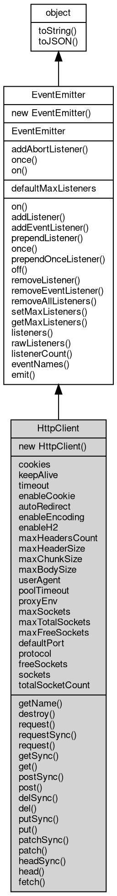

# Object HttpClient
The HttpClient class provides an independent HTTP/HTTPS client: its own connection pool, cookie jar, defaults and optional TLS identity

HttpClient is the [object](object.md) behind every client function of the [http](../../module/ifs/http.md) [module](../../module/ifs/module.md). It owns a pool of
keep-alive connections, a cookie jar and the settings (`keepAlive`, `timeout`, `autoRedirect`,
`enableEncoding`, `enableH2`, `userAgent`, the size limits and the proxy environment) used for
its requests. The [module](../../module/ifs/module.md)-level functions (`http.getSync`, `http.request`, ...) share one hidden
client configured by the [module](../../module/ifs/module.md) properties; create an HttpClient when you need different
settings, an isolated cookie jar, a client certificate or simply a separate connection pool.

Obtained from:
- `new [http.Client](../../module/ifs/http.md#Client)(options)` — the class is exported as `[http.Client](../../module/ifs/http.md#Client)`; `http.Agent` is the
  same [object](object.md), provided for Node.js compatibility;
- `new [http.Client](../../module/ifs/http.md#Client)(secureContext)` — creates the client directly from a tls.SecureContext;
- `new [http.Client](../../module/ifs/http.md#Client)({ ...[tls](../../module/ifs/tls.md) options, keepAlive, timeout, ... })` — the TLS options build the
  secure context and the remaining properties set the client defaults.

Concepts:

- **Connection pool**: an HttpClient pools finished keep-alive connections in one idle list and
  reuses them for later requests to the same host. `poolTimeout` (default 10000 ms) expires an
  idle connection and `maxFreeSockets` (default 256) caps the number of idle connections kept
  by the client as a whole, not per host as in Node.js. `maxSockets` and `maxTotalSockets` are
  accepted for Node.js compatibility but are not enforced. `freeSockets`, `sockets` and
  `totalSocketCount` are compatibility accessors: fibjs returns an empty [object](object.md) or 0 instead of
  exposing the pool contents, and `destroy()` releases the pooled connections.
- **Cookies**: the client keeps its own cookie jar (`cookies`). With `enableCookie` enabled
  (the default) the Set-Cookie headers of every response are stored and matching cookies are
  sent with later requests; two clients never share cookies.
- **Redirects**: with `autoRedirect` enabled (the default) 301, 302, 303, 307 and 308 responses
  are followed; 303 switches to GET and drops the body. There is no redirect count limit, but a
  URL seen twice in one chain raises a cyclic redirect error; `redirect: 'manual'` on fetch
  returns the redirect response instead.
- **Timeouts and cancellation**: `timeout` (default 0, no timeout) is the maximum time of one
  request in milliseconds and a per-request `timeout` option overrides it. An `AbortSignal`
  passed with the request cancels it and fails it with an AbortError, or a TimeoutError when it
  comes from [AbortSignal.timeout](AbortSignal.md#timeout).
- **TLS and proxy**: the constructor options are passed to [tls.createSecureContext](../../module/ifs/tls.md#createSecureContext) (for example
  `ca`, `cert`, `key`, `passphrase`, `ciphers`, `secureProtocol` and `rejectUnauthorized`), so
  an HTTPS client can trust a private CA or present a client certificate. `proxyEnv` routes
  HTTP/HTTPS requests through a proxy; connections to localhost, 127.0.0.1 and ::1 always
  bypass it.
- **HTTP/2**: with `enableH2` enabled (the default) HTTPS connections negotiate HTTP/2 through
  ALPN. HTTP/2 sessions are cached [process](../../module/ifs/process.md)-wide by origin, proxy, SNI and TLS identity, so
  clients with the same identity share them; `destroy()` clears that cache for every client.
- **Node.js differences**: Node.js splits this role between `Agent` and `globalAgent` and has no
  cookie jar, no automatic decompression and no automatic redirects; fibjs has `getName`
  returning `protocol//host:port[:localAddress]` (Node returns `host:port:localAddress`), and
  `defaultPort`/`protocol` only affect `getName()`.

Example 1 — a client with its own defaults:

```JavaScript
const http = require('http');

const client = new http.Client({
    timeout: 2000,
    userAgent: 'my-app/1.0'
});

const server = new http.Server(0, (req) => {
    req.response.write(req.firstHeader('user-agent'));
});
server.start();
const port = server.socket.localPort;

const resp = client.getSync('http://127.0.0.1:' + port + '/');
console.log(resp.text()); // my-app/1.0

client.destroy();
server.stop();
```

Example 2 — cookie jar and connection reuse in one client:

```JavaScript
const http = require('http');

const server = new http.Server(0, (req) => {
    req.response.appendHeader('Set-Cookie', 'sid=42; path=/');
    req.response.write(req.firstHeader('cookie') || 'no cookie');
});
server.start();
const port = server.socket.localPort;
const url = 'http://127.0.0.1:' + port + '/';

const client = new http.Client();
console.log(client.getSync(url).text()); // no cookie
console.log(client.getSync(url).text()); // sid=42

client.destroy();
server.stop();
```

Example 3 — disable redirects and inspect the response:

```JavaScript
const http = require('http');

const server = new http.Server(0, (req) => {
    if (req.address === '/old') {
        req.response.redirect('/new');
    } else {
        req.response.write('target');
    }
});
server.start();
const port = server.socket.localPort;
const url = 'http://127.0.0.1:' + port;

const client = new http.Client({
    autoRedirect: false
});
const resp = client.getSync(url + '/old');
console.log(resp.statusCode, resp.firstHeader('location')); // 302 /new
console.log(client.getSync(url + '/new').text()); // target

client.destroy();
server.stop();
```

Example 4 — timeout and per-request override:

```JavaScript
const http = require('http');
const coroutine = require('coroutine');

const server = new http.Server(0, (req) => {
    if (req.address === '/slow') {
        coroutine.sleep(500);
    }
    req.response.write('done');
});
server.start();
const port = server.socket.localPort;
const url = 'http://127.0.0.1:' + port;

const client = new http.Client({
    timeout: 100
});
try {
    client.getSync(url + '/slow');
} catch (e) {
    console.log('timed out', e.number); // timed out 20021
}
// the per-request option overrides the client timeout
console.log(client.getSync(url + '/slow', {
    timeout: 1000
}).text()); // done

client.destroy();
server.stop();
```

## Inheritance

```dot
digraph {
    node [fontname="Helvetica,sans-Serif", fontsize=10, shape="record", style="filled", fillcolor="white"];

    object [tooltip="object", URL="object.md", label="{object|toString()\ltoJSON()\l}"];
    EventEmitter [tooltip="EventEmitter", URL="EventEmitter.md", label="{EventEmitter|new EventEmitter()\l|EventEmitter\l|addAbortListener()\lonce()\lon()\l|defaultMaxListeners\l|on()\laddListener()\laddEventListener()\lprependListener()\lonce()\lprependOnceListener()\loff()\lremoveListener()\lremoveEventListener()\lremoveAllListeners()\lsetMaxListeners()\lgetMaxListeners()\llisteners()\lrawListeners()\llistenerCount()\leventNames()\lemit()\l}"];
    HttpClient [tooltip="HttpClient", fillcolor="lightgray", id="me", label="{HttpClient|new HttpClient()\l|cookies\lkeepAlive\ltimeout\lenableCookie\lautoRedirect\lenableEncoding\lenableH2\lmaxHeadersCount\lmaxHeaderSize\lmaxChunkSize\lmaxBodySize\luserAgent\lpoolTimeout\lproxyEnv\lmaxSockets\lmaxTotalSockets\lmaxFreeSockets\ldefaultPort\lprotocol\lfreeSockets\lsockets\ltotalSocketCount\l|getName()\ldestroy()\lrequest()\lrequestSync()\lrequest()\lgetSync()\lget()\lpostSync()\lpost()\ldelSync()\ldel()\lputSync()\lput()\lpatchSync()\lpatch()\lheadSync()\lhead()\lfetch()\l}"];

    object -> EventEmitter [dir=back];
    EventEmitter -> HttpClient [dir=back];
}
```

## Constructors
        
### HttpClient
**HttpClient constructor, creates a new HttpClient [object](object.md)**

```JavaScript
new HttpClient();
```

The default options are keepAlive true, timeout 0, enableCookie/autoRedirect/enableEncoding/
enableH2 true, maxHeadersCount 128, maxHeaderSize 8192, maxChunkSize 2, maxBodySize -1,
poolTimeout 10000, maxFreeSockets 256, userAgent 'curl/8.14.1' and an empty proxyEnv.

--------------------------
**HttpClient constructor, creates a new HttpClient [object](object.md)**

```JavaScript
new HttpClient(SecureContext | Object options);
```

Parameters:
* options: [SecureContext](SecureContext.md) | Object, the secure context or the options used to create one

options may be the options [object](object.md) used to create the secure context (the same [object](object.md)
[tls.createSecureContext](../../module/ifs/tls.md#createSecureContext) accepts: `ca`, `cert`, `key`, `passphrase`, `ciphers`,
`secureProtocol`, `rejectUnauthorized`, ...), or the [SecureContext](SecureContext.md) [object](object.md) itself.

In addition to the properties used to create a [SecureContext](SecureContext.md), options also accepts the
client properties listed below; each one has the same meaning and default as the instance
property of the same name:
- keepAlive: specifies whether to keep the connection alive (default true)
- timeout: specifies the request timeout in milliseconds (default 0, no timeout)
- enableCookie: specifies whether to enable the cookie feature (default true)
- autoRedirect: specifies whether to enable the automatic redirect feature (default true)
- enableEncoding: specifies whether to enable the automatic decompression feature (default true)
- enableH2: specifies whether to enable HTTP/2 automatic upgrade (default true)
- maxHeadersCount: specifies the maximum number of request headers (default 128)
- maxHeaderSize: specifies the maximum request header size in bytes (default 8192)
- maxChunkSize: specifies the maximum chunk size in MB (default 2)
- maxBodySize: specifies the maximum body size in MB (default -1, no limit)
- userAgent: specifies the browser identifier (default 'curl/8.14.1')
- poolTimeout: specifies the keep-alive cached connection timeout in ms (default 10000)
- maxFreeSockets: specifies the maximum number of idle connections (default 256)
- proxyEnv: specifies the proxy configuration environment variables, including HTTP_PROXY, HTTPS_PROXY, NO_PROXY and their lowercase forms

Example — a client that trusts a private CA and identifies itself:

```JavaScript
// fragment: options
new http.Client({
    ca: fs.readFileSync('ca.pem'),
    cert: fs.readFileSync('client.pem'),
    key: fs.readFileSync('client-key.pem'),
    rejectUnauthorized: true,
    timeout: 5000,
    userAgent: 'my-service/1.0'
})
```

## Static Methods
        
### addAbortListener
**Registers a one-shot abort handler on an [AbortSignal](AbortSignal.md)**

```JavaScript
static Object HttpClient.addAbortListener(EventEmitter signal,
    Function(Object ev) func);
```

Parameters:
* signal: [EventEmitter](EventEmitter.md), the [AbortSignal](AbortSignal.md) [object](object.md) to listen to
* func: Function(Object ev), the handler for the abort event

Returns:
* Object, returns a Disposable [object](object.md) containing a `[Symbol.dispose]` method

The handler is called at most once when the signal is aborted, and it is removed from the
signal afterwards. If the signal is already aborted the handler is invoked synchronously.
The returned [object](object.md) has a `[Symbol.dispose]()` method that removes the handler, so it can be
released before the abort happens.

Example — abort handling with automatic cleanup:

```JavaScript
const events = require('events');

const controller = new AbortController();
const disposable = events.addAbortListener(controller.signal,
    () => console.log('aborted'));

controller.abort(); // aborted
disposable[Symbol.dispose](); // safe to call after the listener fired
console.log(controller.signal.listenerCount('abort')); // 0
```

--------------------------
### once
**Creates a Promise resolved by the next occurrence of an event**

```JavaScript
static Object HttpClient.once(EventEmitter emitter,
    Value ev,
    Object options = {});
```

Parameters:
* emitter: [EventEmitter](EventEmitter.md), the event emitter [object](object.md) to listen to
* ev: Value, the event name to listen for
* options: Object, optional parameter [object](object.md)

Returns:
* Object, returns a Promise that resolves with the array of event parameters

The Promise resolves with the array of the emit arguments when the event fires; it rejects
when `error` is emitted while waiting, unless the waited event is `error` itself, or when
the signal option aborts. The temporary listeners are removed when the Promise settles.

options supports the following option:

```JavaScript
// fragment: options
({
    "signal": null // AbortSignal; aborting rejects the Promise with an AbortError
});
```

Example — awaiting the next occurrence of an event:

```JavaScript
const EventEmitter = require('events');

(async () => {
    const emitter = new EventEmitter();
    const waiting = EventEmitter.once(emitter, 'ready');

    emitter.emit('ready', 200, 'ok');
    console.log(JSON.stringify(await waiting)); // [200,"ok"]
})();
```

--------------------------
### on
**Creates an async iterator that yields event occurrences**

```JavaScript
static Object HttpClient.on(EventEmitter emitter,
    Value ev,
    Object options = {});
```

Parameters:
* emitter: [EventEmitter](EventEmitter.md), the event emitter [object](object.md) to listen to
* ev: Value, the event name to listen for
* options: Object, optional parameter [object](object.md)

Returns:
* Object, returns an AsyncIterator [object](object.md)

Each next() resolves with `{ value: [args...], done: false }` when the event fires and with
`{ done: true }` after an event named in the `close` option fires or the signal aborts; an
`error` event rejects the pending call. The listeners are registered when the iterator is
created and removed when the iteration ends or the signal aborts.

options supports the following options:

```JavaScript
// fragment: options
({
    "signal": null, // AbortSignal; aborting rejects pending and future next() calls
    "close": [] // event names; the first one to fire ends the iteration
});
```

Example — iterating the occurrences of an event:

```JavaScript
const EventEmitter = require('events');

(async () => {
    const emitter = new EventEmitter();
    const iterator = EventEmitter.on(emitter, 'data', {
        close: ['end']
    });

    emitter.emit('data', 1);
    emitter.emit('data', 2);
    emitter.emit('end');

    for await (const args of iterator)
    console.log(JSON.stringify(args)); // [1] then [2]
})();
```

## Static Properties
        
### defaultMaxListeners
**Integer, The [process](../../module/ifs/process.md)-wide default listener limit reported by getMaxListeners()**

```JavaScript
static Integer HttpClient.defaultMaxListeners;
```

Defaults to 10. Assigning a value changes getMaxListeners() for every emitter that never
called setMaxListeners(); an emitter with an explicit limit keeps it. The limit is
informational: fibjs never warns when the number of listeners exceeds it.

## Properties
        
### cookies
**[HttpCookie](HttpCookie.md), Returns the [HttpCookie](HttpCookie.md) [object](object.md) list of the [http](../../module/ifs/http.md) client**

```JavaScript
readonly HttpCookie HttpClient.cookies;
```

The jar of this client only: cookies collected from its responses are sent back on later
requests to matching domains and paths. Two clients never share cookies; entries are updated
in place when the same cookie is set again.

--------------------------
### keepAlive
**Boolean, Queries and sets whether this client keeps connections alive**

```JavaScript
Boolean HttpClient.keepAlive;
```

Default true: a finished connection is kept in the client pool and reused for later requests
to the same host until `poolTimeout` expires. Set to false to open one connection per
request. A per-request `keepAlive` option overrides this setting.

--------------------------
### timeout
**Integer, Queries and sets the timeout in milliseconds**

```JavaScript
Integer HttpClient.timeout;
```

Default 0, which means no timeout. The timeout covers a whole request; when it expires the
request fails with error number 20021. A per-request `timeout` option overrides it, and
`poolTimeout` separately controls idle pooled connections.

--------------------------
### enableCookie
**Boolean, Cookie feature switch, enabled by default**

```JavaScript
Boolean HttpClient.enableCookie;
```

When enabled, the Set-Cookie headers of responses are stored in `cookies` and matching
cookies are sent with later requests. Set to false to ignore cookies completely.

--------------------------
### autoRedirect
**Boolean, Automatic redirect feature switch, enabled by default**

```JavaScript
Boolean HttpClient.autoRedirect;
```

When enabled, 301, 302, 303, 307 and 308 responses are followed automatically; 303 switches
the request to GET and drops the body. There is no redirect count limit, but a URL visited
twice raises a cyclic redirect error. When disabled, the redirect response itself is
returned. Node.js never follows redirects automatically.

--------------------------
### enableEncoding
**Boolean, Automatic decompression feature switch, enabled by default**

```JavaScript
Boolean HttpClient.enableEncoding;
```

When enabled, requests send `Accept-Encoding: gzip, deflate` and responses compressed with
gzip or deflate are decompressed transparently, removing the Content-Encoding and
Content-Length headers. When disabled, the raw compressed bytes are returned.

--------------------------
### enableH2
**Boolean, HTTP/2 automatic upgrade switch, enabled by default**

```JavaScript
Boolean HttpClient.enableH2;
```

When enabled, an HTTPS request negotiates the protocol through ALPN and uses HTTP/2 when
the server supports it; the switch has no effect on plain HTTP requests. HTTP/2 sessions
are cached [process](../../module/ifs/process.md)-wide and shared by origin, proxy, SNI and TLS identity; `destroy()`
clears the cache. Set to false to use HTTP/1.1 only.

--------------------------
### maxHeadersCount
**Integer, Queries and sets the maximum number of request headers, default 128**

```JavaScript
Integer HttpClient.maxHeadersCount;
```

Applies to the messages parsed and generated by this client; a message can override it
through its own `maxHeadersCount` property. Node.js defaults to 1000.

--------------------------
### maxHeaderSize
**Integer, Queries and sets the maximum request header size in bytes, default 8192**

```JavaScript
Integer HttpClient.maxHeaderSize;
```

A response whose headers exceed the limit is rejected. Node.js defaults to 16384 bytes.

--------------------------
### maxChunkSize
**Integer, Queries and sets the maximum chunk size in MB, default 2**

```JavaScript
Integer HttpClient.maxChunkSize;
```

Limits one chunk of a chunked request or response body; a chunk larger than the limit is
rejected. Not a Node.js option.

--------------------------
### maxBodySize
**Integer, Queries and sets the maximum body size in MB, default -1, no size limit**

```JavaScript
Integer HttpClient.maxBodySize;
```

A response whose body exceeds the limit fails with error number 20024; 0 rejects every
body. A HEAD response is exempt because it has no body. Not a Node.js option.

--------------------------
### userAgent
**String, Queries and sets the browser identifier in [http](../../module/ifs/http.md) requests**

```JavaScript
String HttpClient.userAgent;
```

Default 'curl/8.14.1'. Sent as the User-Agent header when the request does not set one;
assign an empty string to omit the header. Node.js sends no User-Agent by default.

--------------------------
### poolTimeout
**Integer, Queries and sets the keep-alive cached connection timeout, default 10000 ms**

```JavaScript
Integer HttpClient.poolTimeout;
```

An idle pooled connection older than this is closed when the client looks for a free
connection or stores one. Setting it to 0 disables connection reuse.

--------------------------
### proxyEnv
**Object, Queries and sets the proxy configuration environment variables, supports HTTP_PROXY, HTTPS_PROXY, NO_PROXY and their lowercase forms**

```JavaScript
Object HttpClient.proxyEnv;
```

Default is an empty [object](object.md), which means no proxy. Assigning an [object](object.md) routes HTTP/HTTPS
requests through the given proxy (`http_proxy`/`HTTP_PROXY` and `https_proxy`/`HTTPS_PROXY`),
with `no_proxy`/`NO_PROXY` listing hosts that must connect directly. Connections to
localhost, 127.0.0.1 and ::1 always bypass the proxy. Equivalent to the proxyEnv constructor
option; see the [module](../../module/ifs/module.md) `setGlobalProxyFromEnv` for the matching env parser.

--------------------------
### maxSockets
**Integer, Queries and sets the maximum number of connections per host, default unlimited**

```JavaScript
Integer HttpClient.maxSockets;
```

Accepted and stored for Node.js compatibility, but fibjs does not enforce it: concurrent
requests are not queued when the limit is reached. Node.js queues the excess requests.

--------------------------
### maxTotalSockets
**Integer, Queries and sets the maximum total number of connections, default unlimited**

```JavaScript
Integer HttpClient.maxTotalSockets;
```

Accepted and stored for Node.js compatibility, but fibjs does not enforce it; only the
number of idle pooled connections (`maxFreeSockets`) is limited.

--------------------------
### maxFreeSockets
**Integer, Queries and sets the maximum number of idle connections, default 256**

```JavaScript
Integer HttpClient.maxFreeSockets;
```

This client keeps one idle list for all hosts and drops the oldest entries beyond this
number; Node.js applies maxFreeSockets per host instead. Ignored when `keepAlive` is false.

--------------------------
### defaultPort
**Integer, Queries and sets the default port used by getName(), default 80**

```JavaScript
Integer HttpClient.defaultPort;
```

Only used when building the connection pool key in getName(); it does not change the port
of requests, which always comes from their URL.

--------------------------
### protocol
**String, Queries and sets the default protocol used by getName(), default "[http](../../module/ifs/http.md):"**

```JavaScript
String HttpClient.protocol;
```

Only used when building the connection pool key in getName(); it does not change the
protocol of requests, which always comes from their URL.

--------------------------
### freeSockets
**Object, Returns the map of idle connections keyed by host:port**

```JavaScript
readonly Object HttpClient.freeSockets;
```

Node.js compatibility accessor: fibjs always returns an empty [object](object.md) because the internal
pool is not exposed. Use `destroy()` to release the real pooled connections.

--------------------------
### sockets
**Object, Returns the map of connections in use keyed by host:port**

```JavaScript
readonly Object HttpClient.sockets;
```

Node.js compatibility accessor: fibjs always returns an empty [object](object.md) because the internal
pool is not exposed.

--------------------------
### totalSocketCount
**Integer, Returns the total number of connections in use across all hosts**

```JavaScript
readonly Integer HttpClient.totalSocketCount;
```

Node.js compatibility accessor: fibjs always returns 0 because the internal pool is not
exposed.

## Methods
        
### getName
**Returns a unique key for the given request options, used for the connection pool**

```JavaScript
String HttpClient.getName(Object options = {});
```

Parameters:
* options: Object, request options

Returns:
* String, returns the connection pool key string

Reads `host` (default empty), `port` (default `defaultPort`) and `localAddress` from options
and returns `protocol//host:port`, with `:localAddress` appended when one is given; the
default result is therefore `http://:80`. This differs from Node.js, which returns
`host:port:localAddress` without the protocol.

Example — the pool key of a host:

```JavaScript
const http = require('http');
const client = new http.Client({
    protocol: 'https:',
    defaultPort: 443
});
console.log(client.getName({
    host: 'example.com',
    port: 8443
})); // https://example.com:8443
```

--------------------------
### destroy
**Destroys all connections currently in use**

```JavaScript
HttpClient.destroy();
```

Clears the idle connection pool of this client and destroys every cached HTTP/2 session;
the HTTP/2 cache is [process](../../module/ifs/process.md)-wide, so this also ends sessions being used by other clients.
Call it when the client is no longer needed to release the sockets immediately.

--------------------------
### request
**Sends an [HttpRequest](HttpRequest.md) over an existing stream and returns it with the response**

```JavaScript
HttpRequest HttpClient.request(Stream conn,
    HttpRequest req);
```

Parameters:
* conn: [Stream](Stream.md), the stream [object](object.md) to [process](../../module/ifs/process.md) the request
* req: [HttpRequest](HttpRequest.md), the [HttpRequest](HttpRequest.md) [object](object.md) to send

Returns:
* [HttpRequest](HttpRequest.md), returns req, whose response property receives the server response

This low-level form writes `req` to `conn` — any connected [Stream](Stream.md) such as a [net.Socket](../../module/ifs/net.md#Socket) or a
[TLSSocket](TLSSocket.md) — instead of creating a connection from a URL; it blocks until the response is
received and returns the same [HttpRequest](HttpRequest.md) [object](object.md) whose `response` property holds the reply.
The request is sent with this client's settings, cookie jar and proxy configuration.

The option-based overloads below are the usual entry points:
- `request(opts)`, `request([url](../../module/ifs/url.md), opts)` and `request(method, [url](../../module/ifs/url.md), opts)` return an [HttpRequest](HttpRequest.md)
  without sending it; `end()` sends it and the response arrives through the callback or the
  `'response'` event;
- the forms taking a callback register it before returning the request.

opts supports the following fields:

```JavaScript
// fragment: options
({
    method: 'GET', // request method, used by the opts-only form
    protocol: 'http', // URL override fields: protocol/host/hostname/port/pathname/path/query/auth
    hostname: '',
    port: 80,
    pathname: '/',
    query: {},
    headers: {}, // Headers object or plain object, added to the generated headers
    body: null, // SeekableStream | Buffer | String | Object | FormData | URLSearchParams | Blob
    json: null, // encoded as JSON, Content-Type: application/json
    pack: null, // encoded as msgpack, Content-Type: application/msgpack
    keepAlive: undefined, // overrides the client keepAlive for this request
    timeout: undefined, // request timeout in ms, overrides the client timeout
    signal: null, // AbortSignal used to cancel the request
    agent: null // HttpClient that sends this request instead of this one
})
```

body, [json](../../module/ifs/json.md) and pack are mutually exclusive; `query` replaces the query string of the URL
instead of merging with it. A string body is sent as application/x-www-form-urlencoded, a
[Buffer](Buffer.md) as application/octet-stream, a plain [object](object.md) or [FormData](FormData.md) as multipart/form-data with a
generated boundary, and [URLSearchParams](URLSearchParams.md) as application/x-www-form-urlencoded.

Example — an event-style request through this client:

```JavaScript
const http = require('http');
const coroutine = require('coroutine');

const server = new http.Server(0, (req) => {
    req.response.write('received: ' + (req.body ? req.body.readAll().toString() : ''));
});
server.start();
const port = server.socket.localPort;

const client = new http.Client();
const done = new coroutine.Event();
const req = client.request('POST', 'http://127.0.0.1:' + port + '/echo', (resp) => {
    console.log(resp.text()); // received: hello
    done.set();
});
req.end('hello'); // request() does not send before end()
done.wait();

client.destroy();
server.stop();
```

--------------------------
**Requests the [url](../../module/ifs/url.md) specified by opts and returns an [HttpRequest](HttpRequest.md) [object](object.md)**

```JavaScript
HttpRequest HttpClient.request(Object opts);
```

Parameters:
* opts: Object, the additional information

Returns:
* [HttpRequest](HttpRequest.md), returns an [HttpRequest](HttpRequest.md) [object](object.md) (listen to the 'response' event to receive the response)

The returned request is not sent: call `end()` to send it. The response arrives through the
callback given here or registered later, or through the `'response'` event; it is also
stored in the `response` property. All opts fields are documented on request([Stream](Stream.md),
[HttpRequest](HttpRequest.md)), the first request overload; unlike `get`, this function does not send
automatically.

--------------------------
**Requests the [url](../../module/ifs/url.md) specified by opts, registers a callback to receive the response, and returns an [HttpRequest](HttpRequest.md) [object](object.md)**

```JavaScript
HttpRequest HttpClient.request(Object opts,
    Function(HttpResponse resp) callback);
```

Parameters:
* opts: Object, the additional information
* callback: Function([HttpResponse](HttpResponse.md) resp), response callback function, receives [HttpResponse](HttpResponse.md) as a parameter

Returns:
* [HttpRequest](HttpRequest.md), returns an [HttpRequest](HttpRequest.md) [object](object.md)

The callback is called with the [HttpResponse](HttpResponse.md) when the response arrives. The returned request
must still be sent with `end()`; the request uses this client's settings and cookie jar.

--------------------------
**Requests the specified [url](../../module/ifs/url.md), registers a callback to receive the response, and returns an [HttpRequest](HttpRequest.md) [object](object.md)**

```JavaScript
HttpRequest HttpClient.request(String url,
    Function(HttpResponse resp) callback);
```

Parameters:
* url: String, the [url](../../module/ifs/url.md) to request; must be a complete [url](../../module/ifs/url.md) including the host
* callback: Function([HttpResponse](HttpResponse.md) resp), response callback function, receives [HttpResponse](HttpResponse.md) as a parameter

Returns:
* [HttpRequest](HttpRequest.md), returns an [HttpRequest](HttpRequest.md) [object](object.md)

The method defaults to GET. The returned request must still be sent with `end()`; the
callback receives the [HttpResponse](HttpResponse.md) when the response arrives.

--------------------------
**Requests the specified [url](../../module/ifs/url.md) and returns an [HttpRequest](HttpRequest.md) [object](object.md)**

```JavaScript
HttpRequest HttpClient.request(String url,
    Object opts = {});
```

Parameters:
* url: String, the [url](../../module/ifs/url.md) to request; must be a complete [url](../../module/ifs/url.md) including the host
* opts: Object, the additional information

Returns:
* [HttpRequest](HttpRequest.md), returns an [HttpRequest](HttpRequest.md) [object](object.md) (listen to the 'response' event to receive the response)

The returned request is not sent: call `end()` to send it; the response is delivered to the
callback (when given), to the `'response'` event and to the `response` property. This form
is the async counterpart of requestSync([url](../../module/ifs/url.md), opts) on this client; use `get([url](../../module/ifs/url.md), opts)` when
the method is GET and the request should be sent automatically.

--------------------------
**Requests the specified [url](../../module/ifs/url.md), registers a callback to receive the response, and returns an [HttpRequest](HttpRequest.md) [object](object.md)**

```JavaScript
HttpRequest HttpClient.request(String url,
    Object opts,
    Function(HttpResponse resp) callback);
```

Parameters:
* url: String, the [url](../../module/ifs/url.md) to request; must be a complete [url](../../module/ifs/url.md) including the host
* opts: Object, the additional information
* callback: Function([HttpResponse](HttpResponse.md) resp), response callback function, receives [HttpResponse](HttpResponse.md) as a parameter

Returns:
* [HttpRequest](HttpRequest.md), returns an [HttpRequest](HttpRequest.md) [object](object.md)

The method defaults to GET and the returned request must still be sent with `end()`; the
callback is called with the [HttpResponse](HttpResponse.md). See the first request overload for the opts fields.

--------------------------
**Requests the specified [url](../../module/ifs/url.md), registers a callback to receive the response, and returns an [HttpRequest](HttpRequest.md) [object](object.md)**

```JavaScript
HttpRequest HttpClient.request(String method,
    String url,
    Function(HttpResponse resp) callback);
```

Parameters:
* method: String, the [http](../../module/ifs/http.md) request method: GET, POST, etc.
* url: String, the [url](../../module/ifs/url.md) to request; must be a complete [url](../../module/ifs/url.md) including the host
* callback: Function([HttpResponse](HttpResponse.md) resp), response callback function, receives [HttpResponse](HttpResponse.md) as a parameter

Returns:
* [HttpRequest](HttpRequest.md), returns an [HttpRequest](HttpRequest.md) [object](object.md)

The returned request must still be sent with `end()`; the callback is called with the
[HttpResponse](HttpResponse.md) when it arrives.

--------------------------
**Requests the specified [url](../../module/ifs/url.md), registers a callback to receive the response, and returns an [HttpRequest](HttpRequest.md) [object](object.md)**

```JavaScript
HttpRequest HttpClient.request(String method,
    String url,
    Object opts = {});
```

Parameters:
* method: String, the [http](../../module/ifs/http.md) request method: GET, POST, etc.
* url: String, the [url](../../module/ifs/url.md) to request; must be a complete [url](../../module/ifs/url.md) including the host
* opts: Object, the additional information

Returns:
* [HttpRequest](HttpRequest.md), returns an [HttpRequest](HttpRequest.md) [object](object.md) (listen to the 'response' event to receive the response)

The general option form of the request family on this client; the returned request must
still be sent with `end()`. See the first request overload for the opts fields.

--------------------------
**Requests the specified [url](../../module/ifs/url.md), registers a callback to receive the response, and returns an [HttpRequest](HttpRequest.md) [object](object.md)**

```JavaScript
HttpRequest HttpClient.request(String method,
    String url,
    Object opts,
    Function(HttpResponse resp) callback);
```

Parameters:
* method: String, the [http](../../module/ifs/http.md) request method: GET, POST, etc.
* url: String, the [url](../../module/ifs/url.md) to request; must be a complete [url](../../module/ifs/url.md) including the host
* opts: Object, the additional information
* callback: Function([HttpResponse](HttpResponse.md) resp), response callback function, receives [HttpResponse](HttpResponse.md) as a parameter

Returns:
* [HttpRequest](HttpRequest.md), returns an [HttpRequest](HttpRequest.md) [object](object.md)

The returned request must still be sent with `end()`; the callback is called with the
[HttpResponse](HttpResponse.md). See the first request overload for the opts fields.

--------------------------
### requestSync
**Requests the [url](../../module/ifs/url.md) specified by opts and returns the result**

```JavaScript
HttpResponse HttpClient.requestSync(Object opts) async;
```

Parameters:
* opts: Object, the additional information

Returns:
* [HttpResponse](HttpResponse.md), returns the server response

The request is sent through this client and blocks the current fiber until the response is
received; the returned [HttpResponse](HttpResponse.md) has its body ready to read. The request uses this
client's defaults, cookie jar and proxy configuration, and all URL fields can be given in
opts instead of a [url](../../module/ifs/url.md) argument.

opts supports the following fields:

```JavaScript
// fragment: options
({
    method: 'GET', // request method, used by the opts-only form
    protocol: 'http', // URL override fields: protocol/host/hostname/port/pathname/path/query/auth
    hostname: '',
    port: 80,
    pathname: '/',
    query: {},
    headers: {}, // Headers object or plain object, added to the generated headers
    body: null, // SeekableStream | Buffer | String | Object | FormData | URLSearchParams | Blob
    json: null, // encoded as JSON, Content-Type: application/json
    pack: null, // encoded as msgpack, Content-Type: application/msgpack
    keepAlive: undefined, // overrides the client keepAlive for this request
    timeout: undefined, // request timeout in ms, overrides the client timeout
    signal: null, // AbortSignal used to cancel the request
    agent: null // HttpClient that sends this request instead of this one
})
```

body, [json](../../module/ifs/json.md) and pack are mutually exclusive; `query` replaces the query string of the URL
instead of merging with it. Without body/[json](../../module/ifs/json.md)/pack the request carries no body.

Example — a sync request through an independent client:

```JavaScript
const http = require('http');

const server = new http.Server(0, (req) => {
    req.response.json({
        path: req.address
    });
});
server.start();
const port = server.socket.localPort;

const client = new http.Client();
const resp = client.requestSync('http://127.0.0.1:' + port + '/status');
console.log(resp.json()); // { path: '/status' }

client.destroy();
server.stop();
```

--------------------------
**Requests the specified [url](../../module/ifs/url.md) with the GET method and returns the result, equivalent to request("GET", ...)**

```JavaScript
HttpResponse HttpClient.requestSync(String url,
    Object opts = {}) async;
```

Parameters:
* url: String, the [url](../../module/ifs/url.md) to request; must be a complete [url](../../module/ifs/url.md) including the host
* opts: Object, the additional information

Returns:
* [HttpResponse](HttpResponse.md), returns the server response

Blocks the current fiber and returns the [HttpResponse](HttpResponse.md) directly. A GET request carries no
body; the opts fields documented on requestSync(opts) apply here as well, with `url`
providing protocol, host, port and [path](../../module/ifs/path.md).

--------------------------
**Requests the specified [url](../../module/ifs/url.md) and returns the result**

```JavaScript
HttpResponse HttpClient.requestSync(String method,
    String url,
    Object opts = {}) async;
```

Parameters:
* method: String, the [http](../../module/ifs/http.md) request method: GET, POST, etc.
* url: String, the [url](../../module/ifs/url.md) to request; must be a complete [url](../../module/ifs/url.md) including the host
* opts: Object, the additional information

Returns:
* [HttpResponse](HttpResponse.md), returns the server response

Blocks the current fiber and returns the [HttpResponse](HttpResponse.md) directly. method selects the request
method (default GET) and opts carries the fields documented on requestSync(opts).

--------------------------
### getSync
**Requests the specified [url](../../module/ifs/url.md) with the GET method and returns the result, equivalent to request("GET", ...)**

```JavaScript
HttpResponse HttpClient.getSync(String url,
    Object opts = {}) async;
```

Parameters:
* url: String, the [url](../../module/ifs/url.md) to request; must be a complete [url](../../module/ifs/url.md) including the host
* opts: Object, the additional information

Returns:
* [HttpResponse](HttpResponse.md), returns the server response

Blocks the current fiber and returns the [HttpResponse](HttpResponse.md) directly. A GET request carries no
body, so body/[json](../../module/ifs/json.md)/pack are not accepted; the other opts fields of requestSync(opts) apply.

--------------------------
### get
**Requests the specified [url](../../module/ifs/url.md) with the GET method and returns an [HttpRequest](HttpRequest.md) [object](object.md)**

```JavaScript
HttpRequest HttpClient.get(String url,
    Object opts = {});
```

Parameters:
* url: String, the [url](../../module/ifs/url.md) to request; must be a complete [url](../../module/ifs/url.md) including the host
* opts: Object, the additional information

Returns:
* [HttpRequest](HttpRequest.md), returns an [HttpRequest](HttpRequest.md) [object](object.md) (listen to the 'response' event to receive the response)

The returned request is sent automatically without calling `end()`; the response is
delivered to the callback or the `'response'` event and stored in the `response` property.
A GET request carries no body; the opts fields are the same as getSync([url](../../module/ifs/url.md), opts).

--------------------------
**Requests the specified [url](../../module/ifs/url.md) with the GET method, registers a callback to receive the response, and returns an [HttpRequest](HttpRequest.md) [object](object.md)**

```JavaScript
HttpRequest HttpClient.get(String url,
    Object opts,
    Function(HttpResponse resp) callback);
```

Parameters:
* url: String, the [url](../../module/ifs/url.md) to request; must be a complete [url](../../module/ifs/url.md) including the host
* opts: Object, the additional information
* callback: Function([HttpResponse](HttpResponse.md) resp), response callback function, receives [HttpResponse](HttpResponse.md) as a parameter

Returns:
* [HttpRequest](HttpRequest.md), returns an [HttpRequest](HttpRequest.md) [object](object.md)

The request is sent automatically (no `end()` needed); the callback receives the [HttpResponse](HttpResponse.md)
when it arrives. See the get([url](../../module/ifs/url.md), opts) overload for the options.

--------------------------
**Requests the specified [url](../../module/ifs/url.md) with the GET method, registers a callback to receive the response, and returns an [HttpRequest](HttpRequest.md) [object](object.md)**

```JavaScript
HttpRequest HttpClient.get(String url,
    Function(HttpResponse resp) callback);
```

Parameters:
* url: String, the [url](../../module/ifs/url.md) to request; must be a complete [url](../../module/ifs/url.md) including the host
* callback: Function([HttpResponse](HttpResponse.md) resp), response callback function, receives [HttpResponse](HttpResponse.md) as a parameter

Returns:
* [HttpRequest](HttpRequest.md), returns an [HttpRequest](HttpRequest.md) [object](object.md)

The request is sent automatically without calling `end()`; the callback receives the
[HttpResponse](HttpResponse.md) when it arrives.

--------------------------
### postSync
**Requests the specified [url](../../module/ifs/url.md) with the POST method and returns the result, equivalent to request("POST", ...)**

```JavaScript
HttpResponse HttpClient.postSync(String url,
    Object opts = {}) async;
```

Parameters:
* url: String, the [url](../../module/ifs/url.md) to request; must be a complete [url](../../module/ifs/url.md) including the host
* opts: Object, the additional information

Returns:
* [HttpResponse](HttpResponse.md), returns the server response

Blocks the current fiber and returns the [HttpResponse](HttpResponse.md) directly. The request body is given
by body, [json](../../module/ifs/json.md) or pack; a string body is sent as application/x-www-form-urlencoded, a plain
[object](object.md) or [FormData](FormData.md) as multipart/form-data. See requestSync(opts) for the field list.

--------------------------
### post
**Requests the specified [url](../../module/ifs/url.md) with the POST method and returns an [HttpRequest](HttpRequest.md) [object](object.md)**

```JavaScript
HttpRequest HttpClient.post(String url,
    Object opts = {});
```

Parameters:
* url: String, the [url](../../module/ifs/url.md) to request; must be a complete [url](../../module/ifs/url.md) including the host
* opts: Object, the additional information

Returns:
* [HttpRequest](HttpRequest.md), returns an [HttpRequest](HttpRequest.md) [object](object.md) (listen to the 'response' event to receive the response)

The returned request is not sent: call `end(data)` or `end()` to send it (the body may also
be given by the body/[json](../../module/ifs/json.md)/pack options); the response is delivered to the callback or the
`'response'` event. See the first request overload for the opts fields.

--------------------------
**Requests the specified [url](../../module/ifs/url.md) with the POST method, registers a callback to receive the response, and returns an [HttpRequest](HttpRequest.md) [object](object.md)**

```JavaScript
HttpRequest HttpClient.post(String url,
    Object opts,
    Function(HttpResponse resp) callback);
```

Parameters:
* url: String, the [url](../../module/ifs/url.md) to request; must be a complete [url](../../module/ifs/url.md) including the host
* opts: Object, the additional information
* callback: Function([HttpResponse](HttpResponse.md) resp), response callback function, receives [HttpResponse](HttpResponse.md) as a parameter

Returns:
* [HttpRequest](HttpRequest.md), returns an [HttpRequest](HttpRequest.md) [object](object.md)

The returned request must still be sent with `end()`; the callback receives the [HttpResponse](HttpResponse.md).
The body may be passed to `end(data)` or given by the body/[json](../../module/ifs/json.md)/pack options.

--------------------------
**Requests the specified [url](../../module/ifs/url.md) with the POST method, registers a callback to receive the response, and returns an [HttpRequest](HttpRequest.md) [object](object.md)**

```JavaScript
HttpRequest HttpClient.post(String url,
    Function(HttpResponse resp) callback);
```

Parameters:
* url: String, the [url](../../module/ifs/url.md) to request; must be a complete [url](../../module/ifs/url.md) including the host
* callback: Function([HttpResponse](HttpResponse.md) resp), response callback function, receives [HttpResponse](HttpResponse.md) as a parameter

Returns:
* [HttpRequest](HttpRequest.md), returns an [HttpRequest](HttpRequest.md) [object](object.md)

The returned request must still be sent with `end()`; the callback receives the [HttpResponse](HttpResponse.md)
when it arrives.

--------------------------
### delSync
**Requests the specified [url](../../module/ifs/url.md) with the DELETE method and returns the result, equivalent to request("DELETE", ...)**

```JavaScript
HttpResponse HttpClient.delSync(String url,
    Object opts = {}) async;
```

Parameters:
* url: String, the [url](../../module/ifs/url.md) to request; must be a complete [url](../../module/ifs/url.md) including the host
* opts: Object, the additional information

Returns:
* [HttpResponse](HttpResponse.md), returns the server response

Blocks the current fiber and returns the [HttpResponse](HttpResponse.md) directly. A DELETE request normally
has no body, but a body may be given like with postSync; the opts fields are the same as
postSync([url](../../module/ifs/url.md), opts).

--------------------------
### del
**Requests the specified [url](../../module/ifs/url.md) with the DELETE method and returns an [HttpRequest](HttpRequest.md) [object](object.md)**

```JavaScript
HttpRequest HttpClient.del(String url,
    Object opts = {});
```

Parameters:
* url: String, the [url](../../module/ifs/url.md) to request; must be a complete [url](../../module/ifs/url.md) including the host
* opts: Object, the additional information

Returns:
* [HttpRequest](HttpRequest.md), returns an [HttpRequest](HttpRequest.md) [object](object.md) (listen to the 'response' event to receive the response)

The returned request is not sent: call `end()` to send it. The opts fields are the same as
post([url](../../module/ifs/url.md), opts); see the first request overload for the field list.

--------------------------
**Requests the specified [url](../../module/ifs/url.md) with the DELETE method, registers a callback to receive the response, and returns an [HttpRequest](HttpRequest.md) [object](object.md)**

```JavaScript
HttpRequest HttpClient.del(String url,
    Object opts,
    Function(HttpResponse resp) callback);
```

Parameters:
* url: String, the [url](../../module/ifs/url.md) to request; must be a complete [url](../../module/ifs/url.md) including the host
* opts: Object, the additional information
* callback: Function([HttpResponse](HttpResponse.md) resp), response callback function, receives [HttpResponse](HttpResponse.md) as a parameter

Returns:
* [HttpRequest](HttpRequest.md), returns an [HttpRequest](HttpRequest.md) [object](object.md)

The returned request must still be sent with `end()`; the callback receives the [HttpResponse](HttpResponse.md).

--------------------------
**Requests the specified [url](../../module/ifs/url.md) with the DELETE method, registers a callback to receive the response, and returns an [HttpRequest](HttpRequest.md) [object](object.md)**

```JavaScript
HttpRequest HttpClient.del(String url,
    Function(HttpResponse resp) callback);
```

Parameters:
* url: String, the [url](../../module/ifs/url.md) to request; must be a complete [url](../../module/ifs/url.md) including the host
* callback: Function([HttpResponse](HttpResponse.md) resp), response callback function, receives [HttpResponse](HttpResponse.md) as a parameter

Returns:
* [HttpRequest](HttpRequest.md), returns an [HttpRequest](HttpRequest.md) [object](object.md)

The returned request must still be sent with `end()`; the callback receives the [HttpResponse](HttpResponse.md)
when it arrives.

--------------------------
### putSync
**Requests the specified [url](../../module/ifs/url.md) with the PUT method and returns the result, equivalent to request("PUT", ...)**

```JavaScript
HttpResponse HttpClient.putSync(String url,
    Object opts = {}) async;
```

Parameters:
* url: String, the [url](../../module/ifs/url.md) to request; must be a complete [url](../../module/ifs/url.md) including the host
* opts: Object, the additional information

Returns:
* [HttpResponse](HttpResponse.md), returns the server response

Blocks the current fiber and returns the [HttpResponse](HttpResponse.md) directly. PUT replaces the target
resource with the request body, which is given by the body/[json](../../module/ifs/json.md)/pack fields like with
postSync; see requestSync(opts) for the field list.

--------------------------
### put
**Requests the specified [url](../../module/ifs/url.md) with the PUT method and returns an [HttpRequest](HttpRequest.md) [object](object.md)**

```JavaScript
HttpRequest HttpClient.put(String url,
    Object opts = {});
```

Parameters:
* url: String, the [url](../../module/ifs/url.md) to request; must be a complete [url](../../module/ifs/url.md) including the host
* opts: Object, the additional information

Returns:
* [HttpRequest](HttpRequest.md), returns an [HttpRequest](HttpRequest.md) [object](object.md) (listen to the 'response' event to receive the response)

The returned request is not sent: call `end(data)` or `end()` to send it. The opts fields
are the same as post([url](../../module/ifs/url.md), opts).

--------------------------
**Requests the specified [url](../../module/ifs/url.md) with the PUT method, registers a callback to receive the response, and returns an [HttpRequest](HttpRequest.md) [object](object.md)**

```JavaScript
HttpRequest HttpClient.put(String url,
    Object opts,
    Function(HttpResponse resp) callback);
```

Parameters:
* url: String, the [url](../../module/ifs/url.md) to request; must be a complete [url](../../module/ifs/url.md) including the host
* opts: Object, the additional information
* callback: Function([HttpResponse](HttpResponse.md) resp), response callback function, receives [HttpResponse](HttpResponse.md) as a parameter

Returns:
* [HttpRequest](HttpRequest.md), returns an [HttpRequest](HttpRequest.md) [object](object.md)

The returned request must still be sent with `end()`; the callback receives the [HttpResponse](HttpResponse.md).

--------------------------
**Requests the specified [url](../../module/ifs/url.md) with the PUT method, registers a callback to receive the response, and returns an [HttpRequest](HttpRequest.md) [object](object.md)**

```JavaScript
HttpRequest HttpClient.put(String url,
    Function(HttpResponse resp) callback);
```

Parameters:
* url: String, the [url](../../module/ifs/url.md) to request; must be a complete [url](../../module/ifs/url.md) including the host
* callback: Function([HttpResponse](HttpResponse.md) resp), response callback function, receives [HttpResponse](HttpResponse.md) as a parameter

Returns:
* [HttpRequest](HttpRequest.md), returns an [HttpRequest](HttpRequest.md) [object](object.md)

The returned request must still be sent with `end()`; the callback receives the [HttpResponse](HttpResponse.md)
when it arrives.

--------------------------
### patchSync
**Requests the specified [url](../../module/ifs/url.md) with the PATCH method and returns the result, equivalent to request("PATCH", ...)**

```JavaScript
HttpResponse HttpClient.patchSync(String url,
    Object opts = {}) async;
```

Parameters:
* url: String, the [url](../../module/ifs/url.md) to request; must be a complete [url](../../module/ifs/url.md) including the host
* opts: Object, the additional information

Returns:
* [HttpResponse](HttpResponse.md), returns the server response

Blocks the current fiber and returns the [HttpResponse](HttpResponse.md) directly. PATCH applies a partial
update with the request body, which is given by the body/[json](../../module/ifs/json.md)/pack fields like with
postSync; see requestSync(opts) for the field list.

--------------------------
### patch
**Requests the specified [url](../../module/ifs/url.md) with the PATCH method and returns an [HttpRequest](HttpRequest.md) [object](object.md)**

```JavaScript
HttpRequest HttpClient.patch(String url,
    Object opts = {});
```

Parameters:
* url: String, the [url](../../module/ifs/url.md) to request; must be a complete [url](../../module/ifs/url.md) including the host
* opts: Object, the additional information

Returns:
* [HttpRequest](HttpRequest.md), returns an [HttpRequest](HttpRequest.md) [object](object.md) (listen to the 'response' event to receive the response)

The returned request is not sent: call `end(data)` or `end()` to send it. The opts fields
are the same as post([url](../../module/ifs/url.md), opts).

--------------------------
**Requests the specified [url](../../module/ifs/url.md) with the PATCH method, registers a callback to receive the response, and returns an [HttpRequest](HttpRequest.md) [object](object.md)**

```JavaScript
HttpRequest HttpClient.patch(String url,
    Object opts,
    Function(HttpResponse resp) callback);
```

Parameters:
* url: String, the [url](../../module/ifs/url.md) to request; must be a complete [url](../../module/ifs/url.md) including the host
* opts: Object, the additional information
* callback: Function([HttpResponse](HttpResponse.md) resp), response callback function, receives [HttpResponse](HttpResponse.md) as a parameter

Returns:
* [HttpRequest](HttpRequest.md), returns an [HttpRequest](HttpRequest.md) [object](object.md)

The returned request must still be sent with `end()`; the callback receives the [HttpResponse](HttpResponse.md).

--------------------------
**Requests the specified [url](../../module/ifs/url.md) with the PATCH method, registers a callback to receive the response, and returns an [HttpRequest](HttpRequest.md) [object](object.md)**

```JavaScript
HttpRequest HttpClient.patch(String url,
    Function(HttpResponse resp) callback);
```

Parameters:
* url: String, the [url](../../module/ifs/url.md) to request; must be a complete [url](../../module/ifs/url.md) including the host
* callback: Function([HttpResponse](HttpResponse.md) resp), response callback function, receives [HttpResponse](HttpResponse.md) as a parameter

Returns:
* [HttpRequest](HttpRequest.md), returns an [HttpRequest](HttpRequest.md) [object](object.md)

The returned request must still be sent with `end()`; the callback receives the [HttpResponse](HttpResponse.md)
when it arrives.

--------------------------
### headSync
**Requests the specified [url](../../module/ifs/url.md) with the HEAD method and returns the result, equivalent to request("HEAD", ...)**

```JavaScript
HttpResponse HttpClient.headSync(String url,
    Object opts = {}) async;
```

Parameters:
* url: String, the [url](../../module/ifs/url.md) to request; must be a complete [url](../../module/ifs/url.md) including the host
* opts: Object, the additional information

Returns:
* [HttpResponse](HttpResponse.md), returns the server response

Blocks the current fiber and returns the [HttpResponse](HttpResponse.md) directly. A HEAD response carries the
status and headers of the equivalent GET but no body, so `resp.body` is empty; unlike GET,
a HEAD response with a large Content-Length is not rejected by maxBodySize. The opts fields
are the same as getSync([url](../../module/ifs/url.md), opts).

--------------------------
### head
**Requests the specified [url](../../module/ifs/url.md) with the HEAD method and returns an [HttpRequest](HttpRequest.md) [object](object.md)**

```JavaScript
HttpRequest HttpClient.head(String url,
    Object opts = {});
```

Parameters:
* url: String, the [url](../../module/ifs/url.md) to request; must be a complete [url](../../module/ifs/url.md) including the host
* opts: Object, the additional information

Returns:
* [HttpRequest](HttpRequest.md), returns an [HttpRequest](HttpRequest.md) [object](object.md) (listen to the 'response' event to receive the response)

Like get(), the returned request is sent automatically without calling `end()`; only the
status and headers of the response are received. See the get([url](../../module/ifs/url.md), opts) overload for the
options.

--------------------------
**Requests the specified [url](../../module/ifs/url.md) with the HEAD method, registers a callback to receive the response, and returns an [HttpRequest](HttpRequest.md) [object](object.md)**

```JavaScript
HttpRequest HttpClient.head(String url,
    Object opts,
    Function(HttpResponse resp) callback);
```

Parameters:
* url: String, the [url](../../module/ifs/url.md) to request; must be a complete [url](../../module/ifs/url.md) including the host
* opts: Object, the additional information
* callback: Function([HttpResponse](HttpResponse.md) resp), response callback function, receives [HttpResponse](HttpResponse.md) as a parameter

Returns:
* [HttpRequest](HttpRequest.md), returns an [HttpRequest](HttpRequest.md) [object](object.md)

The request is sent automatically without calling `end()`; the callback receives the
[HttpResponse](HttpResponse.md) when the headers arrive.

--------------------------
**Requests the specified [url](../../module/ifs/url.md) with the HEAD method, registers a callback to receive the response, and returns an [HttpRequest](HttpRequest.md) [object](object.md)**

```JavaScript
HttpRequest HttpClient.head(String url,
    Function(HttpResponse resp) callback);
```

Parameters:
* url: String, the [url](../../module/ifs/url.md) to request; must be a complete [url](../../module/ifs/url.md) including the host
* callback: Function([HttpResponse](HttpResponse.md) resp), response callback function, receives [HttpResponse](HttpResponse.md) as a parameter

Returns:
* [HttpRequest](HttpRequest.md), returns an [HttpRequest](HttpRequest.md) [object](object.md)

The request is sent automatically without calling `end()`; the callback receives the
[HttpResponse](HttpResponse.md) when it arrives.

--------------------------
### fetch
**Sends a request using the Web Fetch standard with an [HttpRequest](HttpRequest.md) [object](object.md) as the request source and returns an [HttpResponse](HttpResponse.md) [object](object.md)**

```JavaScript
HttpResponse HttpClient.fetch(HttpRequest | String request,
    Object opts = {}) async;
```

Parameters:
* request: [HttpRequest](HttpRequest.md) | String, the request source
* opts: Object, the additional information, can override the corresponding fields in request; following the Fetch

Returns:
* [HttpResponse](HttpResponse.md), returns the server response, containing properties such as status, headers, body, ok, redirected, [url](../../module/ifs/url.md) and type

The request is sent through this client, using its settings, cookie jar and proxy
configuration. opts can override the request fields (`new Request(request, init)`
semantics); the supported contents are as follows:

```JavaScript
// fragment: options
({
    method: 'GET', // overrides the request method; the method of an HttpRequest source is kept when not given
    headers: {}, // when present it replaces the headers of the request source, like `new Request(request, init)`
    body: null, // overrides the request body; a string body is sent as text/plain;charset=UTF-8
    keepAlive: undefined, // overrides the keep-alive setting
    timeout: undefined, // request timeout in ms, uses the client default settings by default
    redirect: 'follow', // redirect mode: 'follow' (default) | 'error' | 'manual'
    signal: null, // AbortSignal object used to cancel the request
    streaming: false // whether to expose the response body as a stream instead of buffering it
})
```

Following the Fetch standard a GET or HEAD request must not carry a body (a TypeError is
thrown) and `headers` replaces the headers of the request source instead of merging them.
`redirect: 'error'` fails with a TypeError when the server redirects and `redirect: 'manual'`
returns the redirect response as it is, with `redirected` false; otherwise redirects are
followed according to `autoRedirect`. An aborted request fails with an AbortError (a
TimeoutError for [AbortSignal.timeout](AbortSignal.md#timeout)).

Example — fetch a URL through this client:

```JavaScript
const http = require('http');

const server = new http.Server(0, (req) => {
    req.response.json({
        ok: true
    });
});
server.start();
const port = server.socket.localPort;

const client = new http.Client();
const resp = client.fetch('http://127.0.0.1:' + port + '/api');
console.log(resp.status, resp.ok, resp.json()); // 200 true { ok: true }

client.destroy();
server.stop();
```

--------------------------
### on
**Appends an event handler to the emitter**

```JavaScript
Object HttpClient.on(Value ev,
    Function(...args) func);
```

Parameters:
* ev: Value, the event name to bind
* func: Function(...args), the event handler function, called with the emit arguments

Returns:
* Object, returns the event [object](object.md) itself for chaining

The listener is called with the arguments of emit() and `this` set to the emitter; the
emitter itself is returned so registrations can be chained. The same function may be
registered several times for one event and each copy is called. See the class documentation
for the dispatch order.

--------------------------
**Appends several event handlers to the emitter**

```JavaScript
Object HttpClient.on(Object map);
```

Parameters:
* map: Object, the event mapping; [object](object.md) property names are used as event names

Returns:
* Object, returns the event [object](object.md) itself for chaining

Every enumerable property of the map whose value is a function is registered under its
property name. Properties are processed in order; a value that is not a function makes the
call fail with an invalid-type error while entries processed before it stay registered.

Example — registering several handlers at once:

```JavaScript
const EventEmitter = require('events');

const emitter = new EventEmitter();
emitter.on({
    connect: () => console.log('connect'),
    close: () => console.log('close')
});

emitter.emit('connect'); // connect
emitter.emit('close'); // close
```

--------------------------
### addListener
**Appends an event handler to the emitter**

```JavaScript
Object HttpClient.addListener(Value ev,
    Function(...args) func);
```

Parameters:
* ev: Value, the event name to bind
* func: Function(...args), the event handler function

Returns:
* Object, returns the event [object](object.md) itself for chaining

Alias of on(ev, func), provided for Node.js compatibility.

--------------------------
**Appends several event handlers to the emitter**

```JavaScript
Object HttpClient.addListener(Object map);
```

Parameters:
* map: Object, the event mapping; [object](object.md) property names are used as event names

Returns:
* Object, returns the event [object](object.md) itself for chaining

Alias of on(map), provided for Node.js compatibility.

--------------------------
### addEventListener
**Appends an event handler to the emitter with an options [object](object.md)**

```JavaScript
Object HttpClient.addEventListener(Value ev,
    Function(...args) func,
    Object options = {});
```

Parameters:
* ev: Value, the event name to bind
* func: Function(...args), the event handler function, called with the emit arguments
* options: Object, the options of the event handler

Returns:
* Object, returns the event [object](object.md) itself for chaining

Web-style alias of on(); the only supported option is `once`, which registers a one-shot
handler exactly like once(). The listener receives the plain emit arguments and not an [Event](Event.md)
[object](object.md); see the [DOMEvent](DOMEvent.md) class for the DOM-style event [object](object.md) used by [AbortSignal](AbortSignal.md) and
fetch-style APIs.

options supports the following option:

```JavaScript
// fragment: options
({
    "once": false // when true, the handler is removed before its single invocation
});
```

Example — a one-shot DOM-style registration:

```JavaScript
const EventEmitter = require('events');

const emitter = new EventEmitter();
emitter.addEventListener('ping', () => console.log('ping'), {
    once: true
});

emitter.emit('ping'); // ping
console.log(emitter.emit('ping')); // false
console.log(emitter.listenerCount('ping')); // 0
```

--------------------------
### prependListener
**Inserts an event handler at the front of the queue**

```JavaScript
Object HttpClient.prependListener(Value ev,
    Function(...args) func);
```

Parameters:
* ev: Value, the event name to bind
* func: Function(...args), the event handler function

Returns:
* Object, returns the event [object](object.md) itself for chaining

The listener is called before the listeners registered with on()/addListener() the next time
the event is emitted. When several prependListener() calls are made, the last one registered
is called first, because every call inserts at the same position.

Example — insertion at the front of the queue:

```JavaScript
const EventEmitter = require('events');

const emitter = new EventEmitter();
emitter.on('order', () => console.log('on'));
emitter.prependListener('order', () => console.log('prepend'));

emitter.emit('order'); // prepend, then on
```

--------------------------
**Inserts several event handlers at the front of the queue**

```JavaScript
Object HttpClient.prependListener(Object map);
```

Parameters:
* map: Object, the event mapping; [object](object.md) property names are used as event names

Returns:
* Object, returns the event [object](object.md) itself for chaining

Map form of prependListener(); every function property is inserted at the front, so the
properties of the map are called in reverse order.

--------------------------
### once
**Appends a one-shot event handler to the emitter**

```JavaScript
Object HttpClient.once(Value ev,
    Function(...args) func);
```

Parameters:
* ev: Value, the event name to bind
* func: Function(...args), the event handler function

Returns:
* Object, returns the event [object](object.md) itself for chaining

The handler is wrapped and removes itself from the queue before it is called, so it runs at
most once. off() removes it when passed the original function, listeners() returns the
original function, and rawListeners() returns the internal wrapper whose `_func` property
holds the original. See Example 2 in the class documentation.

--------------------------
**Appends several one-shot event handlers to the emitter**

```JavaScript
Object HttpClient.once(Object map);
```

Parameters:
* map: Object, the event mapping; [object](object.md) property names are used as event names

Returns:
* Object, returns the event [object](object.md) itself for chaining

Map form of once(); every function property is registered as a one-shot listener under its
property name.

--------------------------
### prependOnceListener
**Inserts a one-shot event handler at the front of the queue**

```JavaScript
Object HttpClient.prependOnceListener(Value ev,
    Function(...args) func);
```

Parameters:
* ev: Value, the event name to bind
* func: Function(...args), the event handler function

Returns:
* Object, returns the event [object](object.md) itself for chaining

Combines prependListener() and once(): the handler is called first and only once, and it is
removed before its invocation.

--------------------------
**Inserts several one-shot event handlers at the front of the queue**

```JavaScript
Object HttpClient.prependOnceListener(Object map);
```

Parameters:
* map: Object, the event mapping; [object](object.md) property names are used as event names

Returns:
* Object, returns the event [object](object.md) itself for chaining

Map form of prependOnceListener(); every function property is inserted as a one-shot
listener, and the properties of the map are called in reverse order.

--------------------------
### off
**Removes an event handler from the emitter**

```JavaScript
Object HttpClient.off(Value ev,
    Function(...args) func);
```

Parameters:
* ev: Value, the event name to unbind
* func: Function(...args), the event handler function

Returns:
* Object, returns the event [object](object.md) itself for chaining

The first matching listener is removed; when the same function was registered several times
only one copy is removed per call, so repeat the call to remove the others. A once() wrapper
is matched by its original function as well. Removing a listener emits the `removeListener`
meta event after the removal.

--------------------------
**Removes all event handlers of one event**

```JavaScript
Object HttpClient.off(Value ev);
```

Parameters:
* ev: Value, the event name to unbind

Returns:
* Object, returns the event [object](object.md) itself for chaining

Every listener of the event is removed and `removeListener` is emitted once per removed
listener. The call succeeds when the event has no listener.

Example — removing every listener of one event:

```JavaScript
const EventEmitter = require('events');

const emitter = new EventEmitter();
emitter.on('data', () => console.log('first'));
emitter.on('data', () => console.log('second'));

emitter.off('data');
console.log(emitter.emit('data')); // false
```

--------------------------
**Removes several event handlers from the emitter**

```JavaScript
Object HttpClient.off(Object map);
```

Parameters:
* map: Object, the event mapping; [object](object.md) property names are used as event names

Returns:
* Object, returns the event [object](object.md) itself for chaining

Every enumerable property of the map whose value is a function names an event from which
that function is removed (one copy per event). A value that is not a function makes the call
fail with an invalid-type error.

--------------------------
### removeListener
**Removes an event handler from the emitter**

```JavaScript
Object HttpClient.removeListener(Value ev,
    Function(...args) func);
```

Parameters:
* ev: Value, the event name to unbind
* func: Function(...args), the event handler function

Returns:
* Object, returns the event [object](object.md) itself for chaining

Alias of off(ev, func), provided for Node.js compatibility.

--------------------------
**Removes all event handlers of one event**

```JavaScript
Object HttpClient.removeListener(Value ev);
```

Parameters:
* ev: Value, the event name to unbind

Returns:
* Object, returns the event [object](object.md) itself for chaining

Alias of off(ev), provided for Node.js compatibility.

--------------------------
**Removes several event handlers from the emitter**

```JavaScript
Object HttpClient.removeListener(Object map);
```

Parameters:
* map: Object, the event mapping; [object](object.md) property names are used as event names

Returns:
* Object, returns the event [object](object.md) itself for chaining

Alias of off(map), provided for Node.js compatibility.

--------------------------
### removeEventListener
**Removes an event handler with an options [object](object.md)**

```JavaScript
Object HttpClient.removeEventListener(Value ev,
    Function(...args) func,
    Object options = {});
```

Parameters:
* ev: Value, the event name to unbind
* func: Function(...args), the event handler function
* options: Object, the options of the event handler, ignored

Returns:
* Object, returns the event [object](object.md) itself for chaining

Web-style alias of off(ev, func); the options [object](object.md) is accepted and ignored, and a once()
wrapper is matched by its original function like off().

--------------------------
### removeAllListeners
**Removes all listeners of one event**

```JavaScript
Object HttpClient.removeAllListeners(Value ev);
```

Parameters:
* ev: Value, the event name to remove

Returns:
* Object, returns the event [object](object.md) itself for chaining

Equivalent to off(ev): every listener of the event is removed, including once() wrappers
matched by their original function, and `removeListener` is emitted once per removal.

--------------------------
**Removes all listeners of the given events, or of the whole emitter**

```JavaScript
Object HttpClient.removeAllListeners(Array evs = []);
```

Parameters:
* evs: Array, the event names to remove

Returns:
* Object, returns the event [object](object.md) itself for chaining

An empty array — including the no-argument call, because the parameter defaults to [] —
clears every string-keyed event; symbol-keyed listeners are left in place, unlike Node.js
which removes them too. A non-empty array clears each named event as
removeAllListeners(ev) does.

Example — clearing selected events and the whole emitter:

```JavaScript
const EventEmitter = require('events');

const emitter = new EventEmitter();
emitter.on('a', () => {});
emitter.on('b', () => {});
emitter.on('c', () => {});

emitter.removeAllListeners(['a', 'b']);
console.log(emitter.listenerCount('a'), emitter.listenerCount('c')); // 0 1

emitter.removeAllListeners();
console.log(emitter.eventNames().length); // 0
```

--------------------------
### setMaxListeners
**Stores a per-emitter listener limit**

```JavaScript
HttpClient.setMaxListeners(Integer n);
```

Parameters:
* n: Integer, the number of events

The value is reported by getMaxListeners() and is otherwise informational: fibjs never warns
when the number of listeners exceeds it. This member exists for Node.js compatibility. A
negative value throws; 0 is accepted and stored as-is, while Node.js treats 0 as unlimited.

--------------------------
### getMaxListeners
**Returns the listener limit of the emitter**

```JavaScript
Integer HttpClient.getMaxListeners();
```

Returns:
* Integer, returns the default limit

Returns the value set by setMaxListeners(), or the [process](../../module/ifs/process.md)-wide defaultMaxListeners (10)
when no explicit value was set.

--------------------------
### listeners
**Returns a copy of the listener array of an event**

```JavaScript
Array HttpClient.listeners(Value ev);
```

Parameters:
* ev: Value, the event name to query

Returns:
* Array, returns the listener array of the specified event

One-shot wrappers are unwrapped, so the result contains the functions passed to
on()/once() and can be passed to off(); an unknown event produces an empty array.

Example — once() listeners are returned unwrapped:

```JavaScript
const EventEmitter = require('events');

const emitter = new EventEmitter();

function onTick() {
    console.log('tick');
}

emitter.once('tick', onTick);
console.log(emitter.listeners('tick')[0] === onTick); // true
console.log(emitter.rawListeners('tick')[0] === onTick); // false
```

--------------------------
### rawListeners
**Returns the internal listener array of an event**

```JavaScript
Array HttpClient.rawListeners(Value ev);
```

Parameters:
* ev: Value, the event name to query

Returns:
* Array, returns the listener array of the specified event

The array is not unwrapped: a listener registered with once() appears as the internal
wrapper function whose `_func` property holds the original function. An unknown event
produces an empty array.

--------------------------
### listenerCount
**Returns the number of listeners of an event**

```JavaScript
Integer HttpClient.listenerCount(Value ev);
```

Parameters:
* ev: Value, the event name to query

Returns:
* Integer, returns the number of listeners of the specified event

One-shot listeners count as one and an unknown event returns 0.

--------------------------
**Returns the number of listeners of an event on another [object](object.md)**

```JavaScript
Integer HttpClient.listenerCount(Value o,
    Value ev);
```

Parameters:
* o: Value, the [object](object.md) to query
* ev: Value, the event name to query

Returns:
* Integer, returns the number of listeners of the specified event

Counts without requiring the target to be an [EventEmitter](EventEmitter.md): any [object](object.md) with registered
events can be queried. The call is normally written as
`EventEmitter.listenerCount(target, 'data')`.

Example — counting the listeners of another [object](object.md):

```JavaScript
const EventEmitter = require('events');

const emitter = new EventEmitter();
emitter.on('data', () => {});
emitter.on('data', () => {});

console.log(EventEmitter.listenerCount(emitter, 'data')); // 2
```

--------------------------
### eventNames
**Returns the names of the events with at least one listener**

```JavaScript
Array HttpClient.eventNames();
```

Returns:
* Array, returns the array of event names

Only string-keyed events are reported; symbol-keyed events are omitted and numeric event
names are returned as numbers (Node.js also reports symbol events).

--------------------------
### emit
**Emits an event and returns whether a listener was called**

```JavaScript
Boolean HttpClient.emit(Value ev,
    ...args);
```

Parameters:
* ev: Value, event name
* args: ..., event parameters, which are passed to the event handler

Returns:
* Boolean, returns whether the event had a listener to respond to it

Listeners are called as described by the dispatch model in the class documentation: the
first one runs synchronously on the current fiber, the remaining ones run in parallel
fibers, and the call returns after all of them finish; an exception raised by a listener is
thrown back to the caller. Emitting `error` with no listener throws instead of returning
false: an Error argument is thrown as-is and any other value is wrapped in
`Error("Unhandled error. (...)")`. [Event](Event.md) names are strings or symbols; `emit()` does not
match a listener registered with a numeric name.

--------------------------
### toString
**Returns the string form of the [object](object.md)**

```JavaScript
String HttpClient.toString();
```

Returns:
* String, returns the string form of the [object](object.md)

The base implementation reports an error: a native [object](object.md) has no implicit
text form, and only the classes whose value can be written as a string
override the member. [Buffer](Buffer.md) returns its content decoded with the given
[encoding](../../module/ifs/encoding.md), [HttpCookie](HttpCookie.md) returns "name=value", and so on; an override commonly
accepts optional arguments ([Buffer.toString](Buffer.md#toString) takes [encoding](../../module/ifs/encoding.md), start and
end) that are not part of this declaration.

Calling the member on a class that does not override it throws
"<Class>: the [object](object.md) can not be converted to string.", which is the
behavior to rely on when probing whether a value has a string form. See
toJSON for the serialization hook.

--------------------------
### toJSON
**Returns the JSON representation of the [object](object.md)**

```JavaScript
Value HttpClient.toJSON(String key = "");
```

Parameters:
* key: String, the property name of the value being serialized

Returns:
* Value, returns the JSON-serializable value

JSON.stringify(value) calls value.toJSON(key) when the member exists and
serializes the returned value in its place; the key argument carries the
property name of the value inside its parent [object](object.md) (an empty string at
the top level) and may be used to build a keyed form. The base
implementation returns a plain [object](object.md) holding the readable properties of
the instance, so a native [object](object.md) serializes without per-class code; a
class with a portable shape such as [Buffer](Buffer.md) overrides it, and a JavaScript
class may override it in the same way.

The member is normally reached through JSON.stringify rather than called
directly; calling it returns the same value JSON.stringify would
serialize.

