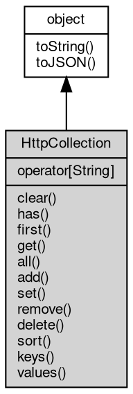

# 对象 HttpCollection
HttpCollection 是一个通用容器，用于处理 [http](../../module/ifs/http.md) 消息中的 headers, query, form, cookie 数据

我们以 headers 为例，说明 HttpCollection 的使用方法。

HttpCollection 支持三种形式添加数据：

1. 添加一个键值数据，添加数据并不修改已存在的键值的数据。`add`

```JavaScript
headers.add({
    'Content-Type': 'text/plain',
    'User-Agent': 'fibjs'
});
```

2. 添加一个键值的一组数据，添加数据并不修改已存在的键值的数据。`add`

```JavaScript
headers.add('Set-Cookie', [
    'a=10',
    'b=20'
]);
```

3. 添加一个键值数据，添加数据并不修改已存在的键值的数据。`add`

```JavaScript
headers.add('Accept-Encoding', 'gzip');
```

HttpCollection 设置数据的形式与添加相同，使用的方法是 `set`。

我们可以使用 `has` 检查容器内是否存在指定键值的数据

```JavaScript
const contentTypeExists = headers.has('Content-Type');
```

使用 `first` 获取容器内某个键对应的第一个值：

```JavaScript
const contentType = headers.first('Content-Type');
```

使用 `all` 查询指定键值的全部值，返回一个数组。如果传递一个空字符串的参数，则返回全部值

```JavaScript
const cookieArray = headers.all('Set-Cookie');
const alls = headers.all();
```

使用 `delete` 方法删除指定键值的所有数据，返回 `true` 表示

## 继承关系


## 操作符
        
### operator[String]
**允许使用键值下标直接访问数值**

```JavaScript
Variant HttpCollection[String];
```

## 成员函数
        
### clear
**清除容器数据**

```JavaScript
HttpCollection.clear();
```

--------------------------
### has
**检查容器内是否存在指定键值的数据**

```JavaScript
Boolean HttpCollection.has(String name);
```

调用参数:
* name: String, 指定要检查的键值

返回结果:
* Boolean, 返回键值是否存在

--------------------------
### first
**查询指定键值的第一个值**

```JavaScript
Variant HttpCollection.first(String name);
```

调用参数:
* name: String, 指定要查询的键值

返回结果:
* Variant, 返回键值所对应的值，若不存在，则返回 undefined

--------------------------
### get
**查询指定键值的第一个值，等同于 first**

```JavaScript
Variant HttpCollection.get(String name);
```

调用参数:
* name: String, 指定要查询的键值

返回结果:
* Variant, 返回键值所对应的值，若不存在，则返回 undefined

--------------------------
### all
**查询指定键值的全部值**

```JavaScript
NObject HttpCollection.all(String name = "");
```

调用参数:
* name: String, 指定要查询的键值，传递空字符串返回全部键值的结果

返回结果:
* NObject, 返回键值所对应全部值的数组，若数据不存在，则返回 null

--------------------------
### add
**添加一个键值数据，添加数据并不修改已存在的键值的数据**

```JavaScript
HttpCollection.add(Object map);
```

调用参数:
* map: Object, 指定要添加的键值数据字典

--------------------------
**添加一个键值的一组数据，添加数据并不修改已存在的键值的数据**

```JavaScript
HttpCollection.add(String name,
    Array values);
```

调用参数:
* name: String, 指定要添加的键值
* values: Array, 指定要添加的一组数据

--------------------------
**添加一个键值数据，添加数据并不修改已存在的键值的数据**

```JavaScript
HttpCollection.add(String name,
    Variant value);
```

调用参数:
* name: String, 指定要添加的键值
* value: Variant, 指定要添加的数据

--------------------------
### set
**设定一个键值数据，设定数据将修改键值所对应的第一个数值，并清除相同键值的其余数据**

```JavaScript
HttpCollection.set(Object map);
```

调用参数:
* map: Object, 指定要设定的键值数据字典

--------------------------
**设定一个键值的一组数据，设定数据将修改键值所对应的数值，并清除相同键值的其余数据**

```JavaScript
HttpCollection.set(String name,
    Array values);
```

调用参数:
* name: String, 指定要设定的键值
* values: Array, 指定要设定的一组数据

--------------------------
**设定一个键值数据，设定数据将修改键值所对应的第一个数值，并清除相同键值的其余数据**

```JavaScript
HttpCollection.set(String name,
    Variant value);
```

调用参数:
* name: String, 指定要设定的键值
* value: Variant, 指定要设定的数据

--------------------------
### remove
**删除指定键值的全部值**

```JavaScript
HttpCollection.remove(String name);
```

调用参数:
* name: String, 指定要删除的键值

--------------------------
### delete
**删除指定键值的全部值**

```JavaScript
HttpCollection.delete(String name);
```

调用参数:
* name: String, 指定要删除的键值

--------------------------
### sort
**按照键值排序容器内的内容**

```JavaScript
HttpCollection.sort();
```

--------------------------
### keys
**查询容器内的键值**

```JavaScript
NArray HttpCollection.keys();
```

返回结果:
* NArray, 返回包含所有键值的数组

--------------------------
### values
**查询容器内的数值**

```JavaScript
NArray HttpCollection.values();
```

返回结果:
* NArray, 返回包含所有数值的数组

--------------------------
### toString
**返回对象的字符串表示，一般返回 "[Native Object]"，对象可以根据自己的特性重新实现**

```JavaScript
String HttpCollection.toString();
```

返回结果:
* String, 返回对象的字符串表示

--------------------------
### toJSON
**返回对象的 JSON 格式表示，一般返回对象定义的可读属性集合**

```JavaScript
Value HttpCollection.toJSON(String key = "");
```

调用参数:
* key: String, 未使用

返回结果:
* Value, 返回包含可 JSON 序列化的值

