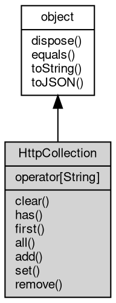

# 对象 HttpCollection
[http](../../module/ifs/http.md) 容器对象，用于 [http](../../module/ifs/http.md) header，cookie，query，form，等数据的存储与组织

## 继承关系


## 下标操作
        
**允许使用键值下标直接访问数值**

```JavaScript
Variant HttpCollection[String];
```

## 成员函数
        
### clear
**清除容器数据**

```JavaScript
HttpCollection.clear();
```

--------------------------
### has
**检查容器内是否存在指定键值的数据**

```JavaScript
Boolean HttpCollection.has(String name);
```

调用参数:
* name: String, 指定要检查的键值

返回结果:
* Boolean, 返回键值是否存在

--------------------------
### first
**查询指定键值的第一个值**

```JavaScript
Variant HttpCollection.first(String name);
```

调用参数:
* name: String, 指定要查询的键值

返回结果:
* Variant, 返回键值所对应的值，若不存在，则返回 undefined

--------------------------
### all
**查询指定键值的全部值**

```JavaScript
List HttpCollection.all(String name);
```

调用参数:
* name: String, 指定要查询的键值

返回结果:
* [List](List.md), 返回键值所对应全部值的数组，若数据不存在，则返回 null

--------------------------
### add
**添加一个键值数据，添加数据并不修改已存在的键值的数据**

```JavaScript
HttpCollection.add(Map map);
```

调用参数:
* map: [Map](Map.md), 指定要添加的键值数据字典

--------------------------
**添加一个键值数据，添加数据并不修改已存在的键值的数据**

```JavaScript
HttpCollection.add(String name,
    Variant value);
```

调用参数:
* name: String, 指定要添加的键值
* value: Variant, 指定要添加的数据

--------------------------
### set
**设定一个键值数据，设定数据将修改键值所对应的第一个数值，并清除相同键值的其余数据**

```JavaScript
HttpCollection.set(Map map);
```

调用参数:
* map: [Map](Map.md), 指定要设定的键值数据字典

--------------------------
**设定一个键值数据，设定数据将修改键值所对应的第一个数值，并清除相同键值的其余数据**

```JavaScript
HttpCollection.set(String name,
    Variant value);
```

调用参数:
* name: String, 指定要设定的键值
* value: Variant, 指定要设定的数据

--------------------------
### remove
**删除指定键值的全部值**

```JavaScript
HttpCollection.remove(String name);
```

调用参数:
* name: String, 指定要删除的键值

--------------------------
### dispose
**强制回收对象，调用此方法后，对象资源将立即释放**

```JavaScript
HttpCollection.dispose();
```

--------------------------
### equals
**比较当前对象与给定的对象是否相等**

```JavaScript
Boolean HttpCollection.equals(object expected);
```

调用参数:
* expected: [object](object.md), 制定比较的目标对象

返回结果:
* Boolean, 返回对象比较的结果

--------------------------
### toString
**返回对象的字符串表示，一般返回 "[Native Object]"，对象可以根据自己的特性重新实现**

```JavaScript
String HttpCollection.toString();
```

返回结果:
* String, 返回对象的字符串表示

--------------------------
### toJSON
**返回对象的 JSON 格式表示，一般返回对象定义的可读属性集合**

```JavaScript
Value HttpCollection.toJSON(String key = "");
```

调用参数:
* key: String, 未使用

返回结果:
* Value, 返回包含可 JSON 序列化的值

