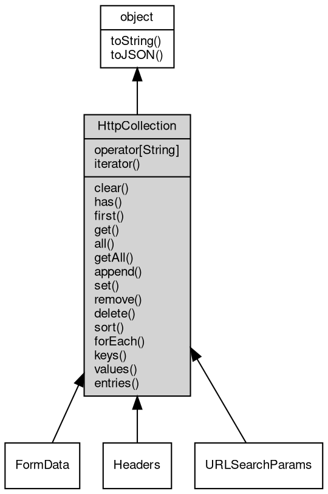

# Object HttpCollection
HttpCollection is the ordered multi-map base class behind the HTTP collections of fibjs: [Headers](Headers.md), [URLSearchParams](URLSearchParams.md), [FormData](FormData.md) and the request cookie collection

A collection stores entries in insertion order and allows the same name to appear more than
once; every operation decides whether it adds another entry or replaces the existing ones.
The concrete containers are:

- `Headers` (also the [global](../../module/ifs/global.md) Headers) stores header fields; names are compared
case-insensitively, stored in lower case, and an empty name is rejected;
- `URLSearchParams` (also the [global](../../module/ifs/global.md) URLSearchParams) stores query parameters with
case-sensitive names in insertion order, allows an empty name and adds `size`,
`toString`, value-aware `has`/`delete` and the standard `sort`;
- `FormData` stores form fields and files with case-sensitive names, allows an empty name
and keeps `File`/`Blob` values;
- `querystring.parse` returns a plain HttpCollection with case-insensitive names, string
values and sorted iteration.

The base class cannot be constructed with `new`; obtain an instance through one of the
containers above.

Concepts:

- **Ordered multi-map**: append adds entries, set replaces every value of a name,
first/get return one value and all/getAll return every value. The insertion order is
preserved until `sort` is called; the iteration helpers of a sorting container call
`sort` first, while [URLSearchParams](URLSearchParams.md) and [FormData](FormData.md) keep insertion order.
- **Case rules**: case sensitivity is decided by the concrete container (see the list
above); [Headers](Headers.md) additionally lower-cases stored names.
- **Values**: containers with string-only semantics convert values to strings; when a name
has several values, `operator[]` and `all()` return an array while `first`/`get` return
the first value.
- **Iteration and serialization**: forEach, keys, values, entries and @iterator are
available on every container; entries() is what `for ... of` uses, and the inherited
toJSON() returns a plain [object](object.md) whose repeated names become arrays.

Example 1 — an ordered multi-map through [Headers](Headers.md):

```JavaScript
const http = require('http');

const headers = new http.Headers();
headers.append('Accept', 'text/html');
headers.append('accept', 'application/json');
headers.append('X-Trace', 'abc');

console.log(headers.get('ACCEPT')); // text/html, application/json
console.log(headers.first('accept')); // text/html
console.log(headers.all('accept')); // [ 'text/html', 'application/json' ]

headers.set('accept', 'image/png');
console.log(headers.all('accept')); // [ 'image/png' ]
```

Example 2 — insertion order and replacement through [URLSearchParams](URLSearchParams.md):

```JavaScript
const params = new URLSearchParams('b=2&a=1&a=3');
params.append('c', '4');

console.log(params.get('a')); // 1
console.log(params.getAll('a')); // [ '1', '3' ]

const pairs = [];
params.forEach((value, name) => pairs.push(name + '=' + value));
console.log(pairs.join('&')); // b=2&a=1&a=3&c=4

params.set('a', '9');
console.log(params.toString()); // b=2&c=4&a=9, the name moves to the end
```

Example 3 — form fields and files through [FormData](FormData.md):

```JavaScript
const form = new FormData();
form.append('name', 'lion');
form.append('file', new Blob(['hello'], {
    type: 'text/plain'
}), 'hello.txt');

console.log(form.get('name')); // lion
console.log(form.all('file').length); // 1
console.log(form.all('file')[0].type); // text/plain
console.log(form.all('file')[0].name); // hello.txt
```

## Inheritance

```dot
digraph {
    node [fontname="Helvetica,sans-Serif", fontsize=10, shape="record", style="filled", fillcolor="white"];

    object [tooltip="object", URL="object.md", label="{object|toString()\ltoJSON()\l}"];
    HttpCollection [tooltip="HttpCollection", fillcolor="lightgray", id="me", label="{HttpCollection|operator[String]\literator()\l|clear()\lhas()\lfirst()\lget()\lall()\lgetAll()\lappend()\lset()\lremove()\ldelete()\lsort()\lforEach()\lkeys()\lvalues()\lentries()\l}"];
    FormData [tooltip="FormData", URL="FormData.md", label="{FormData}"];
    Headers [tooltip="Headers", URL="Headers.md", label="{Headers}"];
    URLSearchParams [tooltip="URLSearchParams", URL="URLSearchParams.md", label="{URLSearchParams}"];

    object -> HttpCollection [dir=back];
    HttpCollection -> FormData [dir=back];
    HttpCollection -> Headers [dir=back];
    HttpCollection -> URLSearchParams [dir=back];
}
```

## Operators
        
### operator[String]
**Accesses values by name with the subscript syntax**

```JavaScript
Variant HttpCollection[String];
```

Reading a name returns its first value, or an array with every value when the name
repeats; reading a missing name returns undefined. Assigning to a name behaves like
set(name, value), and `delete container[name]` behaves like remove; the delete
operator always returns true in the current implementation, even when no entry was
removed, so use has to [test](../../module/ifs/test.md) the result.

Example — read a repeated name:

```JavaScript
const http = require('http');

const headers = new http.Headers();
headers.append('X-Tag', 'a');
headers.append('X-Tag', 'b');
console.log(headers['X-Tag']); // [ 'a', 'b' ]
console.log(headers['missing']); // undefined
```

--------------------------
### @iterator
**Returns the default iterator over [name, value] pairs, an alias of entries**

```JavaScript
Iterator HttpCollection.@iterator();
```

Returns:
* [Iterator](Iterator.md), an iterator with every [name, value] pair

The member is what `for ... of` and the spread syntax use on a collection; it yields
one [name, value] pair per stored entry, so a repeated name appears once per value.
Containers that sort on iteration sort first.

## Methods
        
### clear
**Removes every entry from the container**

```JavaScript
HttpCollection.clear();
```

The container becomes empty and the iteration helpers yield nothing afterwards. The
method is available on every concrete container.

--------------------------
### has
**Checks whether a name is present**

```JavaScript
Boolean HttpCollection.has(String name);
```

Parameters:
* name: String, name to check

Returns:
* Boolean, true when the name exists

The comparison follows the case rules of the concrete container; [[Headers](Headers.md)](Headers.md) rejects an
empty name with error 20004 while [URLSearchParams](URLSearchParams.md) and [[FormData](FormData.md)](FormData.md) accept it.

Example — check a header through its case-insensitive name:

```JavaScript
const http = require('http');

const headers = new http.Headers({
    'Content-Type': 'text/plain'
});
console.log(headers.has('content-type')); // true
```

--------------------------
### first
**Queries the first value of a name**

```JavaScript
Variant HttpCollection.first(String name);
```

Parameters:
* name: String, name to query

Returns:
* Variant, the first value, or null when the name does not exist

Values are returned in insertion order, so the first appended value wins. The result
is null when the name does not exist. [Headers](Headers.md) rejects an empty name with error 20004,
while [URLSearchParams](URLSearchParams.md) and [FormData](FormData.md) accept it.

Example — read the first value of a repeated header:

```JavaScript
const http = require('http');

const headers = new http.Headers();
headers.append('X-Tag', 'a');
headers.append('x-tag', 'b');
console.log(headers.first('X-TAG')); // a
console.log(headers.first('missing')); // null
```

--------------------------
### get
**Queries the first value of a name, an alias of first**

```JavaScript
Variant HttpCollection.get(String name);
```

Parameters:
* name: String, name to query

Returns:
* Variant, the value of the name, or null when it does not exist

[Headers](Headers.md) overrides this member with a different semantic: its get joins every value of
the name with `, ` as required by the Fetch API, while first still returns only the
first raw value. The other containers return the same value as first.

--------------------------
### all
**Queries all values of a name, or the whole container as an [object](object.md)**

```JavaScript
NObject HttpCollection.all(String name = "");
```

Parameters:
* name: String, name to query; an empty string returns the whole container

Returns:
* NObject, an array of values, or an [object](object.md) with every entry when the name is empty

Called with a non-empty name, the method returns an array with every value of that
name in insertion order and an empty array when the name is missing. Called with an
empty string or without an argument, it returns a plain [object](object.md) with every entry, where
a name that has several values becomes an array. [URLSearchParams](URLSearchParams.md) and [FormData](FormData.md), which
accept an empty name, return the whole container in that case; use getAll('') to read
the values of the empty name.

Example — collect every value of a name:

```JavaScript
const params = new URLSearchParams('tag=a&tag=b&tag=c');
console.log(params.all('tag')); // [ 'a', 'b', 'c' ]
console.log(params.all('missing')); // []
```

--------------------------
### getAll
**Queries all values of a name as an array**

```JavaScript
NArray HttpCollection.getAll(String name);
```

Parameters:
* name: String, name to query

Returns:
* NArray, an array with every value of the name

Always returns an array, empty when the name is missing and including for the empty
name, so it is the value-oriented counterpart of all. Values keep the insertion order
of the container.

--------------------------
### append
**Appends every entry of an [[object](object.md)](object.md)**

```JavaScript
HttpCollection.append(Object map);
```

Parameters:
* map: Object, [[object](object.md)](object.md) whose properties are appended

The own enumerable properties are visited in enumeration order; a property whose value
is an array appends every element in order, any other value appends a single entry,
and existing entries are not modified. Values are converted according to the container
([[Headers](Headers.md)](Headers.md) and [[URLSearchParams](URLSearchParams.md)](URLSearchParams.md) store strings).

Example — append a group of headers:

```JavaScript
const http = require('http');

const headers = new http.Headers();
headers.append({
    'Accept-Encoding': 'gzip',
    'Set-Cookie': ['a=1', 'b=2']
});
console.log(headers.all('set-cookie')); // [ 'a=1', 'b=2' ]
```

--------------------------
**Appends one value, or every element of an array, for a name**

```JavaScript
HttpCollection.append(String name,
    Array | Variant value);
```

Parameters:
* name: String, name to append
* value: Array | Variant, value, or array of values, to append

An array appends every element in order, any other value appends a single entry, and
existing entries are not modified. An empty name is rejected by [[Headers](Headers.md)](Headers.md) with error
20004 and accepted by [[URLSearchParams](URLSearchParams.md)](URLSearchParams.md) and [FormData](FormData.md).

Example — append two values of one name:

```JavaScript
const http = require('http');

const headers = new http.Headers();
headers.append('X-Tag', ['a', 'b']);
console.log(headers.all('x-tag')); // [ 'a', 'b' ]
```

--------------------------
**Appends an array of [name, value] entries**

```JavaScript
HttpCollection.append(Array entries);
```

Parameters:
* entries: Array, array of [name, value] pairs to append

Every element of the argument must be an array of exactly two elements; a different
shape fails with a bad variable type error (20003). Elements are appended in order and
existing entries are not modified.

Example — append pairs through [[URLSearchParams](URLSearchParams.md)](URLSearchParams.md):

```JavaScript
const params = new URLSearchParams();
params.append([
    ['a', '1'],
    ['b', '2']
]);
console.log(params.toString()); // a=1&b=2
```

--------------------------
### set
**Sets every entry of an [[object](object.md)](object.md), replacing the existing values of each name**

```JavaScript
HttpCollection.set(Object map);
```

Parameters:
* map: Object, [[object](object.md)](object.md) whose properties are set

The own enumerable properties are visited in enumeration order; a property whose value
is an array sets every element in order, any other value sets a single entry. Every
existing value of a name is removed before its new values are appended.

Example — replace a group of headers:

```JavaScript
const http = require('http');

const headers = new http.Headers({
    Accept: 'text/html',
    'X-Tag': 'old'
});
headers.set({
    Accept: 'application/json',
    'X-Tag': ['a', 'b']
});
console.log(headers.all('accept')); // [ 'application/json' ]
console.log(headers.all('x-tag')); // [ 'a', 'b' ]
```

--------------------------
**Sets one value, or every element of an array, for a name**

```JavaScript
HttpCollection.set(String name,
    Array | Variant value);
```

Parameters:
* name: String, name to set
* value: Array | Variant, value, or array of values, to set

Every existing value of the name is removed first, then an array appends every element
in order or another value appends a single entry; a name that already existed therefore
moves to the end of the insertion order. An empty name is rejected by [[Headers](Headers.md)](Headers.md) with
error 20004 and accepted by [[URLSearchParams](URLSearchParams.md)](URLSearchParams.md) and [FormData](FormData.md).

--------------------------
### remove
**Removes every value of a name**

```JavaScript
HttpCollection.remove(String name);
```

Parameters:
* name: String, name to remove

The name is looked up with the case rules of the container and removing a name that
does not exist is not an error. delete is an alias: the two differ only in that
`delete container[name]` can be used as an operator (its return value is not reliable,
see the operator member).

--------------------------
### delete
**Removes every value of a name, an alias of remove**

```JavaScript
HttpCollection.delete(String name);
```

Parameters:
* name: String, name to remove

See remove. The `delete container[name]` operator removes the same entries, but its
result is always true in the current implementation, so [[test](../../module/ifs/test.md)](../../[module](../../module/ifs/module.md)/ifs/test.md) the removal with has
instead of relying on the return value.

--------------------------
### sort
**Sorts the entries by name in place**

```JavaScript
HttpCollection.sort();
```

The sort is stable and compares names byte by byte, so upper-case letters sort before
lower-case ones. Sorting changes the order seen by every later operation, including
all() and toJSON(). The iteration helpers of [Headers](Headers.md) and of the collection returned by
[querystring.parse](../../module/ifs/querystring.md#parse) call sort automatically; [URLSearchParams](URLSearchParams.md) and [FormData](FormData.md) never sort
implicitly.

--------------------------
### forEach
**Visits every entry in order**

```JavaScript
HttpCollection.forEach(Function(Value value, String key, Object obj) callback);
```

Parameters:
* callback: Function(Value value, String key, Object obj), function called with (value, name, collection)

The callback receives (value, name, collection); returning from the callback does not
stop the iteration. Containers that sort on iteration ([Headers](Headers.md) and the [querystring](../../module/ifs/querystring.md)
collection) sort before the first callback, so the names are visited in sorted order.

Example — list every header:

```JavaScript
const http = require('http');

const headers = new http.Headers({
    'B-Header': '1',
    'A-Header': '2'
});
headers.forEach((value, name) => console.log(name, value));
// a-header 2, then b-header 1 (names are lower-cased and sorted)
```

--------------------------
**Visits every entry in order with an explicit this value**

```JavaScript
HttpCollection.forEach(Function(Value value, String key, Object obj) callback,
    Value thisArg);
```

Parameters:
* callback: Function(Value value, String key, Object obj), function called with (value, name, thisArg)
* thisArg: Value, value used as `this` inside the callback

Identical to forEach except that the callback runs with thisArg as `this` and receives
thisArg as its third argument instead of the collection.

--------------------------
### keys
**Returns an iterator over the names**

```JavaScript
Iterator HttpCollection.keys();
```

Returns:
* [Iterator](Iterator.md), an iterator with every name

Repeated names appear once per entry; containers that sort on iteration sort first.
The iterator implements the standard iterator protocol, so it can be used in a
`for ... of` loop or queried with next().

Example — iterate names:

```JavaScript
const http = require('http');

const headers = new http.Headers({
    B: '1',
    A: '2'
});
for (const name of headers.keys())
    console.log(name); // a, then b (Headers sorts on iteration)
```

--------------------------
### values
**Returns an iterator over the values**

```JavaScript
Iterator HttpCollection.values();
```

Returns:
* [Iterator](Iterator.md), an iterator with every value

Values are visited in the same order as the names of keys(), one value per entry.

--------------------------
### entries
**Returns an iterator over [name, value] pairs**

```JavaScript
Iterator HttpCollection.entries();
```

Returns:
* [Iterator](Iterator.md), an iterator with every [name, value] pair

This is also the iterator used by `for ... of` and by spread on the container; a name
with several values appears once per value.

Example — turn query parameters into pairs:

```JavaScript
const params = new URLSearchParams('a=1&a=2');
console.log(JSON.stringify([...params])); // [["a","1"],["a","2"]]
```

--------------------------
### toString
**Returns the string form of the [object](object.md)**

```JavaScript
String HttpCollection.toString();
```

Returns:
* String, returns the string form of the [object](object.md)

The base implementation reports an error: a native [object](object.md) has no implicit
text form, and only the classes whose value can be written as a string
override the member. [Buffer](Buffer.md) returns its content decoded with the given
[encoding](../../module/ifs/encoding.md), [HttpCookie](HttpCookie.md) returns "name=value", and so on; an override commonly
accepts optional arguments ([Buffer.toString](Buffer.md#toString) takes [encoding](../../module/ifs/encoding.md), start and
end) that are not part of this declaration.

Calling the member on a class that does not override it throws
"<Class>: the [object](object.md) can not be converted to string.", which is the
behavior to rely on when probing whether a value has a string form. See
toJSON for the serialization hook.

--------------------------
### toJSON
**Returns the JSON representation of the [object](object.md)**

```JavaScript
Value HttpCollection.toJSON(String key = "");
```

Parameters:
* key: String, the property name of the value being serialized

Returns:
* Value, returns the JSON-serializable value

JSON.stringify(value) calls value.toJSON(key) when the member exists and
serializes the returned value in its place; the key argument carries the
property name of the value inside its parent [object](object.md) (an empty string at
the top level) and may be used to build a keyed form. The base
implementation returns a plain [object](object.md) holding the readable properties of
the instance, so a native [object](object.md) serializes without per-class code; a
class with a portable shape such as [Buffer](Buffer.md) overrides it, and a JavaScript
class may override it in the same way.

The member is normally reached through JSON.stringify rather than called
directly; calling it returns the same value JSON.stringify would
serialize.

