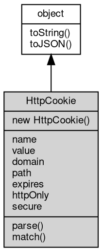

# 对象 HttpCookie
HttpCookie 是 HTTP 协议封装的 cookie 对象，它提供了获取、设置 cookie 的各个属性，同时也支持多个 cookie 的组织与处理，是 [http.Request](../../module/ifs/http.md#Request) 和 [http.Response](../../module/ifs/http.md#Response) 两个对象都支持的一个重要属性

在服务器端，可以通过 [HttpRequest.cookies](HttpRequest.md#cookies) 来获取 HTTP 请求中的所有 cookie。这里的每个 cookie 都是一个 HttpCookie 对象，通过它的属性或方法可以获取或设置 cookie 的相关信息。
例如我们可以通过下述代码从客户端发送的 cookie 中读取对应属性：

```JavaScript
const http = require('http');
const server = new http.Server(8080, function(request) {
    const cookies = request.cookies;
    const name = cookies.get('name');
    request.response.write(`Hello ${name}!`);
});
server.start();
```

这里我们使用 [HttpRequest.cookies](HttpRequest.md#cookies) 属性获取请求中的所有 cookie。然后使用 cookies.get 方法，传入 cookie 的名称，来获取该 cookie 的值。

为了向客户端发送一个 cookie，可以通过 HttpCookie 对象来创建一个新的 cookie 并将其添加到 HttpReponse.cookies 集合中。以下是一个示例：

```JavaScript
const http = require('http');
const server = new http.Server(8080, function(request) {
    const cookies = request.cookies;
    let name = cookies.get('name');

    if (name) {
        request.response.write(`Hello ${name} again!`);
    } else {
        name = 'User';
        request.response.cookies.add(new http.Cookie('name', name, {
            expires: new Date(Date.now() + 900000)
        }));
        request.response.write(`Welcome ${name}!`);
    }
});

server.start();
```

在上述示例中，我们首先获取了 HttpServletRequest.cookies，然后尝试从中读取名称为 name 的 cookie 的值。如果 cookie 存在，那就向请求发送响应并使用该 cookie 的值来向客户端打招呼。如果该 cookie 不存在，我们创建一个新的 cookie 对象，并添加到 HttpServletResponse.cookies 集合中。配有 name 和 value 的第一个参数用于指定 cookie 名称和对应的值。同时，expires 属性用于指定 cookie 的过期时间，这里指定了现在时间加上 15 分钟为过期时间。最后，我们将返回值的内容添加上欢迎语。

## 继承关系


## 构造函数
        
### HttpCookie
**HttpCookie 构造函数，创建一个新的 HttpCookie 对象**

```JavaScript
new HttpCookie(Object opts = {});
```

调用参数:
* opts: Object, 指定创建的 cookie 的属性

opts 可以设置的选项如下：

```JavaScript
{
    "name": "", // specify the name of the cookie
    "value": "", // specify the value of the cookie
    "expires": Date, // specify the expires time of the cookie
    "domain": "", // specify the domain of the cookie
    "path": "", // specify the path of the cookie
    "secure": false, // specify the secure of the cookie
    "httpOnly": false, // specify the httpOnly of the cookie
}
```

--------------------------
**HttpCookie 构造函数，创建一个新的 HttpCookie 对象**

```JavaScript
new HttpCookie(String name,
    String value,
    Object opts = {});
```

调用参数:
* name: String, 指定创建的 cookie 名称
* value: String, 指定创建的 cookie 值
* opts: Object, 指定创建的 cookie 的其它属性

opts 可以设置的选项如下：

```JavaScript
{
    "expires": Date, // specify the expires time of the cookie
    "domain": "", // specify the domain of the cookie
    "path": "", // specify the path of the cookie
    "secure": false, // specify the secure of the cookie
    "httpOnly": false, // specify the httpOnly of the cookie
}
```

## 成员属性
        
### name
**String, 查询和设置 cookie 名称**

```JavaScript
String HttpCookie.name;
```

--------------------------
### value
**String, 查询和设置 cookie 的值**

```JavaScript
String HttpCookie.value;
```

--------------------------
### domain
**String, 查询和设置 cookie 的域名范围**

```JavaScript
String HttpCookie.domain;
```

--------------------------
### path
**String, 查询和设置 cookie 的路径范围**

```JavaScript
String HttpCookie.path;
```

--------------------------
### expires
**Date, 查询和设置 cookie 的过期时间**

```JavaScript
Date HttpCookie.expires;
```

--------------------------
### httpOnly
**Boolean, 查询和设置 cookie 是否仅允许 [http](../../module/ifs/http.md) 请求，缺省 false**

```JavaScript
Boolean HttpCookie.httpOnly;
```

--------------------------
### secure
**Boolean, 查询和设置 cookie 是否仅通过 https 传递，缺省 false**

```JavaScript
Boolean HttpCookie.secure;
```

## 成员函数
        
### parse
**解析给定的字符串，填充 cookie 对象**

```JavaScript
HttpCookie.parse(String header);
```

调用参数:
* header: String, 指定需要解析的 header 字符串

--------------------------
### match
**检测给定的 [url](../../module/ifs/url.md) 是否匹配当前设置**

```JavaScript
Boolean HttpCookie.match(String url);
```

调用参数:
* url: String, 指定测试的 [url](../../module/ifs/url.md)

返回结果:
* Boolean, 匹配成功返回 true

--------------------------
### toString
**返回对象的字符串表示，一般返回 "[Native Object]"，对象可以根据自己的特性重新实现**

```JavaScript
String HttpCookie.toString();
```

返回结果:
* String, 返回对象的字符串表示

--------------------------
### toJSON
**返回对象的 JSON 格式表示，一般返回对象定义的可读属性集合**

```JavaScript
Value HttpCookie.toJSON(String key = "");
```

调用参数:
* key: String, 未使用

返回结果:
* Value, 返回包含可 JSON 序列化的值

