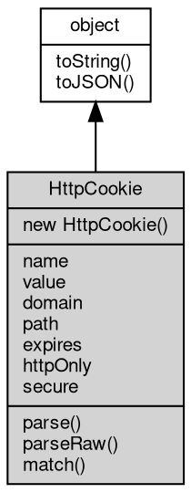

# Object HttpCookie
HttpCookie represents one HTTP cookie: a name/value pair with the domain, [path](../../module/ifs/path.md), expiry and security attributes that scope it

A cookie travels between client and server in the `Cookie` and `Set-Cookie` headers. fibjs
exposes it as a mutable value [object](object.md): build one with `new [http.Cookie](../../module/ifs/http.md#Cookie)(...)`, parse an
existing header with parse or parseRaw, [test](../../module/ifs/test.md) the scope of a URL with match, and serialize it
back with toString. `[http.Response](../../module/ifs/http.md#Response)#cookies` returns the cookies of a response as an array of
HttpCookie objects, while `[http.Request](../../module/ifs/http.md#Request)#cookies` is an [HttpCollection](HttpCollection.md) with the name/value
pairs of the incoming Cookie header; add a cookie to a response by appending its serialized
form to the Set-Cookie header.

Concepts:

- **Attributes**: name and value are the payload; domain and [path](../../module/ifs/path.md) scope where the cookie is
sent (a domain matches itself and its subdomains, a [path](../../module/ifs/path.md) matches itself and its subpaths);
expires is the time after which the client drops the cookie; secure limits it to HTTPS and
httpOnly hides it from scripts.
- **Not an [HttpCollection](HttpCollection.md)**: a single HttpCookie is a value [object](object.md), not a container of
cookies; the cookie jar of a request is the [HttpCollection](HttpCollection.md) returned by
`[http.Request](../../module/ifs/http.md#Request)#cookies`, and a response carries an array of HttpCookie.
- **Encoding**: toString percent-encodes the name and value and writes expires as a GMT
date; parse decodes the percent-[encoding](../../module/ifs/encoding.md) so it round-trips with toString, while parseRaw
keeps the header bytes unchanged as required by RFC 6265 for Set-Cookie values.
- **Limits**: the [object](object.md) models only name, value, domain, [path](../../module/ifs/path.md), expires, secure and httpOnly.
SameSite and Max-Age are not supported: parse ignores them and toString never writes them.
Node.js has no Cookie class; the same fields appear in the Set-Cookie header and in
userland cookie packages.

Obtained from:
- `new [http.Cookie](../../module/ifs/http.md#Cookie)(name, value, options)` — build a cookie from scratch;
- `new [http.Cookie](../../module/ifs/http.md#Cookie)(options)` — build one from a properties [object](object.md);
- `parse(header)` / `parseRaw(header)` — fill an empty [object](object.md) from a header value;
- `[http.Response](../../module/ifs/http.md#Response)#cookies` — the cookies read from a response (array);
- `[http.Request](../../module/ifs/http.md#Request)#cookies` — the parsed Cookie header ([HttpCollection](HttpCollection.md) of name/value pairs).

Example 1 — build, serialize and match a cookie:

```JavaScript
const http = require('http');

const cookie = new http.Cookie('session', 'abc 123', {
    expires: new Date(Date.UTC(2030, 0, 2, 3, 4, 5)),
    domain: 'example.com',
    path: '/app',
    secure: true,
    httpOnly: true
});

console.log(cookie.name, cookie.value); // session abc 123
console.log(cookie.match('https://www.example.com/app/home')); // true
console.log(cookie.match('https://example.com/other')); // false
```

Example 2 — parse a Set-Cookie header and inspect the attributes:

```JavaScript
const http = require('http');

const cookie = new http.Cookie();
cookie.parseRaw('session=abc%20123; Path=/app; Domain=example.com; HttpOnly; Secure');

console.log(cookie.name, cookie.value); // session abc%20123
console.log(cookie.path, cookie.domain); // /app example.com
console.log(cookie.httpOnly, cookie.secure); // true true

const decoded = new http.Cookie();
decoded.parse('session=abc%20123');
console.log(decoded.value); // abc 123
```

Example 3 — read request cookies and set a response cookie:

```JavaScript
const http = require('http');

const server = new http.Server(0, (req) => {
    const name = req.cookies.get('name') || 'guest';
    req.response.appendHeader('Set-Cookie',
        new http.Cookie('name', name, {
            httpOnly: true
        }).toString());
    req.response.write('Hello ' + name);
});
server.start();

const resp = http.getSync('http://127.0.0.1:' + server.socket.localPort + '/');
console.log(resp.text()); // Hello guest
console.log(resp.cookies[0].name, resp.cookies[0].value); // name guest
server.stop();
```

## Inheritance

```dot
digraph {
    node [fontname="Helvetica,sans-Serif", fontsize=10, shape="record", style="filled", fillcolor="white"];

    object [tooltip="object", URL="object.md", label="{object|toString()\ltoJSON()\l}"];
    HttpCookie [tooltip="HttpCookie", fillcolor="lightgray", id="me", label="{HttpCookie|new HttpCookie()\l|name\lvalue\ldomain\lpath\lexpires\lhttpOnly\lsecure\l|parse()\lparseRaw()\lmatch()\l}"];

    object -> HttpCookie [dir=back];
}
```

## Constructors
        
### HttpCookie
**Creates a cookie from a properties [object](object.md)**

```JavaScript
new HttpCookie(Object opts = {});
```

Parameters:
* opts: Object, properties of the cookie to create

Every field of the cookie may be given; missing fields keep their default, so [path](../../module/ifs/path.md) is
`/`, expires is an invalid Date (getTime() returns NaN) and secure/httpOnly are false.
The constructor accepts no header syntax: pass each field separately, or use parse to
read a `name=value; attribute` header. Passing a string to this overload fails with a
type error (20005).

Supported fields:

```JavaScript
// fragment: option fields
({
    "name": "", // cookie name
    "value": "", // cookie value
    "expires": new Date(), // expiry time, a Date or a date string
    "domain": "", // domain scope, for example "example.com"
    "path": "/", // path scope, default "/"
    "secure": false, // send only over HTTPS
    "httpOnly": false // hide from scripts
});
```

--------------------------
**Creates a cookie from a name, a value and an optional properties [object](object.md)**

```JavaScript
new HttpCookie(String name,
    String value,
    Object opts = {});
```

Parameters:
* name: String, cookie name
* value: String, cookie value
* opts: Object, other properties of the cookie to create

The name and value are stored as given without [encoding](../../module/ifs/encoding.md); the options accept the
attributes expires, domain, [path](../../module/ifs/path.md), secure and httpOnly. As in the other constructor,
[path](../../module/ifs/path.md) defaults to `/`, expires to an invalid Date and both flags to false.

Supported fields:

```JavaScript
// fragment: option fields
({
    "expires": new Date(), // expiry time, a Date or a date string
    "domain": "", // domain scope, for example "example.com"
    "path": "/", // path scope, default "/"
    "secure": false, // send only over HTTPS
    "httpOnly": false // hide from scripts
});
```

## Properties
        
### name
**String, Cookie name; encoded by toString and decoded by parse**

```JavaScript
String HttpCookie.name;
```

The name is stored as given; toString percent-encodes the characters that are not
allowed in a cookie name and parse reverses that [encoding](../../module/ifs/encoding.md). An empty name is accepted
by the [object](object.md) but such a cookie is invalid on the wire and servers reject it.

--------------------------
### value
**String, Cookie value; encoded by toString and decoded by parse**

```JavaScript
String HttpCookie.value;
```

With parseRaw the value keeps the raw header text. An empty value is valid and marks
a cookie that the client deletes only when it also carries an expiry in the past.

--------------------------
### domain
**String, Domain scope of the cookie**

```JavaScript
String HttpCookie.domain;
```

Stored as given and not validated; an empty domain matches every host. match treats a
leading dot as optional and also accepts a bare host for its subdomains.

--------------------------
### path
**String, Path scope of the cookie**

```JavaScript
String HttpCookie.path;
```

Defaults to `/` in both constructors; an empty [path](../../module/ifs/path.md) matches every [path](../../module/ifs/path.md). match ignores
trailing slashes, so `/app/` and `/app` behave the same.

--------------------------
### expires
**Date, Expiry time of the cookie**

```JavaScript
Date HttpCookie.expires;
```

A Date; when unset the getter returns an invalid Date (getTime() returns NaN) and
toString omits the attribute. When set, toString writes `; expires=<GMT date>`, which
asks the client to drop the cookie after that instant.

--------------------------
### httpOnly
**Boolean, Whether the cookie is only allowed for HTTP requests, default false**

```JavaScript
Boolean HttpCookie.httpOnly;
```

When true, toString appends the `HttpOnly` attribute and scripts cannot read the
cookie. It does not affect the matching performed by match.

--------------------------
### secure
**Boolean, Whether the cookie is only transmitted over HTTPS, default false**

```JavaScript
Boolean HttpCookie.secure;
```

When true, toString appends the `Secure` attribute; clients then send the cookie only
over a secure connection. It does not affect the matching performed by match.

## Methods
        
### parse
**Parses a `name=value; attribute` header into this [object](object.md), decoding name and value**

```JavaScript
HttpCookie.parse(String header);
```

Parameters:
* header: String, header string to parse

The name and value are decoded with the URL rules, so `%20` becomes a space while a
`+` stays a `+`; this matches the [encoding](../../module/ifs/encoding.md) that toString performs and keeps the two
round-tripping. The attributes expires, domain, [path](../../module/ifs/path.md), secure and HttpOnly are read;
any other attribute, including Max-Age and SameSite, is ignored. A header without a
name or without `=` throws `HttpCookie: bad cookie format.` (20024). Parsing into an
existing [object](object.md) only overwrites the fields present in the header, so use parseRaw for
a remote Set-Cookie value whose %XX sequences must stay as written.

Example — decode a header and read the attributes:

```JavaScript
const http = require('http');

const cookie = new http.Cookie();
cookie.parse('theme=dark%20blue; Path=/; HttpOnly');
console.log(cookie.name, cookie.value, cookie.httpOnly); // theme dark blue true
```

--------------------------
### parseRaw
**Parses a header into this [object](object.md) without decoding name and value**

```JavaScript
HttpCookie.parseRaw(String header);
```

Parameters:
* header: String, header string to parse

According to RFC 6265 a cookie value is an opaque string and the %XX sequences of a
Set-Cookie header must be preserved as they are, so `session=abc%20123` yields the
value `abc%20123`. `[http.Response](../../module/ifs/http.md#Response)#cookies` parses headers with this method. The
accepted syntax and the error behaviour are the same as parse.

--------------------------
### match
**Tests whether a URL matches the domain and [path](../../module/ifs/path.md) of the cookie**

```JavaScript
Boolean HttpCookie.match(String url);
```

Parameters:
* url: String, URL to [test](../../module/ifs/test.md)

Returns:
* Boolean, true when the URL matches the domain and [path](../../module/ifs/path.md)

The URL is parsed and its hostname and pathname are compared with the domain and [path](../../module/ifs/path.md).
An empty domain or [path](../../module/ifs/path.md) matches everything; a domain matches the host itself and its
subdomains, with leading dots ignored; a [path](../../module/ifs/path.md) matches itself, its subpaths and with
trailing slashes ignored. A single-label domain other than `localhost` never matches,
mirroring the way browsers reject cookies for public suffixes. A URL that cannot be
parsed fails with the parser error.

Example — scope a cookie to a host and a [path](../../module/ifs/path.md):

```JavaScript
const http = require('http');

const cookie = new http.Cookie('sid', '1', {
    domain: 'example.com',
    path: '/app'
});
console.log(cookie.match('https://www.example.com/app/home')); // true
console.log(cookie.match('https://example.com/other')); // false
console.log(cookie.match('https://other.com/app')); // false
```

--------------------------
### toString
**Returns the string form of the [object](object.md)**

```JavaScript
String HttpCookie.toString();
```

Returns:
* String, returns the string form of the [object](object.md)

The base implementation reports an error: a native [object](object.md) has no implicit
text form, and only the classes whose value can be written as a string
override the member. [Buffer](Buffer.md) returns its content decoded with the given
[encoding](../../module/ifs/encoding.md), HttpCookie returns "name=value", and so on; an override commonly
accepts optional arguments ([Buffer.toString](Buffer.md#toString) takes [encoding](../../module/ifs/encoding.md), start and
end) that are not part of this declaration.

Calling the member on a class that does not override it throws
"<Class>: the [object](object.md) can not be converted to string.", which is the
behavior to rely on when probing whether a value has a string form. See
toJSON for the serialization hook.

--------------------------
### toJSON
**Returns the JSON representation of the [object](object.md)**

```JavaScript
Value HttpCookie.toJSON(String key = "");
```

Parameters:
* key: String, the property name of the value being serialized

Returns:
* Value, returns the JSON-serializable value

JSON.stringify(value) calls value.toJSON(key) when the member exists and
serializes the returned value in its place; the key argument carries the
property name of the value inside its parent [object](object.md) (an empty string at
the top level) and may be used to build a keyed form. The base
implementation returns a plain [object](object.md) holding the readable properties of
the instance, so a native [object](object.md) serializes without per-class code; a
class with a portable shape such as [Buffer](Buffer.md) overrides it, and a JavaScript
class may override it in the same way.

The member is normally reached through JSON.stringify rather than called
directly; calling it returns the same value JSON.stringify would
serialize.

