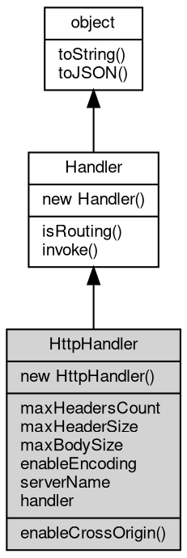

# Object HttpHandler
Turns a stream carrying HTTP messages into request/response handling

An HttpHandler wraps a request handler and runs the HTTP server side of a data
stream: it reads requests from the stream, calls the wrapped handler once per
request and writes the response back to the same stream, taking care of
keep-alive, the body framing and the response options (compression, CORS and
the size limits). `http.Server` and `net.TcpServer` build one around the
handler they are given, so the class is created directly only to serve an
arbitrary stream or to configure those options.

Concepts:
- **Wrapped handler forms**: the wrapped handler follows the usual forms — a
  [Handler](Handler.md) [object](object.md), an array (a [Chain](Chain.md)), a function `(req, res)`, a routing map
  [object](object.md) (a [Routing](Routing.md)) and a [path](../../module/ifs/path.md)/address string (a static file handler or a
  repeater). With a routing map the function values are called as
  `(req, ...captures, res)`, which is what an HTTP router needs.
- **Request lifecycle**: invoke takes a stream (or a message that carries a
  stream) and serves it until the connection closes: read a request, invoke
  the wrapped handler, send the response, then repeat while keep-alive is on.
  The 500 response on a handler error and the 400 response on a malformed
  request are produced by this class.
- **Limits**: maxHeadersCount (number of header fields), maxHeaderSize (bytes
  of the header block) and maxBodySize (MB of the body) guard the request
  parser; a request over any of them is answered with 400 Bad Request and the
  connection is closed.
- **Response options**: enableEncoding compresses a suitable response when the
  request accepts gzip/deflate, serverName sets the Server header, and
  enableCrossOrigin answers the CORS preflight and adds the CORS headers.

Obtained from:
- `new [mq.HttpHandler](../../module/ifs/mq.md#HttpHandler)(hdlr)` / `new [http.Handler](../../module/ifs/http.md#Handler)(hdlr)` — the same class under
  two names;
- `new [http.Server](../../module/ifs/http.md#Server)(port, hdlr)` / `http.createServer(hdlr)` — the server
  wraps the handler in an HttpHandler internally;
- `http.fileHandler(...)` returns a file handler (a concrete handler [object](object.md),
  not an HttpHandler).

Example 1 — wrap a function and drive it with a raw request:

```JavaScript
const http = require('http');
const io = require('io');

const handler = new http.Handler((req, res) => {
    res.write('hello ' + req.address);
});

// a raw request drives the handler through a memory stream
const stm = new io.MemoryStream();
stm.write(Buffer.from('GET /world HTTP/1.1\r\nHost: example.com\r\nConnection: close\r\n\r\n'));
stm.rewind();

handler.invoke(stm);

stm.rewind();
const text = stm.readAll().toString();
console.log(text.slice(text.indexOf('\r\n\r\n') + 4));
```

Example 2 — read the options and set the server name:

```JavaScript
const http = require('http');
const io = require('io');

const handler = new http.Handler((req, res) => {
    res.json({
        ok: true
    });
});

console.log(handler.maxHeadersCount, handler.maxHeaderSize, handler.maxBodySize); // 128 8192 64
console.log(handler.enableEncoding); // false

handler.serverName = 'demo-server';
const stm = new io.MemoryStream();
stm.write(Buffer.from('GET / HTTP/1.1\r\nHost: example.com\r\nConnection: close\r\n\r\n'));
stm.rewind();
handler.invoke(stm);
stm.rewind();
console.log(stm.readAll().toString().indexOf('Server: demo-server') >= 0); // true
```

Example 3 — enableEncoding compresses the response:

```JavaScript
const http = require('http');
const io = require('io');
const zlib = require('zlib');

const handler = new http.Handler((req, res) => {
    res.setHeader('Content-Type', 'text/plain');
    res.write('x'.repeat(200));
});
handler.enableEncoding = true;

const stm = new io.MemoryStream();
stm.write(Buffer.from('GET / HTTP/1.1\r\nHost: example.com\r\n' +
    'Accept-Encoding: gzip\r\nConnection: close\r\n\r\n'));
stm.rewind();
handler.invoke(stm);

stm.rewind();
const raw = stm.readAll();
const text = raw.toString('binary');
const headEnd = text.indexOf('\r\n\r\n', text.indexOf('\r\n\r\n') + 4);
const head = text.slice(text.indexOf('\r\n\r\n') + 4, headEnd);
console.log(head.indexOf('Content-Encoding: gzip') >= 0); // true
console.log(zlib.gunzipSync(raw.slice(headEnd + 4)).length); // 200
```

Notes:
- The request bytes and the response bytes share the stream, so a memory
  stream used as the transport contains the request first and the response
  after it; slice the response out as the examples do.
- A response over 500 produced by a handler error and the 400 of a malformed
  request are sent by this class; the handler does not see them.

## Inheritance


## Constructors
        
### HttpHandler
**Creates an [http](../../module/ifs/http.md) protocol handler over a stream of [http](../../module/ifs/http.md) messages**

```JavaScript
new HttpHandler(Function(HttpRequest req, HttpResponse res) => Value hdlr);
```

Parameters:
* hdlr: [Handler](Handler.md) | [Handler](Handler.md)[] | Function([HttpRequest](HttpRequest.md) req, [HttpResponse](HttpResponse.md) res) => Value | Object | String, the request handler

hdlr may be given in any of these forms:
- a [Handler](Handler.md) [object](object.md), invoked as it is;
- an array of handlers, wrapped in a [Chain](Chain.md) and invoked in order;
- a handler function `(req, res) => any`, called with the [HttpRequest](HttpRequest.md) and
  the [HttpResponse](HttpResponse.md) of each request;
- a routing map [object](object.md), whose keys are match patterns and whose values are
  handlers in these same forms (see [mq.Routing](../../module/ifs/mq.md#Routing)); a function value is
  called as `(req, ...captures, res) => any`, with the captured groups
  between the request and the response (also readable as req.params);
- a [path](../../module/ifs/path.md) or address string: a directory served as static files, or an
  `http(s)://` address forwarded by a repeater.

The constructed [object](object.md) is the class exposed as both [mq.HttpHandler](../../module/ifs/mq.md#HttpHandler) and
[http.Handler](../../module/ifs/http.md#Handler); the wrapped handler is available through the handler
property.

## Properties
        
### maxHeadersCount
**Integer, queries and sets the maximum number of request headers, default is 128**

```JavaScript
Integer HttpHandler.maxHeadersCount;
```

The limit counts the header fields of one request; a request with more
fields is answered with 400 Bad Request and the connection is closed.
Clients that send many cookies or a long header set may need a larger
value; lower it to reject abusive requests early.

Example — the limit is enforced by the parser:

```JavaScript
const http = require('http');
const io = require('io');

const handler = new http.Handler((req, res) => res.write('ok'));
handler.maxHeadersCount = 2;

const stm = new io.MemoryStream();
stm.write(Buffer.from('GET / HTTP/1.1\r\nHost: x\r\nA: 1\r\nB: 2\r\n' +
    'C: 3\r\nConnection: close\r\n\r\n'));
stm.rewind();
handler.invoke(stm);

stm.rewind();
const text = stm.readAll().toString();
console.log(text.slice(text.indexOf('HTTP/1.1 ')).indexOf('400 Bad Request') >= 0); // true
```

--------------------------
### maxHeaderSize
**Integer, queries and sets the maximum request header length, default is 8192**

```JavaScript
Integer HttpHandler.maxHeaderSize;
```

The limit is the size in bytes of the whole header block of one request; a
request whose header block is larger is answered with 400 Bad Request and
the connection is closed. It bounds the memory a single request can use
for its headers independently of the field count.

Example — a header block over the limit is rejected:

```JavaScript
const http = require('http');
const io = require('io');

const handler = new http.Handler((req, res) => res.write('ok'));
const stm = new io.MemoryStream();
stm.write(Buffer.from('GET / HTTP/1.1\r\nHost: x\r\nX-Big: ' +
    'a'.repeat(9000) + '\r\nConnection: close\r\n\r\n'));
stm.rewind();
handler.invoke(stm);

stm.rewind();
const text = stm.readAll().toString();
console.log(text.slice(text.indexOf('HTTP/1.1 ')).indexOf('400 Bad Request') >= 0); // true
```

--------------------------
### maxBodySize
**Integer, queries and sets the maximum body size in MB, default is 64**

```JavaScript
Integer HttpHandler.maxBodySize;
```

The limit is expressed in megabytes and applies to the request body; a
body over it is answered with 400 Bad Request and the connection is
closed. Raise it for upload endpoints, or lower it when the body is known
to be small.

Example — a body over the limit is rejected:

```JavaScript
const http = require('http');
const io = require('io');

const handler = new http.Handler((req, res) => res.write('ok'));
handler.maxBodySize = 1;
const body = 'x'.repeat(2 * 1024 * 1024);
const stm = new io.MemoryStream();
stm.write(Buffer.from('POST / HTTP/1.1\r\nHost: x\r\nContent-Length: ' +
    body.length + '\r\nConnection: close\r\n\r\n' + body));
stm.rewind();
handler.invoke(stm);

stm.rewind();
const text = stm.readAll().toString();
const response = text.slice(text.indexOf('\r\n\r\n') + 4 + body.length);
console.log(response.indexOf('400 Bad Request') >= 0); // true
```

--------------------------
### enableEncoding
**Boolean, switch for the automatic decompression feature, disabled by default**

```JavaScript
Boolean HttpHandler.enableEncoding;
```

When enabled, a response whose body is longer than 128 bytes and shorter
than 64 MB is compressed with gzip or deflate when the request advertises
it through Accept-Encoding and the response has a compressible content
type (text/* or one of the known document, script and archive [types](../../module/ifs/types.md)); the
Content-Encoding header is added and an existing one disables the
compression. The body must be seekable, which the standard response body
is.

Example — gzip an accepted response:

```JavaScript
const http = require('http');
const io = require('io');
const zlib = require('zlib');

const handler = new http.Handler((req, res) => {
    res.setHeader('Content-Type', 'text/plain');
    res.write('x'.repeat(200));
});
handler.enableEncoding = true;

const stm = new io.MemoryStream();
stm.write(Buffer.from('GET / HTTP/1.1\r\nHost: example.com\r\n' +
    'Accept-Encoding: deflate\r\nConnection: close\r\n\r\n'));
stm.rewind();
handler.invoke(stm);

stm.rewind();
const raw = stm.readAll();
const text = raw.toString('binary');
const headEnd = text.indexOf('\r\n\r\n', text.indexOf('\r\n\r\n') + 4);
const head = text.slice(text.indexOf('\r\n\r\n') + 4, headEnd);
console.log(head.indexOf('Content-Encoding: deflate') >= 0); // true
console.log(zlib.inflateSync(raw.slice(headEnd + 4)).length); // 200
```

--------------------------
### serverName
**String, queries and sets the server name, default is: fibjs/0.x.0**

```JavaScript
String HttpHandler.serverName;
```

The value is written to the Server header of every response unless the
handler or the wrapped code has already set one. The default is
`fibjs/` followed by the runtime version.

Example — the value appears in the response:

```JavaScript
const http = require('http');
const io = require('io');

const handler = new http.Handler((req, res) => res.write('ok'));
handler.serverName = 'fibjs-demo';

const stm = new io.MemoryStream();
stm.write(Buffer.from('GET / HTTP/1.1\r\nHost: example.com\r\nConnection: close\r\n\r\n'));
stm.rewind();
handler.invoke(stm);
stm.rewind();
console.log(stm.readAll().toString().indexOf('Server: fibjs-demo') >= 0); // true
```

--------------------------
### handler
**[Handler](Handler.md), the current event handling interface [object](object.md) of the [http](../../module/ifs/http.md) protocol conversion handler**

```JavaScript
Handler HttpHandler.handler;
```

The property is the handler wrapped at construction time; set it to
replace the handler of a running [object](object.md). The setter accepts the same forms
as the constructor (a [Handler](Handler.md) [object](object.md), an array, a function, a routing map
or a [path](../../module/ifs/path.md)/address string), so the server can be reconfigured without
rebuilding the [object](object.md).

Example — swap the inner handler for a routing map:

```JavaScript
const http = require('http');
const io = require('io');

const handler = new http.Handler((req, res) => res.write('first'));
console.log(handler.handler.isRouting()); // false

// the property accepts the same forms as the constructor
handler.handler = {
    '/second': (req, res) => res.write('second')
};
console.log(handler.handler.isRouting()); // true

const stm = new io.MemoryStream();
stm.write(Buffer.from('GET /second HTTP/1.1\r\nHost: example.com\r\n' +
    'Connection: close\r\n\r\n'));
stm.rewind();
handler.invoke(stm);
stm.rewind();
console.log(stm.readAll().toString().indexOf('second') >= 0); // true
```

## Methods
        
### enableCrossOrigin
**enables cross-origin requests**

```JavaScript
HttpHandler.enableCrossOrigin(String allowHeaders = "Content-Type");
```

Parameters:
* allowHeaders: String, specifies the accepted [http](../../module/ifs/http.md) header fields

Turns the handler into a CORS endpoint: when a request carries an Origin
header, the response receives Access-Control-Allow-Credentials: true and
Access-Control-Allow-Origin set to that origin, and an OPTIONS preflight
is answered by the handler itself with Access-Control-Allow-Methods: *,
Access-Control-Max-Age: 1728000 and Access-Control-Allow-[Headers](Headers.md) set to
allowHeaders. The wrapped handler is not called for the preflight.

Example — answer a preflight for a custom header:

```JavaScript
const http = require('http');
const io = require('io');

const handler = new http.Handler((req, res) => {
    res.write('body');
});
handler.enableCrossOrigin('Content-Type, X-Token');

// the preflight request is answered by the handler itself
const stm = new io.MemoryStream();
stm.write(Buffer.from('OPTIONS /submit HTTP/1.1\r\nHost: example.com\r\n' +
    'Origin: http://app.example.com\r\nConnection: close\r\n\r\n'));
stm.rewind();
handler.invoke(stm);

stm.rewind();
const response = stm.readAll().toString();
const origin = 'Access-Control-Allow-Origin: http://app.example.com';
const headers = 'Access-Control-Allow-Headers: Content-Type, X-Token';
console.log(response.indexOf(origin) >= 0); // true
console.log(response.indexOf(headers) >= 0); // true
```

--------------------------
### isRouting
**Queries whether the current handler supports routing**

```JavaScript
Boolean HttpHandler.isRouting();
```

Returns:
* Boolean, returns whether the current handler supports routing

A routing handler matches messages by itself and is used for the message
as it is; a non-routing handler is a terminal stage of a chain or a
function. [Routing](Routing.md), [HttpRepeater](HttpRepeater.md) and file handlers return true, while
JavaScript handlers and chains made only of them return false. [Chain](Chain.md)
returns true when at least one of its elements routes; [Routing.append](Routing.md#append)
reads the flag to decide whether the remaining [path](../../module/ifs/path.md) must be handed to the
handler as a sub-route.

Example — the flag of the concrete classes:

```JavaScript
const mq = require('mq');

console.log(new mq.Routing({
    '/a': () => {}
}).isRouting()); // true
console.log(new mq.Chain([() => {}]).isRouting()); // false

const repeater = new mq.Handler('http://127.0.0.1:8080/');
console.log(repeater.isRouting()); // true
```

--------------------------
### invoke
**Processes a message or [object](object.md)**

```JavaScript
Handler HttpHandler.invoke(object v) async;
```

Parameters:
* v: [object](object.md), the message or [object](object.md) to [process](../../module/ifs/process.md)

Returns:
* [Handler](Handler.md), returns the next handler

The call is a single stage of the pipeline: the handler processes v and
the returned value is the next handler to run, or null when the message
processing is finished. For a JavaScript handler this is the value the
function returned (converted to a handler); for a routing it is the
handler of the matched rule; for a chain it is the handler that should run
next. The method is asynchronous and blocks the current fiber until the
stage completes; [mq.invoke](../../module/ifs/mq.md#invoke) is the loop that keeps invoking the returned
handler until null.

Example — run one stage and continue with the returned handler:

```JavaScript
const mq = require('mq');

const step = new mq.Handler((v) => {
    console.log('stage: ' + v.value);
    return new mq.Handler((v) => console.log('returned handler ran'));
});

const msg = new mq.Message();
msg.value = 'x';
const next = step.invoke(msg);
console.log(next instanceof mq.Handler); // true
next.invoke(msg);
```

--------------------------
### toString
**Returns the string form of the [object](object.md)**

```JavaScript
String HttpHandler.toString();
```

Returns:
* String, returns the string form of the [object](object.md)

The base implementation reports an error: a native [object](object.md) has no implicit
text form, and only the classes whose value can be written as a string
override the member. [Buffer](Buffer.md) returns its content decoded with the given
[encoding](../../module/ifs/encoding.md), [HttpCookie](HttpCookie.md) returns "name=value", and so on; an override commonly
accepts optional arguments ([Buffer.toString](Buffer.md#toString) takes [encoding](../../module/ifs/encoding.md), start and
end) that are not part of this declaration.

Calling the member on a class that does not override it throws
"<Class>: the [object](object.md) can not be converted to string.", which is the
behavior to rely on when probing whether a value has a string form. See
toJSON for the serialization hook.

--------------------------
### toJSON
**Returns the JSON representation of the [object](object.md)**

```JavaScript
Value HttpHandler.toJSON(String key = "");
```

Parameters:
* key: String, the property name of the value being serialized

Returns:
* Value, returns the JSON-serializable value

JSON.stringify(value) calls value.toJSON(key) when the member exists and
serializes the returned value in its place; the key argument carries the
property name of the value inside its parent [object](object.md) (an empty string at
the top level) and may be used to build a keyed form. The base
implementation returns a plain [object](object.md) holding the readable properties of
the instance, so a native [object](object.md) serializes without per-class code; a
class with a portable shape such as [Buffer](Buffer.md) overrides it, and a JavaScript
class may override it in the same way.

The member is normally reached through JSON.stringify rather than called
directly; calling it returns the same value JSON.stringify would
serialize.

