# 对象 HttpMessage
[http](../../module/ifs/http.md) 基础消息对象

## 继承关系

```dot
digraph {
    node [fontname="Helvetica,sans-Serif", fontsize=10, shape="record", style="filled", fillcolor="white"];

    object [tooltip="object", URL="object.md", label="{object|toString()\ltoJSON()\l}"];
    EventEmitter [tooltip="EventEmitter", URL="EventEmitter.md", label="{EventEmitter|new EventEmitter()\l|EventEmitter\l|addAbortListener()\lonce()\lon()\l|defaultMaxListeners\l|on()\laddListener()\laddEventListener()\lprependListener()\lonce()\lprependOnceListener()\loff()\lremoveListener()\lremoveEventListener()\lremoveAllListeners()\lsetMaxListeners()\lgetMaxListeners()\llisteners()\lrawListeners()\llistenerCount()\leventNames()\lemit()\l}"];
    Message [tooltip="Message", URL="Message.md", label="{Message|new Message()\l|TEXT\lBINARY\l|sent\lvalue\lparams\ltype\lbody\lbodyUsed\llength\lstream\llastError\l|read()\lreadAll()\lwrite()\ltext()\larrayBuffer()\lblob()\lbytes()\ljson()\lpack()\lend()\lisEnded()\lclear()\lsendTo()\lreadFrom()\lclone()\lresume()\lpause()\lpipe()\lunpipe()\l|event data\levent close\levent error\l}"];
    HttpMessage [tooltip="HttpMessage", fillcolor="lightgray", id="me", label="{HttpMessage|protocol\lheaders\lkeepAlive\lupgrade\lmaxHeadersCount\lmaxHeaderSize\lmaxChunkSize\lmaxBodySize\lsocket\lheadersSent\ltrailers\l|hasHeader()\lfirstHeader()\lallHeader()\lappendHeader()\lsetHeader()\lremoveHeader()\lgetHeader()\lgetHeaders()\laddTrailers()\l}"];
    HttpRequest [tooltip="HttpRequest", URL="HttpRequest.md", label="{HttpRequest}"];
    HttpResponse [tooltip="HttpResponse", URL="HttpResponse.md", label="{HttpResponse}"];

    object -> EventEmitter [dir=back];
    EventEmitter -> Message [dir=back];
    Message -> HttpMessage [dir=back];
    HttpMessage -> HttpRequest [dir=back];
    HttpMessage -> HttpResponse [dir=back];
}
```


## 静态函数
        
### addAbortListener
**监听一个 [AbortSignal](AbortSignal.md) 的 abort 事件，返回一个可释放的对象**

```JavaScript
static Object HttpMessage.addAbortListener(EventEmitter signal,
    Function func);
```

调用参数:
* signal: [EventEmitter](EventEmitter.md), 要监听的 [AbortSignal](AbortSignal.md) 对象
* func: Function, abort 事件的处理函数

返回结果:
* Object, 返回一个包含 `[Symbol.dispose]` 方法的 Disposable 对象

返回的对象包含 `[Symbol.dispose]()` 方法，调用后将移除监听器。如果信号已中止，则监听器会被立即调用。

--------------------------
### once
**创建一个 Promise，等待指定事件触发一次后解析**

```JavaScript
static Object HttpMessage.once(EventEmitter emitter,
    Value ev,
    Object options = {});
```

调用参数:
* emitter: [EventEmitter](EventEmitter.md), 要监听的事件触发器对象
* ev: Value, 指定事件的名称
* options: Object, 可选参数对象

返回结果:
* Object, 返回 Promise，以事件参数数组解析

返回一个 Promise，当目标事件触发时以事件参数数组解析。如果在此期间触发 'error' 事件（且监听的不是 'error' 事件本身），Promise 将被拒绝。

options 参数可包含：
- signal: [AbortSignal](AbortSignal.md)，用于取消等待

--------------------------
### on
**创建一个异步迭代器，持续监听指定事件**

```JavaScript
static Object HttpMessage.on(EventEmitter emitter,
    Value ev,
    Object options = {});
```

调用参数:
* emitter: [EventEmitter](EventEmitter.md), 要监听的事件触发器对象
* ev: Value, 指定事件的名称
* options: Object, 可选参数对象

返回结果:
* Object, 返回 AsyncIterator 对象

返回一个 AsyncIterator，每次事件触发时产出事件参数数组。如果触发 'error' 事件，迭代器将抛出错误。

options 参数可包含：
- signal: [AbortSignal](AbortSignal.md)，用于取消迭代
- close: 字符串数组，指定结束迭代的事件名称

## 静态属性
        
### defaultMaxListeners
**Integer, 默认全局最大监听器数**

```JavaScript
static Integer HttpMessage.defaultMaxListeners;
```

## 常量
        
### TEXT
**指定消息类型 1，代表一个文本类型**

```JavaScript
const HttpMessage.TEXT = 1;
```

--------------------------
### BINARY
**指定消息类型 2，代表一个二进制类型**

```JavaScript
const HttpMessage.BINARY = 2;
```

## 成员属性
        
### protocol
**String, 协议版本信息，允许的格式为：HTTP/#.#**

```JavaScript
String HttpMessage.protocol;
```

--------------------------
### headers
**[Headers](Headers.md), 包含消息中 [http](../../module/ifs/http.md) 消息头的容器，只读属性**

```JavaScript
readonly Headers HttpMessage.headers;
```

--------------------------
### keepAlive
**Boolean, 查询和设定是否保持连接**

```JavaScript
Boolean HttpMessage.keepAlive;
```

--------------------------
### upgrade
**Boolean, 查询和设定是否是升级协议**

```JavaScript
Boolean HttpMessage.upgrade;
```

--------------------------
### maxHeadersCount
**Integer, 查询和设置最大请求头个数，缺省为 128**

```JavaScript
Integer HttpMessage.maxHeadersCount;
```

--------------------------
### maxHeaderSize
**Integer, 查询和设置最大请求头长度，缺省为 8192**

```JavaScript
Integer HttpMessage.maxHeaderSize;
```

--------------------------
### maxChunkSize
**Integer, 查询和设置 chunk 最大尺寸，以 MB 为单位，缺省为 2**

```JavaScript
Integer HttpMessage.maxChunkSize;
```

--------------------------
### maxBodySize
**Integer, 查询和设置 body 最大尺寸，以 MB 为单位，缺省为 64**

```JavaScript
Integer HttpMessage.maxBodySize;
```

--------------------------
### socket
**[Stream](Stream.md), 查询当前对象的来源 socket**

```JavaScript
readonly Stream HttpMessage.socket;
```

--------------------------
### headersSent
**Boolean, 查询消息头是否已发送**

```JavaScript
readonly Boolean HttpMessage.headersSent;
```

--------------------------
### trailers
**[Headers](Headers.md), 包含消息中 [http](../../module/ifs/http.md) 尾部消息头的容器，只读属性**

```JavaScript
readonly Headers HttpMessage.trailers;
```

--------------------------
### sent
**Boolean, 当前消息是否已经发送**

```JavaScript
readonly Boolean HttpMessage.sent;
```

--------------------------
### value
**String, 消息的基本内容**

```JavaScript
String HttpMessage.value;
```

--------------------------
### params
**NArray, 消息的基本参数**

```JavaScript
readonly NArray HttpMessage.params;
```

--------------------------
### type
**Integer, 消息类型**

```JavaScript
Integer HttpMessage.type;
```

--------------------------
### body
**[Stream](Stream.md), 包含消息数据部分的流对象**

```JavaScript
Stream HttpMessage.body;
```

--------------------------
### bodyUsed
**Boolean, 查询消息的 body 是否已被消费**

```JavaScript
readonly Boolean HttpMessage.bodyUsed;
```

--------------------------
### length
**Long, 消息数据部分的长度**

```JavaScript
readonly Long HttpMessage.length;
```

--------------------------
### stream
**[Stream](Stream.md), 查询消息 readFrom 时的流对象**

```JavaScript
readonly Stream HttpMessage.stream;
```

--------------------------
### lastError
**String, 查询和设置消息处理的最后错误**

```JavaScript
String HttpMessage.lastError;
```

## 成员函数
        
### hasHeader
**检查是否存在指定键值的消息头**

```JavaScript
Boolean HttpMessage.hasHeader(String name);
```

调用参数:
* name: String, 指定要检查的键值

返回结果:
* Boolean, 返回键值是否存在

--------------------------
### firstHeader
**查询指定键值的第一个消息头**

```JavaScript
String HttpMessage.firstHeader(String name);
```

调用参数:
* name: String, 指定要查询的键值

返回结果:
* String, 返回键值所对应的值，若不存在，则返回 undefined

--------------------------
### allHeader
**查询指定键值的全部消息头**

```JavaScript
NObject HttpMessage.allHeader(String name = "");
```

调用参数:
* name: String, 指定要查询的键值，传递空字符串返回全部键值的结果

返回结果:
* NObject, 返回键值所对应全部值的数组，若数据不存在，则返回 null

--------------------------
### appendHeader
**添加一个消息头，添加数据并不修改已存在的键值的消息头**

```JavaScript
HttpMessage.appendHeader(Object map);
```

调用参数:
* map: Object, 指定要添加的键值数据字典

--------------------------
**添加消息头，添加数据并不修改已存在的键值的消息头**

```JavaScript
HttpMessage.appendHeader(Headers headers);
```

调用参数:
* headers: [Headers](Headers.md), 指定要添加的 [Headers](Headers.md) 对象

--------------------------
**添加指定名称的一组消息头，添加数据并不修改已存在的键值的消息头**

```JavaScript
HttpMessage.appendHeader(String name,
    Array values);
```

调用参数:
* name: String, 指定要添加的键值
* values: Array, 指定要添加的一组数据

--------------------------
**添加一个消息头，添加数据并不修改已存在的键值的消息头**

```JavaScript
HttpMessage.appendHeader(String name,
    String value);
```

调用参数:
* name: String, 指定要添加的键值
* value: String, 指定要添加的数据

--------------------------
### setHeader
**设定一个消息头，设定数据将修改键值所对应的第一个数值，并清除相同键值的其余消息头**

```JavaScript
HttpMessage.setHeader(Object map);
```

调用参数:
* map: Object, 指定要设定的键值数据字典

--------------------------
**设定消息头，设定数据将修改键值所对应的数值，并清除相同键值的其余消息头**

```JavaScript
HttpMessage.setHeader(Headers headers);
```

调用参数:
* headers: [Headers](Headers.md), 指定要设定的 [Headers](Headers.md) 对象

--------------------------
**设定指定名称的一组消息头，设定数据将修改键值所对应的数值，并清除相同键值的其余消息头**

```JavaScript
HttpMessage.setHeader(String name,
    Array values);
```

调用参数:
* name: String, 指定要设定的键值
* values: Array, 指定要设定的一组数据

--------------------------
**设定一个消息头，设定数据将修改键值所对应的第一个数值，并清除相同键值的其余消息头**

```JavaScript
HttpMessage.setHeader(String name,
    String value);
```

调用参数:
* name: String, 指定要设定的键值
* value: String, 指定要设定的数据

--------------------------
### removeHeader
**删除指定键值的全部消息头**

```JavaScript
HttpMessage.removeHeader(String name);
```

调用参数:
* name: String, 指定要删除的键值

--------------------------
### getHeader
**查询指定键值的第一个消息头**

```JavaScript
Value HttpMessage.getHeader(String name);
```

调用参数:
* name: String, 指定要查询的键值

返回结果:
* Value, 返回键值所对应的值，若不存在，则返回 undefined

--------------------------
### getHeaders
**查询全部消息头**

```JavaScript
NObject HttpMessage.getHeaders();
```

返回结果:
* NObject, 返回全部消息头的键值对

--------------------------
### addTrailers
**添加尾部消息头，尾部消息头将在 body 之后发送**

```JavaScript
HttpMessage.addTrailers(Object headers);
```

调用参数:
* headers: Object, 指定要添加的尾部消息头

--------------------------
### read
**从流内读取指定大小的数据，此方法为 body 相应方法的别名**

```JavaScript
Buffer HttpMessage.read(Integer bytes = -1) async;
```

调用参数:
* bytes: Integer, 指定要读取的数据量，缺省为读取随机大小的数据块，读出的数据尺寸取决于设备

返回结果:
* [Buffer](Buffer.md), 返回从流内读取的数据，若无数据可读，或者连接中断，则返回 null

--------------------------
### readAll
**从流内读取剩余的全部数据，此方法为 body 相应方法的别名**

```JavaScript
Buffer HttpMessage.readAll() async;
```

返回结果:
* [Buffer](Buffer.md), 返回从流内读取的数据，若无数据可读，或者连接中断，则返回 null

--------------------------
### write
**写入给定的数据，此方法为 body 相应方法的别名**

```JavaScript
Integer HttpMessage.write(Buffer data) async;
```

调用参数:
* data: [Buffer](Buffer.md), 给定要写入的数据

返回结果:
* Integer, 返回实际写入的字节数

--------------------------
### text
**写入给定的文本数据**

```JavaScript
String HttpMessage.text(String data) async;
```

调用参数:
* data: String, 给定要写入的数据

返回结果:
* String, 此方法不会返回数据

--------------------------
**以文本编码解析消息中的数据**

```JavaScript
String HttpMessage.text() async;
```

返回结果:
* String, 返回解析的结果

--------------------------
### arrayBuffer
**以二进制形式返回消息的数据部分**

```JavaScript
ArrayBuffer HttpMessage.arrayBuffer() async;
```

返回结果:
* ArrayBuffer, 返回包含消息数据部分的 ArrayBuffer 对象

--------------------------
### blob
**以 [Blob](Blob.md) 形式返回消息中的数据部分**

```JavaScript
Blob HttpMessage.blob(String type = "") async;
```

调用参数:
* type: String, [Blob](Blob.md) 的 MIME 类型，默认为空字符串

返回结果:
* [Blob](Blob.md), 返回包含消息数据部分的 [Blob](Blob.md) 对象

--------------------------
### bytes
**以 [Buffer](Buffer.md) 形式返回消息中的数据部分**

```JavaScript
Buffer HttpMessage.bytes() async;
```

返回结果:
* [Buffer](Buffer.md), 返回包含消息数据部分的 [Buffer](Buffer.md)，若无数据则返回空 [Buffer](Buffer.md)

--------------------------
### json
**以 JSON 编码写入给定的数据**

```JavaScript
Variant HttpMessage.json(Value data) async;
```

调用参数:
* data: Value, 给定要写入的数据

返回结果:
* Variant, 此方法不会返回数据

--------------------------
**以 JSON 编码解析消息中的数据**

```JavaScript
Variant HttpMessage.json() async;
```

返回结果:
* Variant, 返回解析的结果

--------------------------
### pack
**以 [msgpack](../../module/ifs/msgpack.md) 编码写入给定的数据**

```JavaScript
Variant HttpMessage.pack(Value data) async;
```

调用参数:
* data: Value, 给定要写入的数据

返回结果:
* Variant, 此方法不会返回数据

--------------------------
**以 [msgpack](../../module/ifs/msgpack.md) 编码解析消息中的数据**

```JavaScript
Variant HttpMessage.pack() async;
```

返回结果:
* Variant, 返回解析的结果

--------------------------
### end
**设置当前消息处理结束，[Chain](Chain.md) 处理器不再继续后面的事务**

```JavaScript
Integer HttpMessage.end() async;
```

返回结果:
* Integer, 成功返回 0

--------------------------
**写入给定的数据并设置当前消息处理结束**

```JavaScript
Integer HttpMessage.end(Buffer data) async;
```

调用参数:
* data: [Buffer](Buffer.md), 给定要写入的数据

返回结果:
* Integer, 成功返回 0

--------------------------
**写入给定的数据并设置当前消息处理结束**

```JavaScript
Integer HttpMessage.end(Buffer data,
    String encoding) async;
```

调用参数:
* data: [Buffer](Buffer.md), 给定要写入的数据
* encoding: String, 指定编码方式，由于 data 是 [Buffer](Buffer.md) 类型，此参数将被忽略

返回结果:
* Integer, 成功返回 0

--------------------------
**写入给定的字符串数据并设置当前消息处理结束**

```JavaScript
Integer HttpMessage.end(String data,
    String encoding = "utf8") async;
```

调用参数:
* data: String, 给定要写入的字符串数据
* encoding: String, 指定字符串的编码方式，默认为 "utf8"

返回结果:
* Integer, 成功返回 0

--------------------------
### isEnded
**查询当前消息是否结束**

```JavaScript
Boolean HttpMessage.isEnded();
```

返回结果:
* Boolean, 结束则返回 true

--------------------------
### clear
**清除消息的内容**

```JavaScript
HttpMessage.clear();
```

--------------------------
### sendTo
**发送格式化消息到给定的流对象**

```JavaScript
HttpMessage.sendTo(Stream stm,
    Object options = {}) async;
```

调用参数:
* stm: [Stream](Stream.md), 指定接收格式化消息的流对象
* options: Object, 指定发送选项

--------------------------
### readFrom
**从给定的缓存流对象中读取格式化消息，并解析填充对象**

```JavaScript
HttpMessage.readFrom(Stream stm,
    Object options = {}) async;
```

调用参数:
* stm: [Stream](Stream.md), 指定读取格式化消息的流对象
* options: Object, 指定读取选项

--------------------------
### clone
**复制当前消息对象**

```JavaScript
Message HttpMessage.clone();
```

返回结果:
* [Message](Message.md), 返回复制的消息对象

--------------------------
### resume
**将消息的 body 流切换到流动读取模式**

```JavaScript
Message HttpMessage.resume();
```

返回结果:
* [Message](Message.md), 返回消息对象

--------------------------
### pause
**暂停消息的 body 流的自动读取模式。此方法仅为兼容，调用后不会有实际效果**

```JavaScript
Message HttpMessage.pause();
```

返回结果:
* [Message](Message.md), 返回消息对象

--------------------------
### pipe
**将消息的 body 流数据管道传输到目标流**

```JavaScript
Value HttpMessage.pipe(Value destination,
    Object options = {});
```

调用参数:
* destination: Value, 目标流对象
* options: Object, 管道选项，可选

返回结果:
* Value, 返回目标流对象

--------------------------
### unpipe
**移除消息的 body 流的所有管道目标。此方法仅为兼容，调用后不会有实际效果**

```JavaScript
HttpMessage.unpipe(Stream destination = NULL);
```

调用参数:
* destination: [Stream](Stream.md), 要取消管道的特定可写目标

--------------------------
### on
**绑定一个事件处理函数到对象**

```JavaScript
Object HttpMessage.on(Value ev,
    Function func);
```

调用参数:
* ev: Value, 指定事件的名称
* func: Function, 指定事件处理函数

返回结果:
* Object, 返回事件对象本身，便于链式调用

--------------------------
**绑定一个事件处理函数到对象**

```JavaScript
Object HttpMessage.on(Object map);
```

调用参数:
* map: Object, 指定事件映射关系，对象属性名称将作为事件名称，属性的值将作为事件处理函数

返回结果:
* Object, 返回事件对象本身，便于链式调用

--------------------------
### addListener
**绑定一个事件处理函数到对象**

```JavaScript
Object HttpMessage.addListener(Value ev,
    Function func);
```

调用参数:
* ev: Value, 指定事件的名称
* func: Function, 指定事件处理函数

返回结果:
* Object, 返回事件对象本身，便于链式调用

--------------------------
**绑定一个事件处理函数到对象**

```JavaScript
Object HttpMessage.addListener(Object map);
```

调用参数:
* map: Object, 指定事件映射关系，对象属性名称将作为事件名称，属性的值将作为事件处理函数

返回结果:
* Object, 返回事件对象本身，便于链式调用

--------------------------
### addEventListener
**绑定一个事件处理函数到对象**

```JavaScript
Object HttpMessage.addEventListener(Value ev,
    Function func,
    Object options = {});
```

调用参数:
* ev: Value, 指定事件的名称
* func: Function, 指定事件处理函数
* options: Object, 指定事件处理函数的选项

返回结果:
* Object, 返回事件对象本身，便于链式调用

options 参数是一个对象，它可以包含以下属性：
- once: 如果为 true，则事件处理函数只会触发一次，触发后会被移除

--------------------------
### prependListener
**绑定一个事件处理函数到对象起始**

```JavaScript
Object HttpMessage.prependListener(Value ev,
    Function func);
```

调用参数:
* ev: Value, 指定事件的名称
* func: Function, 指定事件处理函数

返回结果:
* Object, 返回事件对象本身，便于链式调用

--------------------------
**绑定一个事件处理函数到对象起始**

```JavaScript
Object HttpMessage.prependListener(Object map);
```

调用参数:
* map: Object, 指定事件映射关系，对象属性名称将作为事件名称，属性的值将作为事件处理函数

返回结果:
* Object, 返回事件对象本身，便于链式调用

--------------------------
### once
**绑定一个一次性事件处理函数到对象，一次性处理函数只会触发一次**

```JavaScript
Object HttpMessage.once(Value ev,
    Function func);
```

调用参数:
* ev: Value, 指定事件的名称
* func: Function, 指定事件处理函数

返回结果:
* Object, 返回事件对象本身，便于链式调用

--------------------------
**绑定一个一次性事件处理函数到对象，一次性处理函数只会触发一次**

```JavaScript
Object HttpMessage.once(Object map);
```

调用参数:
* map: Object, 指定事件映射关系，对象属性名称将作为事件名称，属性的值将作为事件处理函数

返回结果:
* Object, 返回事件对象本身，便于链式调用

--------------------------
### prependOnceListener
**绑定一个事件处理函数到对象起始**

```JavaScript
Object HttpMessage.prependOnceListener(Value ev,
    Function func);
```

调用参数:
* ev: Value, 指定事件的名称
* func: Function, 指定事件处理函数

返回结果:
* Object, 返回事件对象本身，便于链式调用

--------------------------
**绑定一个事件处理函数到对象起始**

```JavaScript
Object HttpMessage.prependOnceListener(Object map);
```

调用参数:
* map: Object, 指定事件映射关系，对象属性名称将作为事件名称，属性的值将作为事件处理函数

返回结果:
* Object, 返回事件对象本身，便于链式调用

--------------------------
### off
**从对象处理队列中取消指定函数**

```JavaScript
Object HttpMessage.off(Value ev,
    Function func);
```

调用参数:
* ev: Value, 指定事件的名称
* func: Function, 指定事件处理函数

返回结果:
* Object, 返回事件对象本身，便于链式调用

--------------------------
**取消对象处理队列中的全部函数**

```JavaScript
Object HttpMessage.off(Value ev);
```

调用参数:
* ev: Value, 指定事件的名称

返回结果:
* Object, 返回事件对象本身，便于链式调用

--------------------------
**从对象处理队列中取消指定函数**

```JavaScript
Object HttpMessage.off(Object map);
```

调用参数:
* map: Object, 指定事件映射关系，对象属性名称作为事件名称，属性的值作为事件处理函数

返回结果:
* Object, 返回事件对象本身，便于链式调用

--------------------------
### removeListener
**从对象处理队列中取消指定函数**

```JavaScript
Object HttpMessage.removeListener(Value ev,
    Function func);
```

调用参数:
* ev: Value, 指定事件的名称
* func: Function, 指定事件处理函数

返回结果:
* Object, 返回事件对象本身，便于链式调用

--------------------------
**取消对象处理队列中的全部函数**

```JavaScript
Object HttpMessage.removeListener(Value ev);
```

调用参数:
* ev: Value, 指定事件的名称

返回结果:
* Object, 返回事件对象本身，便于链式调用

--------------------------
**从对象处理队列中取消指定函数**

```JavaScript
Object HttpMessage.removeListener(Object map);
```

调用参数:
* map: Object, 指定事件映射关系，对象属性名称作为事件名称，属性的值作为事件处理函数

返回结果:
* Object, 返回事件对象本身，便于链式调用

--------------------------
### removeEventListener
**从对象处理队列中取消指定函数**

```JavaScript
Object HttpMessage.removeEventListener(Value ev,
    Function func,
    Object options = {});
```

调用参数:
* ev: Value, 指定事件的名称
* func: Function, 指定事件处理函数
* options: Object, 指定事件处理函数的选项

返回结果:
* Object, 返回事件对象本身，便于链式调用

--------------------------
### removeAllListeners
**从对象处理队列中取消所有事件的所有监听器， 如果指定事件，则移除指定事件的所有监听器。**

```JavaScript
Object HttpMessage.removeAllListeners(Value ev);
```

调用参数:
* ev: Value, 指定事件的名称

返回结果:
* Object, 返回事件对象本身，便于链式调用

--------------------------
**从对象处理队列中取消所有事件的所有监听器， 如果指定事件，则移除指定事件的所有监听器。**

```JavaScript
Object HttpMessage.removeAllListeners(Array evs = []);
```

调用参数:
* evs: Array, 指定事件的名称

返回结果:
* Object, 返回事件对象本身，便于链式调用

--------------------------
### setMaxListeners
**监听器的默认限制的数量，仅用于兼容**

```JavaScript
HttpMessage.setMaxListeners(Integer n);
```

调用参数:
* n: Integer, 指定事件的数量

--------------------------
### getMaxListeners
**获取监听器的默认限制的数量，仅用于兼容**

```JavaScript
Integer HttpMessage.getMaxListeners();
```

返回结果:
* Integer, 返回默认限制数量

--------------------------
### listeners
**查询对象指定事件的监听器数组**

```JavaScript
Array HttpMessage.listeners(Value ev);
```

调用参数:
* ev: Value, 指定事件的名称

返回结果:
* Array, 返回指定事件的监听器数组

--------------------------
### rawListeners
**查询对象指定事件的监听器数组，包含 once 包装函数**

```JavaScript
Array HttpMessage.rawListeners(Value ev);
```

调用参数:
* ev: Value, 指定事件的名称

返回结果:
* Array, 返回指定事件的监听器数组

--------------------------
### listenerCount
**查询对象指定事件的监听器数量**

```JavaScript
Integer HttpMessage.listenerCount(Value ev);
```

调用参数:
* ev: Value, 指定事件的名称

返回结果:
* Integer, 返回指定事件的监听器数量

--------------------------
**查询对象指定事件的监听器数量**

```JavaScript
Integer HttpMessage.listenerCount(Value o,
    Value ev);
```

调用参数:
* o: Value, 指定查询的对象
* ev: Value, 指定事件的名称

返回结果:
* Integer, 返回指定事件的监听器数量

--------------------------
### eventNames
**查询监听器事件名称**

```JavaScript
Array HttpMessage.eventNames();
```

返回结果:
* Array, 返回事件名称数组

--------------------------
### emit
**主动触发一个事件**

```JavaScript
Boolean HttpMessage.emit(Value ev,
    ...args);
```

调用参数:
* ev: Value, 事件名称
* args: ..., 事件参数，将会传递给事件处理函数

返回结果:
* Boolean, 返回事件触发状态，有响应事件返回 true，否则返回 false

--------------------------
### toString
**返回对象的字符串表示，一般返回 "[Native Object]"，对象可以根据自己的特性重新实现**

```JavaScript
String HttpMessage.toString();
```

返回结果:
* String, 返回对象的字符串表示

--------------------------
### toJSON
**返回对象的 JSON 格式表示，一般返回对象定义的可读属性集合**

```JavaScript
Value HttpMessage.toJSON(String key = "");
```

调用参数:
* key: String, 未使用

返回结果:
* Value, 返回包含可 JSON 序列化的值

## 事件
        
### data
**查询和绑定流数据事件，相当于 on("data", func);**

```JavaScript
event HttpMessage.data(Buffer data);
```

调用参数:
* data: [Buffer](Buffer.md), 读取到的数据

--------------------------
### close
**查询和绑定流关闭事件，相当于 on("close", func);**

```JavaScript
event HttpMessage.close();
```

--------------------------
### error
**查询和绑定流错误事件，相当于 on("error", func);**

```JavaScript
event HttpMessage.error(Integer code);
```

调用参数:
* code: Integer, 错误码

