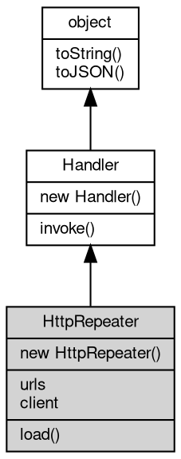

# 对象 HttpRepeater
HttpRepeater 是一个 HTTP 请求转发器，可以将 HTTP 请求转发到指定的后端服务器并获得响应。它常常用于需要在前端与多个服务端交互的复杂系统中，或者用于负载均衡

使用 HttpRepeater 非常简单，只需要在创建实例时为其提供后端服务器的 URL 或负载均衡 URL 数组即可。

如下是一个使用单个后端的示例：

```JavaScript
var http = require('http');
var serverUrl = 'http://localhost:' + actualPort + '/example'
var repeater = new http.Repeater(serverUrl)

var server = new http.Server(8081, repeater);
server.start();
```

下面是一个使用 URL 数组实现负载均衡的示例：

```JavaScript
var serverURLs = [
    'http://server1.example.com',
    'http://server2.example.com',
    'http://server3.example.com'
]
var repeater = new http.Repeater(serverURLs)

var server = new http.Server(8081, repeater);
server.start();
```

## 继承关系


## 构造函数
        
### HttpRepeater
**HttpRepeater 构造函数，创建一个新的 HttpRepeater 对象**

```JavaScript
new HttpRepeater(String url);
```

调用参数:
* url: String, 指定一个后端服务器 [url](../../module/ifs/url.md)

--------------------------
**HttpRepeater 构造函数，创建一个新的 HttpRepeater 对象**

```JavaScript
new HttpRepeater(Array urls);
```

调用参数:
* urls: Array, 指定一组后端服务器 [url](../../module/ifs/url.md)

## 成员属性
        
### urls
**NArray, 查询当前后端服务器 [url](../../module/ifs/url.md) 列表**

```JavaScript
readonly NArray HttpRepeater.urls;
```

--------------------------
### client
**[HttpClient](HttpClient.md), 请求转发处理器内部使用的 [HttpClient](HttpClient.md) 对象**

```JavaScript
readonly HttpClient HttpRepeater.client;
```

## 成员函数
        
### load
**加载一组新的后端 [url](../../module/ifs/url.md)**

```JavaScript
HttpRepeater.load(Array urls);
```

调用参数:
* urls: Array, 指定一组后端服务器 [url](../../module/ifs/url.md)

--------------------------
### invoke
**处理一个消息或对象**

```JavaScript
Handler HttpRepeater.invoke(object v) async;
```

调用参数:
* v: [object](object.md), 指定处理的消息或对象

返回结果:
* [Handler](Handler.md), 返回下一步的处理器

--------------------------
### toString
**返回对象的字符串表示，一般返回 "[Native Object]"，对象可以根据自己的特性重新实现**

```JavaScript
String HttpRepeater.toString();
```

返回结果:
* String, 返回对象的字符串表示

--------------------------
### toJSON
**返回对象的 JSON 格式表示，一般返回对象定义的可读属性集合**

```JavaScript
Value HttpRepeater.toJSON(String key = "");
```

调用参数:
* key: String, 未使用

返回结果:
* Value, 返回包含可 JSON 序列化的值

