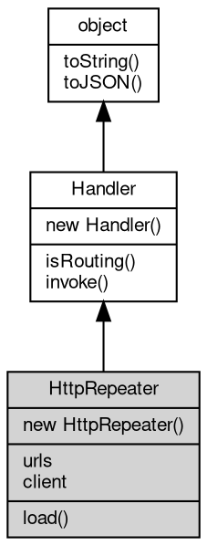

# Object HttpRepeater
An HTTP request forwarder (reverse proxy) to one or more backend servers

HttpRepeater is a handler that forwards the HTTP requests it receives to a
backend server and copies the backend response back. With several urls it also
balances the requests and with a target [path](../../module/ifs/path.md) it rewrites the address, so the
class covers front-end/back-end separation, a service that hides several
internal servers, and simple load balancing.

Concepts:
- **Rotation**: the urls are used one per request in round-robin order; after
  the last one the first is used again. load replaces the whole list and
  restarts the rotation.
- **Address rewriting**: the target pathname is prefixed to the request
  address, while the method, the headers (minus Host and Connection), the
  query string and the body are forwarded. The backend status code, status
  message, headers and body are copied to the response, so the client sees the
  backend's answer.
- **URL validation**: every [url](../../module/ifs/url.md) must contain a hostname and must not contain a
  query string or a fragment; an empty [url](../../module/ifs/url.md) array is rejected. load validates
  the whole list before replacing the current urls, so a failed load leaves
  the previous list in place.
- **The inner client**: requests are sent by a dedicated [HttpClient](HttpClient.md) with
  cookies, automatic redirects and automatic decoding disabled and an empty
  user agent, so a backend sees what the client sent; adjust it through client
  when a backend needs different behavior.

Obtained from:
- `new [http.Repeater](../../module/ifs/http.md#Repeater)([url](../../module/ifs/url.md))` / `new [http.Repeater](../../module/ifs/http.md#Repeater)(urls)` — the class is exposed
  as `http.Repeater` and as HttpRepeater;
- `new [mq.Handler](../../module/ifs/mq.md#Handler)('http://host/...')` — the address form of the [Handler](Handler.md)
  constructor returns a repeater.

Example 1 — single backend and [path](../../module/ifs/path.md) prefixing:

```JavaScript
const http = require('http');

// a backend that reports the path it received
const backend = new http.Server(0, (req, res) => {
    res.write('backend ' + req.address);
});
backend.start();

// the target path is prefixed to the request path
const repeater = new http.Repeater('http://127.0.0.1:' + backend.socket.localPort + '/api');

const req = new http.Request();
req.address = req.value = '/users';
repeater.invoke(req);
console.log(req.response.read().toString()); // backend /api/users

backend.stop();
```

Example 2 — load balancing with a [url](../../module/ifs/url.md) array:

```JavaScript
const http = require('http');

const a = new http.Server(0, (req, res) => {
    res.write('A');
});
const b = new http.Server(0, (req, res) => {
    res.write('B');
});
a.start();
b.start();

// the urls are used in rotation, one request each
const repeater = new http.Repeater([
    'http://127.0.0.1:' + a.socket.localPort,
    'http://127.0.0.1:' + b.socket.localPort
]);

for (let i = 0; i < 4; i++) {
    const req = new http.Request();
    req.address = req.value = '/';
    repeater.invoke(req);
    console.log(req.response.read().toString()); // A B A B
}

a.stop();
b.stop();
```

Example 3 — [url](../../module/ifs/url.md) validation and the inner client configuration:

```JavaScript
const http = require('http');

const repeater = new http.Repeater('http://127.0.0.1:8080/root');
console.log(repeater.urls.length); // 1
console.log(repeater.client.userAgent === ''); // true

try {
    new http.Repeater([]);
} catch (e) {
    console.log(e.name); // TypeError
}

try {
    new http.Repeater('http://127.0.0.1:8080/?q=1');
} catch (e) {
    console.log(e.number); // 20024
}
```

## Inheritance

```dot
digraph {
    node [fontname="Helvetica,sans-Serif", fontsize=10, shape="record", style="filled", fillcolor="white"];

    object [tooltip="object", URL="object.md", label="{object|toString()\ltoJSON()\l}"];
    Handler [tooltip="Handler", URL="Handler.md", label="{Handler|new Handler()\l|isRouting()\linvoke()\l}"];
    HttpRepeater [tooltip="HttpRepeater", fillcolor="lightgray", id="me", label="{HttpRepeater|new HttpRepeater()\l|urls\lclient\l|load()\l}"];

    object -> Handler [dir=back];
    Handler -> HttpRepeater [dir=back];
}
```

## Constructors
        
### HttpRepeater
**HttpRepeater constructor, creates a new HttpRepeater [object](object.md)**

```JavaScript
new HttpRepeater(String url);
```

Parameters:
* url: String, specifies a backend server [url](../../module/ifs/url.md)

Parses [url](../../module/ifs/url.md) and builds the forwarder around it; the [url](../../module/ifs/url.md) must contain a
hostname and must not contain a query string or a fragment, otherwise the
constructor throws. A single [url](../../module/ifs/url.md) means no balancing: every request goes to
the same backend, with the target pathname prefixed to the request
address.

--------------------------
**HttpRepeater constructor, creates a new HttpRepeater [object](object.md)**

```JavaScript
new HttpRepeater(String urls[]);
```

Parameters:
* urls[]: String, specifies a group of backend server urls

Takes the same [url](../../module/ifs/url.md) form as the single-[url](../../module/ifs/url.md) constructor and accepts a list,
in which case the requests are rotated through the urls. The list must not
be empty and every [url](../../module/ifs/url.md) is validated the same way.

Example — two backends behind one handler:

```JavaScript
const http = require('http');

const repeater = new http.Repeater([
    'http://127.0.0.1:8080/',
    'http://127.0.0.1:8081/base'
]);
console.log(repeater.urls.length); // 2
```

## Properties
        
### urls
**String, queries the current list of backend server urls**

```JavaScript
readonly String HttpRepeater.urls;
```

Returns one string per [url](../../module/ifs/url.md), in the same form they were given (the
normalized [url](../../module/ifs/url.md) produced by parsing). The rotation index and the internal
client are not part of the value.

Example — read the list back:

```JavaScript
const http = require('http');

const repeater = new http.Repeater(['http://127.0.0.1:8080/']);
console.log(repeater.urls[0]); // http://127.0.0.1:8080/
```

--------------------------
### client
**[HttpClient](HttpClient.md), the [HttpClient](HttpClient.md) [object](object.md) used internally by the request forwarding handler**

```JavaScript
readonly HttpClient HttpRepeater.client;
```

The client is created with cookies, automatic redirects and automatic
decoding disabled and with an empty user agent, so the forwarded request
stays close to the original one. Change its properties (for example
userAgent, timeout or keepAlive) to configure the backend calls; the same
client is reused for every request of the repeater.

Example — configure the backend calls:

```JavaScript
const http = require('http');

const repeater = new http.Repeater('http://127.0.0.1:8080/');
console.log(repeater.client.autoRedirect); // false
repeater.client.userAgent = 'my-proxy';
console.log(repeater.client.userAgent); // my-proxy
```

## Methods
        
### load
**loads a new group of backend urls**

```JavaScript
HttpRepeater.load(String urls[]);
```

Parameters:
* urls[]: String, specifies a group of backend server urls

Validates the whole list and then replaces the current urls in one step,
so a validation error leaves the previous list active. The rotation
restarts from the first [url](../../module/ifs/url.md) of the new list. An empty list is rejected
like it is in the constructor.

Example — replace the urls and keep them on error:

```JavaScript
const http = require('http');

const repeater = new http.Repeater('http://127.0.0.1:8080/root');
console.log(repeater.urls.length); // 1

repeater.load(['http://127.0.0.1:8081/a', 'http://127.0.0.1:8082/b']);
console.log(repeater.urls.length); // 2

try {
    repeater.load([]);
} catch (e) {
    console.log(e.name); // TypeError, the previous urls are kept
}
console.log(repeater.urls.length); // 2
```

--------------------------
### isRouting
**Queries whether the current handler supports routing**

```JavaScript
Boolean HttpRepeater.isRouting();
```

Returns:
* Boolean, returns whether the current handler supports routing

A routing handler matches messages by itself and is used for the message
as it is; a non-routing handler is a terminal stage of a chain or a
function. [Routing](Routing.md), HttpRepeater and file handlers return true, while
JavaScript handlers and chains made only of them return false. [Chain](Chain.md)
returns true when at least one of its elements routes; [Routing.append](Routing.md#append)
reads the flag to decide whether the remaining [path](../../module/ifs/path.md) must be handed to the
handler as a sub-route.

Example — the flag of the concrete classes:

```JavaScript
const mq = require('mq');

console.log(new mq.Routing({
    '/a': () => {}
}).isRouting()); // true
console.log(new mq.Chain([() => {}]).isRouting()); // false

const repeater = new mq.Handler('http://127.0.0.1:8080/');
console.log(repeater.isRouting()); // true
```

--------------------------
### invoke
**Processes a message or [object](object.md)**

```JavaScript
Handler HttpRepeater.invoke(object v) async;
```

Parameters:
* v: [object](object.md), the message or [object](object.md) to [process](../../module/ifs/process.md)

Returns:
* [Handler](Handler.md), returns the next handler

The call is a single stage of the pipeline: the handler processes v and
the returned value is the next handler to run, or null when the message
processing is finished. For a JavaScript handler this is the value the
function returned (converted to a handler); for a routing it is the
handler of the matched rule; for a chain it is the handler that should run
next. The method is asynchronous and blocks the current fiber until the
stage completes; [mq.invoke](../../module/ifs/mq.md#invoke) is the loop that keeps invoking the returned
handler until null.

Example — run one stage and continue with the returned handler:

```JavaScript
const mq = require('mq');

const step = new mq.Handler((v) => {
    console.log('stage: ' + v.value);
    return new mq.Handler((v) => console.log('returned handler ran'));
});

const msg = new mq.Message();
msg.value = 'x';
const next = step.invoke(msg);
console.log(next instanceof mq.Handler); // true
next.invoke(msg);
```

--------------------------
### toString
**Returns the string form of the [object](object.md)**

```JavaScript
String HttpRepeater.toString();
```

Returns:
* String, returns the string form of the [object](object.md)

The base implementation reports an error: a native [object](object.md) has no implicit
text form, and only the classes whose value can be written as a string
override the member. [Buffer](Buffer.md) returns its content decoded with the given
[encoding](../../module/ifs/encoding.md), [HttpCookie](HttpCookie.md) returns "name=value", and so on; an override commonly
accepts optional arguments ([Buffer.toString](Buffer.md#toString) takes [encoding](../../module/ifs/encoding.md), start and
end) that are not part of this declaration.

Calling the member on a class that does not override it throws
"<Class>: the [object](object.md) can not be converted to string.", which is the
behavior to rely on when probing whether a value has a string form. See
toJSON for the serialization hook.

--------------------------
### toJSON
**Returns the JSON representation of the [object](object.md)**

```JavaScript
Value HttpRepeater.toJSON(String key = "");
```

Parameters:
* key: String, the property name of the value being serialized

Returns:
* Value, returns the JSON-serializable value

JSON.stringify(value) calls value.toJSON(key) when the member exists and
serializes the returned value in its place; the key argument carries the
property name of the value inside its parent [object](object.md) (an empty string at
the top level) and may be used to build a keyed form. The base
implementation returns a plain [object](object.md) holding the readable properties of
the instance, so a native [object](object.md) serializes without per-class code; a
class with a portable shape such as [Buffer](Buffer.md) overrides it, and a JavaScript
class may override it in the same way.

The member is normally reached through JSON.stringify rather than called
directly; calling it returns the same value JSON.stringify would
serialize.

