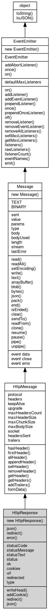

# Object HttpResponse
The HTTP response message: what a handler writes and what a client receives

An HttpResponse carries the status code and message, the live header collection, the
trailer collection and the body. A server handler writes the reply through
request.response (the same [object](object.md) arrives as the handler's second argument); the client
functions return an HttpResponse whose body is already readable. The header and body API
is inherited from [HttpMessage](HttpMessage.md) and [Message](Message.md). Node.js has [http.ServerResponse](../../module/ifs/http.md#ServerResponse) on the server
side and [http.IncomingMessage](../../module/ifs/http.md#IncomingMessage) for a received response; fibjs uses one class for both.

Concepts:

- **Writing model**: write, [json](../../module/ifs/json.md), writeHead and the header setters accumulate the
  response; nothing is sent while the handler runs and the whole reply is serialized when
  the handler returns (or when send/sendTo is called explicitly), at which point
  headersSent becomes true. The default is a 200 with an empty body; a plain 200 without
  Last-Modified or Cache-Control also receives Cache-Control: no-cache, no-store and
  Expires: -1 from the [http](../../module/ifs/http.md) handler.
- **Status**: statusCode and status are the same numeric value, statusMessage and
  statusText are the same reason phrase. An empty statusMessage lets the writer use the
  standard phrase of the code (200 becomes "200 OK"); a custom one is written verbatim
  after the code. ok is true exactly for the 2xx range.
- **[Headers](Headers.md), cookies and trailers**: headers is the live [Headers](Headers.md) collection; cookies
  collects every Set-Cookie header as [HttpCookie](HttpCookie.md) objects and addCookie queues one more;
  addTrailers queues the trailer section sent after a chunked body (see [HttpMessage](HttpMessage.md)).
- **Fetch metadata**: on a response produced by the client, [url](../../module/ifs/url.md) is the final URL after
  the redirects were followed, redirected reports whether that happened and type is the
  Fetch type ("basic", or "error" for Response.error()); a hand-built response keeps
  them empty, false and "basic".
- **Web Response form**: new [http.Response](../../module/ifs/http.md#Response)(body, options) and the static [json](../../module/ifs/json.md), redirect
  and error factories mirror the WHATWG Response constructors; accepted bodies are
  string, [Buffer](Buffer.md), [Blob](Blob.md), [FormData](FormData.md), [URLSearchParams](URLSearchParams.md) and seekable streams.

Obtained from:
- `request.response` in an [http.Server](../../module/ifs/http.md#Server) handler — the reply of the request being served;
- `http.getSync(...)`, `http.requestSync(...)`, `http.fetch(...)` and the other client
  functions — the answer, body already readable;
- `new [http.Response](../../module/ifs/http.md#Response)()` / `new [http.Response](../../module/ifs/http.md#Response)(body, options)` — a message built in memory
  and serialized with sendTo();
- `[http.Response](../../module/ifs/http.md#Response).[json](../../module/ifs/json.md)()`, `[http.Response](../../module/ifs/http.md#Response).redirect()` and `[http.Response](../../module/ifs/http.md#Response).error()` — the
  Web-style static factories.

Example 1 — write a status, a header and the body in a handler:

```JavaScript
const http = require('http');

const server = new http.Server(0, (req) => {
    const res = req.response;
    res.statusCode = 201;
    res.setHeader('Content-Type', 'text/plain');
    res.write('created');
});
server.start();
const port = server.socket.localPort;

const res = http.getSync('http://127.0.0.1:' + port + '/items');
console.log(res.statusCode, res.statusMessage); // 201 Created
console.log(res.text()); // created

server.stop();
```

Example 2 — build a response in memory and serialize it:

```JavaScript
const http = require('http');
const io = require('io');

const res = http.Response.json({
    ok: true
}, {
    status: 201,
    statusText: 'Created'
});
console.log(res.statusCode, res.statusMessage, res.ok); // 201 Created true
console.log(res.firstHeader('Content-Type')); // application/json

const wire = new io.MemoryStream();
res.sendTo(wire);
wire.rewind();
console.log(wire.readAll().toString().split('\r\n')[0]); // HTTP/1.1 201 Created
```

Example 3 — cookies and two writes seen by a client:

```JavaScript
const http = require('http');

const server = new http.Server(0, (req) => {
    const res = req.response;
    res.addCookie({
        name: 'seen',
        value: '1',
        httpOnly: true
    });
    res.write('part1');
    res.write('part2');
});
server.start();
const port = server.socket.localPort;

const res = http.getSync('http://127.0.0.1:' + port + '/');
console.log(res.text()); // part1part2
console.log(res.cookies[0].name, res.cookies[0].httpOnly); // seen true

server.stop();
```

Notes:
- write appends bytes and its return value is not the number of bytes sent; do not use
  it as the handler result (see [HttpServer](HttpServer.md) for the handler contract).
- A response is not reusable after sendTo()/send(); readFrom() parses a received
  response from a [BufferedStream](BufferedStream.md).

## Inheritance

```dot
digraph {
    node [fontname="Helvetica,sans-Serif", fontsize=10, shape="record", style="filled", fillcolor="white"];

    object [tooltip="object", URL="object.md", label="{object|toString()\ltoJSON()\l}"];
    EventEmitter [tooltip="EventEmitter", URL="EventEmitter.md", label="{EventEmitter|new EventEmitter()\l|EventEmitter\l|addAbortListener()\lonce()\lon()\l|defaultMaxListeners\l|on()\laddListener()\laddEventListener()\lprependListener()\lonce()\lprependOnceListener()\loff()\lremoveListener()\lremoveEventListener()\lremoveAllListeners()\lsetMaxListeners()\lgetMaxListeners()\llisteners()\lrawListeners()\llistenerCount()\leventNames()\lemit()\l}"];
    Message [tooltip="Message", URL="Message.md", label="{Message|new Message()\l|TEXT\lBINARY\l|sent\lvalue\lparams\ltype\lbody\lbodyUsed\llength\lstream\llastError\l|read()\lreadAll()\lsetEncoding()\lwrite()\ltext()\larrayBuffer()\lblob()\lbytes()\ljson()\lpack()\lend()\lisEnded()\lclear()\lsendTo()\lreadFrom()\lclone()\lresume()\lpause()\lpipe()\lunpipe()\l|event data\levent close\levent error\l}"];
    HttpMessage [tooltip="HttpMessage", URL="HttpMessage.md", label="{HttpMessage|protocol\lheaders\lkeepAlive\lupgrade\lmaxHeadersCount\lmaxHeaderSize\lmaxChunkSize\lmaxBodySize\lsocket\lheadersSent\ltrailers\l|hasHeader()\lfirstHeader()\lallHeader()\lappendHeader()\lsetHeader()\lremoveHeader()\lgetHeader()\lgetHeaders()\laddTrailers()\lformData()\l}"];
    HttpResponse [tooltip="HttpResponse", fillcolor="lightgray", id="me", label="{HttpResponse|new HttpResponse()\l|json()\lredirect()\lerror()\l|statusCode\lstatusMessage\lstatusText\lstatus\lok\lcookies\lurl\lredirected\ltype\l|writeHead()\laddCookie()\lredirect()\ljson()\l}"];

    object -> EventEmitter [dir=back];
    EventEmitter -> Message [dir=back];
    Message -> HttpMessage [dir=back];
    HttpMessage -> HttpResponse [dir=back];
}
```

## Constructors
        
### HttpResponse
**Creates an empty 200 response**

```JavaScript
new HttpResponse();
```

The message starts with statusCode 200 and an empty statusMessage (the writer then
fills in the standard phrase), no headers, no trailers and an empty body; ok is true
and type is "basic". Assign the status and write the body with write()/[json](../../module/ifs/json.md)(); the
Web-style constructor and the static factories build a complete response in one
call.

--------------------------
**Creates a response from a body and options (Web API compatible)**

```JavaScript
new HttpResponse(Value body,
    Object options = {});
```

Parameters:
* body: Value, the body: string, [Buffer](Buffer.md), [Blob](Blob.md), [FormData](FormData.md), [URLSearchParams](URLSearchParams.md), stream or null
* options: Object, the options [object](object.md), supporting status, statusText and headers

body may be null or undefined for no body, a string, [Buffer](Buffer.md), [Blob](Blob.md), [FormData](FormData.md),
[URLSearchParams](URLSearchParams.md) or a seekable stream; a Content-Type is added when the options do
not provide one (text/plain;charset=UTF-8 for strings, application/octet-stream for
binary data, multipart/form-data with a generated boundary for [FormData](FormData.md) and plain
objects). options supports status, statusText and headers, where headers may be an
[object](object.md) or a [Headers](Headers.md) collection and replaces any default. Matches the WHATWG
`new Response(body, init)`.

## Static Methods
        
### json
**Creates a response with a JSON body (static factory)**

```JavaScript
static HttpResponse HttpResponse.json(Value data,
    Object options = {});
```

Parameters:
* data: Value, the data to serialize to JSON
* options: Object, the options [object](object.md), supporting status, statusText and headers

Returns:
* HttpResponse, returns a new HttpResponse [object](object.md)

The returned response carries Content-Type: application/[json](../../module/ifs/json.md), status 200 and the
given options (status, statusText and headers), like the body constructor. The Web
standard Response.json() has the same name; Node's [http](../../module/ifs/http.md) [module](../../module/ifs/module.md) has no equivalent.

--------------------------
### redirect
**Creates a redirect response (static factory)**

```JavaScript
static HttpResponse HttpResponse.redirect(String url,
    Integer status = 302);
```

Parameters:
* url: String, the redirect target URL
* status: Integer, the redirect status code, default is 302

Returns:
* HttpResponse, returns a new HttpResponse [object](object.md)

Sets statusCode to status (default 302) and Location to the URL; unlike the instance
redirect() it validates nothing. Matches the Web Response.redirect([url](../../module/ifs/url.md), status).

--------------------------
### error
**Creates an error response (static factory)**

```JavaScript
static HttpResponse HttpResponse.error();
```

Returns:
* HttpResponse, returns a new HttpResponse [object](object.md) with type="error"

The result has statusCode 0, type "error" and ok false, matching the Web
Response.error(); its body is empty. Fetch-style callers can use it to report a
network-level failure instead of throwing.

--------------------------
### addAbortListener
**Registers a one-shot abort handler on an [AbortSignal](AbortSignal.md)**

```JavaScript
static Object HttpResponse.addAbortListener(EventEmitter signal,
    Function(Object ev) func);
```

Parameters:
* signal: [EventEmitter](EventEmitter.md), the [AbortSignal](AbortSignal.md) [object](object.md) to listen to
* func: Function(Object ev), the handler for the abort event

Returns:
* Object, returns a Disposable [object](object.md) containing a `[Symbol.dispose]` method

The handler is called at most once when the signal is aborted, and it is removed from the
signal afterwards. If the signal is already aborted the handler is invoked synchronously.
The returned [object](object.md) has a `[Symbol.dispose]()` method that removes the handler, so it can be
released before the abort happens.

Example — abort handling with automatic cleanup:

```JavaScript
const events = require('events');

const controller = new AbortController();
const disposable = events.addAbortListener(controller.signal,
    () => console.log('aborted'));

controller.abort(); // aborted
disposable[Symbol.dispose](); // safe to call after the listener fired
console.log(controller.signal.listenerCount('abort')); // 0
```

--------------------------
### once
**Creates a Promise resolved by the next occurrence of an event**

```JavaScript
static Object HttpResponse.once(EventEmitter emitter,
    Value ev,
    Object options = {});
```

Parameters:
* emitter: [EventEmitter](EventEmitter.md), the event emitter [object](object.md) to listen to
* ev: Value, the event name to listen for
* options: Object, optional parameter [object](object.md)

Returns:
* Object, returns a Promise that resolves with the array of event parameters

The Promise resolves with the array of the emit arguments when the event fires; it rejects
when `error` is emitted while waiting, unless the waited event is `error` itself, or when
the signal option aborts. The temporary listeners are removed when the Promise settles.

options supports the following option:

```JavaScript
// fragment: options
({
    "signal": null // AbortSignal; aborting rejects the Promise with an AbortError
});
```

Example — awaiting the next occurrence of an event:

```JavaScript
const EventEmitter = require('events');

(async () => {
    const emitter = new EventEmitter();
    const waiting = EventEmitter.once(emitter, 'ready');

    emitter.emit('ready', 200, 'ok');
    console.log(JSON.stringify(await waiting)); // [200,"ok"]
})();
```

--------------------------
### on
**Creates an async iterator that yields event occurrences**

```JavaScript
static Object HttpResponse.on(EventEmitter emitter,
    Value ev,
    Object options = {});
```

Parameters:
* emitter: [EventEmitter](EventEmitter.md), the event emitter [object](object.md) to listen to
* ev: Value, the event name to listen for
* options: Object, optional parameter [object](object.md)

Returns:
* Object, returns an AsyncIterator [object](object.md)

Each next() resolves with `{ value: [args...], done: false }` when the event fires and with
`{ done: true }` after an event named in the `close` option fires or the signal aborts; an
`error` event rejects the pending call. The listeners are registered when the iterator is
created and removed when the iteration ends or the signal aborts.

options supports the following options:

```JavaScript
// fragment: options
({
    "signal": null, // AbortSignal; aborting rejects pending and future next() calls
    "close": [] // event names; the first one to fire ends the iteration
});
```

Example — iterating the occurrences of an event:

```JavaScript
const EventEmitter = require('events');

(async () => {
    const emitter = new EventEmitter();
    const iterator = EventEmitter.on(emitter, 'data', {
        close: ['end']
    });

    emitter.emit('data', 1);
    emitter.emit('data', 2);
    emitter.emit('end');

    for await (const args of iterator)
    console.log(JSON.stringify(args)); // [1] then [2]
})();
```

## Static Properties
        
### defaultMaxListeners
**Integer, The [process](../../module/ifs/process.md)-wide default listener limit reported by getMaxListeners()**

```JavaScript
static Integer HttpResponse.defaultMaxListeners;
```

Defaults to 10. Assigning a value changes getMaxListeners() for every emitter that never
called setMaxListeners(); an emitter with an explicit limit keeps it. The limit is
informational: fibjs never warns when the number of listeners exceeds it.

## Constants
        
### TEXT
**[Message](Message.md) type 1, representing a text type**

```JavaScript
const HttpResponse.TEXT = 1;
```

Set `type` to this value on messages whose payload is text: [WebSocketMessage](WebSocketMessage.md) then delivers
`data` as a String, and application handlers can decode the body as text. The default type
of a new message is BINARY.

--------------------------
### BINARY
**[Message](Message.md) type 2, representing a binary type**

```JavaScript
const HttpResponse.BINARY = 2;
```

The default type of a new message. The payload is treated as raw bytes; a [WebSocketMessage](WebSocketMessage.md)
with this type delivers `data` as a [Buffer](Buffer.md).

## Properties
        
### statusCode
**Integer, Queries and sets the numeric status code**

```JavaScript
Integer HttpResponse.statusCode;
```

Default 200; the value is written verbatim into the status line and drives ok and the
computed reason phrase, while the parser sets it from a received status line.
statusCode is the Node.js name and status is an alias.

--------------------------
### statusMessage
**String, Queries and sets the reason phrase**

```JavaScript
String HttpResponse.statusMessage;
```

Empty by default: the writer then derives the standard phrase of the status code
("OK" for 200, "Not Found" for 404, "<code> Unknown" for an unknown code). A
non-empty value is written after the code as given, so it may differ from the
standard text. statusText is an alias.

--------------------------
### statusText
**String, Alias of statusMessage, provided by the Web API**

```JavaScript
String HttpResponse.statusText;
```

Reads and writes the same value as statusMessage. MDN's Response.statusText is
always the standard phrase; in fibjs a custom value set here is written to the wire
verbatim.

--------------------------
### status
**Integer, Alias of statusCode**

```JavaScript
Integer HttpResponse.status;
```

Reads and writes the same numeric value as statusCode, so the two names never
disagree.

--------------------------
### ok
**Boolean, Whether the status code is in the 2xx range, read-only**

```JavaScript
readonly Boolean HttpResponse.ok;
```

Computed from the current statusCode (200-299) like the Web Response.ok;
Response.error() is the notable factory with a non-2xx status (0). It only reflects
the code: a hand-built 500 reports false and a hand-built 204 reports true.

--------------------------
### cookies
**[HttpCookie](HttpCookie.md), The Set-Cookie headers as an array of [HttpCookie](HttpCookie.md) objects, read-only**

```JavaScript
readonly HttpCookie HttpResponse.cookies;
```

Parsed once from every Set-Cookie header and cached; addCookie() appends to the same
list and the whole list is serialized when the response is sent. The objects are a
read view: mutating one does not rewrite the header. Node.js has no cookie
collection on ServerResponse.

Example — collect the cookies of a response:

```JavaScript
const http = require('http');

const res = new http.Response();
res.appendHeader('Set-Cookie', 'a=1; Path=/');
res.addCookie({
    name: 'b',
    value: '2'
});
console.log(res.cookies.map((c) => c.name).join(',')); // a,b
```

--------------------------
### url
**String, The final URL of a client response, read-only**

```JavaScript
readonly String HttpResponse.url;
```

Filled by the client functions after the request completes: the address after all
followed redirects. Empty on a hand-built response. Matches the Web Response.url.

--------------------------
### redirected
**Boolean, Whether the client followed at least one redirect, read-only**

```JavaScript
readonly Boolean HttpResponse.redirected;
```

False for a hand-built response and for a response received without redirects; true
when autoRedirect followed a 30x answer. The intermediate redirect responses are not
delivered; see autoRedirect in the [http](../../module/ifs/http.md) [module](../../module/ifs/module.md). Matches the Web Response.redirected.

--------------------------
### type
**String, The Fetch type of the response, read-only**

```JavaScript
readonly String HttpResponse.type;
```

"basic" for a normal response and "error" for a response produced by the static
Response.error() factory; the Web values "cors" and "opaque" are never produced.
This member overrides [Message.type](Message.md#type). The names follow the Fetch standard.

--------------------------
### protocol
**String, protocol version information, the allowed format is: HTTP/#.#**

```JavaScript
String HttpResponse.protocol;
```

Default HTTP/1.1. The setter validates the form and throws error 20024 for anything else;
a version above 1.0 enables keepAlive and 1.0 disables it. A parsed message sets the
version from its start line. Node.js exposes the same value as httpVersion on
IncomingMessage and ServerResponse.

Example — the version drives keep-alive:

```JavaScript
const http = require('http');

const req = new http.Request();
console.log(req.protocol, req.keepAlive); // HTTP/1.1 true

req.protocol = 'HTTP/1.0';
console.log(req.protocol, req.keepAlive); // HTTP/1.0 false

req.appendHeader('Connection', 'keep-alive');
console.log(req.keepAlive); // true
```

--------------------------
### headers
**[Headers](Headers.md), container holding the [http](../../module/ifs/http.md) headers of the message, read-only property**

```JavaScript
readonly Headers HttpResponse.headers;
```

The live [Headers](Headers.md) collection of the message: the property itself cannot be replaced, but
the collection can be modified with its own methods (set, append, delete, ...) and the
change is reflected in the wire output. Parsed messages store keys lowercase, lookup is
case-insensitive either way. Node.js uses a plain [object](object.md) plus rawHeaders instead.

--------------------------
### keepAlive
**Boolean, queries and sets whether to keep the connection alive**

```JavaScript
Boolean HttpResponse.keepAlive;
```

Default true. Setting protocol above 1.0 turns it on and 1.0 turns it off, and appending
or parsing a Connection header updates it ('close' clears, 'keep-alive' and 'upgrade' set).
On output the value selects the Connection header written by sendTo. Node's IncomingMessage
has no such property, persistence belongs to the Agent.

--------------------------
### upgrade
**Boolean, queries and sets whether the protocol is upgraded**

```JavaScript
Boolean HttpResponse.upgrade;
```

Default false. Set when a Connection: Upgrade header is appended or parsed; the [WebSocket](WebSocket.md)
handshake relies on it. Node.js reports the same condition through the 'upgrade' event.

--------------------------
### maxHeadersCount
**Integer, queries and sets the maximum number of request headers, default is 128**

```JavaScript
Integer HttpResponse.maxHeadersCount;
```

The parser fails with error 20024 when a message carries more header lines than this; it
is used when reading requests. A negative value throws a RangeError (20006). Node.js has
an [http.Server](../../module/ifs/http.md#Server).maxHeadersCount property instead of a per-message one.

--------------------------
### maxHeaderSize
**Integer, queries and sets the maximum request header length, default is 8192**

```JavaScript
Integer HttpResponse.maxHeaderSize;
```

The maximum size in bytes of one header line accepted by the parser; a longer line fails
with error 20024. A negative value throws a RangeError (20006). Node.js supports the
[process](../../module/ifs/process.md)-wide --max-[http](../../module/ifs/http.md)-header-size setting instead.

--------------------------
### maxChunkSize
**Integer, queries and sets the maximum chunk size in MB, default is 2**

```JavaScript
Integer HttpResponse.maxChunkSize;
```

Bounds a single chunk of a chunked body while it is parsed: a larger chunk fails with
error 20024 ("[HttpMessage](HttpMessage.md): chunk is too huge."). 0 is accepted. Node.js has no equivalent
per-message setting.

--------------------------
### maxBodySize
**Integer, queries and sets the maximum body size in MB, default is 64**

```JavaScript
Integer HttpResponse.maxBodySize;
```

While parsing, a Content-Length or chunked body larger than this fails with error 20024
("[HttpMessage](HttpMessage.md): body is too huge."); -1 disables the limit and 0 reads no body at all. Set
it before readFrom. Node.js has no per-message body limit.

--------------------------
### socket
**[Stream](Stream.md), queries the source socket of the current [object](object.md)**

```JavaScript
readonly Stream HttpResponse.socket;
```

The underlying device stream the message was read from; null when the message was built in
memory and reset by clear(). It differs from stream (inherited from [Message](Message.md)), the buffered
wrapper the parser consumed. Node.js exposes socket on IncomingMessage only.

--------------------------
### headersSent
**Boolean, queries whether the headers have been sent**

```JavaScript
readonly Boolean HttpResponse.headersSent;
```

False for a message built in memory; sendTo and send set it to true when the start line
and headers were written to a stream. On a server response it is true once the reply left
the handler pipeline. Node's ServerResponse.headersSent has the same meaning.

--------------------------
### trailers
**[Headers](Headers.md), container holding the [http](../../module/ifs/http.md) trailer headers of the message, read-only property**

```JavaScript
readonly Headers HttpResponse.trailers;
```

A live [Headers](Headers.md) collection filled with the trailer section of a parsed chunked body and
used to queue outgoing trailers together with addTrailers; empty for messages without
trailers and reset by clear().

--------------------------
### sent
**Boolean, Whether the current message has been sent**

```JavaScript
readonly Boolean HttpResponse.sent;
```

The base [Message](Message.md) and [WebSocketMessage](WebSocketMessage.md) always report false; [HttpMessage](HttpMessage.md) reports the real
flag, which sendTo and send set when the message was written to a stream. Node.js has no
equivalent property on IncomingMessage.

--------------------------
### value
**String, The basic content of the message**

```JavaScript
String HttpResponse.value;
```

A free-form string that carries the value a handler dispatches on: [mq.Routing](../../module/ifs/mq.md#Routing) stores the
matched [path](../../module/ifs/path.md) or the captured value in it, and an [HttpRequest](HttpRequest.md) mirrors its [path](../../module/ifs/path.md). Default is
an empty string.

--------------------------
### params
**NArray, The basic parameters of the message**

```JavaScript
readonly NArray HttpResponse.params;
```

Holds the capture groups that [mq.Routing](../../module/ifs/mq.md#Routing) fills when a pattern with capture groups matches;
the handler receives them here and as extra function arguments. The array is a read view:
writing into it from JavaScript does not change the message.

--------------------------
### body
**[Stream](Stream.md), The stream [object](object.md) containing the data part of the message**

```JavaScript
Stream HttpResponse.body;
```

A buffered body is seekable and can be read from the beginning more than once; assigning a
non-seekable stream makes the body streaming, so it can be consumed only once. The getter
returns null when the message has no body or when the buffered body is empty (size 0).

--------------------------
### bodyUsed
**Boolean, Queries whether the body of the message has been consumed**

```JavaScript
readonly Boolean HttpResponse.bodyUsed;
```

Set by the consuming readers (text, [json](../../module/ifs/json.md), pack, bytes, arrayBuffer, blob and, on an
[HttpMessage](HttpMessage.md), formData). A buffered body can still be read again after the flag is set; a
streaming body rejects a second consume with TypeError 20024 "body has already been
consumed". read and readAll do not set the flag.

--------------------------
### length
**Long, The length of the data part of the message**

```JavaScript
readonly Long HttpResponse.length;
```

The size in bytes of the buffered body, 0 when the message has no body. It is also 0 for a
streaming body (a response body received from a client), whose size is unknown until it is
read; Node.js exposes the size through the Content-Length header instead of a property.

--------------------------
### stream
**[Stream](Stream.md), Queries the stream [object](object.md) used when the message was read from**

```JavaScript
readonly Stream HttpResponse.stream;
```

The base [Message](Message.md) throws 20009; on an [HttpMessage](HttpMessage.md) and a [WebSocketMessage](WebSocketMessage.md) it is the buffered
stream the message was parsed from, and null when the message was built in memory. It is
distinct from socket, the underlying device stream of an HTTP message.

--------------------------
### lastError
**String, Queries and sets the last error of message processing**

```JavaScript
String HttpResponse.lastError;
```

A free-form string, empty by default; the base message never writes it, handler layers
such as [Chain](Chain.md) record a failure here. clear() preserves it.

## Methods
        
### writeHead
**Sets the status code and appends response headers**

```JavaScript
HttpResponse.writeHead(Integer statusCode,
    Object headers = {});
```

Parameters:
* statusCode: Integer, specifies the return status of the response message
* headers: Object, specifies the response headers to add to the response message

Equivalent to assigning statusCode and then calling appendHeader(headers): existing
headers are kept and the entries of the [object](object.md) or [Headers](Headers.md) collection are added. The
reason phrase is left untouched. See the three-argument overload for an explicit
status message.

--------------------------
**Sets the status code and reason phrase and appends response headers**

```JavaScript
HttpResponse.writeHead(Integer statusCode,
    String statusMessage,
    Object headers = {});
```

Parameters:
* statusCode: Integer, specifies the return status of the response message
* statusMessage: String, specifies the return message of the response message
* headers: Object, specifies the response headers to add to the response message

Same as the two-argument overload plus an explicit statusMessage; headers are
appended, not replaced, matching Node's writeHead(statusCode[, statusMessage[,
headers]]).

--------------------------
### addCookie
**Queues a cookie to be sent with the response**

```JavaScript
HttpResponse.addCookie(HttpCookie | Object cookie);
```

Parameters:
* cookie: [HttpCookie](HttpCookie.md) | Object, the cookie to add

cookie may be an [HttpCookie](HttpCookie.md) [object](object.md) or an options [object](object.md) accepted by the [HttpCookie](HttpCookie.md)
constructor (name, value, [path](../../module/ifs/path.md), domain, expires, secure, httpOnly, ...). The cookie
is appended as one more Set-Cookie header when the response is serialized, after the
values already present. Node.js uses setHeader('Set-Cookie', ...) manually.

--------------------------
### redirect
**Sends a 302 redirect to the client**

```JavaScript
HttpResponse.redirect(String url);
```

Parameters:
* url: String, the redirect address

Sets statusCode to 302 and Location to the URL; the body is not touched. Equivalent
to redirect(302, [url](../../module/ifs/url.md)). Only 301, 302 and 307 are accepted by the explicit overload,
while the static factory Response.redirect() writes any status without validating
it.

--------------------------
**Sends a redirect with an explicit status code**

```JavaScript
HttpResponse.redirect(Integer statusCode,
    String url);
```

Parameters:
* statusCode: Integer, the return status; accepted values are 301, 302 and 307
* url: String, the redirect address

Only 301, 302 and 307 are accepted; any other code throws error 20024 ("Invalid
statusCode ..., expected 301, 302, or 307."). 303 and 308 have to be set manually
with statusCode plus a Location header.

--------------------------
### json
**Writes data as a JSON body, optionally setting status and headers**

```JavaScript
Variant HttpResponse.json(Value data,
    Object options = {}) async;
```

Parameters:
* data: Value, the data to serialize to JSON
* options: Object, the options [object](object.md), supporting status, statusText and headers

Returns:
* Variant, no data; the call writes the encoded body

Serializes data with the [json](../../module/ifs/json.md) [module](../../module/ifs/module.md), appends it to the body and sets Content-Type:
application/[json](../../module/ifs/json.md), replacing an existing value. options supports status, statusText
and headers, which are applied before the body so they are visible on the wire.
Calling [json](../../module/ifs/json.md)() without arguments instead reads the body as JSON, and the static
Response.json() builds a new response.

Example — write JSON with a status and a header:

```JavaScript
const http = require('http');

const res = new http.Response();
res.json({
    n: 1
}, {
    status: 202,
    statusText: 'Accepted',
    headers: {
        'X-Job': '7'
    }
});
console.log(res.statusCode, res.statusMessage, res.firstHeader('X-Job')); // 202 Accepted 7
console.log(res.text()); // {"n":1}
```

--------------------------
**Parses the response body as JSON**

```JavaScript
Variant HttpResponse.json() async;
```

Returns:
* Variant, returns the parsing result

The read form inherited from [Message](Message.md): the body is consumed and decoded, and the
Content-Type must name a JSON media type or the call throws error 20024
("Content-Type is missing." / "Invalid content type."). A buffered body can be read
again after a rewind.

--------------------------
### hasHeader
**checks whether a header of the specified key exists**

```JavaScript
Boolean HttpResponse.hasHeader(String name);
```

Parameters:
* name: String, specifies the key to check

Returns:
* Boolean, returns whether the key exists

Lookup is case-insensitive; returns false when the key was never set. See the headers
property for the collection itself.

--------------------------
### firstHeader
**queries the first header of the specified key**

```JavaScript
String HttpResponse.firstHeader(String name);
```

Parameters:
* name: String, specifies the key to query

Returns:
* String, returns the value corresponding to the key, or null if it does not exist

Returns the first value when the key was appended more than once; a missing key returns
null (not undefined). Use getHeader for the Node.js-style undefined result and allHeader
for every value.

--------------------------
### allHeader
**queries all headers of the specified key**

```JavaScript
NObject HttpResponse.allHeader(String name = "");
```

Parameters:
* name: String, specifies the key to query; passing an empty string returns the result of all keys

Returns:
* NObject, returns an array of all values corresponding to the key, or an empty array if the data does not exist

Returns the values in append order as an array; a missing key returns an empty array. With
an empty name the whole header set is returned as an [object](object.md) whose multi-value keys are
arrays and whose single-value keys are strings, the shape getHeaders() returns.

--------------------------
### appendHeader
**appends a header; appending data does not modify the headers of an existing key**

```JavaScript
HttpResponse.appendHeader(Object map);
```

Parameters:
* map: Object, specifies the key-value data dictionary to append

Appends every entry of the [object](object.md); existing values of the same key are kept, so a key can
end up with several values (Set-Cookie and friends). The overloads cover an [object](object.md) map, a
[Headers](Headers.md) collection, a name with an array of values and a name with a single value; a
Connection entry updates keepAlive/upgrade as it is appended.

Example — append keeps duplicates, setHeader replaces them:

```JavaScript
const http = require('http');

const req = new http.Request();
req.appendHeader('X-Tag', 'a');
req.appendHeader('X-Tag', 'b');
req.appendHeader({
    'X-Tag': 'c'
});

console.log(req.allHeader('X-Tag').join(',')); // a,b,c
console.log(req.firstHeader('X-Tag')); // a

const extra = new http.Headers();
extra.append('X-Tag', 'd');
extra.append('Content-Type', 'text/plain');
req.appendHeader(extra);
console.log(req.allHeader('X-Tag').join(',')); // a,b,c,d
```

--------------------------
**appends headers; appending data does not modify the headers of an existing key**

```JavaScript
HttpResponse.appendHeader(Headers headers);
```

Parameters:
* headers: [Headers](Headers.md), specifies the [Headers](Headers.md) [object](object.md) to append

Appends every value of the given collection in order, duplicates included; useful to merge
another message's headers into this one.

--------------------------
**appends a group of headers with the specified name; appending data does not modify the headers of an existing key**

```JavaScript
HttpResponse.appendHeader(String name,
    Array values);
```

Parameters:
* name: String, specifies the key to append
* values: Array, specifies the group of data to append

Every element of the array is appended as a separate value of the key; non-string scalars
are rendered as strings.

--------------------------
**appends a header; appending data does not modify the headers of an existing key**

```JavaScript
HttpResponse.appendHeader(String name,
    Variant value);
```

Parameters:
* name: String, specifies the key to append
* value: Variant, specifies the data to append

Appends one value; a non-string scalar (number, boolean, Date) is rendered as its string
form. The same effect is available through headers.append(name, value).

--------------------------
### setHeader
**sets a header; setting data modifies the first value of the key and clears the remaining headers with the same key**

```JavaScript
HttpResponse.setHeader(Object map);
```

Parameters:
* map: Object, specifies the key-value data dictionary to set

Sets each key of the [object](object.md), replacing all of its existing values; keys not present in the
[object](object.md) are left untouched. The setHeader([Headers](Headers.md)) overload replaces the whole header set
instead. See appendHeader for the appending counterpart.

Example — replace, set and remove headers:

```JavaScript
const http = require('http');

const res = new http.Response();
res.setHeader('X-Mode', 'a');
res.appendHeader('X-Mode', 'b');
console.log(res.allHeader('X-Mode').join(',')); // a,b

res.setHeader('X-Mode', 'c');
console.log(res.allHeader('X-Mode').join(',')); // c

res.setHeader({
    'X-Extra': '1'
});
res.removeHeader('X-Mode');
console.log(res.hasHeader('X-Mode'), res.getHeader('X-Mode')); // false undefined
console.log(res.firstHeader('X-Extra')); // 1
```

--------------------------
**sets headers; setting data modifies the value of the key and clears the remaining headers with the same key**

```JavaScript
HttpResponse.setHeader(Headers headers);
```

Parameters:
* headers: [Headers](Headers.md), specifies the [Headers](Headers.md) [object](object.md) to set

Clears every existing header first and copies the given collection, so the result contains
exactly its entries (duplicates preserved).

--------------------------
**sets a group of headers with the specified name; setting data modifies the value of the key and clears the remaining headers with the same key**

```JavaScript
HttpResponse.setHeader(String name,
    Array values);
```

Parameters:
* name: String, specifies the key to set
* values: Array, specifies the group of data to set

Replaces all values of the key with the given array.

--------------------------
**sets a header; setting data modifies the first value of the key and clears the remaining headers with the same key**

```JavaScript
HttpResponse.setHeader(String name,
    Variant value);
```

Parameters:
* name: String, specifies the key to set
* value: Variant, specifies the data to set

Replaces all values of the key with the single value.

--------------------------
### removeHeader
**deletes all headers of the specified key**

```JavaScript
HttpResponse.removeHeader(String name);
```

Parameters:
* name: String, specifies the key to delete

Case-insensitive; a missing key is ignored. Returns no data, like Node's
response.removeHeader.

--------------------------
### getHeader
**queries the first header of the specified key**

```JavaScript
Value HttpResponse.getHeader(String name);
```

Parameters:
* name: String, specifies the key to query

Returns:
* Value, returns the value corresponding to the key, or undefined if it does not exist

Returns the first value as a string, or undefined when the key does not exist
(Node.js-style). firstHeader returns null instead and allHeader returns every value.

--------------------------
### getHeaders
**queries all headers**

```JavaScript
NObject HttpResponse.getHeaders();
```

Returns:
* NObject, returns the key-value pairs of all headers

Returns one [object](object.md) with every header: a key with one value maps to the string, a key with
several values maps to an array; the same shape as allHeader(""). Node's
response.getHeaders() returns arrays for every key instead.

--------------------------
### addTrailers
**adds trailer headers, which will be sent after the body**

```JavaScript
HttpResponse.addTrailers(Object headers);
```

Parameters:
* headers: Object, specifies the trailer headers to add

Appends (not replaces) the entries of the [object](object.md) to the trailers collection; the trailer
section is written after a chunked body. Node's response.addTrailers has the same shape.

Example — queue a trailer and read it back:

```JavaScript
const http = require('http');

const res = new http.Response();
res.write('body');
res.addTrailers({
    'X-Checksum': 'abc123'
});

console.log(res.trailers.get('X-Checksum')); // abc123
```

--------------------------
### formData
**parses the message body into [FormData](FormData.md) according to Content-Type**

```JavaScript
FormData HttpResponse.formData() async;
```

Returns:
* [FormData](FormData.md), returns the parsed [FormData](FormData.md) [object](object.md)

Only multipart/form-data (with a boundary parameter in Content-Type) and
application/x-www-form-urlencoded are supported; any other type throws a TypeError 20024
("the Content-Type is not a form type"), a multipart type without a boundary throws "the
multipart Content-Type is missing a boundary" and an empty body throws "the body is
empty". The body is consumed (bodyUsed is set), a buffered body can still be read again;
this mirrors the Fetch Body mixin (MDN).

Example — parse an urlencoded response body:

```JavaScript
const http = require('http');

const res = new http.Response('name=fibjs&mode=fast', {
    headers: {
        'Content-Type': 'application/x-www-form-urlencoded'
    }
});

const form = res.formData();
console.log(form.get('name'), form.get('mode')); // fibjs fast
console.log(res.bodyUsed); // true
```

--------------------------
### read
**Reads the specified amount of data from the stream; this method is an alias of the corresponding body method**

```JavaScript
Buffer HttpResponse.read(Integer bytes = -1) async;
```

Parameters:
* bytes: Integer, the amount of data to read; the default is to read a data block of random size, and the size of the data read depends on the device

Returns:
* [Buffer](Buffer.md), returns the data read from the stream, or null if no data is available or the connection is interrupted

Reads from the current position of the body: a freshly written message is positioned at the
end and returns null until the body is rewound, while a message parsed with readFrom is
rewound and can be read sequentially. Reading a streaming body consumes it. Use readAll to
rewind a buffered body and take everything.

--------------------------
### readAll
**Reads all remaining data from the stream; this method is an alias of the corresponding body method**

```JavaScript
Buffer HttpResponse.readAll() async;
```

Returns:
* [Buffer](Buffer.md), returns the data read from the stream, or null if no data is available or the connection is interrupted

A buffered body is rewound first, so the call returns the whole body even after it was
read; a streaming body is read to the end and returns null on a second call. Returns null
when the message has no body.

--------------------------
### setEncoding
**Sets the [encoding](../../module/ifs/encoding.md) of the message body; this method is an alias of the corresponding body method**

```JavaScript
Message HttpResponse.setEncoding(String encoding);
```

Parameters:
* encoding: String, the [encoding](../../module/ifs/encoding.md) to use, such as 'utf8', 'ascii', '[hex](../../module/ifs/hex.md)', etc.

Returns:
* [Message](Message.md), returns the current message [object](object.md)

The [encoding](../../module/ifs/encoding.md) is handed to the body stream, so the `data` event then delivers strings
instead of Buffers; for the built-in memory-backed bodies `read` still returns a [Buffer](Buffer.md),
unlike Node's IncomingMessage.setEncoding, which makes read() return strings. Passing null
or an unsupported [encoding](../../module/ifs/encoding.md) throws a TypeError.

Example — the data event decodes after setEncoding:

```JavaScript
const mq = require('mq');
const io = require('io');
const coroutine = require('coroutine');

const msg = new mq.Message();
const ms = new io.MemoryStream();
ms.write('hello');
ms.rewind();
msg.body = ms;

const chunks = [];
msg.setEncoding('utf8');
msg.on('data', (chunk) => chunks.push(chunk));
msg.resume();
coroutine.sleep(10);

console.log(chunks.length, typeof chunks[0], chunks[0]); // 1 string hello
```

--------------------------
### write
**Writes the given data; this method is an alias of the corresponding body method; a string data is encoded as utf8**

```JavaScript
Integer HttpResponse.write(Buffer | String data) async;
```

Parameters:
* data: [Buffer](Buffer.md) | String, the data to write

Returns:
* Integer, returns the number of bytes actually written

Appends to the buffered body, creating an empty one when needed; it does not replace the
existing content and does not mark the message ended. The count returned for a buffered
body is not filled reliably by the current implementation, so use length for the body
size; Node's writable.write returns a boolean backpressure flag instead.

Example — write appends and readAll rewinds:

```JavaScript
const mq = require('mq');

const msg = new mq.Message();
msg.write('hello');
msg.write(' world');
console.log(msg.length); // 11

msg.body.rewind();
console.log(msg.read(5).toString()); // hello
console.log(msg.readAll().toString()); // hello world (readAll rewinds again)
```

--------------------------
### text
**Writes the given text data**

```JavaScript
String HttpResponse.text(String data) async;
```

Parameters:
* data: String, the data to write

Returns:
* String, this method does not return data

Replaces the body with the utf8 bytes of the string (write appends instead). The method
returns no data; it is the writing counterpart of text() and follows the Fetch Body mixin
shape.

--------------------------
**Parses the data in the message as text [encoding](../../module/ifs/encoding.md)**

```JavaScript
String HttpResponse.text() async;
```

Returns:
* String, returns the parsing result

Decodes the body as utf8 and consumes it (a buffered body is rewound first); an empty or
missing body returns an empty string. A second call on a streaming body throws TypeError
20024.

--------------------------
### arrayBuffer
**Returns the data part of the message in binary form**

```JavaScript
ArrayBuffer HttpResponse.arrayBuffer() async;
```

Returns:
* ArrayBuffer, returns an ArrayBuffer [object](object.md) containing the data part of the message

Consumes the body and returns its bytes as an ArrayBuffer; a missing or empty body returns
a zero-length ArrayBuffer. A second call on a streaming body throws TypeError 20024.
Matches the Fetch Body mixin (MDN Body.arrayBuffer()).

--------------------------
### blob
**Returns the data part of the message as a [Blob](Blob.md)**

```JavaScript
Blob HttpResponse.blob(String type = "") async;
```

Parameters:
* type: String, the MIME type of the [Blob](Blob.md), default is an empty string

Returns:
* [Blob](Blob.md), returns a [Blob](Blob.md) [object](object.md) containing the data part of the message

Consumes the body; a missing or empty body returns an empty [Blob](Blob.md). The argument is the MIME
type of the result and is not taken from the Content-Type header (fibjs extension: MDN
Body.blob() falls back to the header when the type is omitted).

--------------------------
### bytes
**Returns the data part of the message as a [Buffer](Buffer.md)**

```JavaScript
Buffer HttpResponse.bytes() async;
```

Returns:
* [Buffer](Buffer.md), returns a [Buffer](Buffer.md) containing the data part of the message, or an empty [Buffer](Buffer.md) if there is no data

Consumes the body; a missing or empty body returns a zero-length [Buffer](Buffer.md). A second call on a
streaming body throws TypeError 20024, while a buffered body can be read again.

--------------------------
### pack
**Writes the given data with [msgpack](../../module/ifs/msgpack.md) [encoding](../../module/ifs/encoding.md)**

```JavaScript
Variant HttpResponse.pack(Value data) async;
```

Parameters:
* data: Value, the data to write

Returns:
* Variant, this method does not return data

Replaces the body with the [msgpack](../../module/ifs/msgpack.md) [encoding](../../module/ifs/encoding.md) produced by the [msgpack](../../module/ifs/msgpack.md) [module](../../module/ifs/module.md) and, on an
[HttpMessage](HttpMessage.md), sets the Content-Type header to application/[msgpack](../../module/ifs/msgpack.md). Throws when the value
cannot be encoded. Returns no data.

--------------------------
**Parses the data in the message as [msgpack](../../module/ifs/msgpack.md)**

```JavaScript
Variant HttpResponse.pack() async;
```

Returns:
* Variant, returns the parsing result

Consumes the body and decodes it with the [msgpack](../../module/ifs/msgpack.md) [module](../../module/ifs/module.md); a missing body returns null and
invalid data throws. On an [HttpMessage](HttpMessage.md) the Content-Type header must be
application/[msgpack](../../module/ifs/msgpack.md) (parameters such as charset are ignored), otherwise error 20024 is
raised.

--------------------------
### end
**Marks the message as ended**

```JavaScript
Integer HttpResponse.end() async;
```

Returns:
* Integer, returns 0 on success

Sets the end flag and returns 0; it writes nothing and does not stop handler chains, the
flag is a state marker for application code, readable with isEnded. An [HttpRequest](HttpRequest.md) reports
the state of its response when one is attached.

--------------------------
**Writes the given data and sets the end of current message processing**

```JavaScript
Integer HttpResponse.end(Buffer data) async;
```

Parameters:
* data: [Buffer](Buffer.md), the data to write

Returns:
* Integer, returns 0 on success

Appends the buffer to the buffered body (like write) and marks the message as ended; no
data is sent.

--------------------------
**Writes the given data and sets the end of current message processing**

```JavaScript
Integer HttpResponse.end(Buffer data,
    String encoding) async;
```

Parameters:
* data: [Buffer](Buffer.md), the data to write
* encoding: String, the [encoding](../../module/ifs/encoding.md) to use; since data is a [Buffer](Buffer.md), this parameter is ignored

Returns:
* Integer, returns 0 on success

Same as end(data) for a [Buffer](Buffer.md); the [encoding](../../module/ifs/encoding.md) parameter is ignored because the data is
already binary and is kept for overload compatibility.

--------------------------
**Writes the given string data and sets the end of current message processing**

```JavaScript
Integer HttpResponse.end(String data,
    String encoding = "utf8") async;
```

Parameters:
* data: String, the string data to write
* encoding: String, the [encoding](../../module/ifs/encoding.md) of the string, default is "utf8"

Returns:
* Integer, returns 0 on success

Encodes the string with the given [encoding](../../module/ifs/encoding.md) (utf8 by default), appends it to the buffered
body and marks the message as ended; end('616263', '[hex](../../module/ifs/hex.md)') appends the bytes of 'abc'.

--------------------------
### isEnded
**Queries whether the current message has ended**

```JavaScript
Boolean HttpResponse.isEnded();
```

Returns:
* Boolean, returns true if ended

True after any end() overload. It is not used by [Chain](Chain.md) or [Routing](Routing.md) to decide whether to
continue; [HttpRequest.isEnded](HttpRequest.md#isEnded) reports the state of its response when one is attached,
otherwise the request message state.

--------------------------
### clear
**Clears the content of the message**

```JavaScript
HttpResponse.clear();
```

Resets the value, params, body and the end flag; type and lastError are preserved. An
[HttpMessage](HttpMessage.md) additionally resets protocol (back to HTTP/1.1), keepAlive, headers, trailers,
stream and socket state.

--------------------------
### sendTo
**Sends a formatted message to the given stream [object](object.md)**

```JavaScript
HttpResponse.sendTo(Stream stm,
    Object options = {}) async;
```

Parameters:
* stm: [Stream](Stream.md), the stream [object](object.md) that receives the formatted message
* options: Object, the sending options

The base [Message](Message.md) does not implement the wire format and throws 20009; [HttpRequest](HttpRequest.md),
HttpResponse and [WebSocketMessage](WebSocketMessage.md) override it. For an HttpResponse the options may contain
header_only (write the start line and the headers only, default false) and content_length
(add the Content-Length header when header_only is true, default true; it is an error
otherwise). [HttpRequest](HttpRequest.md) ignores the options and always writes the complete request.

Example — serialize a request and parse it back (on [http.Request](../../module/ifs/http.md#Request), which implements the
member; the same round trip works on [http.Response](../../module/ifs/http.md#Response)):

```JavaScript
const http = require('http');
const io = require('io');

const req = new http.Request();
req.address = '/ping';
req.appendHeader('X-Trace', 'demo');

const wire = new io.MemoryStream();
req.sendTo(wire);
console.log(req.headersSent); // true

wire.rewind();
const bs = new io.BufferedStream(wire);
bs.EOL = '\r\n';
const parsed = new http.Request();
parsed.readFrom(bs);
console.log(parsed.address, parsed.firstHeader('X-Trace')); // /ping demo
```

--------------------------
### readFrom
**Reads a formatted message from the given cached stream [object](object.md) and parses and fills the [object](object.md)**

```JavaScript
HttpResponse.readFrom(Stream stm,
    Object options = {}) async;
```

Parameters:
* stm: [Stream](Stream.md), the stream [object](object.md) from which the formatted message is read
* options: Object, the reading options

The base [Message](Message.md) does not implement the wire format and throws 20009; [HttpRequest](HttpRequest.md),
HttpResponse and [WebSocketMessage](WebSocketMessage.md) override it. The HTTP implementations require a
[BufferedStream](BufferedStream.md) (error 20024 otherwise); the HttpResponse options may contain header_only
(parse the status line and the headers without the body, default false).

--------------------------
### clone
**Copies the current message [object](object.md)**

```JavaScript
Message HttpResponse.clone();
```

Returns:
* [Message](Message.md), returns the copied message [object](object.md)

The base [Message](Message.md) and [HttpMessage](HttpMessage.md) are not cloneable directly and throw 20009; [HttpRequest](HttpRequest.md),
HttpResponse and [WebSocketMessage](WebSocketMessage.md) return a deep copy with its own body, headers and
metadata, so the copy can be read and modified independently.

Example — clone a response and read both copies:

```JavaScript
const http = require('http');

const res = new http.Response();
res.statusCode = 201;
res.appendHeader('X-Id', '7');
res.write('created');

const copy = res.clone();
console.log(copy.statusCode, copy.firstHeader('X-Id'), copy.text()); // 201 7 created
console.log(res.text()); // created (the original is unchanged)
```

--------------------------
### resume
**Switches the message body stream to flowing read mode**

```JavaScript
Message HttpResponse.resume();
```

Returns:
* [Message](Message.md), returns the message [object](object.md)

The body starts emitting `data` events and pipe destinations receive data; a buffered body
is read from its current position. Returns the message itself, so the call can be chained.

--------------------------
### pause
**Pauses the automatic reading mode of the message body stream**

```JavaScript
Message HttpResponse.pause();
```

Returns:
* [Message](Message.md), returns the message [object](object.md)

Kept for Node.js compatibility; like [Stream.pause](Stream.md#pause) it currently has no effect. The method
still returns the message so chainable code keeps working.

--------------------------
### pipe
**Pipes the message body stream data to a destination stream**

```JavaScript
Value HttpResponse.pipe(Value destination,
    Object options = {});
```

Parameters:
* destination: Value, the destination stream [object](object.md)
* options: Object, pipe options, optional

Returns:
* Value, returns the destination stream [object](object.md)

Data is forwarded through the `data` events of the body, so a streaming body flows
automatically while a buffered body is copied from its current position (rewind it first
when it was just written). The options are handed to the underlying pipe helper; end:
false leaves the destination open when the body ends. Returns the destination, like Node's
readable.pipe.

Example — copy a buffered body into another stream:

```JavaScript
const mq = require('mq');
const io = require('io');
const coroutine = require('coroutine');

const ms = new io.MemoryStream();
ms.write('piped data');
ms.rewind();

const msg = new mq.Message();
msg.body = ms;

const dst = new io.MemoryStream();
console.log(msg.pipe(dst) === dst); // true
coroutine.sleep(20);

dst.rewind();
console.log(dst.readAll().toString()); // piped data
```

--------------------------
### unpipe
**Removes all pipe destinations of the message body stream**

```JavaScript
HttpResponse.unpipe(Stream destination = NULL);
```

Parameters:
* destination: [Stream](Stream.md), a specific writable destination to unpipe

Kept for Node.js compatibility; like [Stream.unpipe](Stream.md#unpipe) it currently has no effect on the pipes
already established.

--------------------------
### on
**Appends an event handler to the emitter**

```JavaScript
Object HttpResponse.on(Value ev,
    Function(...args) func);
```

Parameters:
* ev: Value, the event name to bind
* func: Function(...args), the event handler function, called with the emit arguments

Returns:
* Object, returns the event [object](object.md) itself for chaining

The listener is called with the arguments of emit() and `this` set to the emitter; the
emitter itself is returned so registrations can be chained. The same function may be
registered several times for one event and each copy is called. See the class documentation
for the dispatch order.

--------------------------
**Appends several event handlers to the emitter**

```JavaScript
Object HttpResponse.on(Object map);
```

Parameters:
* map: Object, the event mapping; [object](object.md) property names are used as event names

Returns:
* Object, returns the event [object](object.md) itself for chaining

Every enumerable property of the map whose value is a function is registered under its
property name. Properties are processed in order; a value that is not a function makes the
call fail with an invalid-type error while entries processed before it stay registered.

Example — registering several handlers at once:

```JavaScript
const EventEmitter = require('events');

const emitter = new EventEmitter();
emitter.on({
    connect: () => console.log('connect'),
    close: () => console.log('close')
});

emitter.emit('connect'); // connect
emitter.emit('close'); // close
```

--------------------------
### addListener
**Appends an event handler to the emitter**

```JavaScript
Object HttpResponse.addListener(Value ev,
    Function(...args) func);
```

Parameters:
* ev: Value, the event name to bind
* func: Function(...args), the event handler function

Returns:
* Object, returns the event [object](object.md) itself for chaining

Alias of on(ev, func), provided for Node.js compatibility.

--------------------------
**Appends several event handlers to the emitter**

```JavaScript
Object HttpResponse.addListener(Object map);
```

Parameters:
* map: Object, the event mapping; [object](object.md) property names are used as event names

Returns:
* Object, returns the event [object](object.md) itself for chaining

Alias of on(map), provided for Node.js compatibility.

--------------------------
### addEventListener
**Appends an event handler to the emitter with an options [object](object.md)**

```JavaScript
Object HttpResponse.addEventListener(Value ev,
    Function(...args) func,
    Object options = {});
```

Parameters:
* ev: Value, the event name to bind
* func: Function(...args), the event handler function, called with the emit arguments
* options: Object, the options of the event handler

Returns:
* Object, returns the event [object](object.md) itself for chaining

Web-style alias of on(); the only supported option is `once`, which registers a one-shot
handler exactly like once(). The listener receives the plain emit arguments and not an [Event](Event.md)
[object](object.md); see the [DOMEvent](DOMEvent.md) class for the DOM-style event [object](object.md) used by [AbortSignal](AbortSignal.md) and
fetch-style APIs.

options supports the following option:

```JavaScript
// fragment: options
({
    "once": false // when true, the handler is removed before its single invocation
});
```

Example — a one-shot DOM-style registration:

```JavaScript
const EventEmitter = require('events');

const emitter = new EventEmitter();
emitter.addEventListener('ping', () => console.log('ping'), {
    once: true
});

emitter.emit('ping'); // ping
console.log(emitter.emit('ping')); // false
console.log(emitter.listenerCount('ping')); // 0
```

--------------------------
### prependListener
**Inserts an event handler at the front of the queue**

```JavaScript
Object HttpResponse.prependListener(Value ev,
    Function(...args) func);
```

Parameters:
* ev: Value, the event name to bind
* func: Function(...args), the event handler function

Returns:
* Object, returns the event [object](object.md) itself for chaining

The listener is called before the listeners registered with on()/addListener() the next time
the event is emitted. When several prependListener() calls are made, the last one registered
is called first, because every call inserts at the same position.

Example — insertion at the front of the queue:

```JavaScript
const EventEmitter = require('events');

const emitter = new EventEmitter();
emitter.on('order', () => console.log('on'));
emitter.prependListener('order', () => console.log('prepend'));

emitter.emit('order'); // prepend, then on
```

--------------------------
**Inserts several event handlers at the front of the queue**

```JavaScript
Object HttpResponse.prependListener(Object map);
```

Parameters:
* map: Object, the event mapping; [object](object.md) property names are used as event names

Returns:
* Object, returns the event [object](object.md) itself for chaining

Map form of prependListener(); every function property is inserted at the front, so the
properties of the map are called in reverse order.

--------------------------
### once
**Appends a one-shot event handler to the emitter**

```JavaScript
Object HttpResponse.once(Value ev,
    Function(...args) func);
```

Parameters:
* ev: Value, the event name to bind
* func: Function(...args), the event handler function

Returns:
* Object, returns the event [object](object.md) itself for chaining

The handler is wrapped and removes itself from the queue before it is called, so it runs at
most once. off() removes it when passed the original function, listeners() returns the
original function, and rawListeners() returns the internal wrapper whose `_func` property
holds the original. See Example 2 in the class documentation.

--------------------------
**Appends several one-shot event handlers to the emitter**

```JavaScript
Object HttpResponse.once(Object map);
```

Parameters:
* map: Object, the event mapping; [object](object.md) property names are used as event names

Returns:
* Object, returns the event [object](object.md) itself for chaining

Map form of once(); every function property is registered as a one-shot listener under its
property name.

--------------------------
### prependOnceListener
**Inserts a one-shot event handler at the front of the queue**

```JavaScript
Object HttpResponse.prependOnceListener(Value ev,
    Function(...args) func);
```

Parameters:
* ev: Value, the event name to bind
* func: Function(...args), the event handler function

Returns:
* Object, returns the event [object](object.md) itself for chaining

Combines prependListener() and once(): the handler is called first and only once, and it is
removed before its invocation.

--------------------------
**Inserts several one-shot event handlers at the front of the queue**

```JavaScript
Object HttpResponse.prependOnceListener(Object map);
```

Parameters:
* map: Object, the event mapping; [object](object.md) property names are used as event names

Returns:
* Object, returns the event [object](object.md) itself for chaining

Map form of prependOnceListener(); every function property is inserted as a one-shot
listener, and the properties of the map are called in reverse order.

--------------------------
### off
**Removes an event handler from the emitter**

```JavaScript
Object HttpResponse.off(Value ev,
    Function(...args) func);
```

Parameters:
* ev: Value, the event name to unbind
* func: Function(...args), the event handler function

Returns:
* Object, returns the event [object](object.md) itself for chaining

The first matching listener is removed; when the same function was registered several times
only one copy is removed per call, so repeat the call to remove the others. A once() wrapper
is matched by its original function as well. Removing a listener emits the `removeListener`
meta event after the removal.

--------------------------
**Removes all event handlers of one event**

```JavaScript
Object HttpResponse.off(Value ev);
```

Parameters:
* ev: Value, the event name to unbind

Returns:
* Object, returns the event [object](object.md) itself for chaining

Every listener of the event is removed and `removeListener` is emitted once per removed
listener. The call succeeds when the event has no listener.

Example — removing every listener of one event:

```JavaScript
const EventEmitter = require('events');

const emitter = new EventEmitter();
emitter.on('data', () => console.log('first'));
emitter.on('data', () => console.log('second'));

emitter.off('data');
console.log(emitter.emit('data')); // false
```

--------------------------
**Removes several event handlers from the emitter**

```JavaScript
Object HttpResponse.off(Object map);
```

Parameters:
* map: Object, the event mapping; [object](object.md) property names are used as event names

Returns:
* Object, returns the event [object](object.md) itself for chaining

Every enumerable property of the map whose value is a function names an event from which
that function is removed (one copy per event). A value that is not a function makes the call
fail with an invalid-type error.

--------------------------
### removeListener
**Removes an event handler from the emitter**

```JavaScript
Object HttpResponse.removeListener(Value ev,
    Function(...args) func);
```

Parameters:
* ev: Value, the event name to unbind
* func: Function(...args), the event handler function

Returns:
* Object, returns the event [object](object.md) itself for chaining

Alias of off(ev, func), provided for Node.js compatibility.

--------------------------
**Removes all event handlers of one event**

```JavaScript
Object HttpResponse.removeListener(Value ev);
```

Parameters:
* ev: Value, the event name to unbind

Returns:
* Object, returns the event [object](object.md) itself for chaining

Alias of off(ev), provided for Node.js compatibility.

--------------------------
**Removes several event handlers from the emitter**

```JavaScript
Object HttpResponse.removeListener(Object map);
```

Parameters:
* map: Object, the event mapping; [object](object.md) property names are used as event names

Returns:
* Object, returns the event [object](object.md) itself for chaining

Alias of off(map), provided for Node.js compatibility.

--------------------------
### removeEventListener
**Removes an event handler with an options [object](object.md)**

```JavaScript
Object HttpResponse.removeEventListener(Value ev,
    Function(...args) func,
    Object options = {});
```

Parameters:
* ev: Value, the event name to unbind
* func: Function(...args), the event handler function
* options: Object, the options of the event handler, ignored

Returns:
* Object, returns the event [object](object.md) itself for chaining

Web-style alias of off(ev, func); the options [object](object.md) is accepted and ignored, and a once()
wrapper is matched by its original function like off().

--------------------------
### removeAllListeners
**Removes all listeners of one event**

```JavaScript
Object HttpResponse.removeAllListeners(Value ev);
```

Parameters:
* ev: Value, the event name to remove

Returns:
* Object, returns the event [object](object.md) itself for chaining

Equivalent to off(ev): every listener of the event is removed, including once() wrappers
matched by their original function, and `removeListener` is emitted once per removal.

--------------------------
**Removes all listeners of the given events, or of the whole emitter**

```JavaScript
Object HttpResponse.removeAllListeners(Array evs = []);
```

Parameters:
* evs: Array, the event names to remove

Returns:
* Object, returns the event [object](object.md) itself for chaining

An empty array — including the no-argument call, because the parameter defaults to [] —
clears every string-keyed event; symbol-keyed listeners are left in place, unlike Node.js
which removes them too. A non-empty array clears each named event as
removeAllListeners(ev) does.

Example — clearing selected events and the whole emitter:

```JavaScript
const EventEmitter = require('events');

const emitter = new EventEmitter();
emitter.on('a', () => {});
emitter.on('b', () => {});
emitter.on('c', () => {});

emitter.removeAllListeners(['a', 'b']);
console.log(emitter.listenerCount('a'), emitter.listenerCount('c')); // 0 1

emitter.removeAllListeners();
console.log(emitter.eventNames().length); // 0
```

--------------------------
### setMaxListeners
**Stores a per-emitter listener limit**

```JavaScript
HttpResponse.setMaxListeners(Integer n);
```

Parameters:
* n: Integer, the number of events

The value is reported by getMaxListeners() and is otherwise informational: fibjs never warns
when the number of listeners exceeds it. This member exists for Node.js compatibility. A
negative value throws; 0 is accepted and stored as-is, while Node.js treats 0 as unlimited.

--------------------------
### getMaxListeners
**Returns the listener limit of the emitter**

```JavaScript
Integer HttpResponse.getMaxListeners();
```

Returns:
* Integer, returns the default limit

Returns the value set by setMaxListeners(), or the [process](../../module/ifs/process.md)-wide defaultMaxListeners (10)
when no explicit value was set.

--------------------------
### listeners
**Returns a copy of the listener array of an event**

```JavaScript
Array HttpResponse.listeners(Value ev);
```

Parameters:
* ev: Value, the event name to query

Returns:
* Array, returns the listener array of the specified event

One-shot wrappers are unwrapped, so the result contains the functions passed to
on()/once() and can be passed to off(); an unknown event produces an empty array.

Example — once() listeners are returned unwrapped:

```JavaScript
const EventEmitter = require('events');

const emitter = new EventEmitter();

function onTick() {
    console.log('tick');
}

emitter.once('tick', onTick);
console.log(emitter.listeners('tick')[0] === onTick); // true
console.log(emitter.rawListeners('tick')[0] === onTick); // false
```

--------------------------
### rawListeners
**Returns the internal listener array of an event**

```JavaScript
Array HttpResponse.rawListeners(Value ev);
```

Parameters:
* ev: Value, the event name to query

Returns:
* Array, returns the listener array of the specified event

The array is not unwrapped: a listener registered with once() appears as the internal
wrapper function whose `_func` property holds the original function. An unknown event
produces an empty array.

--------------------------
### listenerCount
**Returns the number of listeners of an event**

```JavaScript
Integer HttpResponse.listenerCount(Value ev);
```

Parameters:
* ev: Value, the event name to query

Returns:
* Integer, returns the number of listeners of the specified event

One-shot listeners count as one and an unknown event returns 0.

--------------------------
**Returns the number of listeners of an event on another [object](object.md)**

```JavaScript
Integer HttpResponse.listenerCount(Value o,
    Value ev);
```

Parameters:
* o: Value, the [object](object.md) to query
* ev: Value, the event name to query

Returns:
* Integer, returns the number of listeners of the specified event

Counts without requiring the target to be an [EventEmitter](EventEmitter.md): any [object](object.md) with registered
events can be queried. The call is normally written as
`EventEmitter.listenerCount(target, 'data')`.

Example — counting the listeners of another [object](object.md):

```JavaScript
const EventEmitter = require('events');

const emitter = new EventEmitter();
emitter.on('data', () => {});
emitter.on('data', () => {});

console.log(EventEmitter.listenerCount(emitter, 'data')); // 2
```

--------------------------
### eventNames
**Returns the names of the events with at least one listener**

```JavaScript
Array HttpResponse.eventNames();
```

Returns:
* Array, returns the array of event names

Only string-keyed events are reported; symbol-keyed events are omitted and numeric event
names are returned as numbers (Node.js also reports symbol events).

--------------------------
### emit
**Emits an event and returns whether a listener was called**

```JavaScript
Boolean HttpResponse.emit(Value ev,
    ...args);
```

Parameters:
* ev: Value, event name
* args: ..., event parameters, which are passed to the event handler

Returns:
* Boolean, returns whether the event had a listener to respond to it

Listeners are called as described by the dispatch model in the class documentation: the
first one runs synchronously on the current fiber, the remaining ones run in parallel
fibers, and the call returns after all of them finish; an exception raised by a listener is
thrown back to the caller. Emitting `error` with no listener throws instead of returning
false: an Error argument is thrown as-is and any other value is wrapped in
`Error("Unhandled error. (...)")`. [Event](Event.md) names are strings or symbols; `emit()` does not
match a listener registered with a numeric name.

--------------------------
### toString
**Returns the string form of the [object](object.md)**

```JavaScript
String HttpResponse.toString();
```

Returns:
* String, returns the string form of the [object](object.md)

The base implementation reports an error: a native [object](object.md) has no implicit
text form, and only the classes whose value can be written as a string
override the member. [Buffer](Buffer.md) returns its content decoded with the given
[encoding](../../module/ifs/encoding.md), [HttpCookie](HttpCookie.md) returns "name=value", and so on; an override commonly
accepts optional arguments ([Buffer.toString](Buffer.md#toString) takes [encoding](../../module/ifs/encoding.md), start and
end) that are not part of this declaration.

Calling the member on a class that does not override it throws
"<Class>: the [object](object.md) can not be converted to string.", which is the
behavior to rely on when probing whether a value has a string form. See
toJSON for the serialization hook.

--------------------------
### toJSON
**Returns the JSON representation of the [object](object.md)**

```JavaScript
Value HttpResponse.toJSON(String key = "");
```

Parameters:
* key: String, the property name of the value being serialized

Returns:
* Value, returns the JSON-serializable value

JSON.stringify(value) calls value.toJSON(key) when the member exists and
serializes the returned value in its place; the key argument carries the
property name of the value inside its parent [object](object.md) (an empty string at
the top level) and may be used to build a keyed form. The base
implementation returns a plain [object](object.md) holding the readable properties of
the instance, so a native [object](object.md) serializes without per-class code; a
class with a portable shape such as [Buffer](Buffer.md) overrides it, and a JavaScript
class may override it in the same way.

The member is normally reached through JSON.stringify rather than called
directly; calling it returns the same value JSON.stringify would
serialize.

## Events
        
### data
**Queries and binds the stream data event, equivalent to on("data", func);**

```JavaScript
event HttpResponse.data(Buffer data);
```

Parameters:
* data: [Buffer](Buffer.md), the data read

Forwarded from the message body stream; it fires while the body is flowing (`resume`,
`pipe`, or a listener attached before the data is produced). The argument is a [Buffer](Buffer.md), or a
String once setEncoding was called.

--------------------------
### close
**Queries and binds the stream close event, equivalent to on("close", func);**

```JavaScript
event HttpResponse.close();
```

Forwarded from the body stream when it is closed; a message built in memory does not emit
it by itself.

