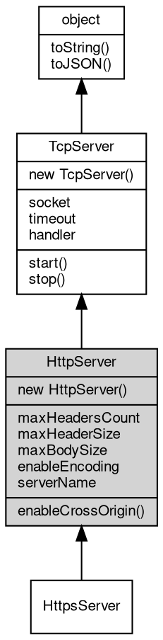

# 对象 HttpServer
HttpServer 是内置对象之一，它是用于创建 HTTP 服务器的对象。一个 HttpServer 对象包含两个必传的参数：端口和事件处理接口对象。在事件处理接口对象中，具体的实现方式可以是简单的回调函数，也可以使用复杂的路由、链式处理数组等方式

[http](../../module/ifs/http.md) 服务器对象是将 [TcpServer](TcpServer.md) 和 [HttpHandler](HttpHandler.md) 组合封装的对象，方便快速搭建服务器，逻辑上相当于：

```JavaScript
var svr = new net.TcpServer(addr, port, new http.Handler(function(req) {
    ...
}));
```

下面是一个最简单的 HttpServer 的应用示例，它仅仅是对所有请求，返回字符串 hello world。

```JavaScript
const http = require('http');
var svr = new http.Server(8080, (req) => {
    req.response.write('hello, world');
});
svr.start();
```

从代码中可以看到，首先，我们导入了内置的 [http](../../module/ifs/http.md) 模块。然后我们创建了一个新的 HttpServer 对象，并且传入了两个必要参数：一个是端口号，另一个是具体的事件处理接口对象。在这个例子中，我们使用了一个简单的回调函数作为事件处理接口，用来响应来自 HTTP 请求的数据。其中 ``req.response.write('hello, world')`` 用于将我们的字符串 hello world 响应到客户端。

在完成了 HttpServer 对象的创建之后，使用 ``svr.start()`` 来启动服务器，这样我们就能通过这个服务器接收来自 Internet 的 HTTP 请求了。

## 继承关系


## 构造函数
        
### HttpServer
**HttpServer 构造函数，在所有本机地址侦听**

```JavaScript
new HttpServer(Integer port,
    Handler hdlr);
```

调用参数:
* port: Integer, 指定 [http](../../module/ifs/http.md) 服务器侦听端口
* hdlr: [Handler](Handler.md), [http](../../module/ifs/http.md) 内置消息处理器，处理函数，链式处理数组，路由对象，详见 [mq.Handler](../../module/ifs/mq.md#Handler)

--------------------------
**HttpServer 构造函数**

```JavaScript
new HttpServer(String addr,
    Integer port,
    Handler hdlr);
```

调用参数:
* addr: String, 指定 [http](../../module/ifs/http.md) 服务器侦听地址，为 "" 则在本机所有地址侦听
* port: Integer, 指定 [http](../../module/ifs/http.md) 服务器侦听端口
* hdlr: [Handler](Handler.md), [http](../../module/ifs/http.md) 内置消息处理器，处理函数，链式处理数组，路由对象，详见 [mq.Handler](../../module/ifs/mq.md#Handler)

--------------------------
**HttpServer 构造函数**

```JavaScript
new HttpServer(String addr,
    Handler hdlr);
```

调用参数:
* addr: String, 指定 [http](../../module/ifs/http.md) 服务器侦听地址，为 "" 则在本机所有地址侦听
* hdlr: [Handler](Handler.md), [http](../../module/ifs/http.md) 内置消息处理器，处理函数，链式处理数组，路由对象，详见 [mq.Handler](../../module/ifs/mq.md#Handler)

## 成员属性
        
### maxHeadersCount
**Integer, 查询和设置最大请求头个数，缺省为 128**

```JavaScript
Integer HttpServer.maxHeadersCount;
```

--------------------------
### maxHeaderSize
**Integer, 查询和设置最大请求头长度，缺省为 8192**

```JavaScript
Integer HttpServer.maxHeaderSize;
```

--------------------------
### maxBodySize
**Integer, 查询和设置 body 最大尺寸，以 MB 为单位，缺省为 64**

```JavaScript
Integer HttpServer.maxBodySize;
```

--------------------------
### enableEncoding
**Boolean, 自动解压缩功能开关，默认关闭**

```JavaScript
Boolean HttpServer.enableEncoding;
```

--------------------------
### serverName
**String, 查询和设置服务器名称，缺省为：fibjs/0.x.0**

```JavaScript
String HttpServer.serverName;
```

--------------------------
### socket
**[Socket](Socket.md), 服务器当前侦听的 [Socket](Socket.md) 对象**

```JavaScript
readonly Socket HttpServer.socket;
```

--------------------------
### timeout
**Integer, 查询和设置超时时间，单位毫秒，此超时时间用于设置接收到的新连接**

```JavaScript
Integer HttpServer.timeout;
```

--------------------------
### handler
**[Handler](Handler.md), 服务器当前事件处理接口对象**

```JavaScript
Handler HttpServer.handler;
```

## 成员函数
        
### enableCrossOrigin
**允许跨域请求**

```JavaScript
HttpServer.enableCrossOrigin(String allowHeaders = "Content-Type");
```

调用参数:
* allowHeaders: String, 指定接受的 [http](../../module/ifs/http.md) 头字段

--------------------------
### start
**启动当前服务器**

```JavaScript
HttpServer.start();
```

--------------------------
### stop
**关闭 socket中止正在运行的服务器**

```JavaScript
HttpServer.stop() async;
```

--------------------------
### toString
**返回对象的字符串表示，一般返回 "[Native Object]"，对象可以根据自己的特性重新实现**

```JavaScript
String HttpServer.toString();
```

返回结果:
* String, 返回对象的字符串表示

--------------------------
### toJSON
**返回对象的 JSON 格式表示，一般返回对象定义的可读属性集合**

```JavaScript
Value HttpServer.toJSON(String key = "");
```

调用参数:
* key: String, 未使用

返回结果:
* Value, 返回包含可 JSON 序列化的值

