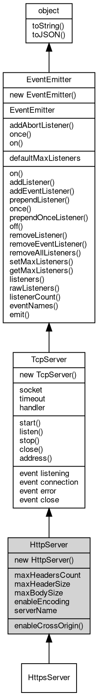

# Object HttpServer
The HTTP server [object](object.md): a [TcpServer](TcpServer.md) plus [HttpHandler](HttpHandler.md) that serves requests by handlers

`new [http.Server](../../module/ifs/http.md#Server)(port, hdlr)` binds the port immediately; the constructor forms without
a port only store the handler and need listen() before connections are accepted. The
embedded [HttpHandler](HttpHandler.md) parses requests, invokes the handler, applies the limits, automatic
headers, CORS and optional compression, and keeps the connection alive for the next
request. [HttpsServer](HttpsServer.md) is the TLS variant of the same [object](object.md).

Concepts:

- **[Handler](Handler.md) contract**: hdlr may be a [Handler](Handler.md) [object](object.md), an array of handlers (wrapped in a
  [Chain](Chain.md) and invoked in order), a function, a routing map of pattern to handler, or a
  [path](../../module/ifs/path.md)/address string that serves static files or forwards to another server. A function
  is called with the [HttpRequest](HttpRequest.md), the capture groups of a routing map and the
  [HttpResponse](HttpResponse.md): `(req, ...captures, res)`, so `(req)` and `(req, res)` both work. Write
  the reply through res (or req.response, the same [object](object.md)). A returned value is treated
  as the **next handler**, not as the response body: returning a function chains it,
  returning a string tries to serve it as a file [path](../../module/ifs/path.md) or an [http](../../module/ifs/http.md)(s) address, and any
  other value fails the reply with an internal error (500), so use a block body for
  `(req) => { ... }` handlers.
- **Lifecycle**: each accepted connection runs a parse-invoke-send loop, and the parsed
  request and its response are reused across keep-alive requests. An exception thrown by
  the handler is caught, logged as `[HttpHandler](HttpHandler.md): <error>` and answered with an empty 500;
  a request that cannot be parsed (bad request line, header or body above a limit) is
  answered with 400 and the connection is closed. There is no built-in 404: an untouched
  response is a 200 with an empty body.
- **Automatic headers**: a Server header is added unless the handler set one (serverName,
  default `fibjs/<version>`), a plain 200 without Last-Modified or Cache-Control gets
  `Cache-Control: no-cache, no-store` and `Expires: -1`, and a HEAD request receives
  headers only. There is no automatic Date header.
- **CORS**: enableCrossOrigin serves the CORS protocol for every handler: a request with
  an Origin header gets Access-Control-Allow-Credentials and
  Access-Control-Allow-Origin, and an OPTIONS preflight is answered directly with
  Allow-Methods `*`, the configured Allow-[Headers](Headers.md) and Max-Age 1728000, without invoking
  the handler.
- **Limits and compression**: maxHeadersCount, maxHeaderSize and maxBodySize bound the
  parsed request (a request over a limit is answered with 400); enableEncoding
  compresses eligible text replies transparently when the client accepts gzip or
  deflate. Node.js has no body limit and no automatic compression.
- **Node.js differences**: Node passes `(req, res)` to a createServer listener and emits
  request/upgrade/clientError events; fibjs accepts the handler forms above, adds
  `req.response`, and forwards the [TcpServer](TcpServer.md) events.

Obtained from:
- `new [http.Server](../../module/ifs/http.md#Server)(port, hdlr)` / `new [http.Server](../../module/ifs/http.md#Server)(addr, port, hdlr)` — bound, ready for
  start();
- `new [http.Server](../../module/ifs/http.md#Server)(hdlr)` / `new [http.Server](../../module/ifs/http.md#Server)(addr, hdlr)` — call listen() to bind;
- `http.createServer(hdlr)` — the same class without a port; listen() to start;
- `http.Server` and `http.HttpsServer` — the [module](../../module/ifs/module.md) aliases of the two server classes.

Example 1 — a routing map with captured segments:

```JavaScript
const http = require('http');

const server = new http.Server(0, {
    '/hello/:name': (req, name) => {
        req.response.write('Hello ' + name);
    },
    '/add/:a/:b': (req, a, b) => {
        req.response.json({
            sum: Number(a) + Number(b)
        });
    }
});
server.start();
const port = server.socket.localPort;

console.log(http.getSync('http://127.0.0.1:' + port + '/hello/fibjs').text()); // Hello fibjs
console.log(http.getSync('http://127.0.0.1:' + port + '/add/2/3').json().sum); // 5

server.stop();
```

Example 2 — a handler chain that shares work before the reply:

```JavaScript
const http = require('http');

const server = new http.Server(0, [
    (req) => {
        req.response.setHeader('X-Server', 'fibjs');
    },
    (req) => {
        if (req.address === '/echo')
            req.response.write(req.text());
        else
            req.response.write('pass-through');
    }
]);
server.start();
const port = server.socket.localPort;

const res = http.postSync('http://127.0.0.1:' + port + '/echo', {
    body: 'payload'
});
console.log(res.text(), res.firstHeader('X-Server')); // payload fibjs

server.stop();
```

Example 3 — handler errors and the request body limit:

```JavaScript
const http = require('http');

const server = new http.Server(0, (req) => {
    if (req.address === '/boom')
        throw new Error('handler failed');
    req.response.write('ok');
});
server.maxBodySize = 1; // MB
server.start();
const port = server.socket.localPort;

console.log(http.getSync('http://127.0.0.1:' + port + '/').text()); // ok
console.log(http.getSync('http://127.0.0.1:' + port + '/boom').statusCode); // 500

const big = http.postSync('http://127.0.0.1:' + port + '/', {
    body: 'x'.repeat(2 * 1024 * 1024)
});
console.log(big.statusCode); // 400

server.stop();
```

## Inheritance

```dot
digraph {
    node [fontname="Helvetica,sans-Serif", fontsize=10, shape="record", style="filled", fillcolor="white"];

    object [tooltip="object", URL="object.md", label="{object|toString()\ltoJSON()\l}"];
    EventEmitter [tooltip="EventEmitter", URL="EventEmitter.md", label="{EventEmitter|new EventEmitter()\l|EventEmitter\l|addAbortListener()\lonce()\lon()\l|defaultMaxListeners\l|on()\laddListener()\laddEventListener()\lprependListener()\lonce()\lprependOnceListener()\loff()\lremoveListener()\lremoveEventListener()\lremoveAllListeners()\lsetMaxListeners()\lgetMaxListeners()\llisteners()\lrawListeners()\llistenerCount()\leventNames()\lemit()\l}"];
    TcpServer [tooltip="TcpServer", URL="TcpServer.md", label="{TcpServer|new TcpServer()\l|socket\ltimeout\lhandler\l|start()\llisten()\lstop()\lclose()\laddress()\l|event listening\levent connection\levent error\levent close\l}"];
    HttpServer [tooltip="HttpServer", fillcolor="lightgray", id="me", label="{HttpServer|new HttpServer()\l|maxHeadersCount\lmaxHeaderSize\lmaxBodySize\lenableEncoding\lserverName\l|enableCrossOrigin()\l}"];
    HttpsServer [tooltip="HttpsServer", URL="HttpsServer.md", label="{HttpsServer}"];

    object -> EventEmitter [dir=back];
    EventEmitter -> TcpServer [dir=back];
    TcpServer -> HttpServer [dir=back];
    HttpServer -> HttpsServer [dir=back];
}
```

## Constructors
        
### HttpServer
**Creates an HTTP server bound to a port**

```JavaScript
new HttpServer(Integer port,
    Function(HttpRequest req, HttpResponse res) => Value hdlr);
```

Parameters:
* port: Integer, specifies the port on which the [http](../../module/ifs/http.md) server listens
* hdlr: [Handler](Handler.md) | [Handler](Handler.md)[] | Function([HttpRequest](HttpRequest.md) req, [HttpResponse](HttpResponse.md) res) => Value | Object | String, the request handler

Port 0 asks the operating system for a free port (read it back from
socket.localPort). hdlr may be a [Handler](Handler.md) [object](object.md), an array of handlers (a [Chain](Chain.md)), a
handler function `(req, res) => ...`, a routing map or a [path](../../module/ifs/path.md)/address string; see
the class documentation for the contract. start() begins serving after the
constructor bound the port; listen() is not needed and start() after listen() throws
error 20009.

--------------------------
**Creates an HTTP server bound to an address and a port**

```JavaScript
new HttpServer(String addr,
    Integer port,
    Function(HttpRequest req, HttpResponse res) => Value hdlr);
```

Parameters:
* addr: String, the listening address; "" listens on all local addresses
* port: Integer, specifies the port on which the [http](../../module/ifs/http.md) server listens
* hdlr: [Handler](Handler.md) | [Handler](Handler.md)[] | Function([HttpRequest](HttpRequest.md) req, [HttpResponse](HttpResponse.md) res) => Value | Object | String, the request handler

addr is the local address to bind: "" or "0.0.0.0" listens on every IPv4 interface,
"::" on every IPv6 interface and a literal such as "127.0.0.1" or "::1" on one
interface. Port 0 selects a free port. The handler forms and the lifecycle are the
same as the other constructors; see the class documentation.

--------------------------
**Creates an HTTP server, taking the port from the address when it carries one**

```JavaScript
new HttpServer(String addr,
    Function(HttpRequest req, HttpResponse res) => Value hdlr);
```

Parameters:
* addr: String, the listening address, optionally with a :port suffix
* hdlr: [Handler](Handler.md) | [Handler](Handler.md)[] | Function([HttpRequest](HttpRequest.md) req, [HttpResponse](HttpResponse.md) res) => Value | Object | String, the request handler

When addr contains a port (for example "127.0.0.1:8080") the server binds it
immediately; otherwise the address is stored and listen() must be called. The
handler forms and the lifecycle are the same as the other constructors; see the
class documentation.

--------------------------
**Creates an HTTP server without binding a port; listen() must be called to start**

```JavaScript
new HttpServer(Function(HttpRequest req, HttpResponse res) => Value hdlr);
```

Parameters:
* hdlr: [Handler](Handler.md) | [Handler](Handler.md)[] | Function([HttpRequest](HttpRequest.md) req, [HttpResponse](HttpResponse.md) res) => Value | Object | String, the request handler

The handler is stored and the listener is created; call listen(port, addr) to bind
and begin serving. This is the form [http.createServer](../../module/ifs/http.md#createServer)() uses. Do not call start()
after listen(): the port is already bound and start() throws error 20009.

## Static Methods
        
### addAbortListener
**Registers a one-shot abort handler on an [AbortSignal](AbortSignal.md)**

```JavaScript
static Object HttpServer.addAbortListener(EventEmitter signal,
    Function(Object ev) func);
```

Parameters:
* signal: [EventEmitter](EventEmitter.md), the [AbortSignal](AbortSignal.md) [object](object.md) to listen to
* func: Function(Object ev), the handler for the abort event

Returns:
* Object, returns a Disposable [object](object.md) containing a `[Symbol.dispose]` method

The handler is called at most once when the signal is aborted, and it is removed from the
signal afterwards. If the signal is already aborted the handler is invoked synchronously.
The returned [object](object.md) has a `[Symbol.dispose]()` method that removes the handler, so it can be
released before the abort happens.

Example — abort handling with automatic cleanup:

```JavaScript
const events = require('events');

const controller = new AbortController();
const disposable = events.addAbortListener(controller.signal,
    () => console.log('aborted'));

controller.abort(); // aborted
disposable[Symbol.dispose](); // safe to call after the listener fired
console.log(controller.signal.listenerCount('abort')); // 0
```

--------------------------
### once
**Creates a Promise resolved by the next occurrence of an event**

```JavaScript
static Object HttpServer.once(EventEmitter emitter,
    Value ev,
    Object options = {});
```

Parameters:
* emitter: [EventEmitter](EventEmitter.md), the event emitter [object](object.md) to listen to
* ev: Value, the event name to listen for
* options: Object, optional parameter [object](object.md)

Returns:
* Object, returns a Promise that resolves with the array of event parameters

The Promise resolves with the array of the emit arguments when the event fires; it rejects
when `error` is emitted while waiting, unless the waited event is `error` itself, or when
the signal option aborts. The temporary listeners are removed when the Promise settles.

options supports the following option:

```JavaScript
// fragment: options
({
    "signal": null // AbortSignal; aborting rejects the Promise with an AbortError
});
```

Example — awaiting the next occurrence of an event:

```JavaScript
const EventEmitter = require('events');

(async () => {
    const emitter = new EventEmitter();
    const waiting = EventEmitter.once(emitter, 'ready');

    emitter.emit('ready', 200, 'ok');
    console.log(JSON.stringify(await waiting)); // [200,"ok"]
})();
```

--------------------------
### on
**Creates an async iterator that yields event occurrences**

```JavaScript
static Object HttpServer.on(EventEmitter emitter,
    Value ev,
    Object options = {});
```

Parameters:
* emitter: [EventEmitter](EventEmitter.md), the event emitter [object](object.md) to listen to
* ev: Value, the event name to listen for
* options: Object, optional parameter [object](object.md)

Returns:
* Object, returns an AsyncIterator [object](object.md)

Each next() resolves with `{ value: [args...], done: false }` when the event fires and with
`{ done: true }` after an event named in the `close` option fires or the signal aborts; an
`error` event rejects the pending call. The listeners are registered when the iterator is
created and removed when the iteration ends or the signal aborts.

options supports the following options:

```JavaScript
// fragment: options
({
    "signal": null, // AbortSignal; aborting rejects pending and future next() calls
    "close": [] // event names; the first one to fire ends the iteration
});
```

Example — iterating the occurrences of an event:

```JavaScript
const EventEmitter = require('events');

(async () => {
    const emitter = new EventEmitter();
    const iterator = EventEmitter.on(emitter, 'data', {
        close: ['end']
    });

    emitter.emit('data', 1);
    emitter.emit('data', 2);
    emitter.emit('end');

    for await (const args of iterator)
    console.log(JSON.stringify(args)); // [1] then [2]
})();
```

## Static Properties
        
### defaultMaxListeners
**Integer, The [process](../../module/ifs/process.md)-wide default listener limit reported by getMaxListeners()**

```JavaScript
static Integer HttpServer.defaultMaxListeners;
```

Defaults to 10. Assigning a value changes getMaxListeners() for every emitter that never
called setMaxListeners(); an emitter with an explicit limit keeps it. The limit is
informational: fibjs never warns when the number of listeners exceeds it.

## Properties
        
### maxHeadersCount
**Integer, Queries and sets the maximum number of request headers, default 128**

```JavaScript
Integer HttpServer.maxHeadersCount;
```

Applied when each request is parsed; a request with more header lines is answered
with 400 and the connection is closed. A negative value throws a RangeError (20006).
Node.js has [http.Server](../../module/ifs/http.md#Server).maxHeadersCount for the same purpose.

--------------------------
### maxHeaderSize
**Integer, Queries and sets the maximum length of one header line in bytes, default 8192**

```JavaScript
Integer HttpServer.maxHeaderSize;
```

A longer line makes the parser fail and the request is answered with 400; a negative
value throws a RangeError (20006). Node.js uses the [process](../../module/ifs/process.md)-wide
--max-[http](../../module/ifs/http.md)-header-size option instead.

--------------------------
### maxBodySize
**Integer, Queries and sets the maximum request body size in MB, default 64**

```JavaScript
Integer HttpServer.maxBodySize;
```

A Content-Length or chunked body larger than this is rejected while parsing and the
request is answered with 400; -1 disables the limit and 0 refuses every body. Node.js
has no built-in body limit.

--------------------------
### enableEncoding
**Boolean, Enables automatic response compression, disabled by default**

```JavaScript
Boolean HttpServer.enableEncoding;
```

When on, a reply larger than 128 bytes and smaller than 64 MB is compressed with
gzip or deflate when the client sent a matching Accept-Encoding and the
Content-Type is text/* or a known compressible type; the handler adds
Content-Encoding and replaces the body with the compressed one. An existing
Content-Encoding disables it. Node.js has no automatic compression.

--------------------------
### serverName
**String, Queries and sets the automatic Server header, default fibjs/<version>**

```JavaScript
String HttpServer.serverName;
```

Written when the handler did not set a Server header itself; an empty value writes
an empty header. Node.js does not add a Server header.

Example — replace the default server name:

```JavaScript
const http = require('http');

const server = new http.Server(0, (req) => {
    req.response.write('named');
});
server.serverName = 'my-app/1.0';
server.start();
const port = server.socket.localPort;

const res = http.getSync('http://127.0.0.1:' + port + '/');
console.log(res.firstHeader('Server')); // my-app/1.0

server.stop();
```

--------------------------
### socket
**[Socket](Socket.md), the [Socket](Socket.md) [object](object.md) the server is currently listening on**

```JavaScript
readonly Socket HttpServer.socket;
```

The underlying listening [Socket](Socket.md) exposes the bound family/localAddress/localPort; it is useful
for diagnostics, but do not call accept on it because the server owns the accept loop. It
throws when the server was created by the handler-only constructor and is not bound yet.
Node.js hides the listening handle.

--------------------------
### timeout
**Integer, Queries and sets the timeout in milliseconds; this timeout is used for newly accepted connections**

```JavaScript
Integer HttpServer.timeout;
```

The default 0 means no timeout. The value is copied to each accepted [Socket](Socket.md) when the server
accepts it, before the handler runs, so it bounds every recv/send of the handler unless the
handler changes it. It does not apply to the listening socket itself.

--------------------------
### handler
**[Handler](Handler.md), the current event handling interface [object](object.md) of the server**

```JavaScript
Handler HttpServer.handler;
```

The normalized [Handler](Handler.md) invoked for every connection. Assigning a value runs it through the
[Handler](Handler.md) constructor: a function becomes a message handler wrapper, an array becomes a [Chain](Chain.md)
and a [path](../../module/ifs/path.md)/address string or routing map is converted accordingly (see [net.createServer](../../module/ifs/net.md#createServer) for
the accepted forms). The getter returns the last assigned [object](object.md).

## Methods
        
### enableCrossOrigin
**Enables automatic CORS handling, including preflight requests**

```JavaScript
HttpServer.enableCrossOrigin(String allowHeaders = "Content-Type");
```

Parameters:
* allowHeaders: String, specifies the accepted [http](../../module/ifs/http.md) header fields

Turns on the embedded handler's CORS mode: requests carrying an Origin header get
Access-Control-Allow-Credentials: true and Access-Control-Allow-Origin echoing the
origin, and an OPTIONS preflight is answered directly (200) with
Access-Control-Allow-Methods: *, Access-Control-Allow-[Headers](Headers.md) set to allowHeaders
and Access-Control-Max-Age: 1728000, without invoking the handler. Node.js has no
built-in CORS support.

Example — answer a preflight:

```JavaScript
const http = require('http');

const server = new http.Server(0, (req) => {
    req.response.write('cors');
});
server.enableCrossOrigin('X-Custom');
server.start();
const port = server.socket.localPort;

const res = http.requestSync('OPTIONS', 'http://127.0.0.1:' + port + '/', {
    headers: {
        Origin: 'http://example.com'
    }
});
console.log(res.statusCode); // 200
console.log(res.firstHeader('Access-Control-Allow-Origin')); // http://example.com
console.log(res.firstHeader('Access-Control-Allow-Headers')); // X-Custom

server.stop();
```

--------------------------
### start
**Starts the current server**

```JavaScript
HttpServer.start();
```

Begins the accept loop and emits 'listening'. The server must already be bound: the
constructors with a port/address bind in the constructor while the handler-only form needs
listen(). Calling start on an unbound server or a second time fails with an invalid-call
error. Each accepted client is passed to the 'connection' listeners and then to the handler.

--------------------------
### listen
**Binds the address and port and starts listening for connections**

```JavaScript
HttpServer.listen(Integer port,
    String addr = "",
    Integer backlog = -1) async;
```

Parameters:
* port: Integer, specifies the TCP server listening port
* addr: String, specifies the TCP server listening address; "" means listening on all local addresses
* backlog: Integer, specifies the maximum length of the connection queue, -1 means using the system default

 Binds and starts the accept loop in one call, emitting 'listening'. Port 0 asks the operating
 system for an ephemeral port, read it from address(). backlog -1 passes the system default to
 the operating system. A second listen on the same server throws ERR_SERVER_ALREADY_LISTEN,
 and a failed bind (for example EADDRINUSE) carries syscall 'listen' like Node.js.

--------------------------
### stop
**Closes the socket and aborts the running server**

```JavaScript
HttpServer.stop() async;
```

Closes the listening socket and emits 'close' immediately; the accepted connections are not
closed and keep running in their handler fibers (the handler owns them). Stopping a server
that was never bound is a no-op. Node.js server.close() instead waits for the active
connections to end before emitting 'close'.

--------------------------
### close
**Closes the socket and aborts the running server; an alias of stop()**

```JavaScript
HttpServer.close() async;
```

Identical to stop(), provided for the Node.js naming; both are awaitable.

--------------------------
### address
**Returns an [object](object.md) containing the server bound address, address family and port. Used to look up the actual port when the OS assigns the address.**

```JavaScript
(String address, String family, Integer port) HttpServer.address();
```

Returns:
* (String address, String family, Integer port), returns the address, address family and port bound by the server

The result has the shape { address, family, port }, where family is 'IPv4' or 'IPv6' and port
is the real port after listen(0). For a unix socket or Windows pipe the address is the bound
[path](../../module/ifs/path.md) while family/port are placeholders ('IPv4'/0). The method throws before the server is
bound (number 20009); Node.js returns null instead and returns the [path](../../module/ifs/path.md) string for pipe
servers.

Example — discovering the port assigned to listen(0):

```JavaScript
const net = require('net');

const server = net.createServer((conn) => conn.close());
server.listen(0, '127.0.0.1');

const addr = server.address();
console.log(addr.address, addr.family, addr.port > 0); // 127.0.0.1 IPv4 true

server.stop();
```

--------------------------
### on
**Appends an event handler to the emitter**

```JavaScript
Object HttpServer.on(Value ev,
    Function(...args) func);
```

Parameters:
* ev: Value, the event name to bind
* func: Function(...args), the event handler function, called with the emit arguments

Returns:
* Object, returns the event [object](object.md) itself for chaining

The listener is called with the arguments of emit() and `this` set to the emitter; the
emitter itself is returned so registrations can be chained. The same function may be
registered several times for one event and each copy is called. See the class documentation
for the dispatch order.

--------------------------
**Appends several event handlers to the emitter**

```JavaScript
Object HttpServer.on(Object map);
```

Parameters:
* map: Object, the event mapping; [object](object.md) property names are used as event names

Returns:
* Object, returns the event [object](object.md) itself for chaining

Every enumerable property of the map whose value is a function is registered under its
property name. Properties are processed in order; a value that is not a function makes the
call fail with an invalid-type error while entries processed before it stay registered.

Example — registering several handlers at once:

```JavaScript
const EventEmitter = require('events');

const emitter = new EventEmitter();
emitter.on({
    connect: () => console.log('connect'),
    close: () => console.log('close')
});

emitter.emit('connect'); // connect
emitter.emit('close'); // close
```

--------------------------
### addListener
**Appends an event handler to the emitter**

```JavaScript
Object HttpServer.addListener(Value ev,
    Function(...args) func);
```

Parameters:
* ev: Value, the event name to bind
* func: Function(...args), the event handler function

Returns:
* Object, returns the event [object](object.md) itself for chaining

Alias of on(ev, func), provided for Node.js compatibility.

--------------------------
**Appends several event handlers to the emitter**

```JavaScript
Object HttpServer.addListener(Object map);
```

Parameters:
* map: Object, the event mapping; [object](object.md) property names are used as event names

Returns:
* Object, returns the event [object](object.md) itself for chaining

Alias of on(map), provided for Node.js compatibility.

--------------------------
### addEventListener
**Appends an event handler to the emitter with an options [object](object.md)**

```JavaScript
Object HttpServer.addEventListener(Value ev,
    Function(...args) func,
    Object options = {});
```

Parameters:
* ev: Value, the event name to bind
* func: Function(...args), the event handler function, called with the emit arguments
* options: Object, the options of the event handler

Returns:
* Object, returns the event [object](object.md) itself for chaining

Web-style alias of on(); the only supported option is `once`, which registers a one-shot
handler exactly like once(). The listener receives the plain emit arguments and not an [Event](Event.md)
[object](object.md); see the [DOMEvent](DOMEvent.md) class for the DOM-style event [object](object.md) used by [AbortSignal](AbortSignal.md) and
fetch-style APIs.

options supports the following option:

```JavaScript
// fragment: options
({
    "once": false // when true, the handler is removed before its single invocation
});
```

Example — a one-shot DOM-style registration:

```JavaScript
const EventEmitter = require('events');

const emitter = new EventEmitter();
emitter.addEventListener('ping', () => console.log('ping'), {
    once: true
});

emitter.emit('ping'); // ping
console.log(emitter.emit('ping')); // false
console.log(emitter.listenerCount('ping')); // 0
```

--------------------------
### prependListener
**Inserts an event handler at the front of the queue**

```JavaScript
Object HttpServer.prependListener(Value ev,
    Function(...args) func);
```

Parameters:
* ev: Value, the event name to bind
* func: Function(...args), the event handler function

Returns:
* Object, returns the event [object](object.md) itself for chaining

The listener is called before the listeners registered with on()/addListener() the next time
the event is emitted. When several prependListener() calls are made, the last one registered
is called first, because every call inserts at the same position.

Example — insertion at the front of the queue:

```JavaScript
const EventEmitter = require('events');

const emitter = new EventEmitter();
emitter.on('order', () => console.log('on'));
emitter.prependListener('order', () => console.log('prepend'));

emitter.emit('order'); // prepend, then on
```

--------------------------
**Inserts several event handlers at the front of the queue**

```JavaScript
Object HttpServer.prependListener(Object map);
```

Parameters:
* map: Object, the event mapping; [object](object.md) property names are used as event names

Returns:
* Object, returns the event [object](object.md) itself for chaining

Map form of prependListener(); every function property is inserted at the front, so the
properties of the map are called in reverse order.

--------------------------
### once
**Appends a one-shot event handler to the emitter**

```JavaScript
Object HttpServer.once(Value ev,
    Function(...args) func);
```

Parameters:
* ev: Value, the event name to bind
* func: Function(...args), the event handler function

Returns:
* Object, returns the event [object](object.md) itself for chaining

The handler is wrapped and removes itself from the queue before it is called, so it runs at
most once. off() removes it when passed the original function, listeners() returns the
original function, and rawListeners() returns the internal wrapper whose `_func` property
holds the original. See Example 2 in the class documentation.

--------------------------
**Appends several one-shot event handlers to the emitter**

```JavaScript
Object HttpServer.once(Object map);
```

Parameters:
* map: Object, the event mapping; [object](object.md) property names are used as event names

Returns:
* Object, returns the event [object](object.md) itself for chaining

Map form of once(); every function property is registered as a one-shot listener under its
property name.

--------------------------
### prependOnceListener
**Inserts a one-shot event handler at the front of the queue**

```JavaScript
Object HttpServer.prependOnceListener(Value ev,
    Function(...args) func);
```

Parameters:
* ev: Value, the event name to bind
* func: Function(...args), the event handler function

Returns:
* Object, returns the event [object](object.md) itself for chaining

Combines prependListener() and once(): the handler is called first and only once, and it is
removed before its invocation.

--------------------------
**Inserts several one-shot event handlers at the front of the queue**

```JavaScript
Object HttpServer.prependOnceListener(Object map);
```

Parameters:
* map: Object, the event mapping; [object](object.md) property names are used as event names

Returns:
* Object, returns the event [object](object.md) itself for chaining

Map form of prependOnceListener(); every function property is inserted as a one-shot
listener, and the properties of the map are called in reverse order.

--------------------------
### off
**Removes an event handler from the emitter**

```JavaScript
Object HttpServer.off(Value ev,
    Function(...args) func);
```

Parameters:
* ev: Value, the event name to unbind
* func: Function(...args), the event handler function

Returns:
* Object, returns the event [object](object.md) itself for chaining

The first matching listener is removed; when the same function was registered several times
only one copy is removed per call, so repeat the call to remove the others. A once() wrapper
is matched by its original function as well. Removing a listener emits the `removeListener`
meta event after the removal.

--------------------------
**Removes all event handlers of one event**

```JavaScript
Object HttpServer.off(Value ev);
```

Parameters:
* ev: Value, the event name to unbind

Returns:
* Object, returns the event [object](object.md) itself for chaining

Every listener of the event is removed and `removeListener` is emitted once per removed
listener. The call succeeds when the event has no listener.

Example — removing every listener of one event:

```JavaScript
const EventEmitter = require('events');

const emitter = new EventEmitter();
emitter.on('data', () => console.log('first'));
emitter.on('data', () => console.log('second'));

emitter.off('data');
console.log(emitter.emit('data')); // false
```

--------------------------
**Removes several event handlers from the emitter**

```JavaScript
Object HttpServer.off(Object map);
```

Parameters:
* map: Object, the event mapping; [object](object.md) property names are used as event names

Returns:
* Object, returns the event [object](object.md) itself for chaining

Every enumerable property of the map whose value is a function names an event from which
that function is removed (one copy per event). A value that is not a function makes the call
fail with an invalid-type error.

--------------------------
### removeListener
**Removes an event handler from the emitter**

```JavaScript
Object HttpServer.removeListener(Value ev,
    Function(...args) func);
```

Parameters:
* ev: Value, the event name to unbind
* func: Function(...args), the event handler function

Returns:
* Object, returns the event [object](object.md) itself for chaining

Alias of off(ev, func), provided for Node.js compatibility.

--------------------------
**Removes all event handlers of one event**

```JavaScript
Object HttpServer.removeListener(Value ev);
```

Parameters:
* ev: Value, the event name to unbind

Returns:
* Object, returns the event [object](object.md) itself for chaining

Alias of off(ev), provided for Node.js compatibility.

--------------------------
**Removes several event handlers from the emitter**

```JavaScript
Object HttpServer.removeListener(Object map);
```

Parameters:
* map: Object, the event mapping; [object](object.md) property names are used as event names

Returns:
* Object, returns the event [object](object.md) itself for chaining

Alias of off(map), provided for Node.js compatibility.

--------------------------
### removeEventListener
**Removes an event handler with an options [object](object.md)**

```JavaScript
Object HttpServer.removeEventListener(Value ev,
    Function(...args) func,
    Object options = {});
```

Parameters:
* ev: Value, the event name to unbind
* func: Function(...args), the event handler function
* options: Object, the options of the event handler, ignored

Returns:
* Object, returns the event [object](object.md) itself for chaining

Web-style alias of off(ev, func); the options [object](object.md) is accepted and ignored, and a once()
wrapper is matched by its original function like off().

--------------------------
### removeAllListeners
**Removes all listeners of one event**

```JavaScript
Object HttpServer.removeAllListeners(Value ev);
```

Parameters:
* ev: Value, the event name to remove

Returns:
* Object, returns the event [object](object.md) itself for chaining

Equivalent to off(ev): every listener of the event is removed, including once() wrappers
matched by their original function, and `removeListener` is emitted once per removal.

--------------------------
**Removes all listeners of the given events, or of the whole emitter**

```JavaScript
Object HttpServer.removeAllListeners(Array evs = []);
```

Parameters:
* evs: Array, the event names to remove

Returns:
* Object, returns the event [object](object.md) itself for chaining

An empty array — including the no-argument call, because the parameter defaults to [] —
clears every string-keyed event; symbol-keyed listeners are left in place, unlike Node.js
which removes them too. A non-empty array clears each named event as
removeAllListeners(ev) does.

Example — clearing selected events and the whole emitter:

```JavaScript
const EventEmitter = require('events');

const emitter = new EventEmitter();
emitter.on('a', () => {});
emitter.on('b', () => {});
emitter.on('c', () => {});

emitter.removeAllListeners(['a', 'b']);
console.log(emitter.listenerCount('a'), emitter.listenerCount('c')); // 0 1

emitter.removeAllListeners();
console.log(emitter.eventNames().length); // 0
```

--------------------------
### setMaxListeners
**Stores a per-emitter listener limit**

```JavaScript
HttpServer.setMaxListeners(Integer n);
```

Parameters:
* n: Integer, the number of events

The value is reported by getMaxListeners() and is otherwise informational: fibjs never warns
when the number of listeners exceeds it. This member exists for Node.js compatibility. A
negative value throws; 0 is accepted and stored as-is, while Node.js treats 0 as unlimited.

--------------------------
### getMaxListeners
**Returns the listener limit of the emitter**

```JavaScript
Integer HttpServer.getMaxListeners();
```

Returns:
* Integer, returns the default limit

Returns the value set by setMaxListeners(), or the [process](../../module/ifs/process.md)-wide defaultMaxListeners (10)
when no explicit value was set.

--------------------------
### listeners
**Returns a copy of the listener array of an event**

```JavaScript
Array HttpServer.listeners(Value ev);
```

Parameters:
* ev: Value, the event name to query

Returns:
* Array, returns the listener array of the specified event

One-shot wrappers are unwrapped, so the result contains the functions passed to
on()/once() and can be passed to off(); an unknown event produces an empty array.

Example — once() listeners are returned unwrapped:

```JavaScript
const EventEmitter = require('events');

const emitter = new EventEmitter();

function onTick() {
    console.log('tick');
}

emitter.once('tick', onTick);
console.log(emitter.listeners('tick')[0] === onTick); // true
console.log(emitter.rawListeners('tick')[0] === onTick); // false
```

--------------------------
### rawListeners
**Returns the internal listener array of an event**

```JavaScript
Array HttpServer.rawListeners(Value ev);
```

Parameters:
* ev: Value, the event name to query

Returns:
* Array, returns the listener array of the specified event

The array is not unwrapped: a listener registered with once() appears as the internal
wrapper function whose `_func` property holds the original function. An unknown event
produces an empty array.

--------------------------
### listenerCount
**Returns the number of listeners of an event**

```JavaScript
Integer HttpServer.listenerCount(Value ev);
```

Parameters:
* ev: Value, the event name to query

Returns:
* Integer, returns the number of listeners of the specified event

One-shot listeners count as one and an unknown event returns 0.

--------------------------
**Returns the number of listeners of an event on another [object](object.md)**

```JavaScript
Integer HttpServer.listenerCount(Value o,
    Value ev);
```

Parameters:
* o: Value, the [object](object.md) to query
* ev: Value, the event name to query

Returns:
* Integer, returns the number of listeners of the specified event

Counts without requiring the target to be an [EventEmitter](EventEmitter.md): any [object](object.md) with registered
events can be queried. The call is normally written as
`EventEmitter.listenerCount(target, 'data')`.

Example — counting the listeners of another [object](object.md):

```JavaScript
const EventEmitter = require('events');

const emitter = new EventEmitter();
emitter.on('data', () => {});
emitter.on('data', () => {});

console.log(EventEmitter.listenerCount(emitter, 'data')); // 2
```

--------------------------
### eventNames
**Returns the names of the events with at least one listener**

```JavaScript
Array HttpServer.eventNames();
```

Returns:
* Array, returns the array of event names

Only string-keyed events are reported; symbol-keyed events are omitted and numeric event
names are returned as numbers (Node.js also reports symbol events).

--------------------------
### emit
**Emits an event and returns whether a listener was called**

```JavaScript
Boolean HttpServer.emit(Value ev,
    ...args);
```

Parameters:
* ev: Value, event name
* args: ..., event parameters, which are passed to the event handler

Returns:
* Boolean, returns whether the event had a listener to respond to it

Listeners are called as described by the dispatch model in the class documentation: the
first one runs synchronously on the current fiber, the remaining ones run in parallel
fibers, and the call returns after all of them finish; an exception raised by a listener is
thrown back to the caller. Emitting `error` with no listener throws instead of returning
false: an Error argument is thrown as-is and any other value is wrapped in
`Error("Unhandled error. (...)")`. [Event](Event.md) names are strings or symbols; `emit()` does not
match a listener registered with a numeric name.

--------------------------
### toString
**Returns the string form of the [object](object.md)**

```JavaScript
String HttpServer.toString();
```

Returns:
* String, returns the string form of the [object](object.md)

The base implementation reports an error: a native [object](object.md) has no implicit
text form, and only the classes whose value can be written as a string
override the member. [Buffer](Buffer.md) returns its content decoded with the given
[encoding](../../module/ifs/encoding.md), [HttpCookie](HttpCookie.md) returns "name=value", and so on; an override commonly
accepts optional arguments ([Buffer.toString](Buffer.md#toString) takes [encoding](../../module/ifs/encoding.md), start and
end) that are not part of this declaration.

Calling the member on a class that does not override it throws
"<Class>: the [object](object.md) can not be converted to string.", which is the
behavior to rely on when probing whether a value has a string form. See
toJSON for the serialization hook.

--------------------------
### toJSON
**Returns the JSON representation of the [object](object.md)**

```JavaScript
Value HttpServer.toJSON(String key = "");
```

Parameters:
* key: String, the property name of the value being serialized

Returns:
* Value, returns the JSON-serializable value

JSON.stringify(value) calls value.toJSON(key) when the member exists and
serializes the returned value in its place; the key argument carries the
property name of the value inside its parent [object](object.md) (an empty string at
the top level) and may be used to build a keyed form. The base
implementation returns a plain [object](object.md) holding the readable properties of
the instance, so a native [object](object.md) serializes without per-class code; a
class with a portable shape such as [Buffer](Buffer.md) overrides it, and a JavaScript
class may override it in the same way.

The member is normally reached through JSON.stringify rather than called
directly; calling it returns the same value JSON.stringify would
serialize.

## Events
        
### listening
**Emitted after start() is called and binding completes**

```JavaScript
event HttpServer.listening();
```

Emitted synchronously by start()/listen(), after the socket is listening and before the first
accept; observe it with on('listening') or the onlistening shorthand. Node.js emits
'listening' asynchronously once the bind completes.

--------------------------
### connection
**Emitted when a new TCP connection is established**

```JavaScript
event HttpServer.connection(Socket socket);
```

Parameters:
* socket: [Socket](Socket.md), the newly established [Socket](Socket.md) connection [object](object.md)

Emitted before the handler is invoked for the same [Socket](Socket.md), on the accepting fiber; a long
listener delays further accepts, so offload work to the handler or to a new fiber. Node.js
emits 'connection' with its socket in the same way.

--------------------------
### error
**Emitted when an error occurs**

```JavaScript
event HttpServer.error(String msg);
```

Parameters:
* msg: String, the error message

Emitted for accept-loop failures with a plain message string, not with an Error [object](object.md) as in
Node.js. An exception thrown by the handler does not emit this event: it is logged and the
connection is closed.

--------------------------
### close
**Emitted after the server is closed**

```JavaScript
event HttpServer.close();
```

Emitted by stop()/close() immediately after the listening socket is closed, even when
connections are still open. Node.js emits 'close' only after the server has stopped
accepting and all connections have ended.

