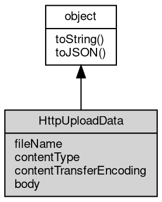

# 对象 HttpUploadData
包含 multipart 的一个条目数据

## 继承关系


## 成员属性
        
### fileName
**String, 包含本条目数据的文件名**

```JavaScript
readonly String HttpUploadData.fileName;
```

--------------------------
### contentType
**String, 包含本条目数据的类型**

```JavaScript
readonly String HttpUploadData.contentType;
```

--------------------------
### contentTransferEncoding
**String, 包含本条目数据的传输编码类型**

```JavaScript
readonly String HttpUploadData.contentTransferEncoding;
```

--------------------------
### body
**[SeekableStream](SeekableStream.md), 包含本条目数据部分的流对象**

```JavaScript
readonly SeekableStream HttpUploadData.body;
```

## 成员函数
        
### toString
**返回对象的字符串表示，一般返回 "[Native Object]"，对象可以根据自己的特性重新实现**

```JavaScript
String HttpUploadData.toString();
```

返回结果:
* String, 返回对象的字符串表示

--------------------------
### toJSON
**返回对象的 JSON 格式表示，一般返回对象定义的可读属性集合**

```JavaScript
Value HttpUploadData.toJSON(String key = "");
```

调用参数:
* key: String, 未使用

返回结果:
* Value, 返回包含可 JSON 序列化的值

