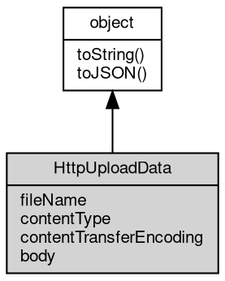

# Object HttpUploadData
HttpUploadData describes one part of a multipart/form-data upload: its file name, media type, transfer [encoding](../../module/ifs/encoding.md) and content stream

The interface describes a single multipart entry as older fibjs versions exposed it. No
public API in the current runtime returns an HttpUploadData [object](object.md) and it cannot be built
with `new` (doing so throws a type error); parsing a multipart body now goes through
[FormData](FormData.md) and `[http.Request](../../module/ifs/http.md#Request)#form`, which expose each part as a [File](File.md)/[Blob](Blob.md): the media type and
size are on the [Blob](Blob.md) and the file name that was passed to [FormData](FormData.md)#append is on [File](File.md)#name.

Concepts:

- **Multipart entry**: a body with Content-Type `multipart/form-data` is a sequence of
parts. Every part is introduced by a `Content-Disposition` header with the field name and
an optional `filename`, followed by optional `Content-Type` and
`Content-Transfer-Encoding` headers and the raw content.
- **Field mapping**: `fileName` is the filename of the Content-Disposition header,
`contentType` the part media type, `contentTransferEncoding` the transfer [encoding](../../module/ifs/encoding.md) (for
example `binary` or `base64`) and `body` the content as a [SeekableStream](SeekableStream.md) so it can be
read, rewound or copied.
- **Replacement API**: the same information is available today through [FormData](FormData.md);
`[http.Request](../../module/ifs/http.md#Request)#form` returns the parsed parts, `[FormData](FormData.md)#get`/`all` return the [File](File.md)/[Blob](Blob.md)
values, `[Blob](Blob.md)#type`/`[Blob](Blob.md)#size` replace contentType and the length of body, and [File](File.md)#name
replaces fileName. Node.js has no equivalent [object](object.md) either; it exposes the raw bytes and
leaves multipart parsing to userland.

Example 1 — the multipart part layout this interface describes:

```JavaScript
const form = new FormData();
form.append('file', new Blob(['hello'], {
    type: 'text/plain'
}), 'hello.txt');

const body = form.encode('multipart/form-data');
console.log(body.type.startsWith('multipart/form-data')); // true
console.log(body.size > 0); // true

// the encoded part carries the same headers the object exposes
body.text().then((text) => {
    console.log(text.includes('filename="hello.txt"')); // true
    console.log(text.includes('Content-Type: text/plain')); // true
});
```

Example 2 — receive an uploaded file with the current API:

```JavaScript
const http = require('http');

const form = new FormData();
form.append('file', new Blob(['hello'], {
    type: 'text/plain'
}), 'hello.txt');

const server = new http.Server(0, (req) => {
    const file = req.form.get('file');
    console.log(file.type, file.size); // text/plain 5
    req.response.write('ok');
});
server.start();

const resp = http.postSync('http://127.0.0.1:' + server.socket.localPort + '/', {
    body: form
});
console.log(resp.statusCode, resp.text()); // 200 ok

server.stop();
```

## Inheritance

```dot
digraph {
    node [fontname="Helvetica,sans-Serif", fontsize=10, shape="record", style="filled", fillcolor="white"];

    object [tooltip="object", URL="object.md", label="{object|toString()\ltoJSON()\l}"];
    HttpUploadData [tooltip="HttpUploadData", fillcolor="lightgray", id="me", label="{HttpUploadData|fileName\lcontentType\lcontentTransferEncoding\lbody\l}"];

    object -> HttpUploadData [dir=back];
}
```

## Properties
        
### fileName
**String, [File](File.md) name of this part**

```JavaScript
readonly String HttpUploadData.fileName;
```

The filename parameter of the part Content-Disposition header, without a [path](../../module/ifs/path.md); empty
when the part does not carry one. In the current API the name is provided by
[FormData](FormData.md)#append(name, blob, filename) rather than by the part [object](object.md).

--------------------------
### contentType
**String, Media type of this part**

```JavaScript
readonly String HttpUploadData.contentType;
```

The value of the part Content-Type header, for example `text/plain`; empty when the
part has no Content-Type. The current API exposes the same value as [Blob](Blob.md)#type.

--------------------------
### contentTransferEncoding
**String, Transfer [encoding](../../module/ifs/encoding.md) of this part**

```JavaScript
readonly String HttpUploadData.contentTransferEncoding;
```

The value of the part Content-Transfer-Encoding header, for example `binary` or
`base64`; empty when the part has no such header. The parser records the header so
that callers can decide how to interpret the body.

--------------------------
### body
**[SeekableStream](SeekableStream.md), Content stream of this part**

```JavaScript
readonly SeekableStream HttpUploadData.body;
```

A [SeekableStream](SeekableStream.md) over the content of the part, so it can be read once, rewound with
seek and copied into another stream. The current API exposes the same content as the
[File](File.md)/[Blob](Blob.md) returned by [FormData](FormData.md)#get and [FormData](FormData.md)#all.

## Methods
        
### toString
**Returns the string form of the [object](object.md)**

```JavaScript
String HttpUploadData.toString();
```

Returns:
* String, returns the string form of the [object](object.md)

The base implementation reports an error: a native [object](object.md) has no implicit
text form, and only the classes whose value can be written as a string
override the member. [Buffer](Buffer.md) returns its content decoded with the given
[encoding](../../module/ifs/encoding.md), [HttpCookie](HttpCookie.md) returns "name=value", and so on; an override commonly
accepts optional arguments ([Buffer.toString](Buffer.md#toString) takes [encoding](../../module/ifs/encoding.md), start and
end) that are not part of this declaration.

Calling the member on a class that does not override it throws
"<Class>: the [object](object.md) can not be converted to string.", which is the
behavior to rely on when probing whether a value has a string form. See
toJSON for the serialization hook.

--------------------------
### toJSON
**Returns the JSON representation of the [object](object.md)**

```JavaScript
Value HttpUploadData.toJSON(String key = "");
```

Parameters:
* key: String, the property name of the value being serialized

Returns:
* Value, returns the JSON-serializable value

JSON.stringify(value) calls value.toJSON(key) when the member exists and
serializes the returned value in its place; the key argument carries the
property name of the value inside its parent [object](object.md) (an empty string at
the top level) and may be used to build a keyed form. The base
implementation returns a plain [object](object.md) holding the readable properties of
the instance, so a native [object](object.md) serializes without per-class code; a
class with a portable shape such as [Buffer](Buffer.md) overrides it, and a JavaScript
class may override it in the same way.

The member is normally reached through JSON.stringify rather than called
directly; calling it returns the same value JSON.stringify would
serialize.

