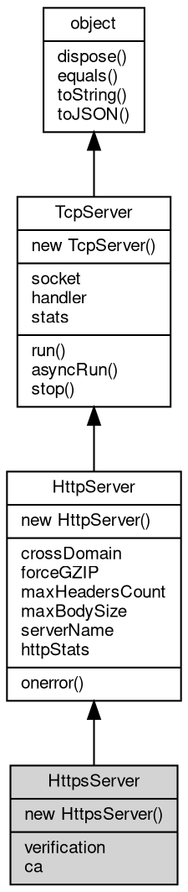

# 对象 HttpsServer
https 服务器对象

https 服务器对象是将 [SslServer](SslServer.md) 和 [HttpHandler](HttpHandler.md) 组合封装的对象，方便快速搭建服务器，逻辑上相当于：

```JavaScript
var svr = new net.SslServer(crt, key, addr, port, new http.Handler(function(req) {
    ...
}));
```

创建方法：

```JavaScript
var http = require("http");
var svr = new http.HttpsServer(crt, key, 443, function(req) {
    ...
});
```

## 继承关系


## 构造函数
        
### HttpsServer
**HttpsServer 构造函数，在所有本机地址侦听**

```JavaScript
new HttpsServer(Array certs,
    Integer port,
    Handler hdlr);
```

调用参数:
* certs: Array, 服务器证书列表
* port: Integer, 指定 [http](../../module/ifs/http.md) 服务器侦听端口
* hdlr: [Handler](Handler.md), [http](../../module/ifs/http.md) 内置消息处理器，处理函数，链式处理数组，路由对象，详见

certs 格式为：

```JavaScript
[{
        crt: [X509Cert object],
        key: [PKey object]
    },
    {
        crt: [X509Cert object],
        key: [PKey object]
    }
]
```

--------------------------
**HttpsServer 构造函数**

```JavaScript
new HttpsServer(Array certs,
    String addr,
    Integer port,
    Handler hdlr);
```

调用参数:
* certs: Array, 服务器证书列表
* addr: String, 指定 [http](../../module/ifs/http.md) 服务器侦听地址，为 "" 则在本机所有地址侦听
* port: Integer, 指定 [http](../../module/ifs/http.md) 服务器侦听端口
* hdlr: [Handler](Handler.md), [http](../../module/ifs/http.md) 内置消息处理器，处理函数，链式处理数组，路由对象，详见

certs 格式为：

```JavaScript
[{
        crt: [X509Cert object],
        key: [PKey object]
    },
    {
        crt: [X509Cert object],
        key: [PKey object]
    }
]
```

--------------------------
**HttpsServer 构造函数，在所有本机地址侦听**

```JavaScript
new HttpsServer(X509Cert crt,
    PKey key,
    Integer port,
    Handler hdlr);
```

调用参数:
* crt: [X509Cert](X509Cert.md), [X509Cert](X509Cert.md) 证书，用于客户端验证服务器
* key: [PKey](PKey.md), [PKey](PKey.md) 私钥，用于与客户端会话
* port: Integer, 指定 [http](../../module/ifs/http.md) 服务器侦听端口
* hdlr: [Handler](Handler.md), [http](../../module/ifs/http.md) 内置消息处理器，处理函数，链式处理数组，路由对象，详见

--------------------------
**HttpsServer 构造函数**

```JavaScript
new HttpsServer(X509Cert crt,
    PKey key,
    String addr,
    Integer port,
    Handler hdlr);
```

调用参数:
* crt: [X509Cert](X509Cert.md), [X509Cert](X509Cert.md) 证书，用于客户端验证服务器
* key: [PKey](PKey.md), [PKey](PKey.md) 私钥，用于与客户端会话
* addr: String, 指定 [http](../../module/ifs/http.md) 服务器侦听地址，为 "" 则在本机所有地址侦听
* port: Integer, 指定 [http](../../module/ifs/http.md) 服务器侦听端口
* hdlr: [Handler](Handler.md), [http](../../module/ifs/http.md) 内置消息处理器，处理函数，链式处理数组，路由对象，详见

## 成员属性
        
### verification
**Integer, 设定证书验证模式，缺省为 VERIFY_NONE**

```JavaScript
Integer HttpsServer.verification;
```

--------------------------
### ca
**[X509Cert](X509Cert.md), 客户端证书验证 ca**

```JavaScript
readonly X509Cert HttpsServer.ca;
```

--------------------------
### crossDomain
**Boolean, 查询和设置是否允许跨域请求，缺省为 false**

```JavaScript
Boolean HttpsServer.crossDomain;
```

--------------------------
### forceGZIP
**Boolean, 查询和设置是否允强制使用 gzip 压缩输出，缺省为 false**

```JavaScript
Boolean HttpsServer.forceGZIP;
```

--------------------------
### maxHeadersCount
**Integer, 查询和设置最大请求头个数，缺省为 128**

```JavaScript
Integer HttpsServer.maxHeadersCount;
```

--------------------------
### maxBodySize
**Integer, 查询和设置 body 最大尺寸，以 MB 为单位，缺省为 64**

```JavaScript
Integer HttpsServer.maxBodySize;
```

--------------------------
### serverName
**String, 查询和设置服务器名称，缺省为：fibjs/0.x.0**

```JavaScript
String HttpsServer.serverName;
```

--------------------------
### httpStats
**[Stats](Stats.md), 查询 [http](../../module/ifs/http.md) 协议转换处理器的工作状态**

```JavaScript
readonly Stats HttpsServer.httpStats;
```

返回的结果为一个 [Stats](Stats.md) 对象，结构如下：

```JavaScript
{
    total: 1000, // 总计处理的请求
    pendding: 100, // 当前正在处理的请求
    request: 10, // 新建的请求
    response: 10, // 发送的响应
    error: 100, // 发生的错误（不计入 404）
    error_400: 10, // 发生的请求错误
    error_404: 12, // 文件未找到的数量
    error_500: 2 // 内部处理错误
}
```

--------------------------
### socket
**[Socket](Socket.md), 服务器当前侦听的 [Socket](Socket.md) 对象**

```JavaScript
readonly Socket HttpsServer.socket;
```

--------------------------
### handler
**[Handler](Handler.md), 服务器当前事件处理接口对象**

```JavaScript
Handler HttpsServer.handler;
```

--------------------------
### stats
**[Stats](Stats.md), 查询当前服务器运行状态**

```JavaScript
readonly Stats HttpsServer.stats;
```

返回的结果为一个 [Stats](Stats.md) 对象，初始化计数器如下：

```JavaScript
{
    total: 1000, // 总计处理的连接
    connections: 100, // 当前正在处理的连接
    accept: 10, // 上次查询后新建的连接
    close: 10 // 上次查询后关闭的连接
}
```

## 成员函数
        
### onerror
**设置错误处理器**

```JavaScript
HttpsServer.onerror(Object hdlrs);
```

调用参数:
* hdlrs: Object, 指定不同的错误的处理器，key 是错误号，value 是处理器，可以是内置消息处理器，处理函数，链式处理数组，路由对象，详见 [mq.Handler](../../module/ifs/mq.md#Handler)

使用方式：

```JavaScript
hdlr.onerror({
    "404": function(v) {
        ...
    },
    "500": new mq.Routing(...)
})
```

--------------------------
### run
**运行服务器并开始接收和分发连接，此函数不会返回**

```JavaScript
HttpsServer.run() async;
```

--------------------------
### asyncRun
**异步运行服务器并开始接收和分发连接，调用后立即返回，服务器在后台运行**

```JavaScript
HttpsServer.asyncRun();
```

--------------------------
### stop
**关闭 socket中止正在运行的服务器**

```JavaScript
HttpsServer.stop() async;
```

--------------------------
### dispose
**强制回收对象，调用此方法后，对象资源将立即释放**

```JavaScript
HttpsServer.dispose();
```

--------------------------
### equals
**比较当前对象与给定的对象是否相等**

```JavaScript
Boolean HttpsServer.equals(object expected);
```

调用参数:
* expected: [object](object.md), 制定比较的目标对象

返回结果:
* Boolean, 返回对象比较的结果

--------------------------
### toString
**返回对象的字符串表示，一般返回 "[Native Object]"，对象可以根据自己的特性重新实现**

```JavaScript
String HttpsServer.toString();
```

返回结果:
* String, 返回对象的字符串表示

--------------------------
### toJSON
**返回对象的 JSON 格式表示，一般返回对象定义的可读属性集合**

```JavaScript
Value HttpsServer.toJSON(String key = "");
```

调用参数:
* key: String, 未使用

返回结果:
* Value, 返回包含可 JSON 序列化的值

