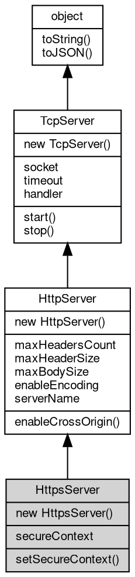

# 对象 HttpsServer
HttpsServer 是用于创建 https 服务器的对象，HttpsServer 对象可以使用 [HttpServer](HttpServer.md) 所有的接口函数和属性。HttpsServer 对象可以通过在创建时传入之前使用 openssl 生成的证书对象 (X509Cert 类型) 和密钥对象 (PKey 类型)，从而为客户端提供 [tls](../../module/ifs/tls.md)/ssl 加密保护的服务

https 服务器对象是将 [TLSServer](TLSServer.md) 和 [HttpHandler](HttpHandler.md) 组合封装的对象，方便快速搭建服务器，逻辑上相当于：

```JavaScript
var svr = new tls.Server({
    crt,
    key
}, addr, port, new http.Handler(function(req) {
    ...
}));
```

下面是一个使用 HttpsServer 的示例代码：

```JavaScript
const http = require("http");

// create https server
const server = new http.HttpsServer({
    cert,
    key
}, 8443, function(req) {
    resp.response.write(`Hello, Fibjs!`);
});
server.start();
```

在上面的例子中，我们加载了一个名为 "server.crt" 和 "server.key" 的证书和私钥文件，然后使用 HttpsServer 对象创建了一个服务，并开启了监听 8443 端口的服务，当客户端通过"https://localhost:8443/" 访问服务时，就可以受到 ssl 加密保护。

需要注意的是，如果是需要让外部访问的话，需要确保证书是公信机构颁发的，否则客户端无法验证，降低了性能和安全，并可能触发安全警告。

## 继承关系


## 构造函数
        
### HttpsServer
**HttpsServer 构造函数，在所有本机地址侦听**

```JavaScript
new HttpsServer(SecureContext context,
    Integer port,
    Handler hdlr);
```

调用参数:
* context: [SecureContext](SecureContext.md), [SecureContext](SecureContext.md) 安全上下文
* port: Integer, 指定 [http](../../module/ifs/http.md) 服务器侦听端口
* hdlr: [Handler](Handler.md), [http](../../module/ifs/http.md) 内置消息处理器，处理函数，链式处理数组，路由对象

--------------------------
**HttpsServer 构造函数**

```JavaScript
new HttpsServer(SecureContext context,
    String addr,
    Integer port,
    Handler hdlr);
```

调用参数:
* context: [SecureContext](SecureContext.md), [SecureContext](SecureContext.md) 安全上下文
* addr: String, 指定 [http](../../module/ifs/http.md) 服务器侦听地址，为 "" 则在本机所有地址侦听
* port: Integer, 指定 [http](../../module/ifs/http.md) 服务器侦听端口
* hdlr: [Handler](Handler.md), [http](../../module/ifs/http.md) 内置消息处理器，处理函数，链式处理数组，路由对象

--------------------------
**HttpsServer 构造函数，在所有本机地址侦听**

```JavaScript
new HttpsServer(Object options,
    Handler hdlr);
```

调用参数:
* options: Object, 使用 [tls.createSecureContext](../../module/ifs/tls.md#createSecureContext) 创建安全上下文需要的选项
* hdlr: [Handler](Handler.md), [http](../../module/ifs/http.md) 内置消息处理器，处理函数，链式处理数组，路由对象

options 除用于创建 [SecureContext](SecureContext.md) 的属性之外，还需提供以下属性：
- address: 指定监听的地址，可选，默认在所有地址监听
- port: 指定监听的端口，必须提供

## 成员属性
        
### secureContext
**[SecureContext](SecureContext.md), 查询当前 HttpsServer 使用的 [SecureContext](SecureContext.md)**

```JavaScript
readonly SecureContext HttpsServer.secureContext;
```

--------------------------
### maxHeadersCount
**Integer, 查询和设置最大请求头个数，缺省为 128**

```JavaScript
Integer HttpsServer.maxHeadersCount;
```

--------------------------
### maxHeaderSize
**Integer, 查询和设置最大请求头长度，缺省为 8192**

```JavaScript
Integer HttpsServer.maxHeaderSize;
```

--------------------------
### maxBodySize
**Integer, 查询和设置 body 最大尺寸，以 MB 为单位，缺省为 64**

```JavaScript
Integer HttpsServer.maxBodySize;
```

--------------------------
### enableEncoding
**Boolean, 自动解压缩功能开关，默认关闭**

```JavaScript
Boolean HttpsServer.enableEncoding;
```

--------------------------
### serverName
**String, 查询和设置服务器名称，缺省为：fibjs/0.x.0**

```JavaScript
String HttpsServer.serverName;
```

--------------------------
### socket
**[Socket](Socket.md), 服务器当前侦听的 [Socket](Socket.md) 对象**

```JavaScript
readonly Socket HttpsServer.socket;
```

--------------------------
### timeout
**Integer, 查询和设置超时时间，单位毫秒，此超时时间用于设置接收到的新连接**

```JavaScript
Integer HttpsServer.timeout;
```

--------------------------
### handler
**[Handler](Handler.md), 服务器当前事件处理接口对象**

```JavaScript
Handler HttpsServer.handler;
```

## 成员函数
        
### setSecureContext
**设置当前 HttpsServer 使用的 [SecureContext](SecureContext.md)**

```JavaScript
HttpsServer.setSecureContext(SecureContext context);
```

调用参数:
* context: [SecureContext](SecureContext.md), 指定新的 [SecureContext](SecureContext.md)

--------------------------
**设置当前 HttpsServer 使用的 [SecureContext](SecureContext.md)**

```JavaScript
HttpsServer.setSecureContext(Object options);
```

调用参数:
* options: Object, 使用 [tls.createSecureContext](../../module/ifs/tls.md#createSecureContext) 创建安全上下文需要的选项

--------------------------
### enableCrossOrigin
**允许跨域请求**

```JavaScript
HttpsServer.enableCrossOrigin(String allowHeaders = "Content-Type");
```

调用参数:
* allowHeaders: String, 指定接受的 [http](../../module/ifs/http.md) 头字段

--------------------------
### start
**启动当前服务器**

```JavaScript
HttpsServer.start();
```

--------------------------
### stop
**关闭 socket中止正在运行的服务器**

```JavaScript
HttpsServer.stop() async;
```

--------------------------
### toString
**返回对象的字符串表示，一般返回 "[Native Object]"，对象可以根据自己的特性重新实现**

```JavaScript
String HttpsServer.toString();
```

返回结果:
* String, 返回对象的字符串表示

--------------------------
### toJSON
**返回对象的 JSON 格式表示，一般返回对象定义的可读属性集合**

```JavaScript
Value HttpsServer.toJSON(String key = "");
```

调用参数:
* key: String, 未使用

返回结果:
* Value, 返回包含可 JSON 序列化的值

