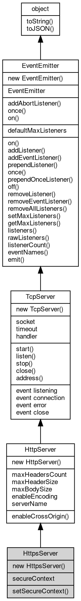

# Object HttpsServer
The HTTPS server: an [HttpServer](HttpServer.md) whose connections are terminated by an embedded [TLSServer](TLSServer.md)

HttpsServer extends [HttpServer](HttpServer.md) and adds the [SecureContext](SecureContext.md) used for the TLS handshake;
everything else (handler forms, routing, limits, automatic headers, CORS and
compression) behaves exactly like the plain server, because the embedded [TLSServer](TLSServer.md)
decodes the stream and passes it to the same [HttpHandler](HttpHandler.md). Use it, or
`http.createServer(options, hdlr)`, whenever the server terminates TLS itself; [TLSServer](TLSServer.md)
with an [http.Handler](../../module/ifs/http.md#Handler) builds the same composition manually.

Concepts:

- **TLS termination**: the [SecureContext](SecureContext.md) holds the certificate chain, the private key,
  the trusted CAs, the protocol versions and the verification flags (see the [tls](../../module/ifs/tls.md)
  [module](../../module/ifs/module.md)). The options constructor and createServer build the context in server mode. A
  context created without isServer (`tls.createSecureContext(opts)`) has requestCert
  true and a server built from it asks every client for a certificate, which ordinary
  clients do not send (the handshake fails with "peer did not return a certificate");
  use `tls.createSecureContext(opts, true)` or pass the TLS options [object](object.md) to the
  server.
- **Construction**: context plus port, context plus address plus port, a TLS options
  [object](object.md) plus handler (its address and port keys are read too) and context plus handler
  without a port (listen() to bind). setSecureContext() replaces the context at runtime;
  connections already open are not renegotiated and later handshakes use the new
  context.
- **Client trust**: a self-signed or private-CA certificate is not in the default
  Mozilla store, so the client must trust it explicitly with `new [http.Client](../../module/ifs/http.md#Client)({ ca })`
  or a [SecureContext](SecureContext.md). The [module](../../module/ifs/module.md)-level [http](../../module/ifs/http.md) functions do not accept TLS keys, so a `ca`
  in their options is ignored (Node's https.get does accept it).
- **Node.js differences**: https.Server extends [tls.Server](../../module/ifs/tls.md#Server) and is created by
  https.createServer(options, listener); fibjs HttpsServer extends [HttpServer](HttpServer.md), and
  `http.createServer` returns one when the first argument is a [SecureContext](SecureContext.md) or contains
  TLS material, while `createServer({}, hdlr)` returns a plain [HttpServer](HttpServer.md). ALPN, SNI and
  session resumption come from the [SecureContext](SecureContext.md) (see [tls](../../module/ifs/tls.md)).

Obtained from:
- `new [http.HttpsServer](../../module/ifs/http.md#HttpsServer)(options, hdlr)` / `new [http.HttpsServer](../../module/ifs/http.md#HttpsServer)(context, port, hdlr)` —
  the server, bound when a port is given;
- `new [http.HttpsServer](../../module/ifs/http.md#HttpsServer)(context, hdlr)` — no port, call listen() to bind;
- `http.createServer(options, hdlr)` — the same [object](object.md) through the [http](../../module/ifs/http.md) [module](../../module/ifs/module.md);
- `http.HttpsServer` is the [module](../../module/ifs/module.md) alias of this class; `require('https')` returns the
  same [http](../../module/ifs/http.md) [module](../../module/ifs/module.md).

Example 1 — a self-signed server and a trusting client:

```JavaScript
const http = require('http');
const crypto = require('crypto');

const pk = crypto.generateKeyPair('rsa', {
    modulusLength: 2048
});
const cert = crypto.createCertificateRequest({
    key: pk.privateKey,
    subject: {
        CN: 'localhost'
    }
}).issue({
    key: pk.privateKey,
    ca: true,
    issuer: {
        CN: 'localhost'
    }
});

const server = new http.HttpsServer({
    cert,
    key: pk.privateKey,
    port: 0
}, (req) => {
    req.response.write('secure');
});
server.start();
const port = server.socket.localPort;

const client = new http.Client({
    ca: cert
});
const res = client.getSync('https://localhost:' + port + '/');
console.log(res.statusCode, res.text()); // 200 secure

server.stop();
```

Example 2 — a server-mode [SecureContext](SecureContext.md) with the no-port constructor:

```JavaScript
const http = require('http');
const crypto = require('crypto');
const tls = require('tls');

const pk = crypto.generateKeyPair('rsa', {
    modulusLength: 2048
});
const cert = crypto.createCertificateRequest({
    key: pk.privateKey,
    subject: {
        CN: 'localhost'
    }
}).issue({
    key: pk.privateKey,
    ca: true,
    issuer: {
        CN: 'localhost'
    }
});

const ctx = tls.createSecureContext({
    cert,
    key: pk.privateKey
}, true);
const server = new http.HttpsServer(ctx, (req) => {
    req.response.write('from context');
});
server.listen(0);
const port = server.socket.localPort;

const client = new http.Client({
    ca: cert
});
console.log(client.getSync('https://localhost:' + port + '/').text()); // from context

server.stop();
```

Example 3 — [http.createServer](../../module/ifs/http.md#createServer)() with TLS options, and an untrusted client:

```JavaScript
const http = require('http');
const crypto = require('crypto');

const pk = crypto.generateKeyPair('rsa', {
    modulusLength: 2048
});
const cert = crypto.createCertificateRequest({
    key: pk.privateKey,
    subject: {
        CN: 'localhost'
    }
}).issue({
    key: pk.privateKey,
    ca: true,
    issuer: {
        CN: 'localhost'
    }
});

const server = http.createServer({
    cert,
    key: pk.privateKey
}, (req) => {
    req.response.write('created');
});
console.log(server.constructor.name); // HttpsServer

server.listen(0);
const port = server.socket.localPort;

let rejected = false;
try {
    new http.Client().getSync('https://localhost:' + port + '/');
} catch (e) {
    rejected = true; // the self-signed certificate is not trusted
}
console.log(rejected); // true

const client = new http.Client({
    ca: cert
});
console.log(client.getSync('https://localhost:' + port + '/').text()); // created

server.stop();
```

## Inheritance

```dot
digraph {
    node [fontname="Helvetica,sans-Serif", fontsize=10, shape="record", style="filled", fillcolor="white"];

    object [tooltip="object", URL="object.md", label="{object|toString()\ltoJSON()\l}"];
    EventEmitter [tooltip="EventEmitter", URL="EventEmitter.md", label="{EventEmitter|new EventEmitter()\l|EventEmitter\l|addAbortListener()\lonce()\lon()\l|defaultMaxListeners\l|on()\laddListener()\laddEventListener()\lprependListener()\lonce()\lprependOnceListener()\loff()\lremoveListener()\lremoveEventListener()\lremoveAllListeners()\lsetMaxListeners()\lgetMaxListeners()\llisteners()\lrawListeners()\llistenerCount()\leventNames()\lemit()\l}"];
    TcpServer [tooltip="TcpServer", URL="TcpServer.md", label="{TcpServer|new TcpServer()\l|socket\ltimeout\lhandler\l|start()\llisten()\lstop()\lclose()\laddress()\l|event listening\levent connection\levent error\levent close\l}"];
    HttpServer [tooltip="HttpServer", URL="HttpServer.md", label="{HttpServer|new HttpServer()\l|maxHeadersCount\lmaxHeaderSize\lmaxBodySize\lenableEncoding\lserverName\l|enableCrossOrigin()\l}"];
    HttpsServer [tooltip="HttpsServer", fillcolor="lightgray", id="me", label="{HttpsServer|new HttpsServer()\l|secureContext\l|setSecureContext()\l}"];

    object -> EventEmitter [dir=back];
    EventEmitter -> TcpServer [dir=back];
    TcpServer -> HttpServer [dir=back];
    HttpServer -> HttpsServer [dir=back];
}
```

## Constructors
        
### HttpsServer
**Creates an HTTPS server bound to a port from a ready [SecureContext](SecureContext.md)**

```JavaScript
new HttpsServer(SecureContext context,
    Integer port,
    Function(HttpRequest req, HttpResponse res) => Value hdlr);
```

Parameters:
* context: [SecureContext](SecureContext.md), the [SecureContext](SecureContext.md) secure context
* port: Integer, specifies the port on which the [http](../../module/ifs/http.md) server listens
* hdlr: [Handler](Handler.md) | [Handler](Handler.md)[] | Function([HttpRequest](HttpRequest.md) req, [HttpResponse](HttpResponse.md) res) => Value | Object | String, the request handler

The context should have been built in server mode
(`tls.createSecureContext(opts, true)`); a client-mode context has requestCert on
and makes the server ask clients for a certificate. Port 0 selects a free port
(socket.localPort). The handler forms and the lifecycle are those of
[HttpServer](HttpServer.md); see its documentation for the handler contract.

--------------------------
**Creates an HTTPS server bound to an address and a port from a ready [SecureContext](SecureContext.md)**

```JavaScript
new HttpsServer(SecureContext context,
    String addr,
    Integer port,
    Function(HttpRequest req, HttpResponse res) => Value hdlr);
```

Parameters:
* context: [SecureContext](SecureContext.md), the [SecureContext](SecureContext.md) secure context
* addr: String, the listening address; "" listens on all local addresses
* port: Integer, specifies the port on which the [http](../../module/ifs/http.md) server listens
* hdlr: [Handler](Handler.md) | [Handler](Handler.md)[] | Function([HttpRequest](HttpRequest.md) req, [HttpResponse](HttpResponse.md) res) => Value | Object | String, the request handler

addr selects the local interface ("" means all of them, as in [HttpServer](HttpServer.md)); the
context should be in server mode. The other constructor forms and the handler
contract are documented on the first constructor and on [HttpServer](HttpServer.md).

--------------------------
**Creates an HTTPS server from TLS options, binding immediately when a port is given**

```JavaScript
new HttpsServer(Object options,
    Function(HttpRequest req, HttpResponse res) => Value hdlr);
```

Parameters:
* options: Object, the options needed to create a secure context with [tls.createSecureContext](../../module/ifs/tls.md#createSecureContext)
* hdlr: [Handler](Handler.md) | [Handler](Handler.md)[] | Function([HttpRequest](HttpRequest.md) req, [HttpResponse](HttpResponse.md) res) => Value | Object | String, the request handler

options is passed to [tls.createSecureContext](../../module/ifs/tls.md#createSecureContext) in server mode; in addition the keys
address (optional, "" listens on all addresses) and port (optional) are read by the
server. When port is omitted, listen() must be called to bind; invalid certificate
material throws error 20024 here. The handler contract is the one of [HttpServer](HttpServer.md).

--------------------------
**Creates an HTTPS server without binding a port; listen() must be called to start**

```JavaScript
new HttpsServer(SecureContext context,
    Function(HttpRequest req, HttpResponse res) => Value hdlr);
```

Parameters:
* context: [SecureContext](SecureContext.md), the [SecureContext](SecureContext.md) secure context
* hdlr: [Handler](Handler.md) | [Handler](Handler.md)[] | Function([HttpRequest](HttpRequest.md) req, [HttpResponse](HttpResponse.md) res) => Value | Object | String, the request handler

Stores the ready [SecureContext](SecureContext.md) and the handler and creates the listener; call
listen(port, addr) to bind and begin serving. Do not call start() after listen()
(error 20009). The handler contract is the one of [HttpServer](HttpServer.md).

## Static Methods
        
### addAbortListener
**Registers a one-shot abort handler on an [AbortSignal](AbortSignal.md)**

```JavaScript
static Object HttpsServer.addAbortListener(EventEmitter signal,
    Function(Object ev) func);
```

Parameters:
* signal: [EventEmitter](EventEmitter.md), the [AbortSignal](AbortSignal.md) [object](object.md) to listen to
* func: Function(Object ev), the handler for the abort event

Returns:
* Object, returns a Disposable [object](object.md) containing a `[Symbol.dispose]` method

The handler is called at most once when the signal is aborted, and it is removed from the
signal afterwards. If the signal is already aborted the handler is invoked synchronously.
The returned [object](object.md) has a `[Symbol.dispose]()` method that removes the handler, so it can be
released before the abort happens.

Example — abort handling with automatic cleanup:

```JavaScript
const events = require('events');

const controller = new AbortController();
const disposable = events.addAbortListener(controller.signal,
    () => console.log('aborted'));

controller.abort(); // aborted
disposable[Symbol.dispose](); // safe to call after the listener fired
console.log(controller.signal.listenerCount('abort')); // 0
```

--------------------------
### once
**Creates a Promise resolved by the next occurrence of an event**

```JavaScript
static Object HttpsServer.once(EventEmitter emitter,
    Value ev,
    Object options = {});
```

Parameters:
* emitter: [EventEmitter](EventEmitter.md), the event emitter [object](object.md) to listen to
* ev: Value, the event name to listen for
* options: Object, optional parameter [object](object.md)

Returns:
* Object, returns a Promise that resolves with the array of event parameters

The Promise resolves with the array of the emit arguments when the event fires; it rejects
when `error` is emitted while waiting, unless the waited event is `error` itself, or when
the signal option aborts. The temporary listeners are removed when the Promise settles.

options supports the following option:

```JavaScript
// fragment: options
({
    "signal": null // AbortSignal; aborting rejects the Promise with an AbortError
});
```

Example — awaiting the next occurrence of an event:

```JavaScript
const EventEmitter = require('events');

(async () => {
    const emitter = new EventEmitter();
    const waiting = EventEmitter.once(emitter, 'ready');

    emitter.emit('ready', 200, 'ok');
    console.log(JSON.stringify(await waiting)); // [200,"ok"]
})();
```

--------------------------
### on
**Creates an async iterator that yields event occurrences**

```JavaScript
static Object HttpsServer.on(EventEmitter emitter,
    Value ev,
    Object options = {});
```

Parameters:
* emitter: [EventEmitter](EventEmitter.md), the event emitter [object](object.md) to listen to
* ev: Value, the event name to listen for
* options: Object, optional parameter [object](object.md)

Returns:
* Object, returns an AsyncIterator [object](object.md)

Each next() resolves with `{ value: [args...], done: false }` when the event fires and with
`{ done: true }` after an event named in the `close` option fires or the signal aborts; an
`error` event rejects the pending call. The listeners are registered when the iterator is
created and removed when the iteration ends or the signal aborts.

options supports the following options:

```JavaScript
// fragment: options
({
    "signal": null, // AbortSignal; aborting rejects pending and future next() calls
    "close": [] // event names; the first one to fire ends the iteration
});
```

Example — iterating the occurrences of an event:

```JavaScript
const EventEmitter = require('events');

(async () => {
    const emitter = new EventEmitter();
    const iterator = EventEmitter.on(emitter, 'data', {
        close: ['end']
    });

    emitter.emit('data', 1);
    emitter.emit('data', 2);
    emitter.emit('end');

    for await (const args of iterator)
    console.log(JSON.stringify(args)); // [1] then [2]
})();
```

## Static Properties
        
### defaultMaxListeners
**Integer, The [process](../../module/ifs/process.md)-wide default listener limit reported by getMaxListeners()**

```JavaScript
static Integer HttpsServer.defaultMaxListeners;
```

Defaults to 10. Assigning a value changes getMaxListeners() for every emitter that never
called setMaxListeners(); an emitter with an explicit limit keeps it. The limit is
informational: fibjs never warns when the number of listeners exceeds it.

## Properties
        
### secureContext
**[SecureContext](SecureContext.md), The [SecureContext](SecureContext.md) used for the TLS handshake, read-only**

```JavaScript
readonly SecureContext HttpsServer.secureContext;
```

The context given to the constructor or built from the options; pass it to a
[tls.connect](../../module/ifs/tls.md#connect) client as secureContext to reuse the same trust settings. It is replaced
by setSecureContext().

Example — the property returns the context the server was built with:

```JavaScript
const http = require('http');
const crypto = require('crypto');
const tls = require('tls');

const pk = crypto.generateKeyPair('rsa', {
    modulusLength: 2048
});
const cert = crypto.createCertificateRequest({
    key: pk.privateKey,
    subject: {
        CN: 'localhost'
    }
}).issue({
    key: pk.privateKey,
    ca: true,
    issuer: {
        CN: 'localhost'
    }
});

const ctx = tls.createSecureContext({
    cert,
    key: pk.privateKey
}, true);
const server = new http.HttpsServer(ctx, (req) => {
    req.response.write('ctx');
});
console.log(server.secureContext === ctx); // true
server.stop();
```

--------------------------
### maxHeadersCount
**Integer, Queries and sets the maximum number of request headers, default 128**

```JavaScript
Integer HttpsServer.maxHeadersCount;
```

Applied when each request is parsed; a request with more header lines is answered
with 400 and the connection is closed. A negative value throws a RangeError (20006).
Node.js has [http.Server](../../module/ifs/http.md#Server).maxHeadersCount for the same purpose.

--------------------------
### maxHeaderSize
**Integer, Queries and sets the maximum length of one header line in bytes, default 8192**

```JavaScript
Integer HttpsServer.maxHeaderSize;
```

A longer line makes the parser fail and the request is answered with 400; a negative
value throws a RangeError (20006). Node.js uses the [process](../../module/ifs/process.md)-wide
--max-[http](../../module/ifs/http.md)-header-size option instead.

--------------------------
### maxBodySize
**Integer, Queries and sets the maximum request body size in MB, default 64**

```JavaScript
Integer HttpsServer.maxBodySize;
```

A Content-Length or chunked body larger than this is rejected while parsing and the
request is answered with 400; -1 disables the limit and 0 refuses every body. Node.js
has no built-in body limit.

--------------------------
### enableEncoding
**Boolean, Enables automatic response compression, disabled by default**

```JavaScript
Boolean HttpsServer.enableEncoding;
```

When on, a reply larger than 128 bytes and smaller than 64 MB is compressed with
gzip or deflate when the client sent a matching Accept-Encoding and the
Content-Type is text/* or a known compressible type; the handler adds
Content-Encoding and replaces the body with the compressed one. An existing
Content-Encoding disables it. Node.js has no automatic compression.

--------------------------
### serverName
**String, Queries and sets the automatic Server header, default fibjs/<version>**

```JavaScript
String HttpsServer.serverName;
```

Written when the handler did not set a Server header itself; an empty value writes
an empty header. Node.js does not add a Server header.

Example — replace the default server name:

```JavaScript
const http = require('http');

const server = new http.Server(0, (req) => {
    req.response.write('named');
});
server.serverName = 'my-app/1.0';
server.start();
const port = server.socket.localPort;

const res = http.getSync('http://127.0.0.1:' + port + '/');
console.log(res.firstHeader('Server')); // my-app/1.0

server.stop();
```

--------------------------
### socket
**[Socket](Socket.md), the [Socket](Socket.md) [object](object.md) the server is currently listening on**

```JavaScript
readonly Socket HttpsServer.socket;
```

The underlying listening [Socket](Socket.md) exposes the bound family/localAddress/localPort; it is useful
for diagnostics, but do not call accept on it because the server owns the accept loop. It
throws when the server was created by the handler-only constructor and is not bound yet.
Node.js hides the listening handle.

--------------------------
### timeout
**Integer, Queries and sets the timeout in milliseconds; this timeout is used for newly accepted connections**

```JavaScript
Integer HttpsServer.timeout;
```

The default 0 means no timeout. The value is copied to each accepted [Socket](Socket.md) when the server
accepts it, before the handler runs, so it bounds every recv/send of the handler unless the
handler changes it. It does not apply to the listening socket itself.

--------------------------
### handler
**[Handler](Handler.md), the current event handling interface [object](object.md) of the server**

```JavaScript
Handler HttpsServer.handler;
```

The normalized [Handler](Handler.md) invoked for every connection. Assigning a value runs it through the
[Handler](Handler.md) constructor: a function becomes a message handler wrapper, an array becomes a [Chain](Chain.md)
and a [path](../../module/ifs/path.md)/address string or routing map is converted accordingly (see [net.createServer](../../module/ifs/net.md#createServer) for
the accepted forms). The getter returns the last assigned [object](object.md).

## Methods
        
### setSecureContext
**Replaces the [SecureContext](SecureContext.md) used for new TLS handshakes**

```JavaScript
HttpsServer.setSecureContext(SecureContext context);
```

Parameters:
* context: [SecureContext](SecureContext.md), specifies the new [SecureContext](SecureContext.md)

Connections that are already open keep the old context; later handshakes use the
new one, which is the supported way to rotate certificates without restarting the
listener. Passing a ready context is equivalent to replacing the certificate chain
and key directly.

--------------------------
**Replaces the [SecureContext](SecureContext.md), building it from TLS options**

```JavaScript
HttpsServer.setSecureContext(Object options);
```

Parameters:
* options: Object, the options needed to create a secure context with [tls.createSecureContext](../../module/ifs/tls.md#createSecureContext)

Creates a server-mode context from the options accepted by [tls.createSecureContext](../../module/ifs/tls.md#createSecureContext)
(cert, key, ca, passphrase, minVersion, ...) and installs it, so new handshakes use
the new material without a restart. Invalid material throws error 20024.

Example — install a context built from TLS options:

```JavaScript
const http = require('http');
const crypto = require('crypto');
const tls = require('tls');

const pk = crypto.generateKeyPair('rsa', {
    modulusLength: 2048
});
const cert = crypto.createCertificateRequest({
    key: pk.privateKey,
    subject: {
        CN: 'localhost'
    }
}).issue({
    key: pk.privateKey,
    ca: true,
    issuer: {
        CN: 'localhost'
    }
});

const ctx = tls.createSecureContext({
    cert,
    key: pk.privateKey
}, true);
const server = new http.HttpsServer(ctx,
    (req) => {
        req.response.write('rotated');
    });
server.listen(0);
const port = server.socket.localPort;

server.setSecureContext({
    cert: cert,
    key: pk.privateKey
});
const client = new http.Client({
    ca: cert
});
console.log(client.getSync('https://localhost:' + port + '/').text()); // rotated

server.stop();
```

--------------------------
### enableCrossOrigin
**Enables automatic CORS handling, including preflight requests**

```JavaScript
HttpsServer.enableCrossOrigin(String allowHeaders = "Content-Type");
```

Parameters:
* allowHeaders: String, specifies the accepted [http](../../module/ifs/http.md) header fields

Turns on the embedded handler's CORS mode: requests carrying an Origin header get
Access-Control-Allow-Credentials: true and Access-Control-Allow-Origin echoing the
origin, and an OPTIONS preflight is answered directly (200) with
Access-Control-Allow-Methods: *, Access-Control-Allow-[Headers](Headers.md) set to allowHeaders
and Access-Control-Max-Age: 1728000, without invoking the handler. Node.js has no
built-in CORS support.

Example — answer a preflight:

```JavaScript
const http = require('http');

const server = new http.Server(0, (req) => {
    req.response.write('cors');
});
server.enableCrossOrigin('X-Custom');
server.start();
const port = server.socket.localPort;

const res = http.requestSync('OPTIONS', 'http://127.0.0.1:' + port + '/', {
    headers: {
        Origin: 'http://example.com'
    }
});
console.log(res.statusCode); // 200
console.log(res.firstHeader('Access-Control-Allow-Origin')); // http://example.com
console.log(res.firstHeader('Access-Control-Allow-Headers')); // X-Custom

server.stop();
```

--------------------------
### start
**Starts the current server**

```JavaScript
HttpsServer.start();
```

Begins the accept loop and emits 'listening'. The server must already be bound: the
constructors with a port/address bind in the constructor while the handler-only form needs
listen(). Calling start on an unbound server or a second time fails with an invalid-call
error. Each accepted client is passed to the 'connection' listeners and then to the handler.

--------------------------
### listen
**Binds the address and port and starts listening for connections**

```JavaScript
HttpsServer.listen(Integer port,
    String addr = "",
    Integer backlog = -1) async;
```

Parameters:
* port: Integer, specifies the TCP server listening port
* addr: String, specifies the TCP server listening address; "" means listening on all local addresses
* backlog: Integer, specifies the maximum length of the connection queue, -1 means using the system default

 Binds and starts the accept loop in one call, emitting 'listening'. Port 0 asks the operating
 system for an ephemeral port, read it from address(). backlog -1 passes the system default to
 the operating system. A second listen on the same server throws ERR_SERVER_ALREADY_LISTEN,
 and a failed bind (for example EADDRINUSE) carries syscall 'listen' like Node.js.

--------------------------
### stop
**Closes the socket and aborts the running server**

```JavaScript
HttpsServer.stop() async;
```

Closes the listening socket and emits 'close' immediately; the accepted connections are not
closed and keep running in their handler fibers (the handler owns them). Stopping a server
that was never bound is a no-op. Node.js server.close() instead waits for the active
connections to end before emitting 'close'.

--------------------------
### close
**Closes the socket and aborts the running server; an alias of stop()**

```JavaScript
HttpsServer.close() async;
```

Identical to stop(), provided for the Node.js naming; both are awaitable.

--------------------------
### address
**Returns an [object](object.md) containing the server bound address, address family and port. Used to look up the actual port when the OS assigns the address.**

```JavaScript
(String address, String family, Integer port) HttpsServer.address();
```

Returns:
* (String address, String family, Integer port), returns the address, address family and port bound by the server

The result has the shape { address, family, port }, where family is 'IPv4' or 'IPv6' and port
is the real port after listen(0). For a unix socket or Windows pipe the address is the bound
[path](../../module/ifs/path.md) while family/port are placeholders ('IPv4'/0). The method throws before the server is
bound (number 20009); Node.js returns null instead and returns the [path](../../module/ifs/path.md) string for pipe
servers.

Example — discovering the port assigned to listen(0):

```JavaScript
const net = require('net');

const server = net.createServer((conn) => conn.close());
server.listen(0, '127.0.0.1');

const addr = server.address();
console.log(addr.address, addr.family, addr.port > 0); // 127.0.0.1 IPv4 true

server.stop();
```

--------------------------
### on
**Appends an event handler to the emitter**

```JavaScript
Object HttpsServer.on(Value ev,
    Function(...args) func);
```

Parameters:
* ev: Value, the event name to bind
* func: Function(...args), the event handler function, called with the emit arguments

Returns:
* Object, returns the event [object](object.md) itself for chaining

The listener is called with the arguments of emit() and `this` set to the emitter; the
emitter itself is returned so registrations can be chained. The same function may be
registered several times for one event and each copy is called. See the class documentation
for the dispatch order.

--------------------------
**Appends several event handlers to the emitter**

```JavaScript
Object HttpsServer.on(Object map);
```

Parameters:
* map: Object, the event mapping; [object](object.md) property names are used as event names

Returns:
* Object, returns the event [object](object.md) itself for chaining

Every enumerable property of the map whose value is a function is registered under its
property name. Properties are processed in order; a value that is not a function makes the
call fail with an invalid-type error while entries processed before it stay registered.

Example — registering several handlers at once:

```JavaScript
const EventEmitter = require('events');

const emitter = new EventEmitter();
emitter.on({
    connect: () => console.log('connect'),
    close: () => console.log('close')
});

emitter.emit('connect'); // connect
emitter.emit('close'); // close
```

--------------------------
### addListener
**Appends an event handler to the emitter**

```JavaScript
Object HttpsServer.addListener(Value ev,
    Function(...args) func);
```

Parameters:
* ev: Value, the event name to bind
* func: Function(...args), the event handler function

Returns:
* Object, returns the event [object](object.md) itself for chaining

Alias of on(ev, func), provided for Node.js compatibility.

--------------------------
**Appends several event handlers to the emitter**

```JavaScript
Object HttpsServer.addListener(Object map);
```

Parameters:
* map: Object, the event mapping; [object](object.md) property names are used as event names

Returns:
* Object, returns the event [object](object.md) itself for chaining

Alias of on(map), provided for Node.js compatibility.

--------------------------
### addEventListener
**Appends an event handler to the emitter with an options [object](object.md)**

```JavaScript
Object HttpsServer.addEventListener(Value ev,
    Function(...args) func,
    Object options = {});
```

Parameters:
* ev: Value, the event name to bind
* func: Function(...args), the event handler function, called with the emit arguments
* options: Object, the options of the event handler

Returns:
* Object, returns the event [object](object.md) itself for chaining

Web-style alias of on(); the only supported option is `once`, which registers a one-shot
handler exactly like once(). The listener receives the plain emit arguments and not an [Event](Event.md)
[object](object.md); see the [DOMEvent](DOMEvent.md) class for the DOM-style event [object](object.md) used by [AbortSignal](AbortSignal.md) and
fetch-style APIs.

options supports the following option:

```JavaScript
// fragment: options
({
    "once": false // when true, the handler is removed before its single invocation
});
```

Example — a one-shot DOM-style registration:

```JavaScript
const EventEmitter = require('events');

const emitter = new EventEmitter();
emitter.addEventListener('ping', () => console.log('ping'), {
    once: true
});

emitter.emit('ping'); // ping
console.log(emitter.emit('ping')); // false
console.log(emitter.listenerCount('ping')); // 0
```

--------------------------
### prependListener
**Inserts an event handler at the front of the queue**

```JavaScript
Object HttpsServer.prependListener(Value ev,
    Function(...args) func);
```

Parameters:
* ev: Value, the event name to bind
* func: Function(...args), the event handler function

Returns:
* Object, returns the event [object](object.md) itself for chaining

The listener is called before the listeners registered with on()/addListener() the next time
the event is emitted. When several prependListener() calls are made, the last one registered
is called first, because every call inserts at the same position.

Example — insertion at the front of the queue:

```JavaScript
const EventEmitter = require('events');

const emitter = new EventEmitter();
emitter.on('order', () => console.log('on'));
emitter.prependListener('order', () => console.log('prepend'));

emitter.emit('order'); // prepend, then on
```

--------------------------
**Inserts several event handlers at the front of the queue**

```JavaScript
Object HttpsServer.prependListener(Object map);
```

Parameters:
* map: Object, the event mapping; [object](object.md) property names are used as event names

Returns:
* Object, returns the event [object](object.md) itself for chaining

Map form of prependListener(); every function property is inserted at the front, so the
properties of the map are called in reverse order.

--------------------------
### once
**Appends a one-shot event handler to the emitter**

```JavaScript
Object HttpsServer.once(Value ev,
    Function(...args) func);
```

Parameters:
* ev: Value, the event name to bind
* func: Function(...args), the event handler function

Returns:
* Object, returns the event [object](object.md) itself for chaining

The handler is wrapped and removes itself from the queue before it is called, so it runs at
most once. off() removes it when passed the original function, listeners() returns the
original function, and rawListeners() returns the internal wrapper whose `_func` property
holds the original. See Example 2 in the class documentation.

--------------------------
**Appends several one-shot event handlers to the emitter**

```JavaScript
Object HttpsServer.once(Object map);
```

Parameters:
* map: Object, the event mapping; [object](object.md) property names are used as event names

Returns:
* Object, returns the event [object](object.md) itself for chaining

Map form of once(); every function property is registered as a one-shot listener under its
property name.

--------------------------
### prependOnceListener
**Inserts a one-shot event handler at the front of the queue**

```JavaScript
Object HttpsServer.prependOnceListener(Value ev,
    Function(...args) func);
```

Parameters:
* ev: Value, the event name to bind
* func: Function(...args), the event handler function

Returns:
* Object, returns the event [object](object.md) itself for chaining

Combines prependListener() and once(): the handler is called first and only once, and it is
removed before its invocation.

--------------------------
**Inserts several one-shot event handlers at the front of the queue**

```JavaScript
Object HttpsServer.prependOnceListener(Object map);
```

Parameters:
* map: Object, the event mapping; [object](object.md) property names are used as event names

Returns:
* Object, returns the event [object](object.md) itself for chaining

Map form of prependOnceListener(); every function property is inserted as a one-shot
listener, and the properties of the map are called in reverse order.

--------------------------
### off
**Removes an event handler from the emitter**

```JavaScript
Object HttpsServer.off(Value ev,
    Function(...args) func);
```

Parameters:
* ev: Value, the event name to unbind
* func: Function(...args), the event handler function

Returns:
* Object, returns the event [object](object.md) itself for chaining

The first matching listener is removed; when the same function was registered several times
only one copy is removed per call, so repeat the call to remove the others. A once() wrapper
is matched by its original function as well. Removing a listener emits the `removeListener`
meta event after the removal.

--------------------------
**Removes all event handlers of one event**

```JavaScript
Object HttpsServer.off(Value ev);
```

Parameters:
* ev: Value, the event name to unbind

Returns:
* Object, returns the event [object](object.md) itself for chaining

Every listener of the event is removed and `removeListener` is emitted once per removed
listener. The call succeeds when the event has no listener.

Example — removing every listener of one event:

```JavaScript
const EventEmitter = require('events');

const emitter = new EventEmitter();
emitter.on('data', () => console.log('first'));
emitter.on('data', () => console.log('second'));

emitter.off('data');
console.log(emitter.emit('data')); // false
```

--------------------------
**Removes several event handlers from the emitter**

```JavaScript
Object HttpsServer.off(Object map);
```

Parameters:
* map: Object, the event mapping; [object](object.md) property names are used as event names

Returns:
* Object, returns the event [object](object.md) itself for chaining

Every enumerable property of the map whose value is a function names an event from which
that function is removed (one copy per event). A value that is not a function makes the call
fail with an invalid-type error.

--------------------------
### removeListener
**Removes an event handler from the emitter**

```JavaScript
Object HttpsServer.removeListener(Value ev,
    Function(...args) func);
```

Parameters:
* ev: Value, the event name to unbind
* func: Function(...args), the event handler function

Returns:
* Object, returns the event [object](object.md) itself for chaining

Alias of off(ev, func), provided for Node.js compatibility.

--------------------------
**Removes all event handlers of one event**

```JavaScript
Object HttpsServer.removeListener(Value ev);
```

Parameters:
* ev: Value, the event name to unbind

Returns:
* Object, returns the event [object](object.md) itself for chaining

Alias of off(ev), provided for Node.js compatibility.

--------------------------
**Removes several event handlers from the emitter**

```JavaScript
Object HttpsServer.removeListener(Object map);
```

Parameters:
* map: Object, the event mapping; [object](object.md) property names are used as event names

Returns:
* Object, returns the event [object](object.md) itself for chaining

Alias of off(map), provided for Node.js compatibility.

--------------------------
### removeEventListener
**Removes an event handler with an options [object](object.md)**

```JavaScript
Object HttpsServer.removeEventListener(Value ev,
    Function(...args) func,
    Object options = {});
```

Parameters:
* ev: Value, the event name to unbind
* func: Function(...args), the event handler function
* options: Object, the options of the event handler, ignored

Returns:
* Object, returns the event [object](object.md) itself for chaining

Web-style alias of off(ev, func); the options [object](object.md) is accepted and ignored, and a once()
wrapper is matched by its original function like off().

--------------------------
### removeAllListeners
**Removes all listeners of one event**

```JavaScript
Object HttpsServer.removeAllListeners(Value ev);
```

Parameters:
* ev: Value, the event name to remove

Returns:
* Object, returns the event [object](object.md) itself for chaining

Equivalent to off(ev): every listener of the event is removed, including once() wrappers
matched by their original function, and `removeListener` is emitted once per removal.

--------------------------
**Removes all listeners of the given events, or of the whole emitter**

```JavaScript
Object HttpsServer.removeAllListeners(Array evs = []);
```

Parameters:
* evs: Array, the event names to remove

Returns:
* Object, returns the event [object](object.md) itself for chaining

An empty array — including the no-argument call, because the parameter defaults to [] —
clears every string-keyed event; symbol-keyed listeners are left in place, unlike Node.js
which removes them too. A non-empty array clears each named event as
removeAllListeners(ev) does.

Example — clearing selected events and the whole emitter:

```JavaScript
const EventEmitter = require('events');

const emitter = new EventEmitter();
emitter.on('a', () => {});
emitter.on('b', () => {});
emitter.on('c', () => {});

emitter.removeAllListeners(['a', 'b']);
console.log(emitter.listenerCount('a'), emitter.listenerCount('c')); // 0 1

emitter.removeAllListeners();
console.log(emitter.eventNames().length); // 0
```

--------------------------
### setMaxListeners
**Stores a per-emitter listener limit**

```JavaScript
HttpsServer.setMaxListeners(Integer n);
```

Parameters:
* n: Integer, the number of events

The value is reported by getMaxListeners() and is otherwise informational: fibjs never warns
when the number of listeners exceeds it. This member exists for Node.js compatibility. A
negative value throws; 0 is accepted and stored as-is, while Node.js treats 0 as unlimited.

--------------------------
### getMaxListeners
**Returns the listener limit of the emitter**

```JavaScript
Integer HttpsServer.getMaxListeners();
```

Returns:
* Integer, returns the default limit

Returns the value set by setMaxListeners(), or the [process](../../module/ifs/process.md)-wide defaultMaxListeners (10)
when no explicit value was set.

--------------------------
### listeners
**Returns a copy of the listener array of an event**

```JavaScript
Array HttpsServer.listeners(Value ev);
```

Parameters:
* ev: Value, the event name to query

Returns:
* Array, returns the listener array of the specified event

One-shot wrappers are unwrapped, so the result contains the functions passed to
on()/once() and can be passed to off(); an unknown event produces an empty array.

Example — once() listeners are returned unwrapped:

```JavaScript
const EventEmitter = require('events');

const emitter = new EventEmitter();

function onTick() {
    console.log('tick');
}

emitter.once('tick', onTick);
console.log(emitter.listeners('tick')[0] === onTick); // true
console.log(emitter.rawListeners('tick')[0] === onTick); // false
```

--------------------------
### rawListeners
**Returns the internal listener array of an event**

```JavaScript
Array HttpsServer.rawListeners(Value ev);
```

Parameters:
* ev: Value, the event name to query

Returns:
* Array, returns the listener array of the specified event

The array is not unwrapped: a listener registered with once() appears as the internal
wrapper function whose `_func` property holds the original function. An unknown event
produces an empty array.

--------------------------
### listenerCount
**Returns the number of listeners of an event**

```JavaScript
Integer HttpsServer.listenerCount(Value ev);
```

Parameters:
* ev: Value, the event name to query

Returns:
* Integer, returns the number of listeners of the specified event

One-shot listeners count as one and an unknown event returns 0.

--------------------------
**Returns the number of listeners of an event on another [object](object.md)**

```JavaScript
Integer HttpsServer.listenerCount(Value o,
    Value ev);
```

Parameters:
* o: Value, the [object](object.md) to query
* ev: Value, the event name to query

Returns:
* Integer, returns the number of listeners of the specified event

Counts without requiring the target to be an [EventEmitter](EventEmitter.md): any [object](object.md) with registered
events can be queried. The call is normally written as
`EventEmitter.listenerCount(target, 'data')`.

Example — counting the listeners of another [object](object.md):

```JavaScript
const EventEmitter = require('events');

const emitter = new EventEmitter();
emitter.on('data', () => {});
emitter.on('data', () => {});

console.log(EventEmitter.listenerCount(emitter, 'data')); // 2
```

--------------------------
### eventNames
**Returns the names of the events with at least one listener**

```JavaScript
Array HttpsServer.eventNames();
```

Returns:
* Array, returns the array of event names

Only string-keyed events are reported; symbol-keyed events are omitted and numeric event
names are returned as numbers (Node.js also reports symbol events).

--------------------------
### emit
**Emits an event and returns whether a listener was called**

```JavaScript
Boolean HttpsServer.emit(Value ev,
    ...args);
```

Parameters:
* ev: Value, event name
* args: ..., event parameters, which are passed to the event handler

Returns:
* Boolean, returns whether the event had a listener to respond to it

Listeners are called as described by the dispatch model in the class documentation: the
first one runs synchronously on the current fiber, the remaining ones run in parallel
fibers, and the call returns after all of them finish; an exception raised by a listener is
thrown back to the caller. Emitting `error` with no listener throws instead of returning
false: an Error argument is thrown as-is and any other value is wrapped in
`Error("Unhandled error. (...)")`. [Event](Event.md) names are strings or symbols; `emit()` does not
match a listener registered with a numeric name.

--------------------------
### toString
**Returns the string form of the [object](object.md)**

```JavaScript
String HttpsServer.toString();
```

Returns:
* String, returns the string form of the [object](object.md)

The base implementation reports an error: a native [object](object.md) has no implicit
text form, and only the classes whose value can be written as a string
override the member. [Buffer](Buffer.md) returns its content decoded with the given
[encoding](../../module/ifs/encoding.md), [HttpCookie](HttpCookie.md) returns "name=value", and so on; an override commonly
accepts optional arguments ([Buffer.toString](Buffer.md#toString) takes [encoding](../../module/ifs/encoding.md), start and
end) that are not part of this declaration.

Calling the member on a class that does not override it throws
"<Class>: the [object](object.md) can not be converted to string.", which is the
behavior to rely on when probing whether a value has a string form. See
toJSON for the serialization hook.

--------------------------
### toJSON
**Returns the JSON representation of the [object](object.md)**

```JavaScript
Value HttpsServer.toJSON(String key = "");
```

Parameters:
* key: String, the property name of the value being serialized

Returns:
* Value, returns the JSON-serializable value

JSON.stringify(value) calls value.toJSON(key) when the member exists and
serializes the returned value in its place; the key argument carries the
property name of the value inside its parent [object](object.md) (an empty string at
the top level) and may be used to build a keyed form. The base
implementation returns a plain [object](object.md) holding the readable properties of
the instance, so a native [object](object.md) serializes without per-class code; a
class with a portable shape such as [Buffer](Buffer.md) overrides it, and a JavaScript
class may override it in the same way.

The member is normally reached through JSON.stringify rather than called
directly; calling it returns the same value JSON.stringify would
serialize.

## Events
        
### listening
**Emitted after start() is called and binding completes**

```JavaScript
event HttpsServer.listening();
```

Emitted synchronously by start()/listen(), after the socket is listening and before the first
accept; observe it with on('listening') or the onlistening shorthand. Node.js emits
'listening' asynchronously once the bind completes.

--------------------------
### connection
**Emitted when a new TCP connection is established**

```JavaScript
event HttpsServer.connection(Socket socket);
```

Parameters:
* socket: [Socket](Socket.md), the newly established [Socket](Socket.md) connection [object](object.md)

Emitted before the handler is invoked for the same [Socket](Socket.md), on the accepting fiber; a long
listener delays further accepts, so offload work to the handler or to a new fiber. Node.js
emits 'connection' with its socket in the same way.

--------------------------
### error
**Emitted when an error occurs**

```JavaScript
event HttpsServer.error(String msg);
```

Parameters:
* msg: String, the error message

Emitted for accept-loop failures with a plain message string, not with an Error [object](object.md) as in
Node.js. An exception thrown by the handler does not emit this event: it is logged and the
connection is closed.

--------------------------
### close
**Emitted after the server is closed**

```JavaScript
event HttpsServer.close();
```

Emitted by stop()/close() immediately after the listening socket is closed, even when
connections are still open. Node.js emits 'close' only after the server has stopped
accepting and all connections have ended.

