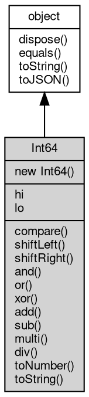

# 对象 Int64
64位整数对象

创建方法：

```JavaScript
var n = new Int64(123);
```

## 继承关系


## 构造函数
        
### Int64
**Int64 构造函数**

```JavaScript
new Int64(Long num = 0);
```

调用参数:
* num: Long, 初始化的值

--------------------------
**Int64 构造函数**

```JavaScript
new Int64(Long hi,
    Long lo);
```

调用参数:
* hi: Long, 高32位数
* lo: Long, 低32位数

--------------------------
**Int64 构造函数**

```JavaScript
new Int64(Int64 num);
```

调用参数:
* num: Int64, 初始化的值

--------------------------
**Int64 构造函数**

```JavaScript
new Int64(String num,
    Integer base = 10);
```

调用参数:
* num: String, 数字字符串
* base: Integer, 数字字符串的编码方式，可以接受 2-16, 32, 64，默认为 10，为 10 时自动识别 0x 编码

## 成员属性
        
### hi
**Long, 高 32 位数值**

```JavaScript
Long Int64.hi;
```

--------------------------
### lo
**Long, 低 32 位数值**

```JavaScript
Long Int64.lo;
```

## 成员函数
        
### compare
**将 Int64 内的数值与给定数值比较大小**

```JavaScript
Integer Int64.compare(Int64 num);
```

调用参数:
* num: Int64, 指定比较的数值

返回结果:
* Integer, 返回 1 表示 Int64 内的数值比指定数值更大，0 表示相等，-1 表示更小

--------------------------
### shiftLeft
**将 Int64 内的数值左移相应的位数，此操作不影响 Int64 原有数值**

```JavaScript
Int64 Int64.shiftLeft(Integer bits);
```

调用参数:
* bits: Integer, 指定移动的位数

返回结果:
* Int64, 返回包含移位以后数值的对象

--------------------------
### shiftRight
**将 Int64 内的数值右移相应的位数，此操作不影响 Int64 原有数值**

```JavaScript
Int64 Int64.shiftRight(Integer bits);
```

调用参数:
* bits: Integer, 指定移动的位数

返回结果:
* Int64, 返回包含移位以后数值的对象

--------------------------
### and
**将 Int64 内的数值与给定的数值进行按位 and 操作，此操作不影响 Int64 原有数值**

```JavaScript
Int64 Int64.and(Int64 num);
```

调用参数:
* num: Int64, 指定运算的数值

返回结果:
* Int64, 返回包含预算以后数值的对象

--------------------------
### or
**将 Int64 内的数值与给定的数值进行按位 or 操作，此操作不影响 Int64 原有数值**

```JavaScript
Int64 Int64.or(Int64 num);
```

调用参数:
* num: Int64, 指定运算的数值

返回结果:
* Int64, 返回包含预算以后数值的对象

--------------------------
### xor
**将 Int64 内的数值与给定的数值进行按位 xor 操作，此操作不影响 Int64 原有数值**

```JavaScript
Int64 Int64.xor(Int64 num);
```

调用参数:
* num: Int64, 指定运算的数值

返回结果:
* Int64, 返回包含预算以后数值的对象

--------------------------
### add
**将 Int64 内的数值与给定的数值进行加操作，此操作不影响 Int64 原有数值**

```JavaScript
Int64 Int64.add(Int64 num);
```

调用参数:
* num: Int64, 指定运算的数值

返回结果:
* Int64, 返回包含预算以后数值的对象

--------------------------
### sub
**将 Int64 内的数值与给定的数值进行减操作，此操作不影响 Int64 原有数值**

```JavaScript
Int64 Int64.sub(Int64 num);
```

调用参数:
* num: Int64, 指定运算的数值

返回结果:
* Int64, 返回包含预算以后数值的对象

--------------------------
### multi
**将 Int64 内的数值与给定的数值进行乘操作，此操作不影响 Int64 原有数值**

```JavaScript
Int64 Int64.multi(Int64 num);
```

调用参数:
* num: Int64, 指定运算的数值

返回结果:
* Int64, 返回包含预算以后数值的对象

--------------------------
### div
**将 Int64 内的数值与给定的数值进行除操作，此操作不影响 Int64 原有数值**

```JavaScript
Int64 Int64.div(Int64 num);
```

调用参数:
* num: Int64, 指定运算的数值

返回结果:
* Int64, 返回包含预算以后数值的对象

--------------------------
### toNumber
**转换成数字类型**

```JavaScript
Number Int64.toNumber();
```

返回结果:
* Number, 返回转换后的数字

--------------------------
### toString
**转换成字符串类型**

```JavaScript
String Int64.toString(Integer base = 10);
```

调用参数:
* base: Integer, 字符串进制数，可以接受 2-16, 32, 64，默认为 10

返回结果:
* String, 返回转换后的字符串

--------------------------
### dispose
**强制回收对象，调用此方法后，对象资源将立即释放**

```JavaScript
Int64.dispose();
```

--------------------------
### equals
**比较当前对象与给定的对象是否相等**

```JavaScript
Boolean Int64.equals(object expected);
```

调用参数:
* expected: [object](object.md), 制定比较的目标对象

返回结果:
* Boolean, 返回对象比较的结果

--------------------------
### toString
**返回对象的字符串表示，一般返回 "[Native Object]"，对象可以根据自己的特性重新实现**

```JavaScript
String Int64.toString();
```

返回结果:
* String, 返回对象的字符串表示

--------------------------
### toJSON
**返回对象的 JSON 格式表示，一般返回对象定义的可读属性集合**

```JavaScript
Value Int64.toJSON(String key = "");
```

调用参数:
* key: String, 未使用

返回结果:
* Value, 返回包含可 JSON 序列化的值

