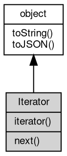

# 对象 Iterator
迭代器对象，用于遍历集合数据

## 继承关系


## 操作符
        
### @iterator
**查询当前对象元素的迭代器**

```JavaScript
Iterator Iterator.@iterator();
```

返回结果:
* Iterator, 返回当前对象元素的迭代器

## 成员函数
        
### next
**迭代下一个元素**

```JavaScript
(Value value, Boolean done) Iterator.next();
```

返回结果:
* (Value value, Boolean done), 返回下一个元素，或者标记迭代结束

--------------------------
### toString
**返回对象的字符串表示，一般返回 "[Native Object]"，对象可以根据自己的特性重新实现**

```JavaScript
String Iterator.toString();
```

返回结果:
* String, 返回对象的字符串表示

--------------------------
### toJSON
**返回对象的 JSON 格式表示，一般返回对象定义的可读属性集合**

```JavaScript
Value Iterator.toJSON(String key = "");
```

调用参数:
* key: String, 未使用

返回结果:
* Value, 返回包含可 JSON 序列化的值

