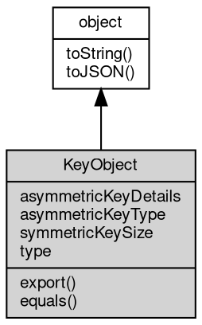

# 对象 KeyObject
KeyObject 类来表示对称或非对称密钥，每种密钥公开不同的功能

[crypto.createSecretKey](../../module/ifs/crypto.md#createSecretKey) 、 [crypto.createPublicKey](../../module/ifs/crypto.md#createPublicKey) 和 [crypto.createPrivateKey](../../module/ifs/crypto.md#createPrivateKey) 方法用于创建 KeyObject 实例。 KeyObject 对象不能直接使用 new 关键字创建。

## 继承关系


## 成员属性
        
### asymmetricKeyDetails
**Object, 有关非对称密钥的信息**

```JavaScript
readonly Object KeyObject.asymmetricKeyDetails;
```

返回结果的内容如下：

```JavaScript
{
    modulusLength: 2048, // 密钥大小（以位为单位）（RSA、DSA）。
    publicExponent: 65537n, // 公共指数 (RSA)。
    hashAlgorithm: 'sha1', // 消息摘要的名称 (RSA-PSS)。
    mgf1HashAlgorithm: 'sha1', // MGF1 (RSA-PSS) 使用的消息摘要的名称。
    saltLength: 20, // 最小盐长度（以字节为单位）（RSA-PSS）。
    divisorLength: , // q 的大小（以位 (DSA) 为单位）。
    namedCurve: '' // 曲线名称 (EC)。
}
```

--------------------------
### asymmetricKeyType
**String, 密钥的类型**

```JavaScript
readonly String KeyObject.asymmetricKeyType;
```

对于非对称密钥，此属性表示密钥的类型。支持的密钥类型有：
- 'rsa' （OID 1.2.840.113549.1.1.1）
- 'rsa-pss' （OID 1.2.840.113549.1.1.10）
- 'dsa' （OID 1.2.840.10040.4.1）
- 'ec' （OID 1.2.840.10045.2.1）
- 'x25519' （OID 1.3.101.110）
- 'x448' （OID 1.3.101.111）
- 'ed25519' （OID 1.3.101.112）
- 'ed448' （OID 1.3.101.113）
- 'dh' （OID 1.2.840.113549.1.3.1）

对于无法识别的 KeyObject 类型和对称密钥，此属性为 undefined 。

--------------------------
### symmetricKeySize
**Integer, 对于秘密密钥，此属性表示密钥的大小（以字节为单位）。对于非对称密钥，此属性为 undefined**

```JavaScript
readonly Integer KeyObject.symmetricKeySize;
```

--------------------------
### type
**String, 密钥的类型，对于秘密（对称）密钥，此属性为 'secret'，对于公共（非对称）密钥，此属性为 'public' 或 'private'**

```JavaScript
readonly String KeyObject.type;
```

## 成员函数
        
### export
**根据给定的选项导出密钥的信息**

```JavaScript
Value KeyObject.export(Object options = {});
```

调用参数:
* options: Object, 导出密钥的选项

返回结果:
* Value, 返回密钥的信息

对于对称密钥，可以使用以下编码选项：
- format: 必须是 'buffer' （默认）或 'jwk'

对于公钥，可以使用以下编码选项：
- type: 必须是 'pkcs1' （仅限 RSA）或 'spki' 之一
- format: 必须是 'pem' 、 'der' 或 'jwk'

对于私钥，可以使用以下编码选项：
- type: 必须是 'pkcs1' （仅限 RSA）、 'pkcs8' 或 'sec1' （仅限 EC）之一
- format: 必须是 'pem' 、 'der' 或 'jwk'
- cipher: 如果指定，则将使用基于 PKCS#5 v2.0 密码的加密，使用给定的 cipher 和 passphrase 对私钥进行加密
- passphrase: <字符串> | 用于加密的密码，请参阅 cipher

当选择 JWK 编码格式时，所有其他编码选项都将被忽略。

可以使用 cipher 和 format 选项的组合来加密 PKCS#1、SEC1 和 PKCS#8 类型密钥。 PKCS#8 type 可以与任何 format 一起使用，通过指定 cipher 来加密任何密钥算法（RSA、EC 或 DH）。当使用 PEM format 时，只能通过指定 cipher 来加密 PKCS#1 和 SEC1。为了获得最大兼容性，请使用 PKCS#8 作为加密私钥。由于 PKCS#8 定义了自己的加密机制，因此在加密 PKCS#8 密钥时不支持 PEM 级加密。有关 PKCS#8 加密的信息，请参阅 RFC 5208；有关 PKCS#1 和 SEC1 加密的信息，请参阅 RFC 1421。

--------------------------
### equals
**比较两个 KeyObject 对象是否相等**

```JavaScript
Boolean KeyObject.equals(KeyObject otherKey);
```

调用参数:
* otherKey: KeyObject, 要比较的 KeyObject 对象

返回结果:
* Boolean, 如果两个 KeyObject 对象相等，则返回 true，否则返回 false

--------------------------
### toString
**返回对象的字符串表示，一般返回 "[Native Object]"，对象可以根据自己的特性重新实现**

```JavaScript
String KeyObject.toString();
```

返回结果:
* String, 返回对象的字符串表示

--------------------------
### toJSON
**返回对象的 JSON 格式表示，一般返回对象定义的可读属性集合**

```JavaScript
Value KeyObject.toJSON(String key = "");
```

调用参数:
* key: String, 未使用

返回结果:
* Value, 返回包含可 JSON 序列化的值

