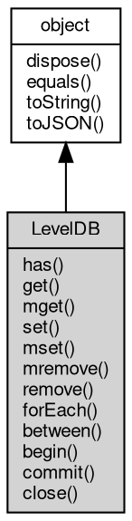

# 对象 LevelDB
LevelDB 数据库对象

用以创建和管理字典对象，创建方法：

```JavaScript
var db = require("db");
var test = new db.openLevelDB("test.db");
```

## 继承关系


## 成员函数
        
### has
**检查数据库内是否存在指定键值的数据**

```JavaScript
Boolean LevelDB.has(Buffer key) async;
```

调用参数:
* key: [Buffer](Buffer.md), 指定要检查的键值

返回结果:
* Boolean, 返回键值是否存在

--------------------------
### get
**查询指定键值的值**

```JavaScript
Buffer LevelDB.get(Buffer key) async;
```

调用参数:
* key: [Buffer](Buffer.md), 指定要查询的键值

返回结果:
* [Buffer](Buffer.md), 返回键值所对应的值，若不存在，则返回 null

--------------------------
### mget
**查询一组指定键值的值**

```JavaScript
List LevelDB.mget(Array keys);
```

调用参数:
* keys: Array, 指定要查询的键值数组

返回结果:
* [List](List.md), 返回包含键值得数组

--------------------------
### set
**设定一个键值数据，键值不存在则插入新数据**

```JavaScript
LevelDB.set(Buffer key,
    Buffer value) async;
```

调用参数:
* key: [Buffer](Buffer.md), 指定要设定的键值
* value: [Buffer](Buffer.md), 指定要设定的数据

--------------------------
### mset
**设定一组键值数据，键值不存在则插入新数据**

```JavaScript
LevelDB.mset(Object map);
```

调用参数:
* map: Object, 指定要设定的键值数据字典

--------------------------
### mremove
**删除一组指定键值的值**

```JavaScript
LevelDB.mremove(Array keys);
```

调用参数:
* keys: Array, 指定要删除的键值数组

--------------------------
### remove
**删除指定键值的全部值**

```JavaScript
LevelDB.remove(Buffer key) async;
```

调用参数:
* key: [Buffer](Buffer.md), 指定要删除的键值

--------------------------
### forEach
**枚举数据库中所有的键值对**

```JavaScript
LevelDB.forEach(Function func);
```

调用参数:
* func: Function, 枚举回调函数

回调函数有两个参数，(value, key)

```JavaScript
var db = require("db");
var test = new db.openLevelDB("test.db");

test.forEach(function(value, key) {
    ...
});
```

--------------------------
### between
**枚举数据库中键值在 from 和 to 之间的键值对**

```JavaScript
LevelDB.between(Buffer from,
    Buffer to,
    Function func);
```

调用参数:
* from: [Buffer](Buffer.md), 枚举的最小键值，枚举时包含此键值
* to: [Buffer](Buffer.md), 枚举的最大键值，枚举时不包含此键值
* func: Function, 枚举回调函数

回调函数有两个参数，(value, key)

```JavaScript
var db = require("db");
var test = new db.openLevelDB("test.db");

test.between("aaa", "bbb", function(value, key) {
    ...
});
```

--------------------------
### begin
**在当前数据库上开启一个事务**

```JavaScript
LevelDB LevelDB.begin();
```

返回结果:
* LevelDB, 返回一个开启的事务对象

--------------------------
### commit
**提交当前事务**

```JavaScript
LevelDB.commit();
```

--------------------------
### close
**关闭当前数据库连接或事务**

```JavaScript
LevelDB.close() async;
```

--------------------------
### dispose
**强制回收对象，调用此方法后，对象资源将立即释放**

```JavaScript
LevelDB.dispose();
```

--------------------------
### equals
**比较当前对象与给定的对象是否相等**

```JavaScript
Boolean LevelDB.equals(object expected);
```

调用参数:
* expected: [object](object.md), 制定比较的目标对象

返回结果:
* Boolean, 返回对象比较的结果

--------------------------
### toString
**返回对象的字符串表示，一般返回 "[Native Object]"，对象可以根据自己的特性重新实现**

```JavaScript
String LevelDB.toString();
```

返回结果:
* String, 返回对象的字符串表示

--------------------------
### toJSON
**返回对象的 JSON 格式表示，一般返回对象定义的可读属性集合**

```JavaScript
Value LevelDB.toJSON(String key = "");
```

调用参数:
* key: String, 未使用

返回结果:
* Value, 返回包含可 JSON 序列化的值

