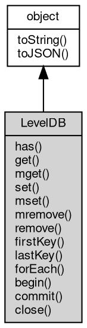

# 对象 LevelDB
LevelDB 是 fibjs 内置的数据库操作对象，用于创建和管理键值对形式的字典对象。使用 LevelDB 对象，可轻松实现键值对数据的存储、查询、删除、枚举等操作。它基于 Google 开源的 LevelDB 实现，具有高效、可靠、可扩展等优点

LevelDB 对象的创建非常简单，只需通过 [db.openLevelDB](../../module/ifs/db.md#openLevelDB) 方法即可创建一个指定名称的数据库对象。例如：

```JavaScript
var db = require("db");
var test = db.openLevelDB("test.db");
```

其中，[db](../../module/ifs/db.md) 为 fibjs 的数据库操作对象，openLevelDB 方法用于打开 leveldb 数据库，test.db 为数据库名称，函数返回的 [test](../../module/ifs/test.md) 对象即为操作数据库的对象。

LevelDB 对象支持的主要操作包括：

- set(key, value)：设置一个键值数据，键值不存在则插入新数据。
- get(key)：查询指定键值的值。
- has(key)：判断指定键值是否存在。
- remove(key)：删除指定键值的全部值。
- forEach(func)：枚举数据库中所有的键值对。
- between(from, to, func)：枚举数据库中键值在 from 和 to 之间的键值对。
- toJSON(key)：返回对象的 JSON 格式表示，一般返回对象定义的可读属性集合。
- begin()：在当前数据库上开启一个事务。
- commit()：提交当前事务。
- close()：关闭当前数据库连接或事务。

例如：

```JavaScript
var db = require("db");
var test = db.openLevelDB("test.db");

test.set("test_key", "test_value");

var value = test.get("test_key");
console.log("test_key:", value.toString());

test.remove("test_key");

console.log("has test_key:", test.has("test_key"));

test.close();
```

以上是 LevelDB 对象的基本用法及示例，可以方便灵活地操作键值对数据。在实际应用中，它可以被用于存储、缓存、日志等场景，提高数据读写效率、简化程序逻辑、减少开发复杂度等。

## 继承关系


## 成员函数
        
### has
**检查数据库内是否存在指定键值的数据**

```JavaScript
Boolean LevelDB.has(Buffer key) async;
```

调用参数:
* key: [Buffer](Buffer.md), 指定要检查的键值

返回结果:
* Boolean, 返回键值是否存在

--------------------------
### get
**查询指定键值的值**

```JavaScript
Buffer LevelDB.get(Buffer key) async;
```

调用参数:
* key: [Buffer](Buffer.md), 指定要查询的键值

返回结果:
* [Buffer](Buffer.md), 返回键值所对应的值，若不存在，则返回 null

--------------------------
### mget
**查询一组指定键值的值**

```JavaScript
NArray LevelDB.mget(Array keys);
```

调用参数:
* keys: Array, 指定要查询的键值数组

返回结果:
* NArray, 返回包含键值得数组

--------------------------
### set
**设定一个键值数据，键值不存在则插入新数据**

```JavaScript
LevelDB.set(Buffer key,
    Buffer value) async;
```

调用参数:
* key: [Buffer](Buffer.md), 指定要设定的键值
* value: [Buffer](Buffer.md), 指定要设定的数据

--------------------------
### mset
**设定一组键值数据，键值不存在则插入新数据**

```JavaScript
LevelDB.mset(Object map);
```

调用参数:
* map: Object, 指定要设定的键值数据字典

--------------------------
### mremove
**删除一组指定键值的值**

```JavaScript
LevelDB.mremove(Array keys);
```

调用参数:
* keys: Array, 指定要删除的键值数组

--------------------------
### remove
**删除指定键值的全部值**

```JavaScript
LevelDB.remove(Buffer key) async;
```

调用参数:
* key: [Buffer](Buffer.md), 指定要删除的键值

--------------------------
### firstKey
**查询最小的 key**

```JavaScript
Buffer LevelDB.firstKey() async;
```

返回结果:
* [Buffer](Buffer.md), 返回最小的 key

--------------------------
### lastKey
**查询最大的 key**

```JavaScript
Buffer LevelDB.lastKey() async;
```

返回结果:
* [Buffer](Buffer.md), 返回最大的 key

--------------------------
### forEach
**枚举数据库中所有的键值对**

```JavaScript
LevelDB.forEach(Function func);
```

调用参数:
* func: Function, 枚举回调函数

回调函数有两个参数，(value, key)

```JavaScript
var db = require("db");
var test = new db.openLevelDB("test.db");

test.forEach(function(value, key) {
    ...
});
```

--------------------------
**枚举数据库中所有的键值对**

```JavaScript
LevelDB.forEach(Buffer from,
    Function func);
```

调用参数:
* from: [Buffer](Buffer.md), 枚举的最小键值，枚举时包含此键值
* func: Function, 枚举回调函数

回调函数有两个参数，(value, key)

```JavaScript
var db = require("db");
var test = new db.openLevelDB("test.db");

test.forEach("aaa", "bbb", function(value, key) {
    ...
});
```

--------------------------
**枚举数据库中所有的键值对**

```JavaScript
LevelDB.forEach(Buffer from,
    Buffer to,
    Function func);
```

调用参数:
* from: [Buffer](Buffer.md), 枚举的最小键值，枚举时包含此键值
* to: [Buffer](Buffer.md), 枚举的最大键值，枚举时不包含此键值
* func: Function, 枚举回调函数

回调函数有两个参数，(value, key)

```JavaScript
var db = require("db");
var test = new db.openLevelDB("test.db");

test.forEach("aaa", "bbb", function(value, key) {
    ...
});
```

--------------------------
**枚举数据库中所有的键值对**

```JavaScript
LevelDB.forEach(Object opt,
    Function func);
```

调用参数:
* opt: Object, 枚举选项，支持 skip, limit, reverse
* func: Function, 枚举回调函数

回调函数有两个参数，(value, key)

```JavaScript
var db = require("db");
var test = new db.openLevelDB("test.db");

test.forEach(function(value, key) {
    ...
});
```

--------------------------
**枚举数据库中所有的键值对**

```JavaScript
LevelDB.forEach(Buffer from,
    Object opt,
    Function func);
```

调用参数:
* from: [Buffer](Buffer.md), 枚举的最小键值，枚举时包含此键值
* opt: Object, 枚举选项，支持 skip, limit, reverse
* func: Function, 枚举回调函数

回调函数有两个参数，(value, key)

```JavaScript
var db = require("db");
var test = new db.openLevelDB("test.db");

test.forEach("aaa", "bbb", function(value, key) {
    ...
});
```

--------------------------
**枚举数据库中所有的键值对**

```JavaScript
LevelDB.forEach(Buffer from,
    Buffer to,
    Object opt,
    Function func);
```

调用参数:
* from: [Buffer](Buffer.md), 枚举的最小键值，枚举时包含此键值
* to: [Buffer](Buffer.md), 枚举的最大键值，枚举时不包含此键值
* opt: Object, 枚举选项，支持 skip, limit, reverse
* func: Function, 枚举回调函数

回调函数有两个参数，(value, key)

```JavaScript
var db = require("db");
var test = new db.openLevelDB("test.db");

test.forEach("aaa", "bbb", function(value, key) {
    ...
});
```

--------------------------
### begin
**在当前数据库上开启一个事务**

```JavaScript
LevelDB LevelDB.begin();
```

返回结果:
* LevelDB, 返回一个开启的事务对象

--------------------------
### commit
**提交当前事务**

```JavaScript
LevelDB.commit();
```

--------------------------
### close
**关闭当前数据库连接或事务**

```JavaScript
LevelDB.close() async;
```

--------------------------
### toString
**返回对象的字符串表示，一般返回 "[Native Object]"，对象可以根据自己的特性重新实现**

```JavaScript
String LevelDB.toString();
```

返回结果:
* String, 返回对象的字符串表示

--------------------------
### toJSON
**返回对象的 JSON 格式表示，一般返回对象定义的可读属性集合**

```JavaScript
Value LevelDB.toJSON(String key = "");
```

调用参数:
* key: String, 未使用

返回结果:
* Value, 返回包含可 JSON 序列化的值

